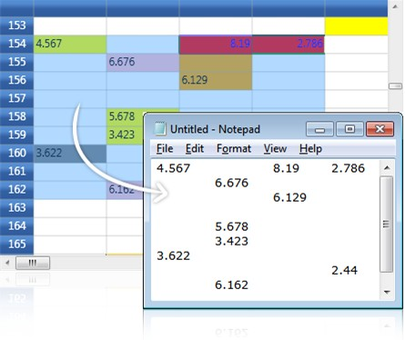
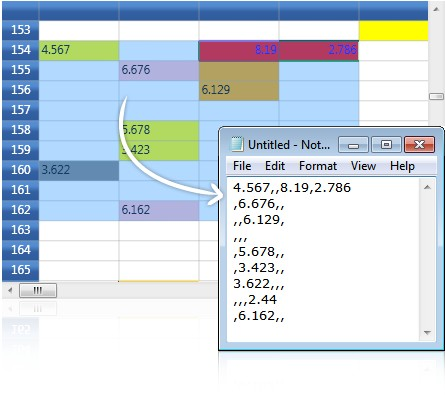
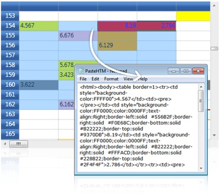

::: {style="DISPLAY: none"}
{#d2h_url_template}{#d2h_package_url style="WIDTH: 0px; DISPLAY: none; HEIGHT: 0px"}
:::

::: {.d2h_secondary_topic style="PADDING-BOTTOM: 10pt; MARGIN: 0pt; PADDING-LEFT: 0pt; PADDING-RIGHT: 0pt; PADDING-TOP: 0pt"}
#### Clipboard Support {#clipboard-support style="tab-stops: 0pt"}

Essential Grid provides complete support for clipboard operations. End users can copy/cut & paste any data inside the grid and to or from other OLE \[Object Linking and Embedding\]-enabled applications such as Notepad. The built-in source allows us to copy the text data along with the style information and also provides hooks that let us customize the clipboard operation of pasting the custom formatted data.

 

Copy Paste Options

 

CopyPasteOption property defines the list of clipboard operations supported by the grid. It exposes the following options:

 

[·      ]{style="FONT-FAMILY: Symbol"}CopyText--Copies only the text from the grid selection to clipboard

[·      ]{style="FONT-FAMILY: Symbol"}CopyCellData--Copies both text and style information from grid cells to clipboard

[·      ]{style="FONT-FAMILY: Symbol"}PasteText--Pastes only the text from clipboard

[·      ]{style="FONT-FAMILY: Symbol"}PasteCell--Pastes the cell text along with its style information from the clipboard

[·      ]{style="FONT-FAMILY: Symbol"}CutText--Moves only the text from grid to clipboard

[·      ]{style="FONT-FAMILY: Symbol"}CutCell--Moves the text and the style information from grid to clipboard

[·      ]{style="FONT-FAMILY: Symbol"}ExcludeCurrentCell--Skips current cell while doing clipboard operations

[·      ]{style="FONT-FAMILY: Symbol"}XmlCopyPaste -- Copy the cell value along with basic styles in  Xml format and supported to paste in Microsoft Excel. This also supports to copy the Formula value from the Grid Control and Paste in Microsoft Excel

 

Example

 

Here are the sample code snippets that define certain copy paste behaviors. 

 

+---------------------------------------------------------------------------------------------------------------------------------------+
| [\[C#\]]{style="FONT-FAMILY: 'Courier New'; COLOR: black"}                                                                            |
|                                                                                                                                       |
| **[]{style="FONT-FAMILY: 'Courier New'; COLOR: black"}**                                                                              |
|                                                                                                                                       |
| [//Copy cell data with style]{style="FONT-FAMILY: 'Courier New'; COLOR: green"}                                                       |
|                                                                                                                                       |
| [gridControl.Model.Options.CopyPasteOption \|= [CopyPaste]{style="COLOR: #2b91af"}.CopyCellData;]{style="FONT-FAMILY: 'Courier New'"} |
|                                                                                                                                       |
| []{style="FONT-FAMILY: 'Courier New'"}                                                                                                |
|                                                                                                                                       |
| [//Cut cell data with style]{style="FONT-FAMILY: 'Courier New'; COLOR: green"}                                                        |
|                                                                                                                                       |
| [gridControl.Model.Options.CopyPasteOption \|= [CopyPaste]{style="COLOR: #2b91af"}.CutCell;]{style="FONT-FAMILY: 'Courier New'"}      |
|                                                                                                                                       |
| []{style="FONT-FAMILY: 'Courier New'"}                                                                                                |
|                                                                                                                                       |
| [//Paste cell data with style]{style="FONT-FAMILY: 'Courier New'; COLOR: green"}                                                      |
|                                                                                                                                       |
| [gridControl.Model.Options.CopyPasteOption \|= [CopyPaste]{style="COLOR: #2b91af"}.PasteCell;]{style="FONT-FAMILY: 'Courier New'"}    |
|                                                                                                                                       |
| []{style="FONT-FAMILY: 'Courier New'"}                                                                                                |
|                                                                                                                                       |
| [//Code to cut copy paste cell text (excluding style)]{style="FONT-FAMILY: 'Courier New'; COLOR: green"}                              |
|                                                                                                                                       |
| [gridControl.Model.Options.CopyPasteOption = ([CopyPaste]{style="COLOR: #2b91af"})(0);]{style="FONT-FAMILY: 'Courier New'"}           |
|                                                                                                                                       |
| [gridControl.Model.Options.CopyPasteOption \|= [CopyPaste]{style="COLOR: #2b91af"}.CopyText;]{style="FONT-FAMILY: 'Courier New'"}     |
|                                                                                                                                       |
| [gridControl.Model.Options.CopyPasteOption \|= [CopyPaste]{style="COLOR: #2b91af"}.CutText;]{style="FONT-FAMILY: 'Courier New'"}      |
|                                                                                                                                       |
| [gridControl.Model.Options.CopyPasteOption \|= [CopyPaste]{style="COLOR: #2b91af"}.PasteText;]{style="FONT-FAMILY: 'Courier New'"}    |
+---------------------------------------------------------------------------------------------------------------------------------------+

[]{style="COLOR: #15428b"} 

{border="0"}

Figure 69: Pasting the grid data in Notepad

***[]{style="COLOR: #15428b"}*** 

Text Data Exchange

 

GridModel.TextDataExchange helps you in customizing the clipboard operations. It is used as an interface that exposes the following property and methods. 

 

[·      ]{style="FONT-FAMILY: Symbol"}Property-TabDelimiter

[·      ]{style="FONT-FAMILY: Symbol"}Method-CopyTextToBuffer(), PasteTextFromBuffer()

 

The above attributes are discussed below in detail:

 

1.   TabDelimiter Property

 

This property specifies a delimiter for the text to be pasted. It can be used when you want to paste the cell data in CSV (Comma-Separated Values) format.

[]{style="COLOR: #15428b"} 

+--------------------------------------------------------------------------------------------------------------------------+
| [\[C#\]]{style="FONT-FAMILY: 'Courier New'; COLOR: black"}                                                               |
|                                                                                                                          |
| **[]{style="FONT-FAMILY: 'Courier New'; COLOR: black"}**                                                                 |
|                                                                                                                          |
| [gridControl.Model.TextDataExchange.TabDelimiter = [\",\"]{style="COLOR: #a31515"};]{style="FONT-FAMILY: 'Courier New'"} |
+--------------------------------------------------------------------------------------------------------------------------+

[]{style="COLOR: #15428b"} 

[]{style="COLOR: #15428b"} 

{border="0"}

Figure 70: Pasting the grid data in CSV format

***[]{style="COLOR: #15428b"}*** 

2.   CopyTextToBuffer() Method

 

This method lets you place the cell data into an intermediate buffer, which can be customized. The method performs clipboard cut or copy operation depending on the third parameter given to it. This method accepts the following parameters:

 

[·      ]{style="FONT-FAMILY: Symbol"}String buffer

[·      ]{style="FONT-FAMILY: Symbol"}Selected range of cells

[·      ]{style="FONT-FAMILY: Symbol"}Boolean value-This should be set to true for cut operation and should be set to false for copy operation.

 

The following code illustrates the CopyTextToBuffer method:

 

+---------------------------------------------------------------------------------------------------------------------------------------------------------------------------------------------------------------------------------------------------------------+
| [\[C#\]]{style="FONT-FAMILY: 'Courier New'; COLOR: black"}                                                                                                                                                                                                    |
|                                                                                                                                                                                                                                                               |
| **[]{style="FONT-FAMILY: 'Courier New'; COLOR: black"}**                                                                                                                                                                                                      |
|                                                                                                                                                                                                                                                               |
| [gridControl.Model.TextDataExchange.CopyTextToBuffer([out]{style="COLOR: blue"} buffer, gridControl.Model.SelectedRanges, [out]{style="COLOR: blue"} row, [out]{style="COLOR: blue"} col, [false]{style="COLOR: blue"});]{style="FONT-FAMILY: 'Courier New'"} |
+---------------------------------------------------------------------------------------------------------------------------------------------------------------------------------------------------------------------------------------------------------------+

[]{style="COLOR: #15428b"} 

Result of this Method Call

 

It returns the following values:

 

[·      ]{style="FONT-FAMILY: Symbol"}Cell text

[·      ]{style="FONT-FAMILY: Symbol"}No. of rows affected

[·      ]{style="FONT-FAMILY: Symbol"}No. of columns affected

**[]{style="COLOR: #15428b"}** 

3.   PasteTextFromBuffer() Method

 

The values returned by the CopyTextToBuffer method is passed as parameter to the PasteTextFromBuffer method using the below code:

 

+-----------------------------------------------------------------------------------------------------------------------------------------+
| [\[C#\]]{style="FONT-FAMILY: 'Courier New'; COLOR: black"}                                                                              |
|                                                                                                                                         |
|                                                                                                                                         |
|                                                                                                                                         |
| [gridControl.Model.TextDataExchange.PasteTextFromBuffer(buffer, gridControl.Model.SelectedRanges);]{style="FONT-FAMILY: 'Courier New'"} |
+-----------------------------------------------------------------------------------------------------------------------------------------+

 

Result of this Method Call

 

It pastes the text from the given buffer into specified range of grid cells.

 

Events

 

Grid provides the following events which are available for the end user to customize the clipboard data.

 

[·      ]{style="FONT-FAMILY: Symbol"}ClipboardCanCopy

[·      ]{style="FONT-FAMILY: Symbol"}ClipboardCanCut

[·      ]{style="FONT-FAMILY: Symbol"}ClipboardCanPaste

[·      ]{style="FONT-FAMILY: Symbol"}ClipboardCopy

[·      ]{style="FONT-FAMILY: Symbol"}ClipboardCut

[·      ]{style="FONT-FAMILY: Symbol"}ClipboardPaste

**[]{style="COLOR: #15428b"}** 

IGridCopyPaste

 

Essential Grid defines an interface called IGridCopyPaste that exposes some methods, namely Copy(), Cut() and Paste(). Here the users can write custom code to perform cut copy or paste operations with any kind of user-defined data. Thereby, it extends its clipboard support behavior to perform clipboard operations in various forms.

 

For instance, let us consider performing the copy and paste operations in HTML format. The respective implementation of IGridCopyPaste is as follows:

 

+----------------------------------------------------------------------------------------------------------------------------------------------------------------------------------------------------------------+
| [\[C#\]]{style="FONT-FAMILY: 'Courier New'; COLOR: black"}                                                                                                                                                     |
|                                                                                                                                                                                                                |
| **[]{style="FONT-FAMILY: 'Courier New'; COLOR: black"}**                                                                                                                                                       |
|                                                                                                                                                                                                                |
| [class]{style="FONT-FAMILY: 'Courier New'; COLOR: blue"}[ [HtmlCopy]{style="COLOR: #2b91af"} : IGridCopyPaste]{style="FONT-FAMILY: 'Courier New'"}                                                             |
|                                                                                                                                                                                                                |
| [{]{style="FONT-FAMILY: 'Courier New'"}                                                                                                                                                                        |
|                                                                                                                                                                                                                |
| [    [public]{style="COLOR: blue"} [void]{style="COLOR: blue"} Copy(GridCellData gridData, GridRangeInfoList rangeList)]{style="FONT-FAMILY: 'Courier New'"}                                                   |
|                                                                                                                                                                                                                |
| [    {]{style="FONT-FAMILY: 'Courier New'"}                                                                                                                                                                    |
|                                                                                                                                                                                                                |
| []{style="FONT-FAMILY: 'Courier New'"}                                                                                                                                                                         |
|                                                                                                                                                                                                                |
| [        [IDataObject]{style="COLOR: #2b91af"} iData = [null]{style="COLOR: blue"};]{style="FONT-FAMILY: 'Courier New'"}                                                                                       |
|                                                                                                                                                                                                                |
| [        iData = [Clipboard]{style="COLOR: #2b91af"}.GetDataObject();]{style="FONT-FAMILY: 'Courier New'"}                                                                                                     |
|                                                                                                                                                                                                                |
| [        [string]{style="COLOR: blue"} buffer = iData.GetData([DataFormats]{style="COLOR: #2b91af"}.UnicodeText) [as]{style="COLOR: blue"} [string]{style="COLOR: blue"};]{style="FONT-FAMILY: 'Courier New'"} |
|                                                                                                                                                                                                                |
| [        [int]{style="COLOR: blue"} top = rangeList\[0\].Top;]{style="FONT-FAMILY: 'Courier New'"}                                                                                                             |
|                                                                                                                                                                                                                |
| [        [int]{style="COLOR: blue"} left = rangeList\[0\].Left;]{style="FONT-FAMILY: 'Courier New'"}                                                                                                           |
|                                                                                                                                                                                                                |
| [        [int]{style="COLOR: blue"} right = rangeList\[0\].Right;]{style="FONT-FAMILY: 'Courier New'"}                                                                                                         |
|                                                                                                                                                                                                                |
| [        [int]{style="COLOR: blue"} bottom = rangeList\[0\].Bottom;]{style="FONT-FAMILY: 'Courier New'"}                                                                                                       |
|                                                                                                                                                                                                                |
| [        [string]{style="COLOR: blue"} stylesheet = [string]{style="COLOR: blue"}.Empty;]{style="FONT-FAMILY: 'Courier New'"}                                                                                  |
|                                                                                                                                                                                                                |
| []{style="FONT-FAMILY: 'Courier New'"}                                                                                                                                                                         |
|                                                                                                                                                                                                                |
| []{style="FONT-FAMILY: 'Courier New'"}                                                                                                                                                                         |
|                                                                                                                                                                                                                |
| [        [StringBuilder]{style="COLOR: #2b91af"} sb = [new]{style="COLOR: blue"} [StringBuilder]{style="COLOR: #2b91af"}();]{style="FONT-FAMILY: 'Courier New'"}                                               |
|                                                                                                                                                                                                                |
| [        GridStyleInfoStore gsis;]{style="FONT-FAMILY: 'Courier New'"}                                                                                                                                         |
|                                                                                                                                                                                                                |
| [        GridStyleInfo style;]{style="FONT-FAMILY: 'Courier New'"}                                                                                                                                             |
|                                                                                                                                                                                                                |
| []{style="FONT-FAMILY: 'Courier New'"}                                                                                                                                                                         |
|                                                                                                                                                                                                                |
| [        sb.Append([\"\<html\>\<body\>\<table border=1\>\"]{style="COLOR: #a31515"});]{style="FONT-FAMILY: 'Courier New'"}                                                                                     |
|                                                                                                                                                                                                                |
| [        [for]{style="COLOR: blue"} ([int]{style="COLOR: blue"} row = top; row \<= bottom; row++)]{style="FONT-FAMILY: 'Courier New'"}                                                                         |
|                                                                                                                                                                                                                |
| [        {]{style="FONT-FAMILY: 'Courier New'"}                                                                                                                                                                |
|                                                                                                                                                                                                                |
| [            sb.Append([\"\<tr\>\"]{style="COLOR: #a31515"});]{style="FONT-FAMILY: 'Courier New'"}                                                                                                             |
|                                                                                                                                                                                                                |
| [            [for]{style="COLOR: blue"} ([int]{style="COLOR: blue"} col = left; col \<= right; col++)]{style="FONT-FAMILY: 'Courier New'"}                                                                     |
|                                                                                                                                                                                                                |
| [            {]{style="FONT-FAMILY: 'Courier New'"}                                                                                                                                                            |
|                                                                                                                                                                                                                |
| []{style="FONT-FAMILY: 'Courier New'"}                                                                                                                                                                         |
|                                                                                                                                                                                                                |
| [                gsis = gridData\[row - top, col - left\];]{style="FONT-FAMILY: 'Courier New'"}                                                                                                                |
|                                                                                                                                                                                                                |
| [                style = [new]{style="COLOR: blue"} GridStyleInfo(gsis);]{style="FONT-FAMILY: 'Courier New'"}                                                                                                  |
|                                                                                                                                                                                                                |
| []{style="FONT-FAMILY: 'Courier New'"}                                                                                                                                                                         |
|                                                                                                                                                                                                                |
| [                stylesheet = [\"\\\"\"]{style="COLOR: #a31515"};]{style="FONT-FAMILY: 'Courier New'"}                                                                                                         |
|                                                                                                                                                                                                                |
| [                [if]{style="COLOR: blue"} (style.HasBackground)]{style="FONT-FAMILY: 'Courier New'"}                                                                                                          |
|                                                                                                                                                                                                                |
| [                {]{style="FONT-FAMILY: 'Courier New'"}                                                                                                                                                        |
|                                                                                                                                                                                                                |
| [                    [string]{style="COLOR: blue"} backgroundColor = style.Background.ToString();]{style="FONT-FAMILY: 'Courier New'"}                                                                         |
|                                                                                                                                                                                                                |
| [                    backgroundColor = backgroundColor.Substring(3, backgroundColor.Length - 3);]{style="FONT-FAMILY: 'Courier New'"}                                                                          |
|                                                                                                                                                                                                                |
| [                    stylesheet = [\"\\\"background-color:\"]{style="COLOR: #a31515"} + backgroundColor;]{style="FONT-FAMILY: 'Courier New'"}                                                                  |
|                                                                                                                                                                                                                |
| [                }]{style="FONT-FAMILY: 'Courier New'"}                                                                                                                                                        |
|                                                                                                                                                                                                                |
| []{style="FONT-FAMILY: 'Courier New'"}                                                                                                                                                                         |
|                                                                                                                                                                                                                |
| [                [if]{style="COLOR: blue"} (style.HasForeground)]{style="FONT-FAMILY: 'Courier New'"}                                                                                                          |
|                                                                                                                                                                                                                |
| [                {]{style="FONT-FAMILY: 'Courier New'"}                                                                                                                                                        |
|                                                                                                                                                                                                                |
| [                    [string]{style="COLOR: blue"} foregroundColor = style.Foreground.ToString();]{style="FONT-FAMILY: 'Courier New'"}                                                                         |
|                                                                                                                                                                                                                |
| [                    foregroundColor = foregroundColor.Substring(3, foregroundColor.Length - 3);]{style="FONT-FAMILY: 'Courier New'"}                                                                          |
|                                                                                                                                                                                                                |
| [                    stylesheet = stylesheet + [\";color:\"]{style="COLOR: #a31515"} + foregroundColor;]{style="FONT-FAMILY: 'Courier New'"}                                                                   |
|                                                                                                                                                                                                                |
| [                }]{style="FONT-FAMILY: 'Courier New'"}                                                                                                                                                        |
|                                                                                                                                                                                                                |
| []{style="FONT-FAMILY: 'Courier New'"}                                                                                                                                                                         |
|                                                                                                                                                                                                                |
| [                [if]{style="COLOR: blue"} (style.HasHorizontalAlignment)]{style="FONT-FAMILY: 'Courier New'"}                                                                                                 |
|                                                                                                                                                                                                                |
| [                {]{style="FONT-FAMILY: 'Courier New'"}                                                                                                                                                        |
|                                                                                                                                                                                                                |
| [                    stylesheet = stylesheet + [\";text-align:\"]{style="COLOR: #a31515"} + style.HorizontalAlignment;]{style="FONT-FAMILY: 'Courier New'"}                                                    |
|                                                                                                                                                                                                                |
| [                }]{style="FONT-FAMILY: 'Courier New'"}                                                                                                                                                        |
|                                                                                                                                                                                                                |
| []{style="FONT-FAMILY: 'Courier New'"}                                                                                                                                                                         |
|                                                                                                                                                                                                                |
| [                [if]{style="COLOR: blue"} (style.HasVerticalAlignment)]{style="FONT-FAMILY: 'Courier New'"}                                                                                                   |
|                                                                                                                                                                                                                |
| [                {]{style="FONT-FAMILY: 'Courier New'"}                                                                                                                                                        |
|                                                                                                                                                                                                                |
| [                    stylesheet = stylesheet + [\";vertical-align:\"]{style="COLOR: #a31515"} + style.VerticalAlignment;]{style="FONT-FAMILY: 'Courier New'"}                                                  |
|                                                                                                                                                                                                                |
| [                }]{style="FONT-FAMILY: 'Courier New'"}                                                                                                                                                        |
|                                                                                                                                                                                                                |
| []{style="FONT-FAMILY: 'Courier New'"}                                                                                                                                                                         |
|                                                                                                                                                                                                                |
| [                [if]{style="COLOR: blue"} (style.HasBorders)]{style="FONT-FAMILY: 'Courier New'"}                                                                                                             |
|                                                                                                                                                                                                                |
| [                {]{style="FONT-FAMILY: 'Courier New'"}                                                                                                                                                        |
|                                                                                                                                                                                                                |
| [                    [string]{style="COLOR: blue"} borderBrush;]{style="FONT-FAMILY: 'Courier New'"}                                                                                                           |
|                                                                                                                                                                                                                |
| []{style="FONT-FAMILY: 'Courier New'"}                                                                                                                                                                         |
|                                                                                                                                                                                                                |
| [                    borderBrush = style.Borders.Left.Brush.ToString();]{style="FONT-FAMILY: 'Courier New'"}                                                                                                   |
|                                                                                                                                                                                                                |
| [                    borderBrush = borderBrush.Substring(3, borderBrush.Length - 3);]{style="FONT-FAMILY: 'Courier New'"}                                                                                      |
|                                                                                                                                                                                                                |
| [                    stylesheet = stylesheet + [\";border-left:solid  #\"]{style="COLOR: #a31515"} + borderBrush;]{style="FONT-FAMILY: 'Courier New'"}                                                         |
|                                                                                                                                                                                                                |
| []{style="FONT-FAMILY: 'Courier New'"}                                                                                                                                                                         |
|                                                                                                                                                                                                                |
| [                    borderBrush = style.Borders.Right.Brush.ToString();]{style="FONT-FAMILY: 'Courier New'"}                                                                                                  |
|                                                                                                                                                                                                                |
| [                    borderBrush = borderBrush.Substring(3, borderBrush.Length - 3);]{style="FONT-FAMILY: 'Courier New'"}                                                                                      |
|                                                                                                                                                                                                                |
| [                    stylesheet = stylesheet + [\";border-right:solid  #\"]{style="COLOR: #a31515"} + borderBrush;]{style="FONT-FAMILY: 'Courier New'"}                                                        |
|                                                                                                                                                                                                                |
| []{style="FONT-FAMILY: 'Courier New'"}                                                                                                                                                                         |
|                                                                                                                                                                                                                |
| [                    borderBrush = style.Borders.Bottom.Brush.ToString();]{style="FONT-FAMILY: 'Courier New'"}                                                                                                 |
|                                                                                                                                                                                                                |
| [                    borderBrush = borderBrush.Substring(3, borderBrush.Length - 3);]{style="FONT-FAMILY: 'Courier New'"}                                                                                      |
|                                                                                                                                                                                                                |
| [                    stylesheet = stylesheet + [\";border-bottom:solid  #\"]{style="COLOR: #a31515"} + borderBrush;]{style="FONT-FAMILY: 'Courier New'"}                                                       |
|                                                                                                                                                                                                                |
| []{style="FONT-FAMILY: 'Courier New'"}                                                                                                                                                                         |
|                                                                                                                                                                                                                |
| [                    borderBrush = style.Borders.Top.Brush.ToString();]{style="FONT-FAMILY: 'Courier New'"}                                                                                                    |
|                                                                                                                                                                                                                |
| [                    borderBrush = borderBrush.Substring(3, borderBrush.Length - 3);]{style="FONT-FAMILY: 'Courier New'"}                                                                                      |
|                                                                                                                                                                                                                |
| [                    stylesheet = stylesheet + [\";border-top:solid  #\"]{style="COLOR: #a31515"} + borderBrush;]{style="FONT-FAMILY: 'Courier New'"}                                                          |
|                                                                                                                                                                                                                |
| [                }]{style="FONT-FAMILY: 'Courier New'"}                                                                                                                                                        |
|                                                                                                                                                                                                                |
| []{style="FONT-FAMILY: 'Courier New'"}                                                                                                                                                                         |
|                                                                                                                                                                                                                |
| []{style="FONT-FAMILY: 'Courier New'"}                                                                                                                                                                         |
|                                                                                                                                                                                                                |
| [                stylesheet = stylesheet + [\"\\\"\"]{style="COLOR: #a31515"};]{style="FONT-FAMILY: 'Courier New'"}                                                                                            |
|                                                                                                                                                                                                                |
| []{style="FONT-FAMILY: 'Courier New'"}                                                                                                                                                                         |
|                                                                                                                                                                                                                |
| [                [if]{style="COLOR: blue"} (!stylesheet.Equals([\"\\\"\\\"\"]{style="COLOR: #a31515"}))]{style="FONT-FAMILY: 'Courier New'"}                                                                   |
|                                                                                                                                                                                                                |
| [                {]{style="FONT-FAMILY: 'Courier New'"}                                                                                                                                                        |
|                                                                                                                                                                                                                |
| [                    sb.Append([@\"\<td style=\"]{style="COLOR: #a31515"} + stylesheet + [\"\>\"]{style="COLOR: #a31515"});]{style="FONT-FAMILY: 'Courier New'"}                                               |
|                                                                                                                                                                                                                |
| [                }]{style="FONT-FAMILY: 'Courier New'"}                                                                                                                                                        |
|                                                                                                                                                                                                                |
| []{style="FONT-FAMILY: 'Courier New'"}                                                                                                                                                                         |
|                                                                                                                                                                                                                |
| [                [else]{style="COLOR: blue"}]{style="FONT-FAMILY: 'Courier New'"}                                                                                                                              |
|                                                                                                                                                                                                                |
| [                {]{style="FONT-FAMILY: 'Courier New'"}                                                                                                                                                        |
|                                                                                                                                                                                                                |
| [                    sb.Append([@\"\<td\>\"]{style="COLOR: #a31515"});]{style="FONT-FAMILY: 'Courier New'"}                                                                                                    |
|                                                                                                                                                                                                                |
| [                }]{style="FONT-FAMILY: 'Courier New'"}                                                                                                                                                        |
|                                                                                                                                                                                                                |
| []{style="FONT-FAMILY: 'Courier New'"}                                                                                                                                                                         |
|                                                                                                                                                                                                                |
| [                [if]{style="COLOR: blue"} (!style.CellValue.ToString().Equals([\"\"]{style="COLOR: #a31515"}))]{style="FONT-FAMILY: 'Courier New'"}                                                           |
|                                                                                                                                                                                                                |
| [                {]{style="FONT-FAMILY: 'Courier New'"}                                                                                                                                                        |
|                                                                                                                                                                                                                |
| [                    sb.Append(style.CellValue.ToString());]{style="FONT-FAMILY: 'Courier New'"}                                                                                                               |
|                                                                                                                                                                                                                |
| [                }]{style="FONT-FAMILY: 'Courier New'"}                                                                                                                                                        |
|                                                                                                                                                                                                                |
| []{style="FONT-FAMILY: 'Courier New'"}                                                                                                                                                                         |
|                                                                                                                                                                                                                |
| [                [else]{style="COLOR: blue"}]{style="FONT-FAMILY: 'Courier New'"}                                                                                                                              |
|                                                                                                                                                                                                                |
| [                {]{style="FONT-FAMILY: 'Courier New'"}                                                                                                                                                        |
|                                                                                                                                                                                                                |
| [                    sb.Append([\"\<pre\>       \</pre\>\"]{style="COLOR: #a31515"});]{style="FONT-FAMILY: 'Courier New'"}                                                                                     |
|                                                                                                                                                                                                                |
| [                }]{style="FONT-FAMILY: 'Courier New'"}                                                                                                                                                        |
|                                                                                                                                                                                                                |
| []{style="FONT-FAMILY: 'Courier New'"}                                                                                                                                                                         |
|                                                                                                                                                                                                                |
| [                sb.Append([\"\</td\>\"]{style="COLOR: #a31515"});]{style="FONT-FAMILY: 'Courier New'"}                                                                                                        |
|                                                                                                                                                                                                                |
| [                stylesheet = [string]{style="COLOR: blue"}.Empty;]{style="FONT-FAMILY: 'Courier New'"}                                                                                                        |
|                                                                                                                                                                                                                |
| [            }]{style="FONT-FAMILY: 'Courier New'"}                                                                                                                                                            |
|                                                                                                                                                                                                                |
| [            sb.Append([\"\</tr\>\"]{style="COLOR: #a31515"});]{style="FONT-FAMILY: 'Courier New'"}                                                                                                            |
|                                                                                                                                                                                                                |
| [        }]{style="FONT-FAMILY: 'Courier New'"}                                                                                                                                                                |
|                                                                                                                                                                                                                |
| [        sb.Append([\"\</table\>\</body\>\</html\>\"]{style="COLOR: #a31515"});]{style="FONT-FAMILY: 'Courier New'"}                                                                                           |
|                                                                                                                                                                                                                |
| [        [DataObject]{style="COLOR: #2b91af"} dataObject = [new]{style="COLOR: blue"} [DataObject]{style="COLOR: #2b91af"}();]{style="FONT-FAMILY: 'Courier New'"}                                             |
|                                                                                                                                                                                                                |
| [        dataObject.SetData([DataFormats]{style="COLOR: #2b91af"}.UnicodeText, sb.ToString());]{style="FONT-FAMILY: 'Courier New'"}                                                                            |
|                                                                                                                                                                                                                |
| [        [Clipboard]{style="COLOR: #2b91af"}.SetDataObject(dataObject);]{style="FONT-FAMILY: 'Courier New'"}                                                                                                   |
|                                                                                                                                                                                                                |
| []{style="FONT-FAMILY: 'Courier New'"}                                                                                                                                                                         |
|                                                                                                                                                                                                                |
| [    }]{style="FONT-FAMILY: 'Courier New'"}                                                                                                                                                                    |
|                                                                                                                                                                                                                |
| []{style="FONT-FAMILY: 'Courier New'"}                                                                                                                                                                         |
|                                                                                                                                                                                                                |
| [    [public]{style="COLOR: blue"} [void]{style="COLOR: blue"} Cut(GridCellData grodCellData, GridRangeInfoList rangeList)]{style="FONT-FAMILY: 'Courier New'"}                                                |
|                                                                                                                                                                                                                |
| [    {]{style="FONT-FAMILY: 'Courier New'"}                                                                                                                                                                    |
|                                                                                                                                                                                                                |
| [    }]{style="FONT-FAMILY: 'Courier New'"}                                                                                                                                                                    |
|                                                                                                                                                                                                                |
| [    [public]{style="COLOR: blue"} [DataObject]{style="COLOR: #2b91af"} Paste(GridRangeInfoList rangeList)]{style="FONT-FAMILY: 'Courier New'"}                                                                |
|                                                                                                                                                                                                                |
| [    {]{style="FONT-FAMILY: 'Courier New'"}                                                                                                                                                                    |
|                                                                                                                                                                                                                |
| [        [return]{style="COLOR: blue"} [new]{style="COLOR: blue"} [DataObject]{style="COLOR: #2b91af"}();]{style="FONT-FAMILY: 'Courier New'"}                                                                 |
|                                                                                                                                                                                                                |
| [    }]{style="FONT-FAMILY: 'Courier New'"}                                                                                                                                                                    |
|                                                                                                                                                                                                                |
| [}]{style="FONT-FAMILY: 'Courier New'"}                                                                                                                                                                        |
+----------------------------------------------------------------------------------------------------------------------------------------------------------------------------------------------------------------+

 

The next step is to attach the above custom copy and paste operations to the grid control.

 

+----------------------------------------------------------------------------------------------------------------------------------------------------------------------------------+
| [\[C#\]]{style="FONT-FAMILY: 'Courier New'; COLOR: black"}                                                                                                                       |
|                                                                                                                                                                                  |
| []{style="FONT-FAMILY: 'Courier New'"}                                                                                                                                           |
|                                                                                                                                                                                  |
| [HtmlCopy]{style="FONT-FAMILY: 'Courier New'; COLOR: #2b91af"}[ htmlCopy = [new]{style="COLOR: blue"} [HtmlCopy]{style="COLOR: #2b91af"}();]{style="FONT-FAMILY: 'Courier New'"} |
|                                                                                                                                                                                  |
| [gridControl.Model.GridCopyPaste = htmlCopy;]{style="FONT-FAMILY: 'Courier New'"}                                                                                                |
+----------------------------------------------------------------------------------------------------------------------------------------------------------------------------------+

[]{style="COLOR: #15428b"} 

{border="0"}

Figure 71: Pasting the grid data in HTML format

 

See Also

 

[[·      ]{style="FONT-FAMILY: Symbol; COLOR: windowtext; TEXT-DECORATION: none; text-underline: none"}]{.UGHyperlink}[[ClipboardCanCopy event]{.UGHyperlink}](ms-xhelp:///?Id=30e03545-af78-4c8c-aadd-9753e3037808)[ ]{.UGHyperlink}

[[·      ]{style="FONT-FAMILY: Symbol; COLOR: windowtext; TEXT-DECORATION: none; text-underline: none"}]{.UGHyperlink}[[ClipboardCanCut event]{.UGHyperlink}](ms-xhelp:///?Id=46f6ec38-4e89-425f-9d08-6fc97cd1c4a3)[]{.UGHyperlink}

[[·      ]{style="FONT-FAMILY: Symbol; COLOR: windowtext; TEXT-DECORATION: none; text-underline: none"}]{.UGHyperlink}[[ClipboardCanPaste event]{.UGHyperlink}](ms-xhelp:///?Id=dd23823a-72d5-4c40-b5b3-ce50d8d13d2b)[]{.UGHyperlink}

[[·      ]{style="FONT-FAMILY: Symbol; COLOR: windowtext; TEXT-DECORATION: none; text-underline: none"}]{.UGHyperlink}[[ClipboardCopy event]{.UGHyperlink}](ms-xhelp:///?Id=fc9a4c96-116d-4f2f-9be1-3460f460e880)[]{.UGHyperlink}

[[·      ]{style="FONT-FAMILY: Symbol; COLOR: windowtext; TEXT-DECORATION: none; text-underline: none"}]{.UGHyperlink}[[ClipboardCut event]{.UGHyperlink}](ms-xhelp:///?Id=893f087e-7eba-4510-8769-eac9e98c5d26)[]{.UGHyperlink}

[[·      ]{style="FONT-FAMILY: Symbol; COLOR: windowtext; TEXT-DECORATION: none; text-underline: none"}]{.UGHyperlink}[[ClipboardPaste event]{.UGHyperlink}](ms-xhelp:///?Id=a70f68bc-c53e-4e02-92fc-81ea6b4aa21c)[]{.UGHyperlink}

 

 

 

[]{#related-topics}
:::
