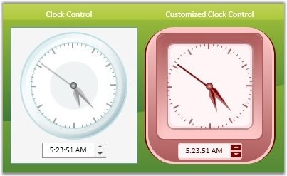

::: {style="DISPLAY: none"}
{#d2h_url_template}{#d2h_package_url style="WIDTH: 0px; DISPLAY: none; HEIGHT: 0px"}
:::

::::: {#nsbanner .d2h_main_nsbanner style="BORDER-BOTTOM: #999999 1px solid; POSITION: relative; PADDING-BOTTOM: 0px; BACKGROUND-COLOR: transparent; PADDING-LEFT: 0px; PADDING-RIGHT: 0px; DISPLAY: none; BORDER-TOP: #999999 1px solid; PADDING-TOP: 0px; LEFT: 0px"}
:::: {#TitleRow .d2h_main_titlerow style="PADDING-BOTTOM: 4px; BACKGROUND-COLOR: transparent; PADDING-LEFT: 22px; WIDTH: 100%; PADDING-RIGHT: 10px; DISPLAY: none; PADDING-TOP: 4px"}
::: {#ienav .d2h_main_ienav style="DISPLAY: none"}
{#D2HPrevious .D2HPreviousEnabled}  {#D2HNext .D2HNextEnabled}
:::
::::
:::::

:::: {#nstext .d2h_main_nstext style="PADDING-BOTTOM: 10px; BACKGROUND-COLOR: transparent; PADDING-LEFT: 22px; PADDING-RIGHT: 10px; HEIGHT: 100%; OVERFLOW: auto; PADDING-TOP: 5px" hasuserbackground="true" valign="bottom"}
::: {#d2h_breadcrumbs .d2h_breadcrumbs}
[Essential Studio User Guide Documentation](ms-xhelp:///?Id=12457748-09e3-4d74-a240-8e049cedf030){.d2h_breadcrumbsNormal}[ \> ]{.d2h_breadcrumbsLinkSeparator}[User Interface Edition](ms-xhelp:///?Id=c29296b7-531c-413b-a0ec-488ca1f7f669){.d2h_breadcrumbsNormal}[ \> ]{.d2h_breadcrumbsLinkSeparator}[Essential WPF](ms-xhelp:///?Id=7f4f82c5-151c-4262-94d0-75c4626c77bc){.d2h_breadcrumbsNormal}[ \> ]{.d2h_breadcrumbsLinkSeparator}[Essential Tools]{.d2h_breadcrumbsContentsOnly}[ \> ]{.d2h_breadcrumbsLinkSeparator}[Tools WPF Controls](ms-xhelp:///?Id=2ea58a12-9426-4a63-96b4-89eb80232c2c){.d2h_breadcrumbsNormal}
:::

## Clock {#clock style="tab-stops: 0pt"}

The Clock control is used to select the time easily just by dragging the hour and minute hands in the clock control.

 

Features

[·      ]{style="FONT-FAMILY: Symbol"}Hand dragging support.

[·      ]{style="FONT-FAMILY: Symbol"}Extenssive designer Support in both Expression Blend and Visual Studio 2008.

[·      ]{style="FONT-FAMILY: Symbol"}Properties to completely customize the control, without the necessity of custom templates.

[·      ]{style="FONT-FAMILY: Symbol"}Digital watch can be displayed to cross check the time selected.

[·      ]{style="FONT-FAMILY: Symbol"}Built-in visual styles and themes support.

[]{style="FONT-FAMILY: 'Trebuchet MS','sans-serif'; COLOR: #15428b; FONT-SIZE: 9pt"} 

{border="0"}

Figure 138: Clock Control

 

More:

[ ]{#related-topics}

[{border="0" align="absMiddle"}Getting Started](ms-xhelp:///?Id=c182abd6-450a-4601-a836-df1b5d1e1ed8){style="TEXT-DECORATION: none"}

[{border="0" align="absMiddle"}Creating Clock Control](ms-xhelp:///?Id=a3cd841c-ab0d-4dab-94f3-a09bf122b730){style="TEXT-DECORATION: none"}

[{border="0" align="absMiddle"}Interactive Features](ms-xhelp:///?Id=896a2daf-e4e2-44f5-9422-1aeeff8e9f4a){style="TEXT-DECORATION: none"}

[{border="0" align="absMiddle"}Layout Related Features](ms-xhelp:///?Id=fa89d936-9dc1-467f-9a42-3eed27d498e3){style="TEXT-DECORATION: none"}
::::
