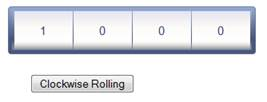

::: {style="DISPLAY: none"}
{#d2h_url_template}{#d2h_package_url style="WIDTH: 0px; DISPLAY: none; HEIGHT: 0px"}
:::

::::: {.d2h_secondary_topic style="PADDING-BOTTOM: 10pt; MARGIN: 0pt; PADDING-LEFT: 0pt; PADDING-RIGHT: 0pt; PADDING-TOP: 0pt"}
##### ClockwiseRolling: {#clockwiserolling style="tab-stops: 0pt"}

 

Rolling Gauge can be animated in clockwise **Direction** by setting its **Direction** property to **Clockwise**.

[]{style="FONT-FAMILY: 'Calibri','sans-serif'"} 

###### 5.4.3.9.1.1 Through View Customization {#through-view-customization style="tab-stops: 0pt"}

**[]{style="FONT-FAMILY: 'Calibri','sans-serif'"}** 

Step 1:

View :

 

Rolling Gauge can be animated by recursively calling its ClientSide **SetValue()** function. Refer the below example to animate the rolling gauge.

 

Here, you are adding one button to start the clockwise animation of rolling gauge. In the button click event, you are recursively calling the ClientSide **SetValue()** function to animate the gauge.

Add the below code in your aspx file.

[]{style="FONT-FAMILY: 'Calibri','sans-serif'"} 

+--------------------------------------------------------------------------------------------------------------------------------------------------------------------------------------------------------------------------------------------------------------------------------------------------------------------------------------+
| [View\[ASPX\]]{style="FONT-FAMILY: 'Courier New'"}                                                                                                                                                                                                                                                                                   |
|                                                                                                                                                                                                                                                                                                                                      |
| [\<%]{style="FONT-FAMILY: 'Courier New'; BACKGROUND: yellow"}[\--Rendering the rolling gauge\--]{style="FONT-FAMILY: 'Courier New'; COLOR: darkgreen"}[%\>]{style="FONT-FAMILY: 'Courier New'; BACKGROUND: yellow"}[]{style="FONT-FAMILY: 'Courier New'"}                                                                            |
|                                                                                                                                                                                                                                                                                                                                      |
| [    [\<%]{style="BACKGROUND: yellow"}[=]{style="COLOR: blue"}Html.Syncfusion().RollingGauge([\"Gauge\"]{style="COLOR: #a31515"})]{style="FONT-FAMILY: 'Courier New'"}                                                                                                                                                               |
|                                                                                                                                                                                                                                                                                                                                      |
| [         .Value([\"1000\"]{style="COLOR: #a31515"})]{style="FONT-FAMILY: 'Courier New'"}                                                                                                                                                                                                                                            |
|                                                                                                                                                                                                                                                                                                                                      |
| [      //]{style="FONT-FAMILY: 'Courier New'; COLOR: darkgreen"}[Setting the animation delay property to control the speed of the animation.]{style="FONT-FAMILY: 'Courier New'; COLOR: green"}[]{style="FONT-FAMILY: 'Courier New'"}                                                                                                |
|                                                                                                                                                                                                                                                                                                                                      |
| [         **.AnimationDelay(1000)**]{style="FONT-FAMILY: 'Courier New'"}                                                                                                                                                                                                                                                             |
|                                                                                                                                                                                                                                                                                                                                      |
| [        //Setting the rolling direction to clockwise.]{style="FONT-FAMILY: 'Courier New'; COLOR: darkgreen"}[]{style="FONT-FAMILY: 'Courier New'"}                                                                                                                                                                                  |
|                                                                                                                                                                                                                                                                                                                                      |
| [         **.Direction([Direction]{style="COLOR: #2b91af"}.Clockwise)**]{style="FONT-FAMILY: 'Courier New'"}                                                                                                                                                                                                                         |
|                                                                                                                                                                                                                                                                                                                                      |
| [          .IsAutomaticSegmentCountEnabled([true]{style="COLOR: blue"})]{style="FONT-FAMILY: 'Courier New'"}                                                                                                                                                                                                                         |
|                                                                                                                                                                                                                                                                                                                                      |
| [         .GaugeSkins([GaugeSkins]{style="COLOR: #2b91af"}.VS2010)]{style="FONT-FAMILY: 'Courier New'"}                                                                                                                                                                                                                              |
|                                                                                                                                                                                                                                                                                                                                      |
| [           .Height(50)]{style="FONT-FAMILY: 'Courier New'"}                                                                                                                                                                                                                                                                         |
|                                                                                                                                                                                                                                                                                                                                      |
| [         ]{style="FONT-FAMILY: 'Courier New'"}                                                                                                                                                                                                                                                                                      |
|                                                                                                                                                                                                                                                                                                                                      |
| [    [%\>]{style="BACKGROUND: yellow"}]{style="FONT-FAMILY: 'Courier New'"}                                                                                                                                                                                                                                                          |
|                                                                                                                                                                                                                                                                                                                                      |
| [    [\<%]{style="BACKGROUND: yellow"}[\--Adding the buttons for animating the gauge in its click event\--]{style="COLOR: darkgreen"}[%\>]{style="BACKGROUND: yellow"}]{style="FONT-FAMILY: 'Courier New'"}                                                                                                                          |
|                                                                                                                                                                                                                                                                                                                                      |
| [    ]{style="FONT-FAMILY: 'Courier New'"}                                                                                                                                                                                                                                                                                           |
|                                                                                                                                                                                                                                                                                                                                      |
| [        [\<]{style="COLOR: blue"}[input]{style="COLOR: maroon"} [type]{style="COLOR: red"}[=\"button\"]{style="COLOR: blue"} [id]{style="COLOR: red"}[=\"Clockwise\"]{style="COLOR: blue"} [value]{style="COLOR: red"}[=\"Clockwise Rolling\"]{style="COLOR: blue"} [/\>]{style="COLOR: blue"}]{style="FONT-FAMILY: 'Courier New'"} |
+--------------------------------------------------------------------------------------------------------------------------------------------------------------------------------------------------------------------------------------------------------------------------------------------------------------------------------------+

**[]{style="FONT-FAMILY: 'Calibri','sans-serif'"}** 

[]{style="FONT-FAMILY: 'Calibri','sans-serif'"} 

+--------------------------------------------------------------------------------------------------------------------------------------------------------------------------------------------------------------------------------------------------------------------------------------------------------------------------------------+
| [View\[cshtml\]]{style="FONT-FAMILY: 'Courier New'"}                                                                                                                                                                                                                                                                                 |
|                                                                                                                                                                                                                                                                                                                                      |
| [@\*]{style="FONT-FAMILY: 'Courier New'; BACKGROUND: yellow"}[\--Rendering the rolling gauge\--]{style="FONT-FAMILY: 'Courier New'; COLOR: darkgreen"}[\*@]{style="FONT-FAMILY: 'Courier New'; BACKGROUND: yellow"}[]{style="FONT-FAMILY: 'Courier New'"}                                                                            |
|                                                                                                                                                                                                                                                                                                                                      |
| [    [\@{]{style="BACKGROUND: yellow"} Html.Syncfusion().RollingGauge([\"Gauge\"]{style="COLOR: #a31515"})]{style="FONT-FAMILY: 'Courier New'"}                                                                                                                                                                                      |
|                                                                                                                                                                                                                                                                                                                                      |
| [         .Value([\"1000\"]{style="COLOR: #a31515"})]{style="FONT-FAMILY: 'Courier New'"}                                                                                                                                                                                                                                            |
|                                                                                                                                                                                                                                                                                                                                      |
| [      //]{style="FONT-FAMILY: 'Courier New'; COLOR: darkgreen"}[Setting the animation delay property to control the speed of the animation.]{style="FONT-FAMILY: 'Courier New'; COLOR: green"}[]{style="FONT-FAMILY: 'Courier New'"}                                                                                                |
|                                                                                                                                                                                                                                                                                                                                      |
| [         **.AnimationDelay(1000)**]{style="FONT-FAMILY: 'Courier New'"}                                                                                                                                                                                                                                                             |
|                                                                                                                                                                                                                                                                                                                                      |
| [        //Setting the rolling direction to clockwise.]{style="FONT-FAMILY: 'Courier New'; COLOR: darkgreen"}[]{style="FONT-FAMILY: 'Courier New'"}                                                                                                                                                                                  |
|                                                                                                                                                                                                                                                                                                                                      |
| [         **.Direction([Direction]{style="COLOR: #2b91af"}.Clockwise)**]{style="FONT-FAMILY: 'Courier New'"}                                                                                                                                                                                                                         |
|                                                                                                                                                                                                                                                                                                                                      |
| [          .IsAutomaticSegmentCountEnabled([true]{style="COLOR: blue"})]{style="FONT-FAMILY: 'Courier New'"}                                                                                                                                                                                                                         |
|                                                                                                                                                                                                                                                                                                                                      |
| [         .GaugeSkins([GaugeSkins]{style="COLOR: #2b91af"}.VS2010)]{style="FONT-FAMILY: 'Courier New'"}                                                                                                                                                                                                                              |
|                                                                                                                                                                                                                                                                                                                                      |
| [           .Height(50).Render();]{style="FONT-FAMILY: 'Courier New'"}                                                                                                                                                                                                                                                               |
|                                                                                                                                                                                                                                                                                                                                      |
| [         ]{style="FONT-FAMILY: 'Courier New'"}                                                                                                                                                                                                                                                                                      |
|                                                                                                                                                                                                                                                                                                                                      |
| [    [}]{style="BACKGROUND: yellow"}]{style="FONT-FAMILY: 'Courier New'"}                                                                                                                                                                                                                                                            |
|                                                                                                                                                                                                                                                                                                                                      |
| [    [@\*]{style="BACKGROUND: yellow"}[\--Adding the buttons for animating the gauge in its click event\--]{style="COLOR: darkgreen"}[\*@]{style="BACKGROUND: yellow"}]{style="FONT-FAMILY: 'Courier New'"}                                                                                                                          |
|                                                                                                                                                                                                                                                                                                                                      |
| [    ]{style="FONT-FAMILY: 'Courier New'"}                                                                                                                                                                                                                                                                                           |
|                                                                                                                                                                                                                                                                                                                                      |
| [        [\<]{style="COLOR: blue"}[input]{style="COLOR: maroon"} [type]{style="COLOR: red"}[=\"button\"]{style="COLOR: blue"} [id]{style="COLOR: red"}[=\"Clockwise\"]{style="COLOR: blue"} [value]{style="COLOR: red"}[=\"Clockwise Rolling\"]{style="COLOR: blue"} [/\>]{style="COLOR: blue"}]{style="FONT-FAMILY: 'Courier New'"} |
+--------------------------------------------------------------------------------------------------------------------------------------------------------------------------------------------------------------------------------------------------------------------------------------------------------------------------------------+

**[]{style="FONT-FAMILY: 'Calibri','sans-serif'"}** 

**[]{style="FONT-FAMILY: 'Calibri','sans-serif'"}** 

Step 2:

**[]{style="FONT-FAMILY: 'Calibri','sans-serif'"}** 

Add the below script in the same aspx file. In the button click event you are recursively calling the **Rolling()** function using **window.setInterval()** method. In the Rolling function, you are calling the Client side **SetValue()** function to update the gauge value dynamically.

[]{style="FONT-FAMILY: 'Calibri','sans-serif'"} 

+--------------------------------------------------------------------------------------------------------------------------------------------------------------------------------------------------------------------------------+
| []{style="FONT-FAMILY: 'Courier New'"}                                                                                                                                                                                         |
|                                                                                                                                                                                                                                |
| [\<]{style="FONT-FAMILY: 'Courier New'; COLOR: blue"}[script]{style="FONT-FAMILY: 'Courier New'; COLOR: maroon"}[ [type]{style="COLOR: red"}[=\"text/javascript\"\>]{style="COLOR: blue"}]{style="FONT-FAMILY: 'Courier New'"} |
|                                                                                                                                                                                                                                |
| [        [var]{style="COLOR: blue"} gauge_Value = 1000;]{style="FONT-FAMILY: 'Courier New'"}                                                                                                                                   |
|                                                                                                                                                                                                                                |
| [        \$(document).ready([function]{style="COLOR: blue"} () {]{style="FONT-FAMILY: 'Courier New'"}                                                                                                                          |
|                                                                                                                                                                                                                                |
| [            [//Binding the Rolling function for animating the gauge, with the button click event.]{style="COLOR: darkgreen"}]{style="FONT-FAMILY: 'Courier New'"}                                                             |
|                                                                                                                                                                                                                                |
| [            \$([\"#Clockwise\"]{style="COLOR: maroon"}).bind([\'click\']{style="COLOR: maroon"}, [function]{style="COLOR: blue"} () {]{style="FONT-FAMILY: 'Courier New'"}                                                    |
|                                                                                                                                                                                                                                |
| [                [//Recursively calling the Rolling function using window.setInterval() method.]{style="COLOR: darkgreen"}]{style="FONT-FAMILY: 'Courier New'"}                                                                |
|                                                                                                                                                                                                                                |
| [                window.setInterval(Rolling, [\"1000\"]{style="COLOR: maroon"});]{style="FONT-FAMILY: 'Courier New'"}                                                                                                          |
|                                                                                                                                                                                                                                |
| [            });]{style="FONT-FAMILY: 'Courier New'"}                                                                                                                                                                          |
|                                                                                                                                                                                                                                |
| [        });]{style="FONT-FAMILY: 'Courier New'"}                                                                                                                                                                              |
|                                                                                                                                                                                                                                |
| [        [//Function to handle the clockwise rolling.]{style="COLOR: darkgreen"}]{style="FONT-FAMILY: 'Courier New'"}                                                                                                          |
|                                                                                                                                                                                                                                |
| [        [function]{style="COLOR: blue"} Rolling() {]{style="FONT-FAMILY: 'Courier New'"}                                                                                                                                      |
|                                                                                                                                                                                                                                |
| [            [//Incrementing the gauge value.]{style="COLOR: darkgreen"}]{style="FONT-FAMILY: 'Courier New'"}                                                                                                                  |
|                                                                                                                                                                                                                                |
| [            gauge_Value += 1;]{style="FONT-FAMILY: 'Courier New'"}                                                                                                                                                            |
|                                                                                                                                                                                                                                |
| [              //Converting the value to string.]{style="FONT-FAMILY: 'Courier New'; COLOR: darkgreen"}[]{style="FONT-FAMILY: 'Courier New'"}                                                                                  |
|                                                                                                                                                                                                                                |
| [            [var]{style="COLOR: blue"} value = String(gauge_Value);]{style="FONT-FAMILY: 'Courier New'"}                                                                                                                      |
|                                                                                                                                                                                                                                |
| [            [var]{style="COLOR: blue"} RollingGaugeObj = \$find([\'Gauge\']{style="COLOR: maroon"});]{style="FONT-FAMILY: 'Courier New'"}                                                                                     |
|                                                                                                                                                                                                                                |
| [            [//calling the SetValue function to update the gauge value dynamically.]{style="COLOR: darkgreen"}]{style="FONT-FAMILY: 'Courier New'"}                                                                           |
|                                                                                                                                                                                                                                |
| **[            RollingGaugeObj.SetValue(value);]{style="FONT-FAMILY: 'Courier New'"}**                                                                                                                                         |
|                                                                                                                                                                                                                                |
| []{style="FONT-FAMILY: 'Courier New'"}                                                                                                                                                                                         |
|                                                                                                                                                                                                                                |
| [        }]{style="FONT-FAMILY: 'Courier New'"}                                                                                                                                                                                |
|                                                                                                                                                                                                                                |
| [    [\</]{style="COLOR: blue"}[script]{style="COLOR: maroon"}[\>]{style="COLOR: blue"}]{style="FONT-FAMILY: 'Courier New'"}                                                                                                   |
+--------------------------------------------------------------------------------------------------------------------------------------------------------------------------------------------------------------------------------+

[]{style="FONT-FAMILY: 'Calibri','sans-serif'"} 

Step 3:

Controller:

Add the code below in the controller.

[]{style="FONT-FAMILY: 'Calibri','sans-serif'"} 

+----------------------------------------------------------------------------------------------------------------------------+
| []{style="FONT-FAMILY: 'Courier New'"}                                                                                     |
|                                                                                                                            |
| [        [public]{style="COLOR: blue"} [ActionResult]{style="COLOR: #2b91af"} Index()]{style="FONT-FAMILY: 'Courier New'"} |
|                                                                                                                            |
| [        {]{style="FONT-FAMILY: 'Courier New'"}                                                                            |
|                                                                                                                            |
| [            [return]{style="COLOR: blue"} View();]{style="FONT-FAMILY: 'Courier New'"}                                    |
|                                                                                                                            |
| [        }]{style="FONT-FAMILY: 'Courier New'"}                                                                            |
|                                                                                                                            |
| []{style="FONT-FAMILY: 'Courier New'"}                                                                                     |
+----------------------------------------------------------------------------------------------------------------------------+

[]{style="FONT-FAMILY: 'Calibri','sans-serif'"} 

Step 4:

Run the above code. You will get the below output.

 

{border="0"}

Figure 161: Rolling Gauge --Clockwise Animation**[]{style="FONT-FAMILY: 'Calibri','sans-serif'"}**

[                                              ]{style="FONT-FAMILY: 'Calibri','sans-serif'"}

::: {style="BORDER-BOTTOM: windowtext 1pt solid; BORDER-LEFT: medium none; PADDING-BOTTOM: 1pt; MARGIN-TOP: 9pt; PADDING-LEFT: 0pt; PADDING-RIGHT: 0pt; MARGIN-BOTTOM: 9pt; BORDER-TOP: windowtext 1pt solid; BORDER-RIGHT: medium none; PADDING-TOP: 1pt"}
{border="0"} Note: Click Clockwise rolling to to animate the Rolling Gauge in Clockwise Direction.
:::

**[]{style="FONT-FAMILY: 'Calibri','sans-serif'"}** 

###### 5.4.3.9.1.2 Through RollingGaugeModel {#through-rollinggaugemodel style="tab-stops: 0pt"}

[]{style="FONT-FAMILY: 'Calibri','sans-serif'"} 

View :

Add the below code in the aspx file. Here, you are adding one button to start the clockwise animation of rolling gauge. In the button click event, you are recursively calling the ClientSide **SetValue()** function to animate the gauge.

[]{style="FONT-FAMILY: 'Calibri','sans-serif'"} 

+--------------------------------------------------------------------------------------------------------------------------------------------------------------------------------------------------------------------------------------------------------------------------------------------------------------------------------------+
| [View\[ASPX\]]{style="FONT-FAMILY: 'Courier New'"}                                                                                                                                                                                                                                                                                   |
|                                                                                                                                                                                                                                                                                                                                      |
| [\<%]{style="FONT-FAMILY: 'Courier New'; BACKGROUND: yellow"}[\--Rendering the rolling gauge\--]{style="FONT-FAMILY: 'Courier New'; COLOR: darkgreen"}[%\>]{style="FONT-FAMILY: 'Courier New'; BACKGROUND: yellow"}[]{style="FONT-FAMILY: 'Courier New'"}                                                                            |
|                                                                                                                                                                                                                                                                                                                                      |
| [    [\<%]{style="BACKGROUND: yellow"}[=]{style="COLOR: blue"}Html.Syncfusion().RollingGauge([\"Gauge\"]{style="COLOR: #a31515"},[\"GaugeModel\"]{style="COLOR: #a31515"})[%\>]{style="BACKGROUND: yellow"}]{style="FONT-FAMILY: 'Courier New'"}                                                                                     |
|                                                                                                                                                                                                                                                                                                                                      |
| [    [\<%]{style="BACKGROUND: yellow"}[\--Adding the buttons for animating the gauge in its click event\--]{style="COLOR: darkgreen"}[%\>]{style="BACKGROUND: yellow"}]{style="FONT-FAMILY: 'Courier New'"}                                                                                                                          |
|                                                                                                                                                                                                                                                                                                                                      |
| [    ]{style="FONT-FAMILY: 'Courier New'"}                                                                                                                                                                                                                                                                                           |
|                                                                                                                                                                                                                                                                                                                                      |
| [        [\<]{style="COLOR: blue"}[input]{style="COLOR: maroon"} [type]{style="COLOR: red"}[=\"button\"]{style="COLOR: blue"} [id]{style="COLOR: red"}[=\"Clockwise\"]{style="COLOR: blue"} [value]{style="COLOR: red"}[=\"Clockwise Rolling\"]{style="COLOR: blue"} [/\>]{style="COLOR: blue"}]{style="FONT-FAMILY: 'Courier New'"} |
+--------------------------------------------------------------------------------------------------------------------------------------------------------------------------------------------------------------------------------------------------------------------------------------------------------------------------------------+

**[]{style="FONT-FAMILY: 'Calibri','sans-serif'"}** 

+--------------------------------------------------------------------------------------------------------------------------------------------------------------------------------------------------------------------------------------------------------------------------------------------------------------------------------------+
| [View\[cshtml\]]{style="FONT-FAMILY: 'Courier New'"}                                                                                                                                                                                                                                                                                 |
|                                                                                                                                                                                                                                                                                                                                      |
| [@\*]{style="FONT-FAMILY: 'Courier New'; BACKGROUND: yellow"}[\--Rendering the rolling gauge\--]{style="FONT-FAMILY: 'Courier New'; COLOR: darkgreen"}[\*@]{style="FONT-FAMILY: 'Courier New'; BACKGROUND: yellow"}[]{style="FONT-FAMILY: 'Courier New'"}                                                                            |
|                                                                                                                                                                                                                                                                                                                                      |
| [@]{style="FONT-FAMILY: Consolas; BACKGROUND: yellow; FONT-SIZE: 9.5pt"}[Html.Syncfusion().RollingGauge([\"Gauge\"]{style="COLOR: #a31515"},[\"GaugeModel\"]{style="COLOR: #a31515"})]{style="FONT-FAMILY: 'Courier New'"}[]{style="FONT-FAMILY: Consolas; BACKGROUND: yellow; FONT-SIZE: 9.5pt"}                                    |
|                                                                                                                                                                                                                                                                                                                                      |
| []{style="FONT-FAMILY: 'Courier New'"}                                                                                                                                                                                                                                                                                               |
|                                                                                                                                                                                                                                                                                                                                      |
| [ [@\*]{style="BACKGROUND: yellow"}[\--Adding the buttons for animating the gauge in its click event\--]{style="COLOR: darkgreen"}[\*@]{style="BACKGROUND: yellow"}]{style="FONT-FAMILY: 'Courier New'"}                                                                                                                             |
|                                                                                                                                                                                                                                                                                                                                      |
| [    ]{style="FONT-FAMILY: 'Courier New'"}                                                                                                                                                                                                                                                                                           |
|                                                                                                                                                                                                                                                                                                                                      |
| [        [\<]{style="COLOR: blue"}[input]{style="COLOR: maroon"} [type]{style="COLOR: red"}[=\"button\"]{style="COLOR: blue"} [id]{style="COLOR: red"}[=\"Clockwise\"]{style="COLOR: blue"} [value]{style="COLOR: red"}[=\"Clockwise Rolling\"]{style="COLOR: blue"} [/\>]{style="COLOR: blue"}]{style="FONT-FAMILY: 'Courier New'"} |
+--------------------------------------------------------------------------------------------------------------------------------------------------------------------------------------------------------------------------------------------------------------------------------------------------------------------------------------+

**[]{style="FONT-FAMILY: 'Calibri','sans-serif'"}** 

**[]{style="FONT-FAMILY: 'Calibri','sans-serif'"}** 

Step 2:

 

Add the below code in the same aspx file.

 

Add the below script in the same aspx file. In the button click event you are recursively calling the **Rolling()** function using **window.setInterval()** method. In the Rolling function, you are calling the Client side **SetValue()** function to update the gauge value dynamically.

[]{style="FONT-FAMILY: 'Calibri','sans-serif'"} 

+--------------------------------------------------------------------------------------------------------------------------------------------------------------------------------------------------------------------------------+
| []{style="FONT-FAMILY: 'Courier New'"}                                                                                                                                                                                         |
|                                                                                                                                                                                                                                |
| [\<]{style="FONT-FAMILY: 'Courier New'; COLOR: blue"}[script]{style="FONT-FAMILY: 'Courier New'; COLOR: maroon"}[ [type]{style="COLOR: red"}[=\"text/javascript\"\>]{style="COLOR: blue"}]{style="FONT-FAMILY: 'Courier New'"} |
|                                                                                                                                                                                                                                |
| [        [var]{style="COLOR: blue"} gauge_Value = 1000;]{style="FONT-FAMILY: 'Courier New'"}                                                                                                                                   |
|                                                                                                                                                                                                                                |
| [        \$(document).ready([function]{style="COLOR: blue"} () {]{style="FONT-FAMILY: 'Courier New'"}                                                                                                                          |
|                                                                                                                                                                                                                                |
| [            [//Binding the Rolling function for animating the gauge, with the button click event.]{style="COLOR: darkgreen"}]{style="FONT-FAMILY: 'Courier New'"}                                                             |
|                                                                                                                                                                                                                                |
| [            \$([\"#Clockwise\"]{style="COLOR: maroon"}).bind([\'click\']{style="COLOR: maroon"}, [function]{style="COLOR: blue"} () {]{style="FONT-FAMILY: 'Courier New'"}                                                    |
|                                                                                                                                                                                                                                |
| [                [//Recursively calling the rolling function using window.setInterval() method.]{style="COLOR: darkgreen"}]{style="FONT-FAMILY: 'Courier New'"}                                                                |
|                                                                                                                                                                                                                                |
| [                window.setInterval(Rolling, [\"1000\"]{style="COLOR: maroon"});]{style="FONT-FAMILY: 'Courier New'"}                                                                                                          |
|                                                                                                                                                                                                                                |
| [            });]{style="FONT-FAMILY: 'Courier New'"}                                                                                                                                                                          |
|                                                                                                                                                                                                                                |
| [        });]{style="FONT-FAMILY: 'Courier New'"}                                                                                                                                                                              |
|                                                                                                                                                                                                                                |
| [        [//Function to handle the clockwise rolling.]{style="COLOR: darkgreen"}]{style="FONT-FAMILY: 'Courier New'"}                                                                                                          |
|                                                                                                                                                                                                                                |
| [        [function]{style="COLOR: blue"} Rolling() {]{style="FONT-FAMILY: 'Courier New'"}                                                                                                                                      |
|                                                                                                                                                                                                                                |
| [            [//Incrementing the gauge value.]{style="COLOR: darkgreen"}]{style="FONT-FAMILY: 'Courier New'"}                                                                                                                  |
|                                                                                                                                                                                                                                |
| [            gauge_Value += 1;]{style="FONT-FAMILY: 'Courier New'"}                                                                                                                                                            |
|                                                                                                                                                                                                                                |
| [              //Converting the value to string.]{style="FONT-FAMILY: 'Courier New'; COLOR: darkgreen"}[]{style="FONT-FAMILY: 'Courier New'"}                                                                                  |
|                                                                                                                                                                                                                                |
| [            [var]{style="COLOR: blue"} value = String(gauge_Value);]{style="FONT-FAMILY: 'Courier New'"}                                                                                                                      |
|                                                                                                                                                                                                                                |
| [            [var]{style="COLOR: blue"} RollingGaugeObj = \$find([\'Gauge\']{style="COLOR: maroon"});]{style="FONT-FAMILY: 'Courier New'"}                                                                                     |
|                                                                                                                                                                                                                                |
| [            [//Calling the SetValue function to update the gauge value dynamically.]{style="COLOR: darkgreen"}]{style="FONT-FAMILY: 'Courier New'"}                                                                           |
|                                                                                                                                                                                                                                |
| [            **RollingGaugeObj.SetValue(value);**]{style="FONT-FAMILY: 'Courier New'"}                                                                                                                                         |
|                                                                                                                                                                                                                                |
| **[]{style="FONT-FAMILY: 'Courier New'"}**                                                                                                                                                                                     |
|                                                                                                                                                                                                                                |
| [        }            ]{style="FONT-FAMILY: 'Courier New'"}                                                                                                                                                                    |
|                                                                                                                                                                                                                                |
| [    [\</]{style="COLOR: blue"}[script]{style="COLOR: maroon"}[\>]{style="COLOR: blue"}]{style="FONT-FAMILY: 'Courier New'"}                                                                                                   |
+--------------------------------------------------------------------------------------------------------------------------------------------------------------------------------------------------------------------------------+

**[]{style="FONT-FAMILY: 'Calibri','sans-serif'"}** 

Step 3:

Controller:

 

Add the below code in your controller.

 

+-------------------------------------------------------------------------------------------------------------------------------------------------------------------------------------+
| []{style="FONT-FAMILY: 'Courier New'"}                                                                                                                                              |
|                                                                                                                                                                                     |
| [public]{style="FONT-FAMILY: 'Courier New'; COLOR: blue"}[ [ActionResult]{style="COLOR: #2b91af"} Index()]{style="FONT-FAMILY: 'Courier New'"}                                      |
|                                                                                                                                                                                     |
| [        {]{style="FONT-FAMILY: 'Courier New'"}                                                                                                                                     |
|                                                                                                                                                                                     |
| [           [RollingGaugeModel]{style="COLOR: #2b91af"} roll_Gauge = [new]{style="COLOR: blue"} [RollingGaugeModel]{style="COLOR: #2b91af"}();]{style="FONT-FAMILY: 'Courier New'"} |
|                                                                                                                                                                                     |
| [            [//Setting the animation delay property to control the speed of the animation.]{style="COLOR: green"}]{style="FONT-FAMILY: 'Courier New'"}                             |
|                                                                                                                                                                                     |
| **[           roll_Gauge.AnimationDelay = 1000;]{style="FONT-FAMILY: 'Courier New'"}**                                                                                              |
|                                                                                                                                                                                     |
| [            [//Setting the rolling direction to clockwise.]{style="COLOR: green"}]{style="FONT-FAMILY: 'Courier New'"}                                                             |
|                                                                                                                                                                                     |
| **[           roll_Gauge.Direction = [Direction]{style="COLOR: #2b91af"}.Clockwise;]{style="FONT-FAMILY: 'Courier New'"}**                                                          |
|                                                                                                                                                                                     |
| [            roll_Gauge.Value = [\"1000\"]{style="COLOR: #a31515"};]{style="FONT-FAMILY: 'Courier New'"}                                                                            |
|                                                                                                                                                                                     |
| [            roll_Gauge.IsAutomaticSegmentCountEnabled = [true]{style="COLOR: blue"};]{style="FONT-FAMILY: 'Courier New'"}                                                          |
|                                                                                                                                                                                     |
| [            roll_Gauge.Height = 50;]{style="FONT-FAMILY: 'Courier New'"}                                                                                                           |
|                                                                                                                                                                                     |
| [            roll_Gauge.GaugeSkins = [GaugeSkins]{style="COLOR: #2b91af"}.VS2010;]{style="FONT-FAMILY: 'Courier New'"}                                                              |
|                                                                                                                                                                                     |
| [            ViewData\[[\"GaugeModel\"]{style="COLOR: #a31515"}\] = roll_Gauge;]{style="FONT-FAMILY: 'Courier New'"}                                                                |
|                                                                                                                                                                                     |
| [            [return]{style="COLOR: blue"} View();]{style="FONT-FAMILY: 'Courier New'"}                                                                                             |
|                                                                                                                                                                                     |
| []{style="FONT-FAMILY: 'Courier New'"}                                                                                                                                              |
|                                                                                                                                                                                     |
| [        }]{style="FONT-FAMILY: 'Courier New'"}                                                                                                                                     |
+-------------------------------------------------------------------------------------------------------------------------------------------------------------------------------------+

[]{style="FONT-FAMILY: 'Calibri','sans-serif'"} 

Step 4:

 

Run the above code. You will get the below output.

 

{border="0"}

Figure 162: Rolling Gauge --Clockwise Animation**[]{style="FONT-FAMILY: 'Calibri','sans-serif'"}**

::: {style="BORDER-BOTTOM: windowtext 1pt solid; BORDER-LEFT: medium none; PADDING-BOTTOM: 1pt; MARGIN-TOP: 9pt; PADDING-LEFT: 0pt; PADDING-RIGHT: 0pt; MARGIN-BOTTOM: 9pt; BORDER-TOP: windowtext 1pt solid; BORDER-RIGHT: medium none; PADDING-TOP: 1pt"}
 

{border="0"} Note: Click Clockwise rolling to to animate the Rolling Gauge in Clockwise Direction.
:::

[]{#related-topics}
:::::
