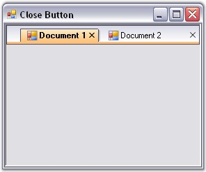
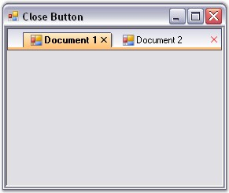

::: {style="DISPLAY: none"}
{#d2h_url_template}{#d2h_package_url style="WIDTH: 0px; DISPLAY: none; HEIGHT: 0px"}
:::

::: {.d2h_secondary_topic style="PADDING-BOTTOM: 10pt; MARGIN: 0pt; PADDING-LEFT: 0pt; PADDING-RIGHT: 0pt; PADDING-TOP: 0pt"}
##### Close Button {#close-button style="MARGIN-LEFT: 18pt; tab-stops: 18.0pt"}

[]{style="COLOR: #15428b"} 

On setting the **CloseButtonVisible** property, the close button will be either visible or hidden.

 

Enabling the **ShowCloseButtonForActiveTabOnly** property will display the close button for the active tab only and **ShowCloseButton** property will display the close button for all the tabs.

 

The close button for individual tabs can also be displayed by implementing the below code snippet.

[]{style="COLOR: #15428b"} 

+-------------------------------------------------------------------------------------------------------------------------------------------------------------------------------+
| **[\[C#\]]{style="FONT-FAMILY: 'Courier New'; COLOR: black"}**                                                                                                                |
|                                                                                                                                                                               |
| []{style="FONT-FAMILY: 'Courier New'; COLOR: black"}                                                                                                                          |
|                                                                                                                                                                               |
| [//Individual Close Buttons enabled.]{style="FONT-FAMILY: 'Courier New'; COLOR: green"}                                                                                       |
|                                                                                                                                                                               |
| [this]{style="FONT-FAMILY: 'Courier New'; COLOR: blue"}[.tabbedMDIManager.ShowCloseButton = [true]{style="COLOR: blue"};]{style="FONT-FAMILY: 'Courier New'"}                 |
|                                                                                                                                                                               |
| []{style="FONT-FAMILY: 'Courier New'"}                                                                                                                                        |
|                                                                                                                                                                               |
| [//Close Buttons for Active Tabs only.]{style="FONT-FAMILY: 'Courier New'; COLOR: green"}                                                                                     |
|                                                                                                                                                                               |
| [this]{style="FONT-FAMILY: 'Courier New'; COLOR: blue"}[.tabbedMDIManager.ShowCloseButtonForActiveTabOnly = [true]{style="COLOR: blue"};]{style="FONT-FAMILY: 'Courier New'"} |
|                                                                                                                                                                               |
| []{style="FONT-FAMILY: 'Courier New'"}                                                                                                                                        |
|                                                                                                                                                                               |
| [//Close Button can be made visible.]{style="FONT-FAMILY: 'Courier New'; COLOR: green"}                                                                                       |
|                                                                                                                                                                               |
| [this]{style="FONT-FAMILY: 'Courier New'; COLOR: blue"}[.tabbedMDIManager.CloseButtonVisible = [true]{style="COLOR: blue"};]{style="FONT-FAMILY: 'Courier New'"}              |
+-------------------------------------------------------------------------------------------------------------------------------------------------------------------------------+

[]{style="COLOR: #15428b"} 

+--------------------------------------------------------------------------------------------------------------------------------------------------------------------------------------------------------------------------------------------------------+
| **[\[VB.NET\]]{style="FONT-FAMILY: 'Courier New'; COLOR: black"}**                                                                                                                                                                                     |
|                                                                                                                                                                                                                                                        |
| []{style="FONT-FAMILY: 'Courier New'; COLOR: black"}                                                                                                                                                                                                   |
|                                                                                                                                                                                                                                                        |
| [\' ]{style="FONT-FAMILY: 'Courier New'; COLOR: black"}[Individual Close Buttons enabled.]{style="FONT-FAMILY: 'Courier New'; COLOR: green"}                                                                                                           |
|                                                                                                                                                                                                                                                        |
| [Me]{style="FONT-FAMILY: 'Courier New'; COLOR: blue"}[.tabbedMDIManager.CloseButtonVisible = ]{style="FONT-FAMILY: 'Courier New'; COLOR: black"}[True]{style="FONT-FAMILY: 'Courier New'; COLOR: blue"}                                                |
|                                                                                                                                                                                                                                                        |
| []{style="FONT-FAMILY: 'Courier New'; COLOR: blue"}                                                                                                                                                                                                    |
|                                                                                                                                                                                                                                                        |
| [\' Close Buttons for active Tabs only.]{style="FONT-FAMILY: 'Courier New'; COLOR: green"}                                                                                                                                                             |
|                                                                                                                                                                                                                                                        |
| [Me]{style="FONT-FAMILY: 'Courier New'; COLOR: blue"}[.tabbedMDIManager.]{style="FONT-FAMILY: 'Courier New'"}[ShowCloseButtonForActiveTabOnly]{style="FONT-FAMILY: 'Courier New'"}[ = [True]{style="COLOR: blue"}]{style="FONT-FAMILY: 'Courier New'"} |
|                                                                                                                                                                                                                                                        |
| []{style="FONT-FAMILY: 'Courier New'; COLOR: blue"}                                                                                                                                                                                                    |
|                                                                                                                                                                                                                                                        |
| [\' Close Button can be made visible. ]{style="FONT-FAMILY: 'Courier New'; COLOR: green"}                                                                                                                                                              |
|                                                                                                                                                                                                                                                        |
| [Me]{style="FONT-FAMILY: 'Courier New'; COLOR: blue"}[.tabbedMDIManager.ShowCloseButton = [True]{style="COLOR: blue"}]{style="FONT-FAMILY: 'Courier New'"}                                                                                             |
+--------------------------------------------------------------------------------------------------------------------------------------------------------------------------------------------------------------------------------------------------------+

[]{style="COLOR: #15428b"} 

{border="0"}

[]{style="COLOR: #15428b"} 

Figure 1088: Close Button Shown for Active Tabs

[]{style="COLOR: #15428b"} 

The color of the close button at the extreme right of the MDI TabStrip can be changed using the **CloseButtonColor** property.

[]{style="COLOR: #15428b"} 

+---------------------------------------------------------------------------------------------------------------------------------------------------------------------+
| **[\[C#\]]{style="FONT-FAMILY: 'Courier New'; COLOR: black"}**                                                                                                      |
|                                                                                                                                                                     |
| []{style="FONT-FAMILY: 'Courier New'; COLOR: black"}                                                                                                                |
|                                                                                                                                                                     |
| [this]{style="FONT-FAMILY: 'Courier New'; COLOR: blue"}[.tabbedMDIManager.CloseButtonColor = [Color]{style="COLOR: teal"}.Red;]{style="FONT-FAMILY: 'Courier New'"} |
+---------------------------------------------------------------------------------------------------------------------------------------------------------------------+

[]{style="COLOR: #15428b"} 

+------------------------------------------------------------------------------------------------------------------------------------------------------------------+
| **[\[VB.NET\]]{style="FONT-FAMILY: 'Courier New'; COLOR: black"}**                                                                                               |
|                                                                                                                                                                  |
| []{style="FONT-FAMILY: 'Courier New'; COLOR: black"}                                                                                                             |
|                                                                                                                                                                  |
| [Me]{style="FONT-FAMILY: 'Courier New'; COLOR: blue"}[.tabbedMDIManager.CloseButtonColor = [Color]{style="COLOR: teal"}.Red]{style="FONT-FAMILY: 'Courier New'"} |
+------------------------------------------------------------------------------------------------------------------------------------------------------------------+

[]{style="COLOR: #15428b"} 

{border="0"}

[]{style="COLOR: #15428b"} 

Figure 1089: CloseButtonColor = \"Red\"

 

Middle Mouse Button

[]{style="COLOR: #15428b"} 

The tabs can be closed by clicking the middle mouse button on enabling the **CloseOnMiddleButtonClick** property.

 

This functionality can also be added using the code snippet given below.

[]{style="COLOR: #15428b"} 

+------------------------------------------------------------------------------------------------------------------------------------------------------------------------+
| **[\[C#\]]{style="FONT-FAMILY: 'Courier New'; COLOR: black"}**                                                                                                         |
|                                                                                                                                                                        |
| []{style="FONT-FAMILY: 'Courier New'; COLOR: blue"}                                                                                                                    |
|                                                                                                                                                                        |
| [this]{style="FONT-FAMILY: 'Courier New'; COLOR: blue"}[.tabbedMDIManager.CloseOnMiddleButtonClick = [true]{style="COLOR: blue"};]{style="FONT-FAMILY: 'Courier New'"} |
+------------------------------------------------------------------------------------------------------------------------------------------------------------------------+

[]{style="COLOR: #15428b"} 

+---------------------------------------------------------------------------------------------------------------------------------------------------------------------+
| **[\[VB.NET\]]{style="FONT-FAMILY: 'Courier New'; COLOR: black"}**                                                                                                  |
|                                                                                                                                                                     |
| []{style="FONT-FAMILY: 'Courier New'; COLOR: blue"}                                                                                                                 |
|                                                                                                                                                                     |
| [Me]{style="FONT-FAMILY: 'Courier New'; COLOR: blue"}[.tabbedMDIManager.CloseOnMiddleButtonClick = [True]{style="COLOR: blue"}]{style="FONT-FAMILY: 'Courier New'"} |
+---------------------------------------------------------------------------------------------------------------------------------------------------------------------+

 

 

[]{#related-topics}
:::
