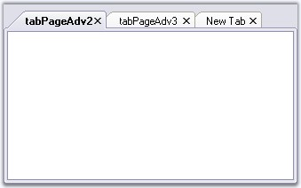

::: {style="DISPLAY: none"}
{#d2h_url_template}{#d2h_package_url style="WIDTH: 0px; DISPLAY: none; HEIGHT: 0px"}
:::

::: {.d2h_secondary_topic style="PADDING-BOTTOM: 10pt; MARGIN: 0pt; PADDING-LEFT: 0pt; PADDING-RIGHT: 0pt; PADDING-TOP: 0pt"}
#### Closed Event {#closed-event style="MARGIN-LEFT: 18pt; tab-stops: 18.0pt"}

[]{style="COLOR: #15428b"} 

The TabPageAdv.Closed event is raised when a TapPage is closed using close button.

[]{style="COLOR: #15428b"} 

+---------------------------------------------------------------------------------------------------------------------------------------------------------------------------------------------------------------------------+
| **[\[C#\]]{style="FONT-FAMILY: 'Courier New'; COLOR: black"}**                                                                                                                                                            |
|                                                                                                                                                                                                                           |
| **[]{style="FONT-FAMILY: 'Courier New'; COLOR: black"}**                                                                                                                                                                  |
|                                                                                                                                                                                                                           |
| [private]{style="FONT-FAMILY: 'Courier New'; COLOR: blue"}[ [void]{style="COLOR: blue"} tabPageAdv1_Closed([object]{style="COLOR: blue"} sender, [EventArgs]{style="COLOR: teal"} e)]{style="FONT-FAMILY: 'Courier New'"} |
|                                                                                                                                                                                                                           |
| [{]{style="FONT-FAMILY: 'Courier New'"}                                                                                                                                                                                   |
|                                                                                                                                                                                                                           |
| [    [this]{style="COLOR: blue"}.tabPageAdv5 = [new]{style="COLOR: blue"} Syncfusion.Windows.Forms.Tools.[TabPageAdv]{style="COLOR: teal"}();]{style="FONT-FAMILY: 'Courier New'"}                                        |
|                                                                                                                                                                                                                           |
| [    [this]{style="COLOR: blue"}.tabPageAdv5.Text = [\"New Tab\"]{style="COLOR: maroon"};]{style="FONT-FAMILY: 'Courier New'"}                                                                                            |
|                                                                                                                                                                                                                           |
| [    [this]{style="COLOR: blue"}.tabControlAdv1.TabPages.Add([this]{style="COLOR: blue"}.tabPageAdv5);]{style="FONT-FAMILY: 'Courier New'"}                                                                               |
|                                                                                                                                                                                                                           |
| [}]{style="FONT-FAMILY: 'Courier New'"}                                                                                                                                                                                   |
+---------------------------------------------------------------------------------------------------------------------------------------------------------------------------------------------------------------------------+

[]{style="COLOR: #15428b"} 

+-----------------------------------------------------------------------------------------------------------------------------------------------------------------------------------------------------------------------------------------------------------------------------------------------------------------------------------------+
| **[\[VB.NET\]]{style="FONT-FAMILY: 'Courier New'; COLOR: black"}**                                                                                                                                                                                                                                                                      |
|                                                                                                                                                                                                                                                                                                                                         |
| **[]{style="FONT-FAMILY: 'Courier New'; COLOR: black"}**                                                                                                                                                                                                                                                                                |
|                                                                                                                                                                                                                                                                                                                                         |
| [Private]{style="FONT-FAMILY: 'Courier New'; COLOR: blue"}[ [Sub]{style="COLOR: blue"} tabPageAdv1_Closed([ByVal]{style="COLOR: blue"} sender [As]{style="COLOR: blue"} [Object]{style="COLOR: blue"}, [ByVal]{style="COLOR: blue"} e [As]{style="COLOR: blue"} [EventArgs]{style="COLOR: black"})]{style="FONT-FAMILY: 'Courier New'"} |
|                                                                                                                                                                                                                                                                                                                                         |
| [Me]{style="FONT-FAMILY: 'Courier New'; COLOR: blue"}[.tabPageAdv5 = [New]{style="COLOR: blue"} Syncfusion.Windows.Forms.Tools.TabPageAdv() ]{style="FONT-FAMILY: 'Courier New'"}                                                                                                                                                       |
|                                                                                                                                                                                                                                                                                                                                         |
| [Me]{style="FONT-FAMILY: 'Courier New'; COLOR: blue"}[.tabPageAdv5.Text = [\"New Tab\"]{style="COLOR: maroon"} ]{style="FONT-FAMILY: 'Courier New'"}                                                                                                                                                                                    |
|                                                                                                                                                                                                                                                                                                                                         |
| [Me]{style="FONT-FAMILY: 'Courier New'; COLOR: blue"}[.tabControlAdv1.TabPages.Add([Me]{style="COLOR: blue"}.tabPageAdv5)]{style="FONT-FAMILY: 'Courier New'"}                                                                                                                                                                          |
|                                                                                                                                                                                                                                                                                                                                         |
| [End]{style="FONT-FAMILY: 'Courier New'; COLOR: blue"}[ [Sub]{style="COLOR: blue"}]{style="FONT-FAMILY: 'Courier New'"}                                                                                                                                                                                                                 |
+-----------------------------------------------------------------------------------------------------------------------------------------------------------------------------------------------------------------------------------------------------------------------------------------------------------------------------------------+

[]{style="COLOR: #15428b"} 

{border="0"}

[]{style="COLOR: #15428b"} 

Figure 1078: TabPageAdv1 is Closed and \"New Tab\" is added to the TabControlAdv

 

 

 

[]{#p886} 

[]{#related-topics}
:::
