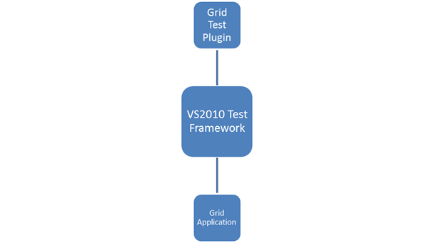

::: {style="DISPLAY: none"}
{#d2h_url_template}{#d2h_package_url style="WIDTH: 0px; DISPLAY: none; HEIGHT: 0px"}
:::

::::: {#nsbanner .d2h_main_nsbanner style="BORDER-BOTTOM: #999999 1px solid; POSITION: relative; PADDING-BOTTOM: 0px; BACKGROUND-COLOR: transparent; PADDING-LEFT: 0px; PADDING-RIGHT: 0px; DISPLAY: none; BORDER-TOP: #999999 1px solid; PADDING-TOP: 0px; LEFT: 0px"}
:::: {#TitleRow .d2h_main_titlerow style="PADDING-BOTTOM: 4px; BACKGROUND-COLOR: transparent; PADDING-LEFT: 22px; WIDTH: 100%; PADDING-RIGHT: 10px; DISPLAY: none; PADDING-TOP: 4px"}
::: {#ienav .d2h_main_ienav style="DISPLAY: none"}
{#D2HPrevious .D2HPreviousEnabled}  {#D2HNext .D2HNextEnabled}
:::
::::
:::::

:::: {#nstext .d2h_main_nstext style="PADDING-BOTTOM: 10px; BACKGROUND-COLOR: transparent; PADDING-LEFT: 22px; PADDING-RIGHT: 10px; HEIGHT: 100%; OVERFLOW: auto; PADDING-TOP: 5px" hasuserbackground="true" valign="bottom"}
::: {#d2h_breadcrumbs .d2h_breadcrumbs}
[Essential Studio User Guide Documentation](ms-xhelp:///?Id=12457748-09e3-4d74-a240-8e049cedf030){.d2h_breadcrumbsNormal}[ \> ]{.d2h_breadcrumbsLinkSeparator}[User Interface Edition](ms-xhelp:///?Id=c29296b7-531c-413b-a0ec-488ca1f7f669){.d2h_breadcrumbsNormal}[ \> ]{.d2h_breadcrumbsLinkSeparator}[Essential Windows](ms-xhelp:///?Id=e60759d8-47a4-4570-9d7a-16a68d63f2ea){.d2h_breadcrumbsNormal}[ \> ]{.d2h_breadcrumbsLinkSeparator}[Essential Grid]{.d2h_breadcrumbsContentsOnly}[ \> ]{.d2h_breadcrumbsLinkSeparator}[Grid Controls](ms-xhelp:///?Id=bf2d70d7-33dc-4c67-a55d-4fcf8d51dc2b){.d2h_breadcrumbsNormal}
:::

## Coded UI Support in Windows Grids {#coded-ui-support-in-windows-grids style="tab-stops: 0pt"}

[]{style="FONT-FAMILY: 'Trebuchet MS','sans-serif'; COLOR: #15428b; FONT-SIZE: 9pt"} 

Essential Grid WF now supports automated UI testing with VS 2010 Coded UI technology. The Grid Test plugin blends in with the automated UI testing framework in VS 2010 by implementing the following classes:

[·      ]{style="FONT-FAMILY: Symbol"}UITechnologyManager

[·      ]{style="FONT-FAMILY: Symbol"}UITestPropertyProvider

[·      ]{style="FONT-FAMILY: Symbol"}UIActionFilter

[]{style="FONT-FAMILY: 'Trebuchet MS','sans-serif'; COLOR: #15428b; FONT-SIZE: 9pt"} 

The architectural diagram is as follows:

{border="0"}

Figure 489: Architectural Diagram

 

[·      ]{style="FONT-FAMILY: Symbol"}Grid Test Plugin implements the necessary details to communicate with the VS 2010 Test Framework.

[·      ]{style="FONT-FAMILY: Symbol"}The Grid application host runs with a .NET Remoting channel hosted internally to communicate with the Test plugin through an interface. The data is then channeled across the VS 2010 Test Framework, to identify the Cells and Grid controls.

[]{style="FONT-FAMILY: 'Trebuchet MS','sans-serif'; COLOR: #15428b; FONT-SIZE: 9pt"} 

Use Case Scenarios

You can create a Coded UI Test with Essential Grid Windows. The following example shows the implementation of the feature.

Perform the following initial steps before creating the Coded UI Test project:

1.   Deploying Extension assembly

2.   Prepare the Grid sample application

3.   Write UI tests using VS 2010

4.   Testing the application with generated Coded UI Tests

[]{style="FONT-FAMILY: 'Trebuchet MS','sans-serif'; COLOR: #15428b; FONT-SIZE: 9pt"} 

More:

[ ]{#related-topics}

[{border="0" align="absMiddle"}Deploying Extension Assembly](ms-xhelp:///?Id=b02e6e36-6787-4e5a-98ad-eaf4bcd544a4){style="TEXT-DECORATION: none"}

[{border="0" align="absMiddle"}Preparing the Grid Application](ms-xhelp:///?Id=f3867235-0697-490c-a3fe-cbfe4d18ffab){style="TEXT-DECORATION: none"}

[{border="0" align="absMiddle"}Creating Unit Tests with VS2010](ms-xhelp:///?Id=4b70d5ee-f083-4a15-8bca-d5e68606f9fc){style="TEXT-DECORATION: none"}

[{border="0" align="absMiddle"}Testing the Application with Generated Coded UI Tests](ms-xhelp:///?Id=b944e647-0d55-40c7-a84d-fbf2041a8e90){style="TEXT-DECORATION: none"}

[{border="0" align="absMiddle"}Properties](ms-xhelp:///?Id=a00093fb-a076-41b4-ad20-6a584fb17ac8){style="TEXT-DECORATION: none"}
::::
