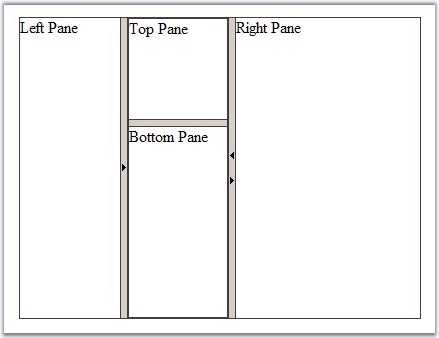

::: {style="DISPLAY: none"}
{#d2h_url_template}{#d2h_package_url style="WIDTH: 0px; DISPLAY: none; HEIGHT: 0px"}
:::

::: {.d2h_secondary_topic style="PADDING-BOTTOM: 10pt; MARGIN: 0pt; PADDING-LEFT: 0pt; PADDING-RIGHT: 0pt; PADDING-TOP: 0pt"}
##### Collapse Expand feature {#collapse-expand-feature style="tab-stops: 0pt"}

[]{style="FONT-FAMILY: 'Trebuchet MS','sans-serif'; COLOR: #15428b; FONT-SIZE: 9pt"} 

Each pane can be collapsed if its adjacent SplitterBars are configured to allow collapsing, using their **CollapseMode** property. The different modes are None, Forward, Backward and Both collapse modes. Depending on the value of the CollapseMode property, the split bar will display two collapse buttons. On clicking this button, it will collapse the pane according to the mode set.

[]{style="FONT-FAMILY: 'Trebuchet MS','sans-serif'; COLOR: #15428b; FONT-SIZE: 9pt"} 

[·      ]{style="FONT-FAMILY: Symbol"}**None**: will not display collapse buttons, the adjacent panes will not be collapsible

[·      ]{style="FONT-FAMILY: Symbol"}**Forward** - depending on the **Layout** property of the parent splitter, the splitter bar will display either left-to-right or top-to-bottom collapse button

When the user clicks the button, the left (top) adjacent pane will increase its size with the width / height of the right (bottom) adjacent pane.

[·      ]{style="FONT-FAMILY: Symbol"}**Backward**: depending on the Layout property of the parent splitter, the splitter bar will display either right-to-left or bottom-to-top collapse button

When the user clicks the button, the right (bottom) adjacent pane will increase its size with the width / height of the left (top) adjacent pane.

[·      ]{style="FONT-FAMILY: Symbol"}**Both**: displays both buttons for Forward and Backward collapsing

[]{style="FONT-FAMILY: 'Trebuchet MS','sans-serif'; COLOR: #15428b; FONT-SIZE: 9pt"} 

When a pane was collapsed by clicking a collapse button, this button will change its direction and will allow expanding. You can make a pane to be initially collapsed if you set its **Collapsed** property to **True**.

The following example demonstrates how to set the CollapseMode property of the SplitterBar controls declaratively.

[]{style="FONT-FAMILY: 'Trebuchet MS','sans-serif'; COLOR: #15428b; FONT-SIZE: 9pt"} 

+--------------------------------------------------------------------------------------------------------------------------------------------------------------------------------------------------------------------------------------------------------------------------------------------------------------------------------------------------------------------------------------------------------------------------------------------------------------------------------------------------------------------------------------------------------------------------------------------------+
| **[\[aspx\]]{style="FONT-FAMILY: 'Courier New'"}**                                                                                                                                                                                                                                                                                                                                                                                                                                                                                                                                               |
|                                                                                                                                                                                                                                                                                                                                                                                                                                                                                                                                                                                                  |
| **[]{style="FONT-FAMILY: 'Courier New'"}**                                                                                                                                                                                                                                                                                                                                                                                                                                                                                                                                                       |
|                                                                                                                                                                                                                                                                                                                                                                                                                                                                                                                                                                                                  |
| [\<]{style="FONT-FAMILY: 'Courier New'; COLOR: blue"}[cc1]{style="FONT-FAMILY: 'Courier New'; COLOR: maroon"}[:]{style="FONT-FAMILY: 'Courier New'; COLOR: blue"}[Splitter]{style="FONT-FAMILY: 'Courier New'; COLOR: maroon"}[ [runat]{style="COLOR: red"}[=\"server\"]{style="COLOR: blue"} [ID]{style="COLOR: red"}[=\"Splitter1\"]{style="COLOR: blue"} [Layout]{style="COLOR: red"}[=\"horizontal\"]{style="COLOR: blue"} [Width]{style="COLOR: red"}[=\"400px\"]{style="COLOR: blue"} [Height]{style="COLOR: red"}[=\"300px\"\>]{style="COLOR: blue"}]{style="FONT-FAMILY: 'Courier New'"} |
|                                                                                                                                                                                                                                                                                                                                                                                                                                                                                                                                                                                                  |
| [    [\<]{style="COLOR: blue"}[cc1]{style="COLOR: maroon"}[:]{style="COLOR: blue"}[SplitPane]{style="COLOR: maroon"} [runat]{style="COLOR: red"}[=\"server\"]{style="COLOR: blue"} [ID]{style="COLOR: red"}[=\"LeftPane\"\>]{style="COLOR: blue"}]{style="FONT-FAMILY: 'Courier New'"}                                                                                                                                                                                                                                                                                                           |
|                                                                                                                                                                                                                                                                                                                                                                                                                                                                                                                                                                                                  |
| [        Left Pane[\</]{style="COLOR: blue"}[cc1]{style="COLOR: maroon"}[:]{style="COLOR: blue"}[SplitPane]{style="COLOR: maroon"}[\>]{style="COLOR: blue"}]{style="FONT-FAMILY: 'Courier New'"}                                                                                                                                                                                                                                                                                                                                                                                                 |
|                                                                                                                                                                                                                                                                                                                                                                                                                                                                                                                                                                                                  |
| [    [\<]{style="COLOR: blue"}[cc1]{style="COLOR: maroon"}[:]{style="COLOR: blue"}[SplitterBar]{style="COLOR: maroon"} [runat]{style="COLOR: red"}[=\"server\"]{style="COLOR: blue"} [ID]{style="COLOR: red"}[=\"SplitterBar1\"]{style="COLOR: blue"} [CollapseMode]{style="COLOR: red"}[=\"Backward\"]{style="COLOR: blue"} [/\>]{style="COLOR: blue"}]{style="FONT-FAMILY: 'Courier New'"}                                                                                                                                                                                                     |
|                                                                                                                                                                                                                                                                                                                                                                                                                                                                                                                                                                                                  |
| [    [\<]{style="COLOR: blue"}[cc1]{style="COLOR: maroon"}[:]{style="COLOR: blue"}[SplitPane]{style="COLOR: maroon"} [runat]{style="COLOR: red"}[=\"server\"]{style="COLOR: blue"} [ID]{style="COLOR: red"}[=\"MiddlePane\"\>]{style="COLOR: blue"}]{style="FONT-FAMILY: 'Courier New'"}                                                                                                                                                                                                                                                                                                         |
|                                                                                                                                                                                                                                                                                                                                                                                                                                                                                                                                                                                                  |
| [        [\<]{style="COLOR: blue"}[cc1]{style="COLOR: maroon"}[:]{style="COLOR: blue"}[Splitter]{style="COLOR: maroon"} [runat]{style="COLOR: red"}[=\"server\"]{style="COLOR: blue"} [ID]{style="COLOR: red"}[=\"InnerSplitter\"]{style="COLOR: blue"} [Layout]{style="COLOR: red"}[=\"vertical\"\>]{style="COLOR: blue"}]{style="FONT-FAMILY: 'Courier New'"}                                                                                                                                                                                                                                  |
|                                                                                                                                                                                                                                                                                                                                                                                                                                                                                                                                                                                                  |
| [            [\<]{style="COLOR: blue"}[cc1]{style="COLOR: maroon"}[:]{style="COLOR: blue"}[SplitPane]{style="COLOR: maroon"} [runat]{style="COLOR: red"}[=\"server\"]{style="COLOR: blue"} [ID]{style="COLOR: red"}[=\"TopPane\"\>]{style="COLOR: blue"}]{style="FONT-FAMILY: 'Courier New'"}                                                                                                                                                                                                                                                                                                    |
|                                                                                                                                                                                                                                                                                                                                                                                                                                                                                                                                                                                                  |
| [                Top Pane[\</]{style="COLOR: blue"}[cc1]{style="COLOR: maroon"}[:]{style="COLOR: blue"}[SplitPane]{style="COLOR: maroon"}[\>]{style="COLOR: blue"}]{style="FONT-FAMILY: 'Courier New'"}                                                                                                                                                                                                                                                                                                                                                                                          |
|                                                                                                                                                                                                                                                                                                                                                                                                                                                                                                                                                                                                  |
| [            [\<]{style="COLOR: blue"}[cc1]{style="COLOR: maroon"}[:]{style="COLOR: blue"}[SplitterBar]{style="COLOR: maroon"} [runat]{style="COLOR: red"}[=\"server\"]{style="COLOR: blue"} [ID]{style="COLOR: red"}[=\"SplitterBar2\"]{style="COLOR: blue"} [/\>]{style="COLOR: blue"}]{style="FONT-FAMILY: 'Courier New'"}                                                                                                                                                                                                                                                                    |
|                                                                                                                                                                                                                                                                                                                                                                                                                                                                                                                                                                                                  |
| [            [\<]{style="COLOR: blue"}[cc1]{style="COLOR: maroon"}[:]{style="COLOR: blue"}[SplitPane]{style="COLOR: maroon"} [runat]{style="COLOR: red"}[=\"server\"]{style="COLOR: blue"} [ID]{style="COLOR: red"}[=\"BottomPane\"\>]{style="COLOR: blue"}]{style="FONT-FAMILY: 'Courier New'"}                                                                                                                                                                                                                                                                                                 |
|                                                                                                                                                                                                                                                                                                                                                                                                                                                                                                                                                                                                  |
| [                Bottom Pane[\</]{style="COLOR: blue"}[cc1]{style="COLOR: maroon"}[:]{style="COLOR: blue"}[SplitPane]{style="COLOR: maroon"}[\>]{style="COLOR: blue"}]{style="FONT-FAMILY: 'Courier New'"}                                                                                                                                                                                                                                                                                                                                                                                       |
|                                                                                                                                                                                                                                                                                                                                                                                                                                                                                                                                                                                                  |
| [        [\</]{style="COLOR: blue"}[cc1]{style="COLOR: maroon"}[:]{style="COLOR: blue"}[Splitter]{style="COLOR: maroon"}[\>]{style="COLOR: blue"}]{style="FONT-FAMILY: 'Courier New'"}                                                                                                                                                                                                                                                                                                                                                                                                           |
|                                                                                                                                                                                                                                                                                                                                                                                                                                                                                                                                                                                                  |
| [    [\</]{style="COLOR: blue"}[cc1]{style="COLOR: maroon"}[:]{style="COLOR: blue"}[SplitPane]{style="COLOR: maroon"}[\>]{style="COLOR: blue"}]{style="FONT-FAMILY: 'Courier New'"}                                                                                                                                                                                                                                                                                                                                                                                                              |
|                                                                                                                                                                                                                                                                                                                                                                                                                                                                                                                                                                                                  |
| [    [\<]{style="COLOR: blue"}[cc1]{style="COLOR: maroon"}[:]{style="COLOR: blue"}[SplitterBar]{style="COLOR: maroon"} [runat]{style="COLOR: red"}[=\"server\"]{style="COLOR: blue"} [ID]{style="COLOR: red"}[=\"SplitterBar3\"]{style="COLOR: blue"} [CollapseMode]{style="COLOR: red"}[=\"Both\"]{style="COLOR: blue"} [/\>]{style="COLOR: blue"}]{style="FONT-FAMILY: 'Courier New'"}                                                                                                                                                                                                         |
|                                                                                                                                                                                                                                                                                                                                                                                                                                                                                                                                                                                                  |
| [    [\<]{style="COLOR: blue"}[cc1]{style="COLOR: maroon"}[:]{style="COLOR: blue"}[SplitPane]{style="COLOR: maroon"} [runat]{style="COLOR: red"}[=\"server\"]{style="COLOR: blue"} [ID]{style="COLOR: red"}[=\"RightPane\"\>]{style="COLOR: blue"}]{style="FONT-FAMILY: 'Courier New'"}                                                                                                                                                                                                                                                                                                          |
|                                                                                                                                                                                                                                                                                                                                                                                                                                                                                                                                                                                                  |
| [        Right Pane[\</]{style="COLOR: blue"}[cc1]{style="COLOR: maroon"}[:]{style="COLOR: blue"}[SplitPane]{style="COLOR: maroon"}[\>]{style="COLOR: blue"}]{style="FONT-FAMILY: 'Courier New'"}                                                                                                                                                                                                                                                                                                                                                                                                |
|                                                                                                                                                                                                                                                                                                                                                                                                                                                                                                                                                                                                  |
| [\</]{style="FONT-FAMILY: 'Courier New'; COLOR: blue"}[cc1]{style="FONT-FAMILY: 'Courier New'; COLOR: maroon"}[:]{style="FONT-FAMILY: 'Courier New'; COLOR: blue"}[Splitter]{style="FONT-FAMILY: 'Courier New'; COLOR: maroon"}[\>]{style="FONT-FAMILY: 'Courier New'; COLOR: blue"}                                                                                                                                                                                                                                                                                                             |
+--------------------------------------------------------------------------------------------------------------------------------------------------------------------------------------------------------------------------------------------------------------------------------------------------------------------------------------------------------------------------------------------------------------------------------------------------------------------------------------------------------------------------------------------------------------------------------------------------+

[]{style="COLOR: black; FONT-SIZE: 8pt"} 

The result will be displayed as shown below.

[]{style="FONT-FAMILY: 'Trebuchet MS','sans-serif'; COLOR: #15428b; FONT-SIZE: 9pt"} 

{border="0"}

Figure 402: CollapseMode property of the SplitterBar controls

 

 

[]{#related-topics}
:::
