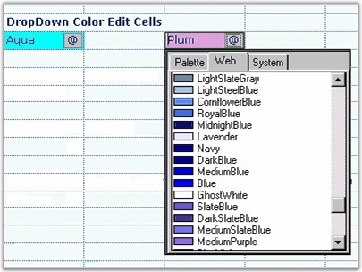

::: {style="DISPLAY: none"}
{#d2h_url_template}{#d2h_package_url style="WIDTH: 0px; DISPLAY: none; HEIGHT: 0px"}
:::

::: {.d2h_secondary_topic style="PADDING-BOTTOM: 10pt; MARGIN: 0pt; PADDING-LEFT: 0pt; PADDING-RIGHT: 0pt; PADDING-TOP: 0pt"}
##### Color Edit {#color-edit style="tab-stops: 0pt"}

[]{style="FONT-FAMILY: 'Trebuchet MS','sans-serif'; COLOR: #15428b; FONT-SIZE: 9pt"} 

The **Color Edit** cell type allows you to pick colors and set a color object as the **CellValue**. To do this, you have to set the **CellType** property to *ColorEdit*.

[]{style="FONT-FAMILY: 'Trebuchet MS','sans-serif'; COLOR: #15428b; FONT-SIZE: 9pt"} 

The following code example illustrates how to set the cell type to ColorEdit.

[]{style="FONT-FAMILY: 'Trebuchet MS','sans-serif'; COLOR: #15428b; FONT-SIZE: 9pt"} 

+------------------------------------------------------------------------------------------------------------------------------+
| **[\[C#\]]{style="FONT-FAMILY: 'Courier New'; COLOR: black"}**                                                               |
|                                                                                                                              |
| []{style="FONT-FAMILY: 'Courier New'; COLOR: black"}                                                                         |
|                                                                                                                              |
| [// Set up a Color Edit control.]{style="FONT-FAMILY: 'Courier New'; COLOR: green"}                                          |
|                                                                                                                              |
| [gridControl1\[rowIndex, colIndex\].CellType = [\"ColorEdit\"]{style="COLOR: #a31515"};]{style="FONT-FAMILY: 'Courier New'"} |
|                                                                                                                              |
| [gridControl1\[rowIndex, colIndex\].CellValue = [Color]{style="COLOR: #2b91af"}.Aqua;]{style="FONT-FAMILY: 'Courier New'"}   |
+------------------------------------------------------------------------------------------------------------------------------+

[]{style="FONT-FAMILY: 'Trebuchet MS','sans-serif'; COLOR: #15428b; FONT-SIZE: 9pt"} 

+---------------------------------------------------------------------------------------------------------------------------+
| **[\[VB.NET\]]{style="FONT-FAMILY: 'Courier New'; COLOR: black"}**                                                        |
|                                                                                                                           |
| []{style="FONT-FAMILY: 'Courier New'; COLOR: black"}                                                                      |
|                                                                                                                           |
| [\' Set up a Color Edit control.]{style="FONT-FAMILY: 'Courier New'; COLOR: green"}                                       |
|                                                                                                                           |
| [gridControl1(rowIndex, colIndex).CellType = [\"ColorEdit\"]{style="COLOR: #a31515"}]{style="FONT-FAMILY: 'Courier New'"} |
|                                                                                                                           |
| [gridControl1(rowIndex, colIndex).CellValue = Color.Aqua]{style="FONT-FAMILY: 'Courier New'"}                             |
+---------------------------------------------------------------------------------------------------------------------------+

[]{style="FONT-FAMILY: 'Trebuchet MS','sans-serif'; COLOR: #15428b; FONT-SIZE: 9pt"} 

{border="0"}

[]{style="FONT-FAMILY: 'Trebuchet MS','sans-serif'; COLOR: #15428b; FONT-SIZE: 9pt"} 

Figure 75: Color Edit Cells

 

[]{#p52} 

 

[]{#related-topics}
:::
