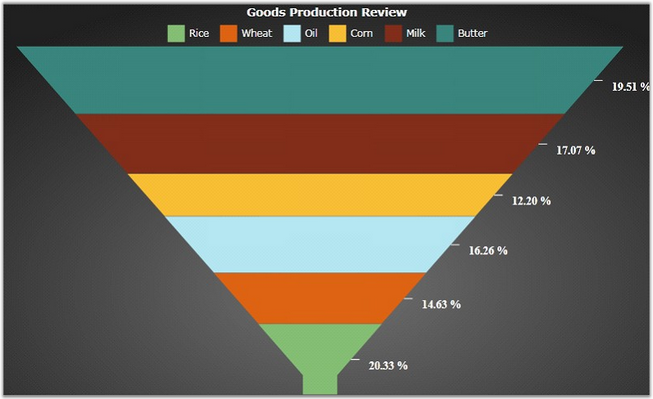

::: {style="DISPLAY: none"}
{#d2h_url_template}{#d2h_package_url style="WIDTH: 0px; DISPLAY: none; HEIGHT: 0px"}
:::

::::: {#nsbanner .d2h_main_nsbanner style="BORDER-BOTTOM: #999999 1px solid; POSITION: relative; PADDING-BOTTOM: 0px; BACKGROUND-COLOR: transparent; PADDING-LEFT: 0px; PADDING-RIGHT: 0px; DISPLAY: none; BORDER-TOP: #999999 1px solid; PADDING-TOP: 0px; LEFT: 0px"}
:::: {#TitleRow .d2h_main_titlerow style="PADDING-BOTTOM: 4px; BACKGROUND-COLOR: transparent; PADDING-LEFT: 22px; WIDTH: 100%; PADDING-RIGHT: 10px; DISPLAY: none; PADDING-TOP: 4px"}
::: {#ienav .d2h_main_ienav style="DISPLAY: none"}
{#D2HPrevious .D2HPreviousEnabled}  {#D2HNext .D2HNextEnabled}
:::
::::
:::::

:::: {#nstext .d2h_main_nstext style="PADDING-BOTTOM: 10px; BACKGROUND-COLOR: transparent; PADDING-LEFT: 22px; PADDING-RIGHT: 10px; HEIGHT: 100%; OVERFLOW: auto; PADDING-TOP: 5px" hasuserbackground="true" valign="bottom"}
::: {#d2h_breadcrumbs .d2h_breadcrumbs}
[Essential Studio User Guide Documentation](ms-xhelp:///?Id=12457748-09e3-4d74-a240-8e049cedf030){.d2h_breadcrumbsNormal}[ \> ]{.d2h_breadcrumbsLinkSeparator}[User Interface Edition](ms-xhelp:///?Id=c29296b7-531c-413b-a0ec-488ca1f7f669){.d2h_breadcrumbsNormal}[ \> ]{.d2h_breadcrumbsLinkSeparator}[Essential Silverlight](ms-xhelp:///?Id=66221bd1-ba2e-43c2-94a7-618f50e01d24){.d2h_breadcrumbsNormal}[ \> ]{.d2h_breadcrumbsLinkSeparator}[Essential Chart]{.d2h_breadcrumbsContentsOnly}[ \> ]{.d2h_breadcrumbsLinkSeparator}[Concepts and Features](ms-xhelp:///?Id=0f820843-9cdd-4436-8cae-3dc5a65fd5cd){.d2h_breadcrumbsNormal}[ \> ]{.d2h_breadcrumbsLinkSeparator}[Chart Series](ms-xhelp:///?Id=89819a94-ebab-4148-9acc-042438f9054b){.d2h_breadcrumbsNormal}
:::

### Color Palette {#color-palette style="tab-stops: 0pt"}

[]{style="COLOR: #15428b"} 

This feature provides support to set colors for Pie, Doughnut, Pyramid and Funnel chart types. It is also used to set colors for large number of series in the Chart Area.

 

Essential Chart Silverlight supports ten built-in color models. It also allows you to apply your own colors to the Chart. The colors can be initialized by using the ColorModel property of ChartArea class. The following code example illustrates how to initialize and use the Color Palette feature in the Funnel Chart.

[]{style="COLOR: #15428b"} 

+---------------------------------------------------------------------------------------------------------------------------------------------------------------------------------------------------------------------------------------------------------------------------------------------------------------------------------------------------------------------------------------------------------------------------------------------------------------------------------------------------------------------------------------------------------------------+
| [\[XAML\]]{style="FONT-FAMILY: 'Courier New'"}                                                                                                                                                                                                                                                                                                                                                                                                                                                                                                                      |
|                                                                                                                                                                                                                                                                                                                                                                                                                                                                                                                                                                     |
| []{style="FONT-FAMILY: 'Courier New'; COLOR: blue"}                                                                                                                                                                                                                                                                                                                                                                                                                                                                                                                 |
|                                                                                                                                                                                                                                                                                                                                                                                                                                                                                                                                                                     |
| [\<]{style="FONT-FAMILY: 'Courier New'; COLOR: blue"}[syncfusion]{style="FONT-FAMILY: 'Courier New'; COLOR: #a31515"}[:]{style="FONT-FAMILY: 'Courier New'; COLOR: blue"}[ChartArea]{style="FONT-FAMILY: 'Courier New'; COLOR: #a31515"}[\>]{style="FONT-FAMILY: 'Courier New'; COLOR: blue"}                                                                                                                                                                                                                                                                       |
|                                                                                                                                                                                                                                                                                                                                                                                                                                                                                                                                                                     |
| [    ]{style="FONT-FAMILY: 'Courier New'; COLOR: #a31515"}[\<]{style="FONT-FAMILY: 'Courier New'; COLOR: blue"}[syncfusion]{style="FONT-FAMILY: 'Courier New'; COLOR: #a31515"}[:]{style="FONT-FAMILY: 'Courier New'; COLOR: blue"}[ChartArea.SecondaryAxis]{style="FONT-FAMILY: 'Courier New'; COLOR: #a31515"}[\>]{style="FONT-FAMILY: 'Courier New'; COLOR: blue"}                                                                                                                                                                                               |
|                                                                                                                                                                                                                                                                                                                                                                                                                                                                                                                                                                     |
| [        ]{style="FONT-FAMILY: 'Courier New'; COLOR: #a31515"}[\<]{style="FONT-FAMILY: 'Courier New'; COLOR: blue"}[syncfusion]{style="FONT-FAMILY: 'Courier New'; COLOR: #a31515"}[:]{style="FONT-FAMILY: 'Courier New'; COLOR: blue"}[ChartAxis]{style="FONT-FAMILY: 'Courier New'; COLOR: #a31515"}[ IsAutoSetRange]{style="FONT-FAMILY: 'Courier New'; COLOR: red"}[=\"True\"]{style="FONT-FAMILY: 'Courier New'; COLOR: blue"}[ RangePadding]{style="FONT-FAMILY: 'Courier New'; COLOR: red"}[=\"Normal\"/\>]{style="FONT-FAMILY: 'Courier New'; COLOR: blue"} |
|                                                                                                                                                                                                                                                                                                                                                                                                                                                                                                                                                                     |
| [    ]{style="FONT-FAMILY: 'Courier New'; COLOR: #a31515"}[\</]{style="FONT-FAMILY: 'Courier New'; COLOR: blue"}[syncfusion]{style="FONT-FAMILY: 'Courier New'; COLOR: #a31515"}[:]{style="FONT-FAMILY: 'Courier New'; COLOR: blue"}[ChartArea.SecondaryAxis]{style="FONT-FAMILY: 'Courier New'; COLOR: #a31515"}[\>]{style="FONT-FAMILY: 'Courier New'; COLOR: blue"}                                                                                                                                                                                              |
|                                                                                                                                                                                                                                                                                                                                                                                                                                                                                                                                                                     |
| [\</]{style="FONT-FAMILY: 'Courier New'; COLOR: blue"}[syncfusion]{style="FONT-FAMILY: 'Courier New'; COLOR: #a31515"}[:]{style="FONT-FAMILY: 'Courier New'; COLOR: blue"}[ChartArea]{style="FONT-FAMILY: 'Courier New'; COLOR: #a31515"}[\>]{style="FONT-FAMILY: 'Courier New'; COLOR: blue"}                                                                                                                                                                                                                                                                      |
+---------------------------------------------------------------------------------------------------------------------------------------------------------------------------------------------------------------------------------------------------------------------------------------------------------------------------------------------------------------------------------------------------------------------------------------------------------------------------------------------------------------------------------------------------------------------+

[]{style="COLOR: #15428b"} 

+-------------------------------------------------------------------------------------------------------------------------------------------------------------------------------------------------------------+
| [\[C#\]]{style="FONT-FAMILY: 'Courier New'"}                                                                                                                                                                |
|                                                                                                                                                                                                             |
| []{style="FONT-FAMILY: 'Courier New'"}                                                                                                                                                                      |
|                                                                                                                                                                                                             |
| [// Create an instance for the Chart and Chart Area.]{style="FONT-FAMILY: 'Courier New'; COLOR: green"}                                                                                                     |
|                                                                                                                                                                                                             |
| [Chart]{style="FONT-FAMILY: 'Courier New'; COLOR: #2b91af"}[ chart = [new]{style="COLOR: blue"} [Chart]{style="COLOR: #2b91af"}();]{style="FONT-FAMILY: 'Courier New'"}                                     |
|                                                                                                                                                                                                             |
| [ChartArea]{style="FONT-FAMILY: 'Courier New'; COLOR: #2b91af"}[ area = [new]{style="COLOR: blue"} [ChartArea]{style="COLOR: #2b91af"}();]{style="FONT-FAMILY: 'Courier New'"}                              |
|                                                                                                                                                                                                             |
| [chart.Areas.Add(area);]{style="FONT-FAMILY: 'Courier New'"}                                                                                                                                                |
|                                                                                                                                                                                                             |
| []{style="FONT-FAMILY: 'Courier New'"}                                                                                                                                                                      |
|                                                                                                                                                                                                             |
| [// Initialize the built-in Color Palette.]{style="FONT-FAMILY: 'Courier New'; COLOR: green"}                                                                                                               |
|                                                                                                                                                                                                             |
| [chart.Areas\[0\].ColorModel.Palette = [ChartColorPalette]{style="COLOR: #2b91af"}.EarthTone;]{style="FONT-FAMILY: 'Courier New'"}                                                                          |
|                                                                                                                                                                                                             |
| []{style="FONT-FAMILY: 'Courier New'"}                                                                                                                                                                      |
|                                                                                                                                                                                                             |
| [// Initialize custom Color Palette colors.]{style="FONT-FAMILY: 'Courier New'; COLOR: green"}                                                                                                              |
|                                                                                                                                                                                                             |
| [Brush]{style="FONT-FAMILY: 'Courier New'; COLOR: #2b91af"}[\[\] colors = [new]{style="COLOR: blue"} [Brush]{style="COLOR: #2b91af"}\[\] {]{style="FONT-FAMILY: 'Courier New'"}                             |
|                                                                                                                                                                                                             |
| [new]{style="FONT-FAMILY: 'Courier New'; COLOR: blue"}[ [SolidColorBrush]{style="COLOR: #2b91af"}([Color]{style="COLOR: #2b91af"}.FromArgb( 0xff, 0x85, 0xbf, 0x75 )),]{style="FONT-FAMILY: 'Courier New'"} |
|                                                                                                                                                                                                             |
| [new]{style="FONT-FAMILY: 'Courier New'; COLOR: blue"}[ [SolidColorBrush]{style="COLOR: #2b91af"}([Color]{style="COLOR: #2b91af"}.FromArgb( 0xff, 0xde, 0x64, 0x13 )),]{style="FONT-FAMILY: 'Courier New'"} |
|                                                                                                                                                                                                             |
| [new]{style="FONT-FAMILY: 'Courier New'; COLOR: blue"}[ [SolidColorBrush]{style="COLOR: #2b91af"}([Color]{style="COLOR: #2b91af"}.FromArgb( 0xff, 0xb4, 0xe7, 0xf2 )),]{style="FONT-FAMILY: 'Courier New'"} |
|                                                                                                                                                                                                             |
| [new]{style="FONT-FAMILY: 'Courier New'; COLOR: blue"}[ [SolidColorBrush]{style="COLOR: #2b91af"}([Color]{style="COLOR: #2b91af"}.FromArgb( 0xff, 0xff, 0xbf, 0x34 )),]{style="FONT-FAMILY: 'Courier New'"} |
|                                                                                                                                                                                                             |
| [new]{style="FONT-FAMILY: 'Courier New'; COLOR: blue"}[ [SolidColorBrush]{style="COLOR: #2b91af"}([Color]{style="COLOR: #2b91af"}.FromArgb( 0xff, 0x82, 0x2e, 0x1b )),]{style="FONT-FAMILY: 'Courier New'"} |
|                                                                                                                                                                                                             |
| [new]{style="FONT-FAMILY: 'Courier New'; COLOR: blue"}[ [SolidColorBrush]{style="COLOR: #2b91af"}([Color]{style="COLOR: #2b91af"}.FromArgb( 0xff, 0x3a, 0x86, 0x7e )),]{style="FONT-FAMILY: 'Courier New'"} |
|                                                                                                                                                                                                             |
| [};]{style="FONT-FAMILY: 'Courier New'"}                                                                                                                                                                    |
|                                                                                                                                                                                                             |
| []{style="FONT-FAMILY: 'Courier New'"}                                                                                                                                                                      |
|                                                                                                                                                                                                             |
| [// Initialize the built-in Color Palette.]{style="FONT-FAMILY: 'Courier New'; COLOR: green"}                                                                                                               |
|                                                                                                                                                                                                             |
| [chart.Areas\[0\].ColorModel.CustomPalette = colors;]{style="FONT-FAMILY: 'Courier New'"}                                                                                                                   |
|                                                                                                                                                                                                             |
| [chart.Areas\[0\].ColorModel.Palette = [ChartColorPalette]{style="COLOR: #2b91af"}.Custom;]{style="FONT-FAMILY: 'Courier New'"}                                                                             |
+-------------------------------------------------------------------------------------------------------------------------------------------------------------------------------------------------------------+

[]{style="COLOR: #15428b"} 

{border="0"}

Figure 66: Color Palette Colors applied to Funnel Chart

[]{#related-topics}
::::
