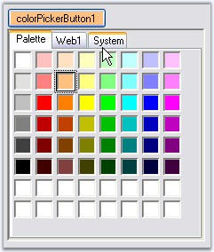

::: {style="DISPLAY: none"}
{#d2h_url_template}{#d2h_package_url style="WIDTH: 0px; DISPLAY: none; HEIGHT: 0px"}
:::

::: {.d2h_secondary_topic style="PADDING-BOTTOM: 10pt; MARGIN: 0pt; PADDING-LEFT: 0pt; PADDING-RIGHT: 0pt; PADDING-TOP: 0pt"}
#### ColorPickerButton {#colorpickerbutton style="tab-stops: 0pt"}

[]{style="COLOR: #15428b"} 

The Essential Tools **ColorPickerButton** allows .NET developers to provide a standard user interface similar to the Visual Studio .NET color picker dropdown, for selecting colors in Windows Forms applications. The ColorPickerButton displays the **ColorUIControl** as a drop-down in combination with a button. The **.NET framework** provides a color dialog control to allow applications to collect color information from users. However, the color dialog control does not provide any way to place a control within the layout of the application to collect color information. The Essential Tools ColorUIControl provides an easy to use color palette control that can be placed inline in your applications.

[]{style="COLOR: #15428b"} 

{border="0"}

[]{style="COLOR: #15428b"} 

Figure 303: ColorPickerButton Control

[]{style="COLOR: #15428b"} 

See also

**[]{style="COLOR: #15428b"}** 

[ColorUIControl]{.UGHyperlink}[]{.UGHyperlink}

 

More:

[ ]{#related-topics}

[{border="0" align="absMiddle"}Features](ms-xhelp:///?Id=b435933d-ad56-4178-94e3-1affe29471a4){style="TEXT-DECORATION: none"}

[{border="0" align="absMiddle"}Creating ColorPickerButton](ms-xhelp:///?Id=65769869-11f1-4cc1-a728-5b47da68e00d){style="TEXT-DECORATION: none"}

[{border="0" align="absMiddle"}Customization Settings](ms-xhelp:///?Id=71bd7c62-b5b5-45be-9d50-1bde4f2540ed){style="TEXT-DECORATION: none"}
:::
