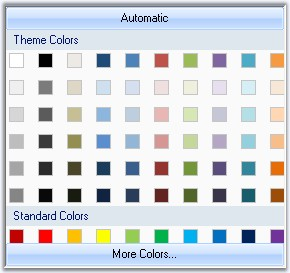

::: {style="DISPLAY: none"}
{#d2h_url_template}{#d2h_package_url style="WIDTH: 0px; DISPLAY: none; HEIGHT: 0px"}
:::

::: {.d2h_secondary_topic style="PADDING-BOTTOM: 10pt; MARGIN: 0pt; PADDING-LEFT: 0pt; PADDING-RIGHT: 0pt; PADDING-TOP: 0pt"}
#### ColorPickerUIAdv[]{style="FONT-SIZE: 10pt"} {#colorpickeruiadv style="tab-stops: 0pt"}

The Essential Tools **ColorPickerUIAdv** allows .**NET** developers to provide Microsoft Word 2007 ColorCells for selecting colors in their applications. The ColorPickerUIAdv comprises of a panel displaying themed colors and standard colors. The ColorPickerUIAdv also comes with a More Colors option, in a color dialog, displaying more sub colors for the base colors in the control.

[]{style="COLOR: #15428b"} 

{border="0"}

[]{style="COLOR: #15428b"} 

Figure 308: ColorPickerUIAdv

**[]{style="COLOR: #15428b"}** 

The .NET framework provides a color dialog control to allow applications to collect color information from users. However, the color dialog control does not provide any way to place a control within the layout of the application to collect color information. The Essential Tools ColorPickerUIAdv provides an easy to use color palette control that can be placed inline in your applications.

More:

[ ]{#related-topics}

[{border="0" align="absMiddle"}Features](ms-xhelp:///?Id=e0a00873-a245-4908-b1f1-436b02ead6ea){style="TEXT-DECORATION: none"}

[{border="0" align="absMiddle"}Creating ColorPickerUI Adv](ms-xhelp:///?Id=9fecd173-4e8a-4d90-9550-f0a4722eb198){style="TEXT-DECORATION: none"}

[{border="0" align="absMiddle"}Concepts and Features](ms-xhelp:///?Id=d830cb00-2f7b-4fa0-89af-267c5410c20f){style="TEXT-DECORATION: none"}

[{border="0" align="absMiddle"}Events](ms-xhelp:///?Id=52c6f01e-4fbc-480e-b7dc-a6be1f5d7bb1){style="TEXT-DECORATION: none"}

[{border="0" align="absMiddle"}Frequently Asked Questions](ms-xhelp:///?Id=e2525a0b-ce45-4955-85c5-66cde1e39385){style="TEXT-DECORATION: none"}
:::
