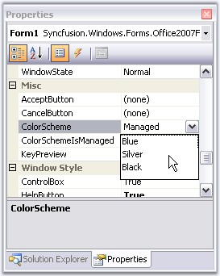
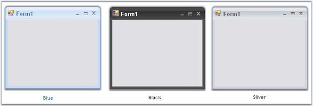
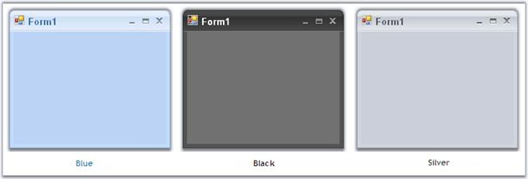
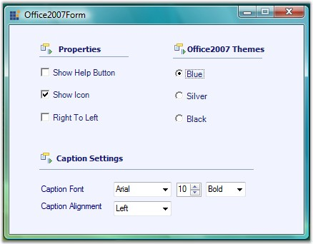

::: {style="DISPLAY: none"}
{#d2h_url_template}{#d2h_package_url style="WIDTH: 0px; DISPLAY: none; HEIGHT: 0px"}
:::

::: {.d2h_secondary_topic style="PADDING-BOTTOM: 10pt; MARGIN: 0pt; PADDING-LEFT: 0pt; PADDING-RIGHT: 0pt; PADDING-TOP: 0pt"}
##### Color Schemes {#color-schemes style="tab-stops: 0pt"}

[]{style="COLOR: #15428b"} 

Office2007 Form supports all the three office color schemes which can be edited through **ColorSchemes** property.

[]{style="COLOR: #15428b"} 

{border="0"}

[]{style="COLOR: #15428b"} 

***[]{style="COLOR: #15428b"}*** 

Figure 1293: ColorScheme Property for Office2007Form[]{#p1095}

[]{style="COLOR: #15428b"} 

+------------------------------------------------------------------------------------------------------------------------------------------------------------------------------------------------+
| **[\[C#\]]{style="FONT-FAMILY: 'Courier New'; COLOR: black"}**                                                                                                                                 |
|                                                                                                                                                                                                |
| []{style="COLOR: #15428b"}                                                                                                                                                                     |
|                                                                                                                                                                                                |
| [//To set Blue color scheme]{style="FONT-FAMILY: 'Courier New'; COLOR: green"}                                                                                                                 |
|                                                                                                                                                                                                |
| [this]{style="FONT-FAMILY: 'Courier New'; COLOR: blue"}[.ColorScheme = [Office2007Theme]{style="COLOR: teal"}.Blue;]{style="FONT-FAMILY: 'Courier New'"}[]{style="FONT-FAMILY: 'Courier New'"} |
+------------------------------------------------------------------------------------------------------------------------------------------------------------------------------------------------+

[]{#p1096}[]{style="COLOR: #15428b"} 

+----------------------------------------------------------------------------------------------------------------------------------------------------------------------+
| **[\[VB.NET\]]{style="FONT-FAMILY: 'Courier New'; COLOR: black"}**                                                                                                   |
|                                                                                                                                                                      |
| []{style="COLOR: #15428b"}                                                                                                                                           |
|                                                                                                                                                                      |
| [\'To set Blue color scheme]{style="FONT-FAMILY: 'Courier New'; COLOR: green"}                                                                                       |
|                                                                                                                                                                      |
| [Me]{style="FONT-FAMILY: 'Courier New'; COLOR: blue"}[.ColorScheme = Office2007Theme.Blue]{style="FONT-FAMILY: 'Courier New'"}[]{style="FONT-FAMILY: 'Courier New'"} |
+----------------------------------------------------------------------------------------------------------------------------------------------------------------------+

[]{style="COLOR: #15428b"} 

{border="0"}

***[]{style="COLOR: #15428b"}*** 

Figure 1294: Blue, Silver and Black ColorSchemes in OfficeForm

 

Background Color for Office2007 Form

 

The background of the Office2007 form can be same, as the color scheme applied to the form. Set UseOffice2007SchemeBackColor property to true to make this effective.

[]{style="COLOR: #15428b"} 

+-------------------------------------------------------------------------------------------------------------------------------------------------------------------------------------------------+
| **[\[C#\]]{style="FONT-FAMILY: 'Courier New'; COLOR: black"}**                                                                                                                                  |
|                                                                                                                                                                                                 |
| []{style="COLOR: #15428b"}                                                                                                                                                                      |
|                                                                                                                                                                                                 |
| [this]{style="FONT-FAMILY: 'Courier New'; COLOR: blue"}[.UseOffice2007SchemeBackColor = [true]{style="COLOR: blue"};]{style="FONT-FAMILY: 'Courier New'"}[]{style="FONT-FAMILY: 'Courier New'"} |
+-------------------------------------------------------------------------------------------------------------------------------------------------------------------------------------------------+

[]{#p1097}[]{style="COLOR: #15428b"} 

+-----------------------------------------------------------------------------------------------------------------------------------------------------------------------------------------------------------+
| **[\[VB.NET\]]{style="FONT-FAMILY: 'Courier New'; COLOR: black"}**                                                                                                                                        |
|                                                                                                                                                                                                           |
| []{style="COLOR: #15428b"}                                                                                                                                                                                |
|                                                                                                                                                                                                           |
| [Me]{style="FONT-FAMILY: 'Courier New'; COLOR: blue"}[.UseOffice2007SchemeBackColor = [True]{style="COLOR: blue"}]{style="FONT-FAMILY: 'Courier New'"}[]{style="FONT-FAMILY: 'Courier New'; COLOR: blue"} |
+-----------------------------------------------------------------------------------------------------------------------------------------------------------------------------------------------------------+

[]{style="COLOR: #15428b"} 

{border="0"}

[]{style="COLOR: #15428b"} 

Figure 1295: Office 2007 Scheme BackColor for Office2007Form

**[]{style="COLOR: #15428b"}** 

Vista Aero Theme

 

Vista Aero theme support is available for Office Form when used in Vista machine.

[]{style="COLOR: #15428b"} 

{border="0"}

**[]{style="COLOR: #15428b"}** 

Figure 1296: Vista Aero Theme for OfficeForm

 

 

 

Office2007Form Color Scheme Settings

Office2007Forms now have the ability to apply or not to apply AeroTheme on forms with a glassy effect. This can be done by **ApplyAeroTheme** property, setting its value either to **True** or **False**.

AeroTheme support is available for Office2007Form when used in Vista machine. Earlier ColorSchemes cannot be applied to Office2007Form when AeroTheme was enabled. Now ColorSchemes can be applied by disabling AeroTheme on Office2007Form.

The following code illustrates how ColorSchemes can be applied by disabling AeroTheme on Office2007Form.

+----------------------------------------------------------------------------------------------------------------------------------------------------------------------------------------------------------------------------------------------------------------------------------------------------+
| **[\[C#\]]{style="FONT-FAMILY: 'Calibri','sans-serif'"}**                                                                                                                                                                                                                                          |
|                                                                                                                                                                                                                                                                                                    |
| [// Disables Aero Theme on Office2007Form.]{style="FONT-FAMILY: 'Calibri','sans-serif'"}                                                                                                                                                                                                           |
|                                                                                                                                                                                                                                                                                                    |
| [this]{style="FONT-FAMILY: 'Courier New'; COLOR: blue"}[.]{style="FONT-FAMILY: 'Courier New'"}[ ApplyAeroTheme ]{style="FONT-FAMILY: 'Calibri','sans-serif'"}[= [false]{style="COLOR: blue"};]{style="FONT-FAMILY: 'Courier New'"}[]{style="FONT-FAMILY: 'Calibri','sans-serif'; FONT-SIZE: 11pt"} |
+----------------------------------------------------------------------------------------------------------------------------------------------------------------------------------------------------------------------------------------------------------------------------------------------------+

[]{style="FONT-FAMILY: 'Calibri','sans-serif'; FONT-SIZE: 11pt"} 

+--------------------------------------------------------------------------------------------------------------------------------------------------------------------------------------------------------------------------------------------------------------------------------------------------+
| **[\[VB.NET\]]{style="FONT-FAMILY: 'Calibri','sans-serif'"}**                                                                                                                                                                                                                                    |
|                                                                                                                                                                                                                                                                                                  |
| ['Disables Aero Theme on Office2007Form.]{style="FONT-FAMILY: 'Calibri','sans-serif'"}                                                                                                                                                                                                           |
|                                                                                                                                                                                                                                                                                                  |
| [Me]{style="FONT-FAMILY: 'Courier New'; COLOR: blue"}[.]{style="FONT-FAMILY: 'Courier New'"}[ ApplyAeroTheme ]{style="FONT-FAMILY: 'Calibri','sans-serif'"}[= [false]{style="COLOR: blue"};]{style="FONT-FAMILY: 'Courier New'"}[]{style="FONT-FAMILY: 'Calibri','sans-serif'; FONT-SIZE: 11pt"} |
+--------------------------------------------------------------------------------------------------------------------------------------------------------------------------------------------------------------------------------------------------------------------------------------------------+

 

[]{#related-topics}
:::
