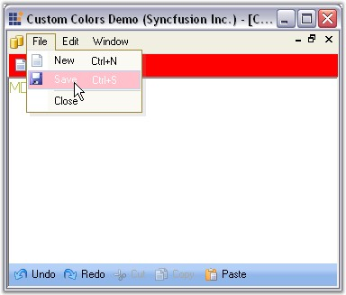

::: {style="DISPLAY: none"}
{#d2h_url_template}{#d2h_package_url style="WIDTH: 0px; DISPLAY: none; HEIGHT: 0px"}
:::

:::::: {.d2h_secondary_topic style="PADDING-BOTTOM: 10pt; MARGIN: 0pt; PADDING-LEFT: 0pt; PADDING-RIGHT: 0pt; PADDING-TOP: 0pt"}
##### Colors for Menus and Toolbars {#colors-for-menus-and-toolbars style="tab-stops: 0pt"}

 

Essential studio comes with three classes to provide custom colors for the Menus.

[]{style="COLOR: #15428b"} 

[·      ]{style="FONT-FAMILY: Symbol"}MenuColors - The Syncfusion.Windows.Forms.Tools.XPMenus.MenuColors class is used when the Visual Styles is Default.

[·      ]{style="FONT-FAMILY: Symbol"}Office2003Colors - The Syncfusion.Windows.Forms.Office2003Colors class is used when the Visual Styles is set as Office2003.

[·      ]{style="FONT-FAMILY: Symbol"}Office2007Colors - The Syncfusion.Windows.Forms.Office2007Colors class is used when the Visual Styles is set as Office2007.

###### []{#_MenuColors}3.5.4.8.2.1 MenuColors {#menucolors style="tab-stops: 0pt"}

**[]{style="COLOR: #485e8c; FONT-SIZE: 8pt"}** 

The **Syncfusion.Windows.Forms.Tools.XPMenus.MenuColors** class includes static properties that allow you to change them to get custom background colors for the different portions of the menus and toolbars. Some of the properties include **MainMenuBackColor**, **CommandBarBackColor** and **StatusBarBackColor**.

 

The following methods of MenuColors class can be invoked to set the custom color.

[]{style="COLOR: #15428b"} 

::: {align="center"}
  MenuColors                         Description
  ---------------------------------- ----------------------------------------------------------------------------------------------------------------------------------------------------------------------
  CommandBarBackColor                Gets / sets the background color for a toolbar / commandbar.
  CheckedSelColor                    Sets the selected color for a checked menu item.
  DisabledMenuTextColorBase          Gets / sets the text color base for the text in the disabled menu items.
  DisabledToolbarItemTextColorBase   Gets / sets the text color base for the text in the disabled toolbar items.
  DropDownBorderColor                Gets / sets the border color for a drop-down menu.
  ExpandedMenuStripBackColor         Gets / sets the Backcolor for the expanded, left-aligned menu strip region. This is the region you see when a partial menu gets expanded to show all the menu items.
  FloatingCommandBarCaptionColor     Gets / sets the Caption background color for a floating toolbar / commandbar.
  InactiveItemAlphaBlendFactor       Gets / sets the alpha-blend factor to use to shade the inactive menu item\'s icons. (255 for no alpha-blending; 0 will completely hide the item).
  MainMenuBackColor                  Gets / sets the background color for the main-menu bar.
  MenuActiveTextColor                Gets / sets the active text color of the menu and toolbar items.
  MenuBGColor                        Sets the background color for a drop down menu.
  MenuLeftStripColor                 Gets / sets the color for the left aligned strip in a drop-down menu where images and check boxes are shown.
  MenuTextColor                      Gets / sets the text color of the menu and toolbar items.
  PressedSelColor                    Gets / sets the selected-pressed color for a menu item in a toolbar.
  SelBorderColor                     Gets / sets the border color for a selected menu item in a toolbar.
  SelColor                           Gets / sets the selected color for a menu item in a toolbar.
  SelTextColor                       Gets / sets the selected text color for an item in a toolbar.
  StatusBarBackColor                 Gets / sets the background color for the Status Bar.
:::

[]{style="COLOR: #15428b"} 

Add the following code snippet to get Custom colors for the menu bar items.

[]{style="COLOR: #15428b"} 

+-----------------------------------------------------------------------------------------------------+
| **[\[C#\]]{style="FONT-FAMILY: 'Courier New'; COLOR: black"}**                                      |
|                                                                                                     |
| **[]{style="FONT-FAMILY: 'Courier New'; COLOR: black"}**                                            |
|                                                                                                     |
| [//Set the background color for a drop down menu]{style="FONT-FAMILY: 'Courier New'; COLOR: green"} |
|                                                                                                     |
| [MenuColors.MenuBGColor = Color.Pink;]{style="FONT-FAMILY: 'Courier New'"}                          |
|                                                                                                     |
| [//Set border color for a drop down menu]{style="FONT-FAMILY: 'Courier New'; COLOR: green"}         |
|                                                                                                     |
| [MenuColors.DropDownBorderColor = Color.Aqua;]{style="FONT-FAMILY: 'Courier New'"}                  |
+-----------------------------------------------------------------------------------------------------+

**[]{style="COLOR: black"}** 

+----------------------------------------------------------------------------------------------------------------------------------------------+
| **[\[VB.NET\]]{style="FONT-FAMILY: 'Courier New'; COLOR: black"}**                                                                           |
|                                                                                                                                              |
| **[]{style="FONT-FAMILY: 'Courier New'; COLOR: black"}**                                                                                     |
|                                                                                                                                              |
| [\'Set the background color for a drop down menu]{style="FONT-FAMILY: 'Courier New'; COLOR: green"}                                          |
|                                                                                                                                              |
| [Private]{style="FONT-FAMILY: 'Courier New'; COLOR: blue"}[ MenuColors.MenuBGColor = Color.Pink]{style="FONT-FAMILY: 'Courier New'"}         |
|                                                                                                                                              |
| [\'Set border color for a drop down menu]{style="FONT-FAMILY: 'Courier New'; COLOR: green"}                                                  |
|                                                                                                                                              |
| [Private]{style="FONT-FAMILY: 'Courier New'; COLOR: blue"}[ MenuColors.DropDownBorderColor = Color.Aqua]{style="FONT-FAMILY: 'Courier New'"} |
+----------------------------------------------------------------------------------------------------------------------------------------------+

**[]{style="COLOR: black"}** 

{border="0"}

[]{style="COLOR: #15428b"} 

Figure 831: XP Menus with Custom Colors

[]{style="COLOR: #15428b"} 

A sample which demonstrates setting colors for Menus using MenuColors class is available in the below sample installation path.

 

***..\\My Documents\\Syncfusion\\EssentialStudio\\Version Number\\Windows\\Tools.Windows\\Samples\\2.0\\Menus Package\\CustomColors***

 

###### []{#_Office2003Colors}3.5.4.8.2.2 Office2003Colors {#office2003colors style="tab-stops: 0pt"}

 

The following table lists the members exposed by Office2003Colors class.

[]{style="COLOR: #15428b"} 

::: {align="center"}
  ---------------------------------------- -------------------------------------------------------------------------------------------------------------------------
  Colors                                   Description
  CheckedColor                             Gets / sets the background color of a check box in the drop-down menu margin or a checked item in the toolbar.
  CheckedSelColor                          Gets / sets the background color of a selected check box in the drop-down menu margin or a checked item in the toolbar.
  CommandBarDropDownColorDark              Gets or sets the dark-gradient color of quick customize dropdown button.
  CommandBarDropDownColorLight             Gets or sets the light-gradient color of quick customize dropdown button.
  ControlBorderColorDark                   Gets or sets the dark-gradient border color of bars.
  ControlBorderColorLight                  Gets or sets the light-gradient border color of bars.
  ControlGripperColor                      Gets or sets the color of the gripper.
  DockBarColorDark                         Gets or sets the left-gradient color of docked bars.
  DockBarColorLight                        Gets or sets the right-gradient color of docked bars.
  DropDownBorderColor                      Gets / sets the border color of a drop-down menu.
  FloatingCommandBarCaptionColor           Gets or sets the caption background color of floating bars.
  FloatingCommandBarItemPressedColor       Gets or sets the color for the floating command bar item which is pressed.
  GroupBarHeaderColorDark                  Gets or sets the dark-gradient color of groupBar header.
  GroupBarHeaderColorLight                 Gets or sets the light-gradient color of groupBar header.
  GroupBarHighlightColorDark               Gets or sets the dark-gradient highlight color of groupBarItem.
  GroupBarHighlightColorLight              Gets or sets the light-gradient highlight color of groupBarItem.
  GroupBarItemTextColor                    Gets / sets the color of the text in a GroupBar item.
  GroupBarItemTextSelectedHighlightColor   Gets / sets the highlight color to be used for the selected text of the GroupBar item.
  GroupBarSelectedColorDark                Gets or sets the dark-gradient color of selected groupBarItem.
  GroupBarSelectedColorLight               Gets or sets the light-gradient color of selected groupBarItem.
  GroupBarSelectedHighlightColorDark       Gets or sets the dark-gradient highlight color of selected groupBarItem.
  GroupBarSelectedHighlightColorLight      Gets or sets the light-gradient highlight color of selected groupBarItem.
  MenuExpandedItemsMarginColorLeft         Gets / sets the left-gradient color of the drop-down menu margin of the expanded menu items.
  MenuExpandedItemsMarginColorRight        Gets / sets the right-gradient color of the drop-down menu margin of the expanded menu items.
  MenuItemHotColorDark                     Gets or sets the dark-gradient color of menu item for hot-tracking.
  MenuItemHotColorLight                    Gets or sets the light-gradient color of menu item for hot-tracking.
  MenuItemPressedColorDark                 Gets or sets the dark-gradient color of quick customize button when it is pressed.
  MenuItemPressedColorLight                Gets or sets the light-gradient color of quick customize button when it is pressed.
  MenuMarginColorDark                      Gets / sets the right-gradient color of the drop-down menu margin.
  MenuMarginColorLight                     Gets / sets the left-gradient color of the drop-down menu margin.
  PressedSelColor                          Gets / sets the pressed-selected color for a menu item in a toolbar.
  SelBorderColor                           Gets / sets the border color of a menu item selection in the drop-down menus and toolbars.
  SelColor                                 Gets / sets the selected color for a menu item in a drop-down menu.
  SeparatorColor                           Gets / sets the color of the separator line between the bar items.
  ---------------------------------------- -------------------------------------------------------------------------------------------------------------------------
:::

###### []{#_Office2007_Colors}3.5.4.8.2.3 Office2007 Colors {#office2007-colors style="tab-stops: 0pt"}

[]{style="COLOR: #15428b"} 

The following table lists the members exposed by Office2007Colors class.

[]{style="COLOR: #15428b"} 

::: {align="center"}
  ----------------------------------------- ---------------------------------------------------------------------------------------
  Color                                     Description
  BarItemCheckBorderColor                   Gets / sets color for the checked bar item.
  BarItemCheckDarkColor                     Gets / sets dark color for background of the checked bar item.
  BarItemCheckFlashColor                    Gets / sets color for flash of the checked bar item.
  BarItemCheckLightColor                    Gets / sets light color for background of the checked bar item.
  BaritemHighlightBorderColor               Gets / sets color for highlighted border of the BarItem.
  BarItemPressBorderColor                   Gets / sets color for pressed border of the BarItem.
  BarItemPressFlashColor                    Gets or sets color for flash of the pressed BarItem.
  BarItemPressDarkColor                     Gets or sets dark color for background of the pressed BarItem.
  BarItemPressLightColor                    Gets or sets light color for background of the pressed BarItem.
  BarItemSelectFlashColor                   Gets or sets color for flash of the selected BarItem.
  BarItemSeparatorColor                     Gets or sets color for separator line of the CommandBar.
  ComboButtonBorder                         Gets or sets border color for ComboButton of the ComboBoxBarItem.
  ComboButtonDarkColor                      Gets or sets dark color for ComboButton of the ComboBoxBarItem.
  ComboButtonLightColor                     Gets or sets light color for ComboButton of the ComboBoxBarItem.
  ComboButtonHighlightBorder                Gets or sets border color for ComboButton of the highlighted ComboBoxBarItem.
  ComboButtonHighlightDarkColor             Gets or sets dark color for ComboButton of the highlighted ComboBoxBarItem.
  ComboButtonHighlightLightColor            Gets or sets light color for ComboButton of the highlighted ComboBoxBarItem.
  ComboButtonPressBorder                    Gets or sets border color for ComboButton of the pressed ComboBoxBarItem.
  ComboButtonPressDarkColor                 Gets or sets dark color for ComboButton of the pressed ComboBoxBarItem.
  ComboButtonPressLightColor                Gets or sets light color for ComboButton of the pressed ComboBoxBarItem.
  CommandBarBorderColor                     Gets or sets color for border of the CommandBar.
  CommandBarDarkColor                       Gets or sets dark color of the CommandBar.
  CommandBarLightColor                      Gets or sets light color of the CommandBar.
  DockBarBackColor                          Gets or sets background color of the DockBar or the main menu.
  DropDownBarItemBorderColor                Gets or sets color for border of the DropDownBarItem.
  DropDownBarItemDarkColor                  Gets or sets dark color for background of the DropDownBarItem.
  DropDownBarItemLightColor                 Gets or sets light color for background of the DropDownBarItem.
  DropDownDarkColor                         Gets or sets dark color for dropdown button of the CommandBar.
  DropDownHighlightDarkColor                Gets or sets dark color for highlight dropdown button of the CommandBar.
  DropDownHighlightLightColor               Gets or sets light color for highlight dropdown button of the CommandBar.
  DropDownLightColor                        Gets or sets light color for dropdown button of the CommandBar.
  DropDownPressedDarkColor                  Gets or sets dark color for pressed dropdown button of the CommandBar. 
  DropDownPressedLightColor                 Gets or sets light color for pressed dropdown button of the CommandBar.
  FloatBackgroundColor                      Gets or sets background color of the floating CommandBar.
  FloatBorderColor                          Gets or sets color for border of the floating CommandBar.
  FloatCaptionColor                         Gets or sets color for caption text of the floating CommandBar.
  FloatCommandBarDarkColor                  Gets or sets dark color of the floating CommandBar.
  FloatCommandBarLightColor                 Gets or sets light color of the floating CommandBar.
  FloatHighlightButtonBorderColor           Gets or sets border color for highlighted dropdown button of the floating CommandBar.
  FloatHighlightButtonColor                 Gets or sets color for highlighted dropdown button of the floating CommandBar.
  FloatLightBorderColor                     Gets or sets color for light border of the floating CommandBar.
  FloatPressButtonBorderColor               Gets or sets border color for pressed dropdown button of the floating CommandBar.
  FloatPressButtonColor                     Gets or sets color for pressed dropdown button of the floating CommandBar.
  FloatPressCloseButtonButtonColor          Gets or sets border color for pressed close button of the floating CommandBar.
  FloatPressCloseButtonColor                Gets or sets color for pressed close button of the floating CommandBar.
  GroupBarBorderColor                       BorderColor of the GroupBar.
  GroupBarHeaderColorDark                   Dark color of the GroupBarHeader.
  GroupBarHeaderColorLight                  Light color of the GroupBarHeader.
  GroupBarHeaderTextColor                   Text color of the GroupBar header text.
  GroupBarHighlightColorDark                Gets or Sets dark color for groupbar item when it is highlighted.
  GroupBarHighlightColorLight               Gets or Sets light color of groupbar item when it is highlighted.
  GroupBarItemColorDark                     Color of groupBaritem.
  GroupBarItemColorLight                    Color of groupBaritem (Top half).
  GroupBarItemTextColor                     Text color of the groupbaritem.
  GroupBarItemSelectedColorDark             Selected Itemcolor (Top gradient).
  GroupBarItemSelectedColorLight            Selected Itemcolor (Bottom gradient).
  GroupBarItemSelectedHighlightColorDark    Selected ItemColor (Top gradient).
  GroupBarItemSelectedHighlightColorLight   Selected ItemColor (Bottom gradient).
  GroupBarSplitterColorDark                 Color of groupBar splitter.
  GroupBarSplitterColorLight                Color of groupBar splitter.
  MenuBackground                            Gets or sets the background color of the menu.
  MenuDropDownBorderColor                   Gets or sets the color for border of the menu.
  MenuCheckedBorderColor                    Gets or sets the color for border check mark of the menu.
  MenuCheckedColor                          Gets or sets the color for check mark of the menu.
  MenuCheckedFillColor                      Gets or sets the background color for check mark of the menu.
  MenuColumnColor                           Gets or sets the dark color for column of the menu.
  MenuColumnSeparatorColor                  Gets or sets the separator color for column of the menu.
  MenuComboButtonArrowColor                 Gets or sets the color for arrow ComboButton of the menu.
  MenuComboButtonHighlightDarkColor         Gets or sets the dark color for highlighted ComboButton of the menu.
  MenuComboButtonHighlightDarkColor         Gets or sets the light color for highlighted ComboButton of the menu.
  MenuComboButtonPushed1Color               Pressed color of combo button in menu dropdown.
  MenuComboButtonPushed2Color               Color of combo button in menu dropdown (Top half).
  MenuComboButtonPushed3Color               Color of combo button in menu dropdown (Middle).
  MenuComboButtonPushed4Color               Color of combo button in menu dropdown (Bottom half).
  MenuItemArrowDarkColor                    Arrow button dark color of submenu parent / dropdownbarItem.
  MenuItemArrowLightColor                   Arrow button light color of submenu parent / dropdownbarItem.
  MenuItemBorderColor                       Gets or sets the border color for highlighted item of the menu.
  MenuItemDarkColor                         Gets or sets the dark color for highlighted item of the menu.
  MenuItemLightColor                        Gets or sets the light color for highlighted item of the menu.
  MenuSeparatorColor                        Gets or sets the color for separator of the menu.
  MenuTextBoxBackColor                      Gets or sets the background color for TextBox item of the menu.
  MenuTextBoxBorderColor                    Gets or sets the border color for TextBox item of the menu.
  TextBarItemBackColor                      Gets or sets back color for the TextBoxBarItem.
  TextBarItemBorderColor                    Gets or sets color for border of the TextBoxBarItem.
  TextBarItemBorderHighlightColor           Gets or sets color for border of the highlight TextBoxBarItem.
  ----------------------------------------- ---------------------------------------------------------------------------------------
:::

 

A sample which demonstrates setting colors for Menus using Office2007Colors class is available in the below sample installation path.

 

***..\\My Documents\\Syncfusion\\EssentialStudio\\Version Number\\Windows\\Tools.Windows\\Samples\\2.0\\Office2007 Controls\\CustomOffice2007ColorsDemo***

 

[]{#related-topics}
::::::
