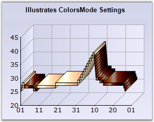
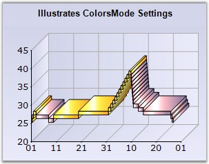

::: {style="DISPLAY: none"}
{#d2h_url_template}{#d2h_package_url style="WIDTH: 0px; DISPLAY: none; HEIGHT: 0px"}
:::

:::: {.d2h_secondary_topic style="PADDING-BOTTOM: 10pt; MARGIN: 0pt; PADDING-LEFT: 0pt; PADDING-RIGHT: 0pt; PADDING-TOP: 0pt"}
#### ColorsMode {#colorsmode style="tab-stops: 0pt"}

 

Gets / sets ColorsMode of the boxes in the financial chart types.

 

::: {align="center"}
+-------------------------------------+---------------------------------------------------------------------------------------------------------------------------------------------+
|                                                                                                                                                                                   |
|                                                                                                                                                                                   |
| Details                                                                                                                                                                           |
+-------------------------------------+---------------------------------------------------------------------------------------------------------------------------------------------+
|                                     |                                                                                                                                             |
|                                     |                                                                                                                                             |
| **Possible Values**                 | [·      ]{style="FONT-FAMILY: Symbol"}**DarkLight** -Draws series data points as a darklight colorsmode.                                    |
|                                     |                                                                                                                                             |
|                                     | [·      ]{style="FONT-FAMILY: Symbol"}**Fixed** - Draws series data points as a Fixed colorsmode.                                           |
|                                     |                                                                                                                                             |
|                                     | [·      ]{style="FONT-FAMILY: Symbol; FONT-SIZE: 8pt"}**Mixed** - Draws series data points as a Mixed colorsmode[.]{style="FONT-SIZE: 8pt"} |
+-------------------------------------+---------------------------------------------------------------------------------------------------------------------------------------------+
|                                     |                                                                                                                                             |
|                                     |                                                                                                                                             |
| **Default Value    **               | **Fixed**                                                                                                                                   |
+-------------------------------------+---------------------------------------------------------------------------------------------------------------------------------------------+
|                                     |                                                                                                                                             |
|                                     |                                                                                                                                             |
| **2D / 3D Limitations**             | None                                                                                                                                        |
+-------------------------------------+---------------------------------------------------------------------------------------------------------------------------------------------+
|                                     |                                                                                                                                             |
|                                     |                                                                                                                                             |
| **Applies to Chart Element**        | All series                                                                                                                                  |
+-------------------------------------+---------------------------------------------------------------------------------------------------------------------------------------------+
|                                     |                                                                                                                                             |
|                                     |                                                                                                                                             |
| **Applies to Chart Types**          | Renko Chart (Financial Chart)                                                                                                               |
+-------------------------------------+---------------------------------------------------------------------------------------------------------------------------------------------+
:::

 

Here is some sample code.

 

+--------------------------------------------------------------------------------------------------------------------------------------------------------------------------------------------------------------------------+
| **[\[C#\]]{style="FONT-FAMILY: 'Courier New'; COLOR: black"}**                                                                                                                                                           |
|                                                                                                                                                                                                                          |
| **[]{style="FONT-FAMILY: 'Courier New'; COLOR: black"}**                                                                                                                                                                 |
|                                                                                                                                                                                                                          |
| [// Setting ColorsMode for series]{style="FONT-FAMILY: 'Courier New'; COLOR: green"}                                                                                                                                     |
|                                                                                                                                                                                                                          |
| [this]{style="FONT-FAMILY: 'Courier New'; COLOR: blue"}[.chartControl1.Series\[0\].ConfigItems.FinancialItem.ColorsMode = [ChartFinancialColorMode]{style="COLOR: teal"}.DarkLight;]{style="FONT-FAMILY: 'Courier New'"} |
+--------------------------------------------------------------------------------------------------------------------------------------------------------------------------------------------------------------------------+

 

+-------------------------------------------------------------------------------------------------------------------------------------------------------------------------------------------------------------------------------------------------------------------------------------------------------------------+
| **[\[VB.NET\]]{style="FONT-FAMILY: 'Courier New'; COLOR: black"}**                                                                                                                                                                                                                                                |
|                                                                                                                                                                                                                                                                                                                   |
| [\' Setting ColorsMode for series]{style="FONT-FAMILY: 'Courier New'; COLOR: green"}                                                                                                                                                                                                                              |
|                                                                                                                                                                                                                                                                                                                   |
| [Me]{style="FONT-FAMILY: 'Courier New'; COLOR: blue"}[.chartControl1.Series(0).ConfigItems.FinancialItem.ColorsMode = ]{style="FONT-FAMILY: 'Courier New'; COLOR: black"}[ChartFinancialColorMode]{style="FONT-FAMILY: 'Courier New'; COLOR: teal"}[.DarkLight]{style="FONT-FAMILY: 'Courier New'; COLOR: black"} |
+-------------------------------------------------------------------------------------------------------------------------------------------------------------------------------------------------------------------------------------------------------------------------------------------------------------------+

 

{border="0"}

**[]{style="COLOR: black; FONT-SIZE: 8pt"}** 

Figure 108: Renko Chart with \"DarkLight\" ColorsMode

**[]{style="COLOR: black; FONT-SIZE: 8pt"}** 

{border="0"}

**[]{style="COLOR: black; FONT-SIZE: 8pt"}** 

Figure 109: Renko Chart with \"Mixed\" ColorsMode

 

See Also

 

[Renko Chart]{.UGHyperlink}[]{.UGHyperlink}

[]{#p85} 

 

[]{#related-topics}
::::
