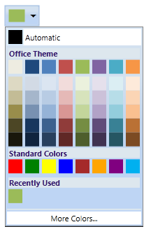
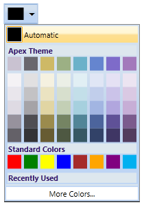
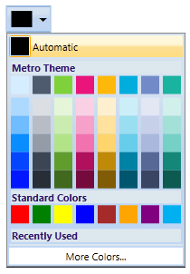

::: {style="DISPLAY: none"}
{#d2h_url_template}{#d2h_package_url style="WIDTH: 0px; DISPLAY: none; HEIGHT: 0px"}
:::

:::: {.d2h_secondary_topic style="PADDING-BOTTOM: 10pt; MARGIN: 0pt; PADDING-LEFT: 0pt; PADDING-RIGHT: 0pt; PADDING-TOP: 0pt"}
#### Color Themes {#color-themes style="tab-stops: 0pt"}

The ColorPickerPalette control includes a list of predefined themes. It allows you to set the required themes. Based on the selected themes, combination of selected theme colors will be displayed on the ThemePanel. The default theme if set to "Office" theme. You can also set the visibility of the ThemePanel by using the ThemePanelVisibility Property.

 

Use Case Scenarios

You can use the Color Themes to have colors based on specific themes.

[]{style="FONT-FAMILY: 'Trebuchet MS','sans-serif'; COLOR: #15428b; FONT-SIZE: 9pt"} 

Adding Color Theme to an Application

Color themes can be added to an application by using XAML or C# code.

 

The following code example illustrates how to add the Color Theme feature to an application through XAML.

 

+-------------------------------------------------------------------------------------------------------------------------------------------------------------------------------------------------------------------------------------------------------------------------------------------------------------------------------------------------------------------------------------------------------------------------------------------------------------------------------------------------------------------------------------------------------------------------------------------------------+
| **[\[XAML\]]{style="FONT-FAMILY: 'Courier New'"}**                                                                                                                                                                                                                                                                                                                                                                                                                                                                                                                                                    |
|                                                                                                                                                                                                                                                                                                                                                                                                                                                                                                                                                                                                       |
| **[]{style="FONT-FAMILY: 'Courier New'"}**                                                                                                                                                                                                                                                                                                                                                                                                                                                                                                                                                            |
|                                                                                                                                                                                                                                                                                                                                                                                                                                                                                                                                                                                                       |
| [\<]{style="FONT-FAMILY: 'Courier New'; COLOR: blue"}[sync]{style="FONT-FAMILY: 'Courier New'; COLOR: #a31515"}[:]{style="FONT-FAMILY: 'Courier New'; COLOR: blue"}[ColorPickerPalette]{style="FONT-FAMILY: 'Courier New'; COLOR: #a31515"}[ x]{style="FONT-FAMILY: 'Courier New'; COLOR: red"}[:]{style="FONT-FAMILY: 'Courier New'; COLOR: blue"}[Name]{style="FONT-FAMILY: 'Courier New'; COLOR: red"}[=\"ColorPicker\"]{style="FONT-FAMILY: 'Courier New'; COLOR: blue"}[ Themes]{style="FONT-FAMILY: 'Courier New'; COLOR: red"}[=\"Apex\" /\>]{style="FONT-FAMILY: 'Courier New'; COLOR: blue"} |
|                                                                                                                                                                                                                                                                                                                                                                                                                                                                                                                                                                                                       |
|                                                                                                                                                                                                                                                                                                                                                                                                                                                                                                                                                                                                       |
+-------------------------------------------------------------------------------------------------------------------------------------------------------------------------------------------------------------------------------------------------------------------------------------------------------------------------------------------------------------------------------------------------------------------------------------------------------------------------------------------------------------------------------------------------------------------------------------------------------+

 

The following code example illustrates how to add the Color Theme feature to an application through C#.

 

+---------------------------------------------------------------------------------------------------------------------------------------------------------------------------------------------------------+
| **[\[C#\]]{style="FONT-FAMILY: 'Courier New'"}**                                                                                                                                                        |
|                                                                                                                                                                                                         |
| **[]{style="FONT-FAMILY: 'Courier New'"}**                                                                                                                                                              |
|                                                                                                                                                                                                         |
| [ColorPickerPalette]{style="FONT-FAMILY: 'Courier New'; COLOR: #2b91af"}[ colorpicker = [new]{style="COLOR: blue"} [ColorPickerPalette]{style="COLOR: #2b91af"}();]{style="FONT-FAMILY: 'Courier New'"} |
|                                                                                                                                                                                                         |
| [colorpicker.Themes = [PaletteTheme]{style="COLOR: #2b91af"}.Apex;]{style="FONT-FAMILY: 'Courier New'"}                                                                                                 |
|                                                                                                                                                                                                         |
|                                                                                                                                                                                                         |
+---------------------------------------------------------------------------------------------------------------------------------------------------------------------------------------------------------+

 

{border="0"}

Figure 194: ColorPickerPalette with "Office" Theme

 

{border="0"}

Figure 195: ColorPickerPalette with "Apex" Theme

[]{style="COLOR: #c00000"} 

{border="0"}

Figure 196: ColorPickerPalette with "Metro" Theme

 

Properties

Table 19: Color Theme Properties Table

::: {align="center"}
  ---------- ---------------------------------------------------------------------------------------------------------- --------------------- --------------------- -----------------
  Property   Description                                                                                                Type                  Data Type             Reference links
  Themes     Describes the enum which contains Palette Themes that can be applied to ColorPickerPalette Themes Panel.   Dependency Property   PaletteTheme.Office   
  ---------- ---------------------------------------------------------------------------------------------------------- --------------------- --------------------- -----------------
:::

[]{style="COLOR: #c00000"} 

Sample Link

To view samples:

1.   Select Start -\> Programs -\> Syncfusion -\> Essential Studio x.x.xx -\> Dashboard.

2.   Select   Run Locally Installed Samples in WPF Button.

3.   Now expand the DragAndDropManagerDemo tree-view item in the Sample Browser.

4.   Choose any one of the samples listed under it to launch.

[]{#related-topics}
::::
