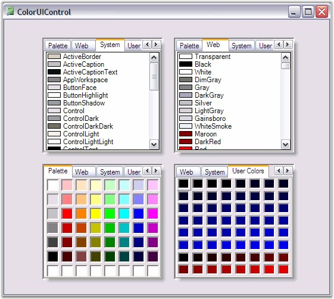

::: {style="DISPLAY: none"}
{#d2h_url_template}{#d2h_package_url style="WIDTH: 0px; DISPLAY: none; HEIGHT: 0px"}
:::

::: {.d2h_secondary_topic style="PADDING-BOTTOM: 10pt; MARGIN: 0pt; PADDING-LEFT: 0pt; PADDING-RIGHT: 0pt; PADDING-TOP: 0pt"}
#### ColorUIControl {#coloruicontrol style="tab-stops: 0pt"}

[]{style="COLOR: #15428b"} 

The Essential Tools ColorUIControl allows .NET developers to provide a standard user-interface which, is similar to the Visual Studio .NET color picker drop-down, for selecting colors in their Windows Forms applications. The ColorUIControl implements a palette type visual interface comprising of the System, Standard, Custom and UserColor color groups. The control can be used either as a regular control that is hosted within a parent container or as a drop-down. Refer ColorPickerButton to use ColorUIControl as drop down.

[]{style="COLOR: #15428b"} 

{border="0"}

[]{style="COLOR: #15428b"} 

Figure 288: ColorUI Control

[]{style="COLOR: #15428b"} 

The .NET framework provides a color dialog control which, allows applications to collect color information from users. However, the color dialog control does not provide any way to place a control within the layout of the application in order to collect color information. The Essential Tools ColorUIControl provides an easy to use color palette control that can be placed inline in applications.  

[]{style="COLOR: #15428b"} 

The ColorUIControl implements a palette type visual interface for selecting colors at run-time. The ColorUIControl class offers a selection of colors that are divided into four color groupings that are arranged as tabs. The four color groupings are:

[]{style="COLOR: #15428b"} 

[·      ]{style="FONT-FAMILY: Symbol"}SystemColors consisting of colors defined within the SystemColors class.

[·      ]{style="FONT-FAMILY: Symbol"}StandardColors consisting of basic colors.

[·      ]{style="FONT-FAMILY: Symbol"}CustomColors providing a customizable color palette.

[·      ]{style="FONT-FAMILY: Symbol"}UserColors providing different shades of user defined Colors

[]{style="COLOR: #15428b"} 

See also

**[]{style="COLOR: #15428b"}** 

[Creating ColorUIControl]{.UGHyperlink}[]{.UGHyperlink}

More:

[ ]{#related-topics}

[{border="0" align="absMiddle"}Features](ms-xhelp:///?Id=235b48ee-f09f-402a-8c44-8241eeb5ea62){style="TEXT-DECORATION: none"}

[{border="0" align="absMiddle"}Creating ColorUIControl](ms-xhelp:///?Id=9ce63e18-4afd-473c-b02f-d834954a330d){style="TEXT-DECORATION: none"}

[{border="0" align="absMiddle"}Concepts and Features](ms-xhelp:///?Id=158662cf-d58e-4659-8a35-1033660373e3){style="TEXT-DECORATION: none"}

[{border="0" align="absMiddle"}ColorUIControl Appearance](ms-xhelp:///?Id=00e312f8-a995-4d89-b517-dd201323400d){style="TEXT-DECORATION: none"}

[{border="0" align="absMiddle"}Runtime Settings](ms-xhelp:///?Id=3ad6b88a-eb46-4ba2-9135-9b1cfe77b421){style="TEXT-DECORATION: none"}
:::
