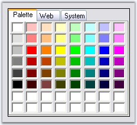
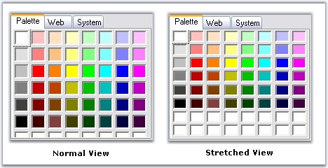

::: {style="DISPLAY: none"}
{#d2h_url_template}{#d2h_package_url style="WIDTH: 0px; DISPLAY: none; HEIGHT: 0px"}
:::

::::: {.d2h_secondary_topic style="PADDING-BOTTOM: 10pt; MARGIN: 0pt; PADDING-LEFT: 0pt; PADDING-RIGHT: 0pt; PADDING-TOP: 0pt"}
##### ColorUIControl Appearance {#coloruicontrol-appearance style="tab-stops: 0pt"}

[]{style="COLOR: #15428b"} 

This section discusses the appearance, border styles and size settings of the ColorUIControl.

[]{style="COLOR: #15428b"} 

Border Styles

[]{style="COLOR: #15428b"} 

The border styles for the ColorUIControl can be set through BorderStyle property.

[]{style="COLOR: #15428b"} 

::: {align="center"}
+-----------------------------------+-----------------------------------------------------+
| ColorUIControl Properties         | Description                                         |
+-----------------------------------+-----------------------------------------------------+
| BorderStyle                       | Sets border style for the control. The options are, |
|                                   |                                                     |
|                                   |                                                     |
|                                   |                                                     |
|                                   | *FixedSingle,*                                      |
|                                   |                                                     |
|                                   | *Fixed3D (default) and*                             |
|                                   |                                                     |
|                                   | *None.*                                             |
+-----------------------------------+-----------------------------------------------------+
:::

[]{style="COLOR: #15428b"} 

+--------------------------------------------------------------------------------------------------------------------------------------------------------------------------------------------------+
| **[\[C#\]]{style="FONT-FAMILY: 'Courier New'; COLOR: black"}**                                                                                                                                   |
|                                                                                                                                                                                                  |
| []{style="COLOR: #15428b"}                                                                                                                                                                       |
|                                                                                                                                                                                                  |
| [this]{style="FONT-FAMILY: 'Courier New'; COLOR: blue"}[.colorUIControl1.BorderStyle = System.Windows.Forms.[BorderStyle]{style="COLOR: teal"}.FixedSingle;]{style="FONT-FAMILY: 'Courier New'"} |
+--------------------------------------------------------------------------------------------------------------------------------------------------------------------------------------------------+

[]{style="COLOR: #15428b"} 

+------------------------------------------------------------------------------------------------------------------------------------------------------------------------------------------------+
| **[\[VB.NET\]]{style="FONT-FAMILY: 'Courier New'; COLOR: black"}**                                                                                                                             |
|                                                                                                                                                                                                |
| []{style="COLOR: #15428b"}                                                                                                                                                                     |
|                                                                                                                                                                                                |
| [Me]{style="FONT-FAMILY: 'Courier New'; COLOR: blue"}[.colorUIControl1.BorderStyle = System.Windows.Forms.[BorderStyle]{style="COLOR: black"}.FixedSingle]{style="FONT-FAMILY: 'Courier New'"} |
+------------------------------------------------------------------------------------------------------------------------------------------------------------------------------------------------+

**[]{style="COLOR: #15428b"}** 

{border="0"}

[]{style="COLOR: #15428b"} 

Figure 296: BorderStyle = \"FixedSingle\"

**[]{style="COLOR: #15428b"}** 

Panel Sizing

**[]{style="COLOR: #15428b"}** 

The Custom and User color panels can be stretched according to the size of the control using the below properties respectively.

**[]{style="COLOR: #333399"}** 

::: {align="center"}
  ---------------------------- ------------------------------------------------------------
  ColorUIControl Properties    Description
  CustomColorStretchOnResize   Gets or Sets enable stretch Custom colors panel on resize.
  UserColorStretchOnResize     Gets or Sets enable stretch User colors panel on resize.
  ---------------------------- ------------------------------------------------------------
:::

**[]{style="COLOR: #15428b"}** 

+--------------------------------------------------------------------------------------------------------------------------------------------------------------------------+
| **[\[C#\]]{style="FONT-FAMILY: 'Courier New'; COLOR: black"}**                                                                                                           |
|                                                                                                                                                                          |
| []{style="COLOR: #15428b"}                                                                                                                                               |
|                                                                                                                                                                          |
| [this]{style="FONT-FAMILY: 'Courier New'; COLOR: blue"}[.colorUIControl1.CustomColorsStretchOnResize = [true]{style="COLOR: blue"};]{style="FONT-FAMILY: 'Courier New'"} |
|                                                                                                                                                                          |
| [this]{style="FONT-FAMILY: 'Courier New'; COLOR: blue"}[.colorUIControl1.UserColorsStretchOnResize = [true]{style="COLOR: blue"};]{style="FONT-FAMILY: 'Courier New'"}   |
+--------------------------------------------------------------------------------------------------------------------------------------------------------------------------+

[]{style="COLOR: #15428b"} 

+-----------------------------------------------------------------------------------------------------------------------------------------------------------------------+
| **[\[VB.NET\]]{style="FONT-FAMILY: 'Courier New'; COLOR: black"}**                                                                                                    |
|                                                                                                                                                                       |
| []{style="COLOR: #15428b"}                                                                                                                                            |
|                                                                                                                                                                       |
| [Me]{style="FONT-FAMILY: 'Courier New'; COLOR: blue"}[.colorUIControl1.CustomColorsStretchOnResize = [True]{style="COLOR: blue"}]{style="FONT-FAMILY: 'Courier New'"} |
|                                                                                                                                                                       |
| [Me]{style="FONT-FAMILY: 'Courier New'; COLOR: blue"}[.colorUIControl1.UserColorsStretchOnResize = [True]{style="COLOR: blue"}]{style="FONT-FAMILY: 'Courier New'"}   |
+-----------------------------------------------------------------------------------------------------------------------------------------------------------------------+

**[]{style="COLOR: #15428b"}** 

{border="0"}

[]{style="COLOR: #15428b"} 

Figure 297: Custom Color Panel\'s Normal and Stretched View

 

[]{#p342} 

[]{#related-topics}
:::::
