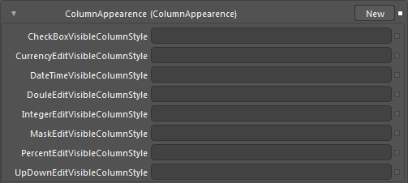

::: {style="DISPLAY: none"}
{#d2h_url_template}{#d2h_package_url style="WIDTH: 0px; DISPLAY: none; HEIGHT: 0px"}
:::

::: {.d2h_secondary_topic style="PADDING-BOTTOM: 10pt; MARGIN: 0pt; PADDING-LEFT: 0pt; PADDING-RIGHT: 0pt; PADDING-TOP: 0pt"}
##### Column Appearance {#column-appearance style="tab-stops: 0pt"}

In the Column Appearance, all the properties are of type **Style.** These properties affect the appearance of whole column. The following table shows the property and its target type.

  -------------------------------- ------------------------------------------
  Property                         TargetType
  CurrencyEditVisibleColumnStyle   GridDataCurrencyEditVisibleColumnControl
  DoubleEditVisibleColumnStyle     GridDataDoubleEditVisibleColumnControl
  IntegerEditVisibleColumnstyle    GridDataIntegerEditVisibleColumnControl
  PercentEditVisibleColumnStyle    GridDataPercentEditVisibleColumnControl
  UpDownEditVisibleColumnStyle     GridDataUpDownEditVisibleColumnControl
  -------------------------------- ------------------------------------------

 

{border="0"}

Figure 168: Column Appearance Properties

[]{#related-topics}
:::
