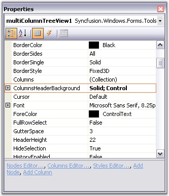
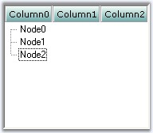
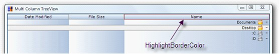

::: {style="DISPLAY: none"}
{#d2h_url_template}{#d2h_package_url style="WIDTH: 0px; DISPLAY: none; HEIGHT: 0px"}
:::

::: {.d2h_secondary_topic style="PADDING-BOTTOM: 10pt; MARGIN: 0pt; PADDING-LEFT: 0pt; PADDING-RIGHT: 0pt; PADDING-TOP: 0pt"}
##### Column Appearance {#column-appearance style="MARGIN-LEFT: 18pt; tab-stops: 18.0pt"}

[]{style="COLOR: #15428b"} 

The appearance of different columns can be customized through Column Styles settings.

 

**MultiColumnTreeView.ColumnHeaderBackground** property sets the background column headers for the control. These settings are overridden by above ColumnStyles settings.

[]{style="COLOR: #15428b"} 

{border="0"}

***[]{style="COLOR: #15428b"}*** 

Figure 1192: ColumnsHeaderBackground property in the Properties Grid

[]{style="COLOR: #15428b"} 

{border="0"}

[]{style="COLOR: #15428b"} 

Figure 1193: Gradient colors set for Header Background

***[]{style="COLOR: #15428b"}*** 

[]{style="COLOR: #15428b"} 

 

Adding HighlightBorderColor property

 

Essential tool is now enhanced with HighlightBorderColor property to set the highlight color of the column header in MultiColumnTreeView.

 

The following code illustrates how to set HighlightBorderColor property.

[]{style="COLOR: #15428b"} 

+---------------------------------------------------------------------------------------------------------------------------------------------------------------+
| **[\[C#\]]{style="FONT-FAMILY: 'Courier New'"}**                                                                                                              |
|                                                                                                                                                               |
| [this.treeColumnAdv1.HighlightBorderColor = Color.Brown;]{style="FONT-FAMILY: 'Courier New'"}[]{style="FONT-FAMILY: 'Calibri','sans-serif'; FONT-SIZE: 11pt"} |
+---------------------------------------------------------------------------------------------------------------------------------------------------------------+

[]{style="FONT-FAMILY: 'Times New Roman','serif'; FONT-SIZE: 11pt"} 

+-------------------------------------------------------------------------------------------------------------------------------------------------------------+
| **[\[VB\]]{style="FONT-FAMILY: 'Courier New'"}**                                                                                                            |
|                                                                                                                                                             |
| [Me.treeColumnAdv1.HighlightBorderColor = Color.Brown;]{style="FONT-FAMILY: 'Courier New'"}[]{style="FONT-FAMILY: 'Calibri','sans-serif'; FONT-SIZE: 11pt"} |
+-------------------------------------------------------------------------------------------------------------------------------------------------------------+

[]{style="FONT-FAMILY: 'Times New Roman','serif'; FONT-SIZE: 11pt"} 

[]{style="FONT-FAMILY: 'Times New Roman','serif'"} 

{border="0"}

Figure 1194: Column Header Highlight Border Color changed

[]{style="FONT-FAMILY: 'Times New Roman','serif'"} 

 

 

 

 

[]{#related-topics}
:::
