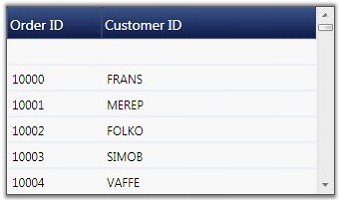
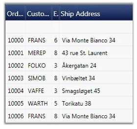
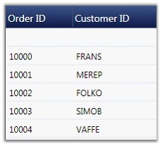

::: {style="DISPLAY: none"}
{#d2h_url_template}{#d2h_package_url style="WIDTH: 0px; DISPLAY: none; HEIGHT: 0px"}
:::

::: {.d2h_secondary_topic style="PADDING-BOTTOM: 10pt; MARGIN: 0pt; PADDING-LEFT: 0pt; PADDING-RIGHT: 0pt; PADDING-TOP: 0pt"}
#### Column Auto Sizing {#column-auto-sizing style="tab-stops: 0pt"}

This feature allows the grid columns to resize themselves automatically to fit the column content. This resize action is performed based on the size of cells, size of header or size of parent control. According to this criterion, the column resize options are defined below in the GridControlLengthUnitType enumeration.

 

Resize Options

 

1\. GridControlLengthUnitType.Auto

 

In Auto type, column widths of the Grid control/GridData control are adjusted with respect to the cell and header content, i.e., each column\'s header length and cell content length is taken into account.

 

+----------------------------------------------------------------------------------------------------------------------------------------------------------------+
| [\[C#\]]{style="FONT-FAMILY: 'Courier New'; COLOR: black"}                                                                                                     |
|                                                                                                                                                                |
| []{style="FONT-FAMILY: 'Courier New'; COLOR: black"}                                                                                                           |
|                                                                                                                                                                |
| [this]{style="FONT-FAMILY: 'Courier New'; COLOR: blue"}[.grid.Model.Options.ColumnSizer = GridControlLengthUnitType.Auto;]{style="FONT-FAMILY: 'Courier New'"} |
+----------------------------------------------------------------------------------------------------------------------------------------------------------------+

[]{style="COLOR: #15428b"} 

+-------------------------------------------------------------------------------------------------------------------------------------------------------------+
| [\[VB.NET\]]{style="FONT-FAMILY: 'Courier New'; COLOR: black"}                                                                                              |
|                                                                                                                                                             |
| []{style="FONT-FAMILY: 'Courier New'; COLOR: black"}                                                                                                        |
|                                                                                                                                                             |
| [Me]{style="FONT-FAMILY: 'Courier New'; COLOR: blue"}[.grid.Model.Options.ColumnSizer = GridControlLengthUnitType.Auto]{style="FONT-FAMILY: 'Courier New'"} |
+-------------------------------------------------------------------------------------------------------------------------------------------------------------+

[]{style="COLOR: #15428b"} 

{border="0"}

[Figure ]{style="COLOR: #15428b"}[197]{style="COLOR: #15428b"}[: Auto Resize]{style="COLOR: #15428b"}

[]{style="COLOR: #15428b"} 

[]{style="COLOR: #15428b"} 

2.   GridControlLengthUnitType.AutoWithLastColumnFill

**[]{style="COLOR: #15428b"}** 

In AutoWithLastColumnFill type, column width of Grid Control/GridData Control is adjusted with respect to cell and header content. The last column\'s width fills the unoccupied space in the parent Framework element.

**[]{style="COLOR: #15428b"}** 

+----------------------------------------------------------------------------------------------------------------------------------------------------------------------------------+
| [\[C#\]]{style="FONT-FAMILY: 'Courier New'; COLOR: black"}                                                                                                                       |
|                                                                                                                                                                                  |
| []{style="FONT-FAMILY: 'Courier New'; COLOR: black"}                                                                                                                             |
|                                                                                                                                                                                  |
| [this]{style="FONT-FAMILY: 'Courier New'; COLOR: blue"}[.grid.Model.Options.ColumnSizer = GridControlLengthUnitType.AutoWithLastColumnFill;]{style="FONT-FAMILY: 'Courier New'"} |
+----------------------------------------------------------------------------------------------------------------------------------------------------------------------------------+

[]{style="COLOR: #15428b"} 

+-------------------------------------------------------------------------------------------------------------------------------------------------------------------------------+
| [\[VB.NET\]]{style="FONT-FAMILY: 'Courier New'; COLOR: black"}                                                                                                                |
|                                                                                                                                                                               |
| []{style="FONT-FAMILY: 'Courier New'; COLOR: black"}                                                                                                                          |
|                                                                                                                                                                               |
| [Me]{style="FONT-FAMILY: 'Courier New'; COLOR: blue"}[.grid.Model.Options.ColumnSizer = GridControlLengthUnitType.AutoWithLastColumnFill]{style="FONT-FAMILY: 'Courier New'"} |
+-------------------------------------------------------------------------------------------------------------------------------------------------------------------------------+

[]{style="COLOR: #15428b"} 

{border="0"}

Figure 198: AutoWithLastColumnFill

[]{style="COLOR: #15428b"} 

3.   GridControlLengthUnitType.SizeToCells

 

In SizeToCells type, column width of Grid Control/GridData Control is adjusted with respect to cell content only.

[]{style="COLOR: #15428b"} 

+-----------------------------------------------------------------------------------------------------------------------------------------------------------------------+
| [\[C#\]]{style="FONT-FAMILY: 'Courier New'; COLOR: black"}                                                                                                            |
|                                                                                                                                                                       |
| []{style="FONT-FAMILY: 'Courier New'; COLOR: black"}                                                                                                                  |
|                                                                                                                                                                       |
| [this]{style="FONT-FAMILY: 'Courier New'; COLOR: blue"}[.grid.Model.Options.ColumnSizer = GridControlLengthUnitType.SizeToCells;]{style="FONT-FAMILY: 'Courier New'"} |
+-----------------------------------------------------------------------------------------------------------------------------------------------------------------------+

[]{style="COLOR: #15428b"} 

+--------------------------------------------------------------------------------------------------------------------------------------------------------------------+
| [\[VB.NET\]]{style="FONT-FAMILY: 'Courier New'; COLOR: black"}                                                                                                     |
|                                                                                                                                                                    |
| []{style="FONT-FAMILY: 'Courier New'; COLOR: black"}                                                                                                               |
|                                                                                                                                                                    |
| [Me]{style="FONT-FAMILY: 'Courier New'; COLOR: blue"}[.grid.Model.Options.ColumnSizer = GridControlLengthUnitType.SizeToCells]{style="FONT-FAMILY: 'Courier New'"} |
+--------------------------------------------------------------------------------------------------------------------------------------------------------------------+

[]{style="COLOR: #15428b"} 

{border="0"}

Figure 199: SizeToCells

[]{style="COLOR: #15428b"} 

4.   GridControlLengthUnitType.SizeToHeader

 

In SizeToHeader type, column widths of Grid Control/GridData Control are adjusted with respect to header content only.

 

+------------------------------------------------------------------------------------------------------------------------------------------------------------------------+
| [\[C#\]]{style="FONT-FAMILY: 'Courier New'; COLOR: black"}                                                                                                             |
|                                                                                                                                                                        |
| []{style="FONT-FAMILY: 'Courier New'; COLOR: black"}                                                                                                                   |
|                                                                                                                                                                        |
| [this]{style="FONT-FAMILY: 'Courier New'; COLOR: blue"}[.grid.Model.Options.ColumnSizer = GridControlLengthUnitType.SizeToHeader;]{style="FONT-FAMILY: 'Courier New'"} |
+------------------------------------------------------------------------------------------------------------------------------------------------------------------------+

[]{style="COLOR: #15428b"} 

+---------------------------------------------------------------------------------------------------------------------------------------------------------------------+
| [\[VB.NET\]]{style="FONT-FAMILY: 'Courier New'; COLOR: black"}                                                                                                      |
|                                                                                                                                                                     |
| []{style="FONT-FAMILY: 'Courier New'; COLOR: black"}                                                                                                                |
|                                                                                                                                                                     |
| [Me]{style="FONT-FAMILY: 'Courier New'; COLOR: blue"}[.grid.Model.Options.ColumnSizer = GridControlLengthUnitType.SizeToHeader]{style="FONT-FAMILY: 'Courier New'"} |
+---------------------------------------------------------------------------------------------------------------------------------------------------------------------+

[]{style="COLOR: #15428b"} 

{border="0"}

Figure 200: SizeToHeader

[]{style="COLOR: #15428b"} 

5.   GridControlLengthUnitType.Star

**[]{style="COLOR: #15428b"}** 

In Star type, column widths are equal and the control and the content occupies total space in the Parent cell. The user need not specify the width for every grid column. They can opt one of these options instead.

**[]{style="COLOR: #15428b"}** 

+----------------------------------------------------------------------------------------------------------------------------------------------------------------+
| [\[C#\]]{style="FONT-FAMILY: 'Courier New'; COLOR: black"}                                                                                                     |
|                                                                                                                                                                |
| []{style="FONT-FAMILY: 'Courier New'; COLOR: black"}                                                                                                           |
|                                                                                                                                                                |
| [this]{style="FONT-FAMILY: 'Courier New'; COLOR: blue"}[.grid.Model.Options.ColumnSizer = GridControlLengthUnitType.Star;]{style="FONT-FAMILY: 'Courier New'"} |
+----------------------------------------------------------------------------------------------------------------------------------------------------------------+

[]{style="COLOR: #15428b"} 

+-------------------------------------------------------------------------------------------------------------------------------------------------------------+
| [\[VB.NET\]]{style="FONT-FAMILY: 'Courier New'; COLOR: black"}                                                                                              |
|                                                                                                                                                             |
| []{style="FONT-FAMILY: 'Courier New'; COLOR: black"}                                                                                                        |
|                                                                                                                                                             |
| [Me]{style="FONT-FAMILY: 'Courier New'; COLOR: blue"}[.grid.Model.Options.ColumnSizer = GridControlLengthUnitType.Star]{style="FONT-FAMILY: 'Courier New'"} |
+-------------------------------------------------------------------------------------------------------------------------------------------------------------+

[]{style="COLOR: #15428b"} 

{border="0"}

Figure 201: Star Resize

[]{style="COLOR: #15428b"} 

6.   MaxLength

 

The user can specify the number of rows that should be considered for calculating column widths using MaxLength property. The following code snippet allows the grid to consider only the data of first 12 rows for calculating column widths.

[]{style="COLOR: #15428b"} 

+--------------------------------------------------------------------------+
| [\[C#\]]{style="FONT-FAMILY: 'Courier New'; COLOR: black"}               |
|                                                                          |
| []{style="FONT-FAMILY: 'Courier New'; COLOR: black"}                     |
|                                                                          |
| [grid.Model.Options.MaxLength = 12;]{style="FONT-FAMILY: 'Courier New'"} |
+--------------------------------------------------------------------------+

[]{style="COLOR: #15428b"} 

+-------------------------------------------------------------------------+
| [\[VB.NET\]]{style="FONT-FAMILY: 'Courier New'; COLOR: black"}          |
|                                                                         |
| []{style="FONT-FAMILY: 'Courier New'; COLOR: black"}                    |
|                                                                         |
| [grid.Model.Options.MaxLength = 12]{style="FONT-FAMILY: 'Courier New'"} |
+-------------------------------------------------------------------------+

 

[]{#related-topics}
:::
