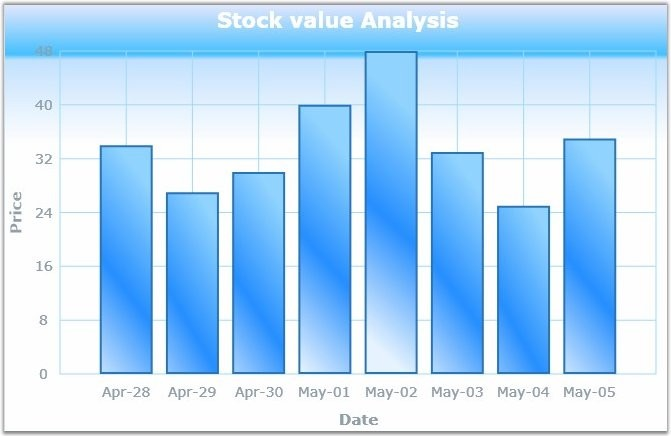

::: {style="DISPLAY: none"}
{#d2h_url_template}{#d2h_package_url style="WIDTH: 0px; DISPLAY: none; HEIGHT: 0px"}
:::

::: {.d2h_secondary_topic style="PADDING-BOTTOM: 10pt; MARGIN: 0pt; PADDING-LEFT: 0pt; PADDING-RIGHT: 0pt; PADDING-TOP: 0pt"}
#### Column Chart {#column-chart style="tab-stops: 0pt"}

[]{#p32}[]{style="COLOR: #15428b"} 

Column Charts are among the most common chart types that are being used. It uses vertical bars (called columns) to display different values of one or more items. It is similar to a bar chart except that, here, the bars are vertical and not horizontal. Points from adjacent series are drawn as bars next to each other.

 

It is used for comparing the frequency, count, total or average of data in different categories. It is ideal for showing the variations in the value of an item over time.

[]{style="COLOR: #15428b"} 

+--------------------------------------------------------------------------------------------------------------------------------------------------------------------------------------------------------------------------------------------------------------------------------------------------------------------------------------------------------------------------------------------------------------------------------------------------------------------------------------------------------------------------------------------------------------------------------------------------------------------------------------------------------------+
| [\[XAML\]]{style="FONT-FAMILY: 'Courier New'"}                                                                                                                                                                                                                                                                                                                                                                                                                                                                                                                                                                                                               |
|                                                                                                                                                                                                                                                                                                                                                                                                                                                                                                                                                                                                                                                              |
| []{style="FONT-FAMILY: 'Courier New'; COLOR: blue"}                                                                                                                                                                                                                                                                                                                                                                                                                                                                                                                                                                                                          |
|                                                                                                                                                                                                                                                                                                                                                                                                                                                                                                                                                                                                                                                              |
| [\<]{style="FONT-FAMILY: 'Courier New'; COLOR: blue"}[syncfusion:ChartSeries]{style="FONT-FAMILY: 'Courier New'; COLOR: #a31515"}[ ]{style="FONT-FAMILY: 'Courier New'; COLOR: blue"}[Type]{style="FONT-FAMILY: 'Courier New'; COLOR: red"}[=]{style="FONT-FAMILY: 'Courier New'; COLOR: blue"}[\"[Column]{style="COLOR: blue"}\"[ ]{style="COLOR: blue"}[LegendLabel]{style="COLOR: red"}[=]{style="COLOR: blue"}\"[Student Marks]{style="COLOR: blue"}\"[ ]{style="COLOR: blue"}[Foreground]{style="COLOR: red"}[=]{style="COLOR: blue"}\"[{StaticResource Series1}]{style="COLOR: blue"}\"[/\>]{style="COLOR: blue"}]{style="FONT-FAMILY: 'Courier New'"} |
+--------------------------------------------------------------------------------------------------------------------------------------------------------------------------------------------------------------------------------------------------------------------------------------------------------------------------------------------------------------------------------------------------------------------------------------------------------------------------------------------------------------------------------------------------------------------------------------------------------------------------------------------------------------+

[]{style="COLOR: #15428b"} 

Run the code. The following output is displayed.

[]{style="COLOR: #15428b"} 

{border="0"}

Figure 26: Chart Displaying Column Series \[ChartType=\"Column\"\]

[]{#related-topics}
:::
