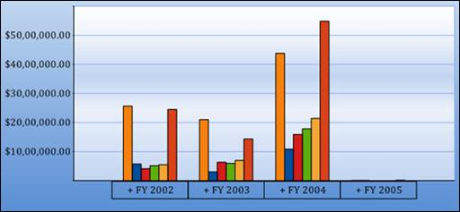
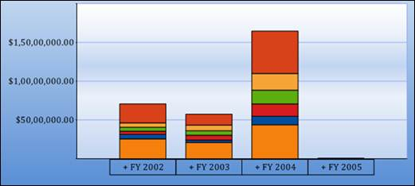
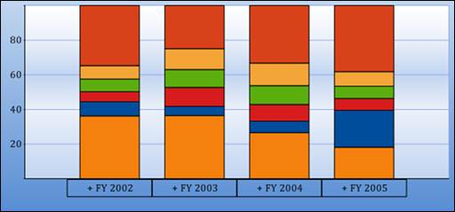

::: {style="DISPLAY: none"}
{#d2h_url_template}{#d2h_package_url style="WIDTH: 0px; DISPLAY: none; HEIGHT: 0px"}
:::

::::: {#nsbanner .d2h_main_nsbanner style="BORDER-BOTTOM: #999999 1px solid; POSITION: relative; PADDING-BOTTOM: 0px; BACKGROUND-COLOR: transparent; PADDING-LEFT: 0px; PADDING-RIGHT: 0px; DISPLAY: none; BORDER-TOP: #999999 1px solid; PADDING-TOP: 0px; LEFT: 0px"}
:::: {#TitleRow .d2h_main_titlerow style="PADDING-BOTTOM: 4px; BACKGROUND-COLOR: transparent; PADDING-LEFT: 22px; WIDTH: 100%; PADDING-RIGHT: 10px; DISPLAY: none; PADDING-TOP: 4px"}
::: {#ienav .d2h_main_ienav style="DISPLAY: none"}
{#D2HPrevious .D2HPreviousEnabled}  {#D2HNext .D2HNextEnabled}
:::
::::
:::::

::::: {#nstext .d2h_main_nstext style="PADDING-BOTTOM: 10px; BACKGROUND-COLOR: transparent; PADDING-LEFT: 22px; PADDING-RIGHT: 10px; HEIGHT: 100%; OVERFLOW: auto; PADDING-TOP: 5px" hasuserbackground="true" valign="bottom"}
::: {#d2h_breadcrumbs .d2h_breadcrumbs}
[Essential Studio User Guide Documentation](ms-xhelp:///?Id=12457748-09e3-4d74-a240-8e049cedf030){.d2h_breadcrumbsNormal}[ \> ]{.d2h_breadcrumbsLinkSeparator}[Business Intelligence Edition](ms-xhelp:///?Id=fdf33dd8-62b2-47b9-ad7b-fc50e590bca5){.d2h_breadcrumbsNormal}[ \> ]{.d2h_breadcrumbsLinkSeparator}[Essential BI ASP.NET](ms-xhelp:///?Id=99c6694e-59c3-4c59-abb5-ce9ce9a948bc){.d2h_breadcrumbsNormal}[ \> ]{.d2h_breadcrumbsLinkSeparator}[Essential BI Chart]{.d2h_breadcrumbsContentsOnly}[ \> ]{.d2h_breadcrumbsLinkSeparator}[Concepts and Features](ms-xhelp:///?Id=be4e11fe-e0a1-44d7-aa3a-05cf8b78bdb8){.d2h_breadcrumbsNormal}[ \> ]{.d2h_breadcrumbsLinkSeparator}[Chart Types](ms-xhelp:///?Id=11a8b8a5-faa3-4a18-ac73-7d73435f1963){.d2h_breadcrumbsNormal}
:::

### Column Chart and its Types {#column-chart-and-its-types style="tab-stops: 0pt"}

 

COLUMN CHART:

Column Charts are among the most common chart types that are being used. It uses vertical bars (called columns) to display different values of one or more items. Points from adjacent series are drawn as bars next to each other. It is used for comparing the frequency, count, total or average of data in different categories. It is ideal for showing the variations in the value of an item over time.

 

+--------------------------------------------------------------------------------------------------------------------------------------------------------------------------------------------------------------------+
| **[\[C#\]]{style="FONT-FAMILY: 'Courier New'"}**                                                                                                                                                                   |
|                                                                                                                                                                                                                    |
| []{style="FONT-FAMILY: 'Courier New'"}                                                                                                                                                                             |
|                                                                                                                                                                                                                    |
| [this]{style="FONT-FAMILY: 'Courier New'; COLOR: blue"}[.olapChart1.ChartSeriesType = [ChartSeriesType]{style="COLOR: #2b91af"}.Column;]{style="FONT-FAMILY: 'Courier New'"}[]{style="FONT-FAMILY: 'Courier New'"} |
+--------------------------------------------------------------------------------------------------------------------------------------------------------------------------------------------------------------------+

 

+-------------------------------------------------------------------------------------------------------------------------------------------------------------------------------------------------------------------------------------------------------------------------------------------------------------------------+
| **[\[VB\]]{style="FONT-FAMILY: 'Courier New'"}**                                                                                                                                                                                                                                                                        |
|                                                                                                                                                                                                                                                                                                                         |
| []{style="FONT-FAMILY: 'Courier New'"}                                                                                                                                                                                                                                                                                  |
|                                                                                                                                                                                                                                                                                                                         |
| [Me]{style="FONT-FAMILY: 'Courier New'; COLOR: blue"}[.olapChart1.ChartSeriesType = ]{style="FONT-FAMILY: 'Courier New'"}[ChartSeriesType]{style="FONT-FAMILY: 'Courier New'; COLOR: #2b91af"}[.]{style="FONT-FAMILY: 'Courier New'"}[Column]{style="FONT-FAMILY: 'Courier New'"}[]{style="FONT-FAMILY: 'Courier New'"} |
+-------------------------------------------------------------------------------------------------------------------------------------------------------------------------------------------------------------------------------------------------------------------------------------------------------------------------+

 

{border="0"}

 

Figure 27: Column Chart

 

STACKING COLUMN CHART:

Stacking Column Charts are similar to column charts except that the y values stack on top of each other in the specified series order. This helps visualize the relationship of parts to the whole.

 

+----------------------------------------------------------------------------------------------------------------------------------------------------------------------------------------------------------------------------+
| **[\[C#\]]{style="FONT-FAMILY: 'Courier New'"}**                                                                                                                                                                           |
|                                                                                                                                                                                                                            |
| []{style="FONT-FAMILY: 'Courier New'"}                                                                                                                                                                                     |
|                                                                                                                                                                                                                            |
| [this]{style="FONT-FAMILY: 'Courier New'; COLOR: blue"}[.olapChart1.ChartSeriesType = [ChartSeriesType]{style="COLOR: #2b91af"}.StackingColumn;]{style="FONT-FAMILY: 'Courier New'"}[]{style="FONT-FAMILY: 'Courier New'"} |
+----------------------------------------------------------------------------------------------------------------------------------------------------------------------------------------------------------------------------+

 

+---------------------------------------------------------------------------------------------------------------------------------------------------------------------------------------------------------------------------------------------------------------------------------------------------------------------------------+
| **[\[VB\]]{style="FONT-FAMILY: 'Courier New'"}**                                                                                                                                                                                                                                                                                |
|                                                                                                                                                                                                                                                                                                                                 |
| []{style="FONT-FAMILY: 'Courier New'"}                                                                                                                                                                                                                                                                                          |
|                                                                                                                                                                                                                                                                                                                                 |
| [Me]{style="FONT-FAMILY: 'Courier New'; COLOR: blue"}[.olapChart1.ChartSeriesType = ]{style="FONT-FAMILY: 'Courier New'"}[ChartSeriesType]{style="FONT-FAMILY: 'Courier New'; COLOR: #2b91af"}[.]{style="FONT-FAMILY: 'Courier New'"}[StackingColumn]{style="FONT-FAMILY: 'Courier New'"}[]{style="FONT-FAMILY: 'Courier New'"} |
+---------------------------------------------------------------------------------------------------------------------------------------------------------------------------------------------------------------------------------------------------------------------------------------------------------------------------------+

 

{border="0"} 

 

Figure 28: Stacking Column Chart

 

STACKING COLUMN 100 CHARTS:

Stacking Column 100 chart types displays multiple series of data as stacked columns ensuring that the cumulative proportion of each stacked element always totals to 100%. Therefore, the y-axis is always rendered within the range of 0 -- 100.

 

+-------------------------------------------------------------------------------------------------------------------------------------------------------------------------------------------------------------------------------+
| **[\[C#\]]{style="FONT-FAMILY: 'Courier New'"}**[]{style="FONT-FAMILY: 'Courier New'"}                                                                                                                                        |
|                                                                                                                                                                                                                               |
| [this]{style="FONT-FAMILY: 'Courier New'; COLOR: blue"}[.olapChart1.ChartSeriesType = [ChartSeriesType]{style="COLOR: #2b91af"}.StackingColumn100;]{style="FONT-FAMILY: 'Courier New'"}[]{style="FONT-FAMILY: 'Courier New'"} |
+-------------------------------------------------------------------------------------------------------------------------------------------------------------------------------------------------------------------------------+

 

+------------------------------------------------------------------------------------------------------------------------------------------------------------------------------------------------------------------------------------------------------------------------------------------------------------------------------------+
| **[\[VB\]]{style="FONT-FAMILY: 'Courier New'"}**[]{style="FONT-FAMILY: 'Courier New'"}                                                                                                                                                                                                                                             |
|                                                                                                                                                                                                                                                                                                                                    |
| [Me]{style="FONT-FAMILY: 'Courier New'; COLOR: blue"}[.olapChart1.ChartSeriesType = ]{style="FONT-FAMILY: 'Courier New'"}[ChartSeriesType]{style="FONT-FAMILY: 'Courier New'; COLOR: #2b91af"}[.]{style="FONT-FAMILY: 'Courier New'"}[StackingColumn100]{style="FONT-FAMILY: 'Courier New'"}[]{style="FONT-FAMILY: 'Courier New'"} |
+------------------------------------------------------------------------------------------------------------------------------------------------------------------------------------------------------------------------------------------------------------------------------------------------------------------------------------+

 

 

 

{border="0"}

 

Figure 29: Stacking Column 100 Chart

 

Table 7: [ChartSeriesType]{style="COLOR: black"}

 

::: {align="center"}
+-----------------+--------------------------------------------------------------------------------------------------------------+-------------+-----------------+----------------+
| Property        | Descriptions                                                                                                 | Type        | Data            | Reference Link |
|                 |                                                                                                              |             |                 |                |
|                 |                                                                                                              |             | type            |                |
+-----------------+--------------------------------------------------------------------------------------------------------------+-------------+-----------------+----------------+
| ChartSeriesType | Different types of charts such as line, area, bar, column and pie chart are implemented using this property. | Server side | ChartSeriesType | \-             |
+-----------------+--------------------------------------------------------------------------------------------------------------+-------------+-----------------+----------------+
:::

 

Sample Link

A sample demo is available at the following location:

 

..\\Syncfusion\\EssentialStudio\\\<Version Number\>\\BI\\Web\\OlapChart.Web\\Samples\\3.5\\Chart Types\\Column Chart\\

[]{#related-topics}
:::::
