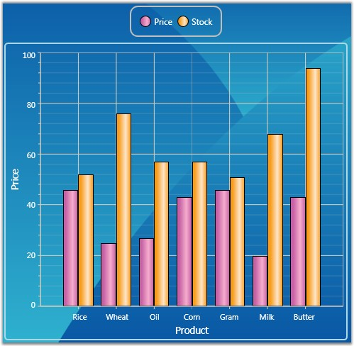
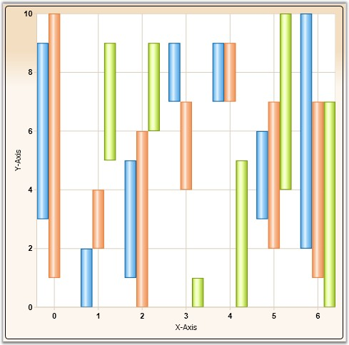
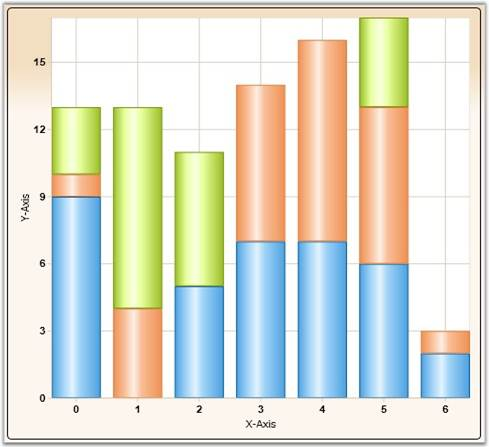
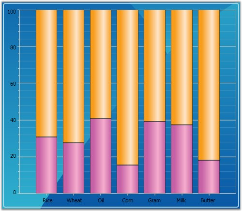
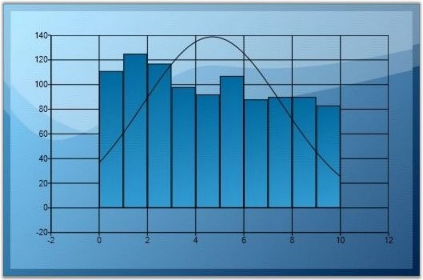
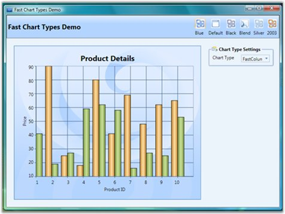

::: {style="DISPLAY: none"}
{#d2h_url_template}{#d2h_package_url style="WIDTH: 0px; DISPLAY: none; HEIGHT: 0px"}
:::

::::::::::::::::::::: {.d2h_secondary_topic style="PADDING-BOTTOM: 10pt; MARGIN: 0pt; PADDING-LEFT: 0pt; PADDING-RIGHT: 0pt; PADDING-TOP: 0pt"}
##### Column Charts {#column-charts style="tab-stops: 0pt"}

###### 4.1.1.4.3.1 Column Chart {#column-chart style="tab-stops: 0pt"}

Column Charts are among the most common chart types that are being used. It uses vertical bars (called columns) to display different values of one or more items. It is similar to a bar chart except that here the bars are vertical and not horizontal. Points from adjacent series are drawn as bars next to each other. 

It is used for comparing the frequency, count, total or average of data in different categories. It is ideal for showing the variations in the value of an item over time.

 

The following image shows a multi series Column Chart.

[]{style="FONT-FAMILY: 'Trebuchet MS','sans-serif'; COLOR: #15428b; FONT-SIZE: 9pt"} 

{border="0"}

Figure 126: Column Chart

[]{style="FONT-FAMILY: 'Trebuchet MS','sans-serif'; COLOR: #15428b; FONT-SIZE: 9pt"} 

Data Requirements

**[]{style="POSITION: relative; COLOR: #4a5c8c; FONT-SIZE: 9pt; TOP: 4.5pt"}** 

Table 46: Data Requirement

::: {align="center"}
+------------------------------+-------------+
| Details                                    |
+------------------------------+-------------+
| Number of y values per point | one         |
+------------------------------+-------------+
| Number of points             | one or more |
+------------------------------+-------------+
| Number of series             | one or more |
+------------------------------+-------------+
:::

[]{style="FONT-FAMILY: 'Trebuchet MS','sans-serif'; COLOR: #15428b; FONT-SIZE: 9pt"} 

Custom Properties

**[]{style="POSITION: relative; COLOR: #4a5c8c; FONT-SIZE: 9pt; TOP: 4.5pt"}** 

Table 47: Custom Property

::: {align="center"}
+-------------------+-----------------+-----------------+--------------------------------------+
| Name              | Type            | Container       | Description                          |
+-------------------+-----------------+-----------------+--------------------------------------+
| ChartType.Spacing | double          | ChartArea       | sets the interval between columns    |
|                   |                 |                 |                                      |
|                   |                 |                 | Possible values lie between 0 and 1. |
+-------------------+-----------------+-----------------+--------------------------------------+
:::

[]{style="FONT-FAMILY: 'Trebuchet MS','sans-serif'; COLOR: #15428b; FONT-SIZE: 9pt"} 

Template

While setting template the following parameters can be used:

[]{style="FONT-FAMILY: 'Trebuchet MS','sans-serif'; COLOR: #15428b; FONT-SIZE: 9pt"} 

Table 48: Template Parameter

::: {align="center"}
  ---------- ------------- ---------------------------
  Name       Type          Description
  X          double        x column coordinate
  Y          double        y column coordinate
  Width      double        column width
  Height     double        column height
  Interior   Brush         column color
  Series     ChartSeries   reference to series-owner
  ---------- ------------- ---------------------------
:::

[]{style="FONT-FAMILY: 'Trebuchet MS','sans-serif'; COLOR: #15428b; FONT-SIZE: 9pt"} 

A sample which demonstrates Column Chart Types is available in the following sample installation path.

[]{style="FONT-FAMILY: 'Trebuchet MS','sans-serif'; COLOR: #15428b; FONT-SIZE: 9pt"} 

***..My Documents\\Syncfusion\\EssentialStudio\\\<Version Number\>\\WPF\\Chart.WPF\\Samples\\3.5\\WindowsSamples\\Chart Gallery\\Column Chart Demo***

**** 

See Also

[[Chart Types]{.UGHyperlink}](ms-xhelp:///?Id=137e357f-58c1-463b-9fb1-c42a058a7844)[]{.UGHyperlink}

[]{#p85} 

###### 4.1.1.4.3.2 Column Range Chart {#column-range-chart style="tab-stops: 0pt"}

Column Range Chart is similar to the Column Chart except that each column is rendered over a range. Therefore the user must specify the y-axis Starting and Ending values for each point.

 

The following figure shows a Column Range Chart.

[]{style="FONT-FAMILY: 'Trebuchet MS','sans-serif'; COLOR: #15428b; FONT-SIZE: 9pt"} 

{border="0"}

Figure 127: Column Range Chart

Data Requirements

[]{style="FONT-FAMILY: 'Trebuchet MS','sans-serif'; COLOR: #15428b; FONT-SIZE: 9pt"} 

Table 49: Data Requirement

::: {align="center"}
+------------------------------+-------------+
| Details                                    |
+------------------------------+-------------+
| Number of y values per point | two         |
+------------------------------+-------------+
| Number of points             | one or more |
+------------------------------+-------------+
| Number of series             | one or more |
+------------------------------+-------------+
:::

[]{style="FONT-FAMILY: 'Trebuchet MS','sans-serif'; COLOR: #15428b; FONT-SIZE: 9pt"} 

Custom Properties

[]{style="FONT-FAMILY: 'Trebuchet MS','sans-serif'; COLOR: #15428b; FONT-SIZE: 9pt"} 

Table 50: Custom Property

::: {align="center"}
+-------------------+-----------------+-----------------+--------------------------------------+
| Name              | Type            | Container       | Description                          |
+-------------------+-----------------+-----------------+--------------------------------------+
| ChartType.Spacing | double          | ChartArea       | sets the interval between columns    |
|                   |                 |                 |                                      |
|                   |                 |                 | Possible values lie between 0 and 1. |
+-------------------+-----------------+-----------------+--------------------------------------+
:::

[]{style="FONT-FAMILY: 'Trebuchet MS','sans-serif'; COLOR: #15428b; FONT-SIZE: 9pt"} 

Template

While setting template the following parameters can be used:

[]{style="FONT-FAMILY: 'Trebuchet MS','sans-serif'; COLOR: #15428b; FONT-SIZE: 9pt"} 

Table 51: Template Parameter

::: {align="center"}
  ---------- ------------- ---------------------------
  Name       Type          Description
  X          double        x column coordinate
  Y          double        y column coordinate
  Width      double        column width
  Height     double        column height
  Interior   Brush         column color
  Series     ChartSeries   reference to series-owner
  ---------- ------------- ---------------------------
:::

[]{style="FONT-FAMILY: 'Trebuchet MS','sans-serif'; COLOR: #15428b; FONT-SIZE: 9pt"} 

A sample which demonstrates Column Chart Types is available in the following sample installation path.

 

***..My Documents\\Syncfusion\\EssentialStudio\\\<Version Number\>\\WPF\\Chart.WPF\\Samples\\3.5\\WindowsSamples\\Chart Gallery\\Column Chart Demo***

 

See Also

[[Chart Types]{.UGHyperlink}](ms-xhelp:///?Id=7f54d9b2-6e7d-4862-a1a5-7d33255c5716)[]{.UGHyperlink}

[]{#p86} 

###### 4.1.1.4.3.3 Stacking Column Chart {#stacking-column-chart style="tab-stops: 0pt"}

Stacking Column Charts are similar to regular column charts except that the Y values stack on top of each other in the specified series order. This helps visualize the relationship of parts to the whole.

 

The following image shows a sample Stacking Column Chart.

[]{style="FONT-FAMILY: 'Trebuchet MS','sans-serif'; COLOR: #15428b; FONT-SIZE: 9pt"} 

{border="0"}

Figure 128: Stacking Column Chart

[]{style="FONT-FAMILY: 'Trebuchet MS','sans-serif'; COLOR: #15428b; FONT-SIZE: 9pt"} 

Data Requirements

[]{style="FONT-FAMILY: 'Trebuchet MS','sans-serif'; COLOR: #15428b; FONT-SIZE: 9pt"} 

Table 52: Data Requirement

::: {align="center"}
+------------------------------+-------------+
| Details                                    |
+------------------------------+-------------+
| Number of y values per point | one         |
+------------------------------+-------------+
| Number of points             | one or more |
+------------------------------+-------------+
| Number of series             | one or more |
+------------------------------+-------------+
:::

**[]{style="FONT-FAMILY: 'Trebuchet MS','sans-serif'; COLOR: #15428b"}** 

**[]{style="FONT-FAMILY: 'Trebuchet MS','sans-serif'; COLOR: #15428b"}** 

Custom StackingColumn100 Properties

[]{style="FONT-FAMILY: 'Trebuchet MS','sans-serif'; COLOR: #15428b; FONT-SIZE: 9pt"} 

Table 53: Custom Stacking Column 100 Property

::: {align="center"}
+---------------------------------------------------+-----------------+-----------------+-----------------------------------------------------------------------------+
| Name                                              | Type            | Container       | Description                                                                 |
+---------------------------------------------------+-----------------+-----------------+-----------------------------------------------------------------------------+
| ChartStackingColumn100Type.ShowValueAsProbability | bool            | ChartArea       | y-axis range is set between 0 and 100                                       |
|                                                   |                 |                 |                                                                             |
|                                                   |                 |                 | If true, the y-axis range is set between 0 and 1. Default value is *false*. |
+---------------------------------------------------+-----------------+-----------------+-----------------------------------------------------------------------------+
:::

**[]{style="FONT-FAMILY: 'Trebuchet MS','sans-serif'; COLOR: #15428b"}** 

Template

While setting template, the following parameters can be used.

[]{style="FONT-FAMILY: 'Trebuchet MS','sans-serif'; COLOR: #15428b; FONT-SIZE: 9pt"} 

Table 54: Template Parameter

::: {align="center"}
  ---------- ------------- ---------------------------------
  Name       Type          Description
  X          double        x column coordinate
  Y          double        y column coordinate
  Width      double        column width
  Height     double        column height
  Interior   Brush         column color
  IsUpper    bool          true -- if this is upper column
  IsLower    bool          true -- if this is lower column
  Series     ChartSeries   reference to series-owner
  ---------- ------------- ---------------------------------
:::

[]{style="FONT-FAMILY: 'Trebuchet MS','sans-serif'; COLOR: #15428b; FONT-SIZE: 9pt"} 

Stacking Negative Series

When negative values are added, Stacking Column chart can be made to be stacked separately in the chart area, above and below the y-axis 0.

 

Below given code is used to do this.

[]{style="FONT-FAMILY: 'Trebuchet MS','sans-serif'; COLOR: #15428b; FONT-SIZE: 9pt"} 

+--------------------------------------------------------------------------------------------------------------------------------------------------------------------+
| **[\[C#\]]{style="FONT-FAMILY: 'Courier New'"}**                                                                                                                   |
|                                                                                                                                                                    |
| []{style="FONT-FAMILY: 'Courier New'"}                                                                                                                             |
|                                                                                                                                                                    |
| [ChartStackingColumnType.SetRequiresNegativeSeriesStack([this]{style="COLOR: blue"}.chartArea2, [true]{style="COLOR: blue"});]{style="FONT-FAMILY: 'Courier New'"} |
+--------------------------------------------------------------------------------------------------------------------------------------------------------------------+

[]{style="FONT-SIZE: 8pt"} 

A sample which demonstrates Column Chart Types is available in the following sample installation path.

 

***..My Documents\\Syncfusion\\EssentialStudio\\\<Version Number\>\\WPF\\Chart.WPF\\Samples\\3.5\\WindowsSamples\\Chart Gallery\\Column Chart Demo***

 

 

See Also

[[Chart Types]{.UGHyperlink}](ms-xhelp:///?Id=137e357f-58c1-463b-9fb1-c42a058a7844)[]{.UGHyperlink}

###### []{#p87}4.1.1.4.3.4 Stacking Column 100 Chart {#stacking-column-100-chart style="tab-stops: 0pt"}

In the 100 % Stacked Column Chart, the cumulative proportion of each stacked element always totals 100%. This type of chart is great to visualize the relative contribution of each series values to the whole.

[]{style="FONT-FAMILY: 'Trebuchet MS','sans-serif'; COLOR: #15428b; FONT-SIZE: 9pt"} 

The following image shows a sample Stacking Column 100 Chart.

[]{style="FONT-FAMILY: 'Trebuchet MS','sans-serif'; COLOR: #15428b; FONT-SIZE: 9pt"} 

{border="0"}

Figure 129: Stacking Column 100 Chart

[]{style="FONT-FAMILY: 'Trebuchet MS','sans-serif'; COLOR: #15428b"} 

Data Requirements

**[]{style="POSITION: relative; COLOR: #4a5c8c; FONT-SIZE: 9pt; TOP: 4.5pt"}** 

Table 55: Data Requirement

::: {align="center"}
+------------------------------+-------------+
| Details                                    |
+------------------------------+-------------+
| Number of y values per point | one         |
+------------------------------+-------------+
| Number of points             | one or more |
+------------------------------+-------------+
| Number of series             | one or more |
+------------------------------+-------------+
:::

**[]{style="FONT-FAMILY: 'Trebuchet MS','sans-serif'; COLOR: #15428b"}** 

**[]{style="FONT-FAMILY: 'Trebuchet MS','sans-serif'; COLOR: #15428b"}** 

Spline Settings

[]{style="FONT-FAMILY: 'Trebuchet MS','sans-serif'; COLOR: #15428b; FONT-SIZE: 9pt"} 

Table 56: Spline Setting

::: {align="center"}
+-----------------------------------------------+-----------------+-----------------+--------------------------------------------------------------------+
| Name                                          | Type            | Container       | Description                                                        |
+-----------------------------------------------+-----------------+-----------------+--------------------------------------------------------------------+
| ChartStackingColumn100.ShowValueAsProbability | bool            | ChartArea       | y-axis range is set from 0 - 100                                   |
|                                               |                 |                 |                                                                    |
|                                               |                 |                 | If true, y-axis range is set from 0 - 1. Default value is *false*. |
+-----------------------------------------------+-----------------+-----------------+--------------------------------------------------------------------+
:::

**[]{style="FONT-FAMILY: 'Trebuchet MS','sans-serif'; COLOR: #15428b"}** 

Template

While setting template, the following parameters can be used.

[]{style="FONT-FAMILY: 'Trebuchet MS','sans-serif'; COLOR: #15428b; FONT-SIZE: 9pt"} 

Table 57: Template parameters

::: {align="center"}
  ------------ ------------- ----------------------------------------------
  Name         Type          Description
  X            double        x column coordinate
  Y            double        y column coordinate
  Width        double        column width
  Height       double        column height
  Interior     Brush         column color
  IsUpper      bool          *true* -- if this is upper column
  IsLower      bool          *true* -- if this is lower column
  Percentage   double        indicates the percentage this point takes up
  Series       ChartSeries   reference to series-owner
  ------------ ------------- ----------------------------------------------
:::

[]{style="FONT-FAMILY: 'Trebuchet MS','sans-serif'; COLOR: #15428b; FONT-SIZE: 9pt"} 

A sample which demonstrates Column Chart Types is available in the following sample installation path.

**** 

***..My Documents\\Syncfusion\\EssentialStudio\\\<Version Number\>\\WPF\\Chart.WPF\\Samples\\3.5\\WindowsSamples\\Chart Gallery\\Column Chart Demo***

**** 

See Also

[[Chart Types]{.UGHyperlink}](ms-xhelp:///?Id=fc1fdcb2-b7ba-4e8b-8d11-9876bb8f2b10)[]{#p88}[]{.UGHyperlink}

###### 4.1.1.4.3.5 Histogram Chart {#histogram-chart style="tab-stops: 0pt"}

Histogram is a bar (column) chart of a frequency distribution in which the widths of the bars are proportional to the classes into which the variable has been divided and the heights of the bars are proportional to the class frequencies. The categories are usually specified as non overlapping intervals of some variable. The categories (bars) must be adjacent. In addition, the chart has the capability to draw a normal distribution curve.

 

Histograms are useful data summaries that convey the following information:

[]{style="FONT-FAMILY: 'Trebuchet MS','sans-serif'; COLOR: #15428b; FONT-SIZE: 9pt"} 

[·      ]{style="FONT-FAMILY: Symbol"}The general shape of the frequency distribution. (normal, exponential, etc.)

[·      ]{style="FONT-FAMILY: Symbol"}Symmetry of the distribution and whether it is skewed.

[·      ]{style="FONT-FAMILY: Symbol"}Modality - unimodal, bimodal or multimodal.

[]{style="FONT-FAMILY: 'Trebuchet MS','sans-serif'; COLOR: #15428b; FONT-SIZE: 9pt"} 

The shape of the distribution conveys important information such as the probability distribution of the data.

[]{style="FONT-FAMILY: 'Trebuchet MS','sans-serif'; COLOR: #15428b; FONT-SIZE: 9pt"} 

{border="0"}

Figure 130: Histogram Chart

[]{style="FONT-FAMILY: 'Trebuchet MS','sans-serif'; COLOR: #15428b; FONT-SIZE: 9pt"} 

Data Requirements

**[]{style="POSITION: relative; COLOR: #4a5c8c; FONT-SIZE: 9pt; TOP: 4.5pt"}** 

Table 58: Data Requirement

::: {align="center"}
+------------------------------+-------------+
| Details                                    |
+------------------------------+-------------+
| Number of y values per point | one         |
+------------------------------+-------------+
| Number of points             | one or more |
+------------------------------+-------------+
| Number of series             | one or more |
+------------------------------+-------------+
:::

[]{style="FONT-FAMILY: 'Trebuchet MS','sans-serif'; COLOR: #15428b; FONT-SIZE: 9pt"} 

Histogram Settings

**[]{style="POSITION: relative; COLOR: #4a5c8c; FONT-SIZE: 9pt; TOP: 4.5pt"}** 

Table 59: Histogram Setting

::: {align="center"}
  ------------------------------------------- -------- ------------- --------------------------------------------------------------------------
  Name                                        Type     Container     Description
  ChartHistogramType.IntervalOfHistogram      double   ChartArea     attached property that specifies the Interval which leads for one column
  ChartHistogramType.DrawNormalDistribution   bool     ChartSeries   specifies whether to draw Normal Distribution Line
  ------------------------------------------- -------- ------------- --------------------------------------------------------------------------
:::

[]{style="FONT-FAMILY: 'Trebuchet MS','sans-serif'; COLOR: #15428b; FONT-SIZE: 9pt"} 

Template

While setting template the following parameters can be used:

[]{style="FONT-FAMILY: 'Trebuchet MS','sans-serif'; COLOR: #15428b; FONT-SIZE: 9pt"} 

Table 60: Template Parameter

::: {align="center"}
  ---------- ------------- ---------------------------
  Name       Type          Description
  X          double        x column coordinate
  Y          double        y column coordinate
  Width      double        column width
  Height     double        column height
  Interior   Brush         column color
  Series     ChartSeries   reference to series-owner
  ---------- ------------- ---------------------------
:::

[]{style="FONT-FAMILY: 'Trebuchet MS','sans-serif'; COLOR: #15428b; FONT-SIZE: 9pt"} 

See Also

[[Chart Types]{.UGHyperlink}](ms-xhelp:///?Id=f16fd203-8f63-43de-88e5-e822ff7e7af7)[]{.UGHyperlink}

[]{#p89} 

###### 4.1.1.4.3.6 Fast Column Chart {#fast-column-chart style="tab-stops: 0pt"}

Fast Column Chart is similar to Column chart as it uses vertical bars (called columns) to display different values of one or more items. Points from adjacent series are drawn as bars next to each other. 

 

It is used for comparing the frequency, count, total or average of data in different categories. It is ideal for showing the variations in the value of an item over time.

 

The following points mark the advantages of **Fast Column** over **Column** charts:

[]{style="FONT-FAMILY: 'Trebuchet MS','sans-serif'; COLOR: #15428b; FONT-SIZE: 9pt"} 

[·      ]{style="FONT-FAMILY: Symbol"}The Fast Column charts are rendered using drawing visuals.

[·      ]{style="FONT-FAMILY: Symbol"}They load faster than the Column charts.

[·      ]{style="FONT-FAMILY: Symbol"}They ensure high performance for displaying data.

[·      ]{style="FONT-FAMILY: Symbol"}They can be used as real time charts to render huge number of data points.

[]{style="FONT-FAMILY: 'Trebuchet MS','sans-serif'; COLOR: #15428b; FONT-SIZE: 9pt"} 

The Chart type Fast Column is added in the Enum of type ChartTypes.

[]{style="FONT-FAMILY: 'Trebuchet MS','sans-serif'; COLOR: #15428b; FONT-SIZE: 9pt"} 

{border="0"}

Figure 131: Fast Column Chart

[]{style="FONT-FAMILY: 'Trebuchet MS','sans-serif'; COLOR: #15428b; FONT-SIZE: 9pt"} 

Data Requirements

**[]{style="POSITION: relative; COLOR: #4a5c8c; FONT-SIZE: 9pt; TOP: 4.5pt"}** 

Table 61: Data Requirement

::: {align="center"}
+------------------------------+-------------+
| Details                                    |
+------------------------------+-------------+
| Number of y values per point | one         |
+------------------------------+-------------+
| Number of points             | one or more |
+------------------------------+-------------+
| Number of series             | one or more |
+------------------------------+-------------+
:::

[]{style="FONT-FAMILY: 'Trebuchet MS','sans-serif'; COLOR: #15428b; FONT-SIZE: 9pt"} 

Custom Properties

**[]{style="POSITION: relative; COLOR: #4a5c8c; FONT-SIZE: 9pt; TOP: 4.5pt"}** 

Table 62: Custom Property

::: {align="center"}
+-------------------+-----------------+-----------------+--------------------------------------+
| Name              | Type            | Container       | Description                          |
+-------------------+-----------------+-----------------+--------------------------------------+
| ChartType.Spacing | double          | ChartArea       | sets the interval between columns    |
|                   |                 |                 |                                      |
|                   |                 |                 | Possible values lie between 0 and 1. |
+-------------------+-----------------+-----------------+--------------------------------------+
:::

[]{style="FONT-FAMILY: 'Trebuchet MS','sans-serif'; COLOR: #15428b; FONT-SIZE: 9pt"} 

Template

While setting template the following parameters can be used:

[]{style="FONT-FAMILY: 'Trebuchet MS','sans-serif'; COLOR: #15428b; FONT-SIZE: 9pt"} 

Table 63: Template Parameter

::: {align="center"}
  ---------- ------------- ---------------------------
  Name       Type          Description
  X          double        x column coordinate
  Y          double        y column coordinate
  Width      double        column width
  Height     double        column height
  Interior   Brush         column color
  Series     ChartSeries   reference to series-owner
  ---------- ------------- ---------------------------
:::

[]{style="FONT-FAMILY: 'Trebuchet MS','sans-serif'; COLOR: #15428b; FONT-SIZE: 9pt"} 

A sample which demonstrates Fast Column Chart Type is available in the following sample installation path.

 

***..My Documents\\Syncfusion\\Essential Studio\\\<Version Number\>\\WPF\\Chart.WPF\\Samples\\3.5\\WindowsSamples\\Chart Performance-\> Fast chart types***

**** 

The following code snippet illustrate the usage of Fast Column charts.

[]{style="FONT-FAMILY: 'Trebuchet MS','sans-serif'; COLOR: #15428b; FONT-SIZE: 9pt"} 

+-----------------------------------------------------------------------------------------------------------------------------------------------------------------------------------------------------------------------------------------------------------------------------------------------------------------------------------------------------------------------------------------------------------------------------------------------------------------------------------------------------------------------------------------------------------------------------------------------------------------------------------------------------------------------------------------------------------------------------------------------------------------------------------------------------------------------------------------------------------+
| **[\[XAML\]]{style="FONT-FAMILY: 'Courier New'"}**                                                                                                                                                                                                                                                                                                                                                                                                                                                                                                                                                                                                                                                                                                                                                                                                        |
|                                                                                                                                                                                                                                                                                                                                                                                                                                                                                                                                                                                                                                                                                                                                                                                                                                                           |
| []{style="FONT-FAMILY: 'Courier New'; COLOR: blue"}                                                                                                                                                                                                                                                                                                                                                                                                                                                                                                                                                                                                                                                                                                                                                                                                       |
|                                                                                                                                                                                                                                                                                                                                                                                                                                                                                                                                                                                                                                                                                                                                                                                                                                                           |
| [\<]{style="FONT-FAMILY: 'Courier New'; COLOR: blue"}[syncfusion]{style="FONT-FAMILY: 'Courier New'; COLOR: #a31515"}[:]{style="FONT-FAMILY: 'Courier New'; COLOR: blue"}[ChartSeries]{style="FONT-FAMILY: 'Courier New'; COLOR: #a31515"}[ Type]{style="FONT-FAMILY: 'Courier New'; COLOR: red"}[=\"FastColumn\"]{style="FONT-FAMILY: 'Courier New'; COLOR: blue"}[ Name]{style="FONT-FAMILY: 'Courier New'; COLOR: red"}[=\"series1\"]{style="FONT-FAMILY: 'Courier New'; COLOR: blue"}[ Stroke]{style="FONT-FAMILY: 'Courier New'; COLOR: red"}[=\"Black\"]{style="FONT-FAMILY: 'Courier New'; COLOR: blue"}[ DataSource]{style="FONT-FAMILY: 'Courier New'; COLOR: red"}[=\"{]{style="FONT-FAMILY: 'Courier New'; COLOR: blue"}[Binding]{style="FONT-FAMILY: 'Courier New'; COLOR: #a31515"}[}\"/\>]{style="FONT-FAMILY: 'Courier New'; COLOR: blue"} |
+-----------------------------------------------------------------------------------------------------------------------------------------------------------------------------------------------------------------------------------------------------------------------------------------------------------------------------------------------------------------------------------------------------------------------------------------------------------------------------------------------------------------------------------------------------------------------------------------------------------------------------------------------------------------------------------------------------------------------------------------------------------------------------------------------------------------------------------------------------------+

[]{style="FONT-FAMILY: 'Trebuchet MS','sans-serif'; COLOR: #15428b; FONT-SIZE: 9pt"} 

+--------------------------------------------------------------------------------------------------------------------------------------------------------------------------------------------------------------------------------------------------------------------------------------------------------------------------------------------------------------------+
| **[\[C#\]]{style="FONT-FAMILY: 'Courier New'"}**                                                                                                                                                                                                                                                                                                                   |
|                                                                                                                                                                                                                                                                                                                                                                    |
| []{style="FONT-FAMILY: 'Courier New'; COLOR: blue"}                                                                                                                                                                                                                                                                                                                |
|                                                                                                                                                                                                                                                                                                                                                                    |
| [ChartSeries]{style="FONT-FAMILY: 'Courier New'; COLOR: #2b91af"}[ series = ]{style="FONT-FAMILY: 'Courier New'; COLOR: black"}[new]{style="FONT-FAMILY: 'Courier New'; COLOR: blue"}[ ]{style="FONT-FAMILY: 'Courier New'; COLOR: black"}[ChartSeries]{style="FONT-FAMILY: 'Courier New'; COLOR: #2b91af"}[();]{style="FONT-FAMILY: 'Courier New'; COLOR: black"} |
|                                                                                                                                                                                                                                                                                                                                                                    |
| [series.Type = ]{style="FONT-FAMILY: 'Courier New'; COLOR: black"}[ChartTypes]{style="FONT-FAMILY: 'Courier New'; COLOR: #2b91af"}[.FastColumn;]{style="FONT-FAMILY: 'Courier New'; COLOR: black"}                                                                                                                                                                 |
+--------------------------------------------------------------------------------------------------------------------------------------------------------------------------------------------------------------------------------------------------------------------------------------------------------------------------------------------------------------------+

[]{style="FONT-FAMILY: 'Trebuchet MS','sans-serif'; COLOR: #15428b; FONT-SIZE: 9pt"} 

Run the sample.

[]{style="FONT-FAMILY: 'Trebuchet MS','sans-serif'; COLOR: #15428b; FONT-SIZE: 9pt"} 

A Fast Column chart is displayed pertaining to the data source it is bound to.

[]{style="FONT-FAMILY: 'Trebuchet MS','sans-serif'; COLOR: #15428b; FONT-SIZE: 9pt"} 

{border="0"}

Figure 132: Fast Column Chart

[]{style="FONT-FAMILY: 'Trebuchet MS','sans-serif'; COLOR: #15428b; FONT-SIZE: 9pt"} 

See Also

[[Chart Types]{.UGHyperlink}](ms-xhelp:///?Id=01480571-7a07-474a-aba3-115b42b69990)[]{.UGHyperlink}

 

[]{#related-topics}
:::::::::::::::::::::
