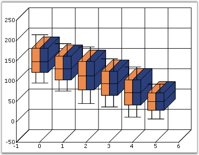
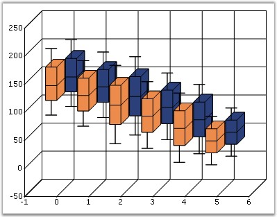
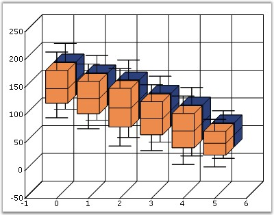

::: {style="DISPLAY: none"}
{#d2h_url_template}{#d2h_package_url style="WIDTH: 0px; DISPLAY: none; HEIGHT: 0px"}
:::

:::: {.d2h_secondary_topic style="PADDING-BOTTOM: 10pt; MARGIN: 0pt; PADDING-LEFT: 0pt; PADDING-RIGHT: 0pt; PADDING-TOP: 0pt"}
#### ColumnDrawMode {#columndrawmode style="tab-stops: 0pt"}

[]{style="FONT-FAMILY: 'Trebuchet MS','sans-serif'; FONT-SIZE: 9pt"} 

Indicates the drawing mode of columns in charts when there are multiple series.

[]{style="FONT-FAMILY: 'Trebuchet MS','sans-serif'; FONT-SIZE: 9pt"} 

::: {align="center"}
+-------------------------------------+--------------------------------------------------------------------------------+
| Details                                                                                                              |
+-------------------------------------+--------------------------------------------------------------------------------+
| Possible Values                     | InDepthMode - Columns from different series are drawn at different depths.     |
|                                     |                                                                                |
|                                     | PlaneMode - Columns from all series are drawn side-by-side.                    |
|                                     |                                                                                |
|                                     | ClusteredMode - Columns from all series are drawn in depth with the same size. |
+-------------------------------------+--------------------------------------------------------------------------------+
| Default Value                       | InDepthMode                                                                    |
+-------------------------------------+--------------------------------------------------------------------------------+
| 2D / 3D Limitations                 | 3D only                                                                        |
+-------------------------------------+--------------------------------------------------------------------------------+
| Applies to Chart Element            | All Series                                                                     |
+-------------------------------------+--------------------------------------------------------------------------------+
| Applies to Chart Types              | Column Chart, ColumnRange Chart,Bar Chart, BoxAndWhisker Chart, Gantt Chart    |
+-------------------------------------+--------------------------------------------------------------------------------+
:::

[]{style="FONT-FAMILY: 'Trebuchet MS','sans-serif'; FONT-SIZE: 9pt"} 

Here is the sample code snippet using **ColumnDrawMode** in Column Chart.

[]{style="FONT-FAMILY: 'Trebuchet MS','sans-serif'; FONT-SIZE: 9pt"} 

+---------------------------------------------------------------------------------------------------------------------------------------------------------------------------------------+
| **[\[C#\]]{style="FONT-FAMILY: 'Courier New'; COLOR: black"}**                                                                                                                        |
|                                                                                                                                                                                       |
| **[]{style="FONT-FAMILY: 'Courier New'; COLOR: black"}**                                                                                                                              |
|                                                                                                                                                                                       |
| [this]{style="FONT-FAMILY: 'Courier New'; COLOR: blue"}[.ChartWebControl1.ColumnDrawMode = [ChartColumnDrawMode]{style="COLOR: teal"}.PlaneMode;]{style="FONT-FAMILY: 'Courier New'"} |
+---------------------------------------------------------------------------------------------------------------------------------------------------------------------------------------+

[]{style="FONT-SIZE: 8pt"} 

+------------------------------------------------------------------------------------------------------------------------------------------------------------------------------------+
| **[\[VB.NET\]]{style="FONT-FAMILY: 'Courier New'; COLOR: black"}**                                                                                                                 |
|                                                                                                                                                                                    |
| **[]{style="FONT-FAMILY: 'Courier New'; COLOR: black"}**                                                                                                                           |
|                                                                                                                                                                                    |
| [Me]{style="FONT-FAMILY: 'Courier New'; COLOR: blue"}[.ChartWebControl1.ColumnDrawMode = [ChartColumnDrawMode]{style="COLOR: teal"}.PlaneMode]{style="FONT-FAMILY: 'Courier New'"} |
+------------------------------------------------------------------------------------------------------------------------------------------------------------------------------------+

[]{style="FONT-FAMILY: 'Courier New'; COLOR: blue"} 

{border="0"}

**[]{style="FONT-FAMILY: 'Trebuchet MS','sans-serif'; FONT-SIZE: 9pt"}** 

Figure 98: ColumnDrawMode set to \"PlaneMode\"

**[]{style="FONT-FAMILY: 'Trebuchet MS','sans-serif'; FONT-SIZE: 9pt"}** 

{border="0"}

**[]{style="FONT-FAMILY: 'Trebuchet MS','sans-serif'; FONT-SIZE: 9pt"}** 

Figure 99: ColumnDrawMode set to \"InDepthMode\"

**[]{style="FONT-FAMILY: 'Trebuchet MS','sans-serif'; FONT-SIZE: 9pt"}** 

{border="0"}

**[]{style="FONT-FAMILY: 'Trebuchet MS','sans-serif'; FONT-SIZE: 9pt"}** 

Figure 100: ColumnDrawMode set to \"ClusteredMode\"

**[]{style="FONT-FAMILY: 'Trebuchet MS','sans-serif'; FONT-SIZE: 9pt"}** 

See Also

**[]{style="FONT-FAMILY: 'Trebuchet MS','sans-serif'; FONT-SIZE: 9pt"}** 

[[Column Chart]{.UGHyperlink}](ms-xhelp:///?Id=07dff027-c96d-450f-9a9b-6037f838f4da)[, ]{.UGHyperlink}[[ColumnRange Chart]{.UGHyperlink}](ms-xhelp:///?Id=f6d7bb1e-6e5a-4165-9dda-eab8aceb7e4d)[, ]{.UGHyperlink}[[Bar Chart]{.UGHyperlink}](ms-xhelp:///?Id=f561904f-bd17-40a3-a1b6-498ed5d46c43)[, ]{.UGHyperlink}[[Box and Whisker Chart]{.UGHyperlink}](ms-xhelp:///?Id=07dff027-c96d-450f-9a9b-6037f838f4da)[, [[Gantt Chart]{style="COLOR: blue"}](ms-xhelp:///?Id=f6d7bb1e-6e5a-4165-9dda-eab8aceb7e4d)]{.UGHyperlink}

[]{#p83} 

[]{#related-topics}
::::
