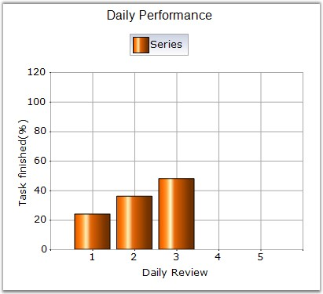

::: {style="DISPLAY: none"}
{#d2h_url_template}{#d2h_package_url style="WIDTH: 0px; DISPLAY: none; HEIGHT: 0px"}
:::

::::: {.d2h_secondary_topic style="PADDING-BOTTOM: 10pt; MARGIN: 0pt; PADDING-LEFT: 0pt; PADDING-RIGHT: 0pt; PADDING-TOP: 0pt"}
#### ColumnFixedWidth {#columnfixedwidth style="tab-stops: 0pt"}

[]{style="COLOR: red; FONT-SIZE: 8pt"} 

Specifies the width of each column when [ColumnWidthMode]{.UGHyperlink} is set to FixedWidthMode.

 

::: {align="center"}
+------------------------------+-------------------------------------------------+
| Details                                                                        |
+------------------------------+-------------------------------------------------+
| **Possible Values**          | An integer value                                |
+------------------------------+-------------------------------------------------+
| **Default Value    **        | **20**                                          |
+------------------------------+-------------------------------------------------+
| **2D / 3D Limitations**      | None                                            |
+------------------------------+-------------------------------------------------+
| **Applies to Chart Element** | All Series                                      |
+------------------------------+-------------------------------------------------+
| **Applies to Chart Types**   | Column Charts, BoxAndWhiskerChart, Candle Chart |
+------------------------------+-------------------------------------------------+
:::

 

Here is some sample code.

 

+--------------------------------------------------------------------------------------------------------------------------------------------------------------------------------------------------------------------+
| **[\[C#\]]{style="FONT-FAMILY: 'Courier New'; COLOR: black"}**                                                                                                                                                     |
|                                                                                                                                                                                                                    |
| **[]{style="FONT-FAMILY: 'Courier New'; COLOR: black"}**                                                                                                                                                           |
|                                                                                                                                                                                                                    |
| [ChartSeries]{style="FONT-FAMILY: 'Courier New'; COLOR: teal"}[ series1 = [new]{style="COLOR: blue"} [ChartSeries]{style="COLOR: teal"}([\"Series\"]{style="COLOR: maroon"});]{style="FONT-FAMILY: 'Courier New'"} |
|                                                                                                                                                                                                                    |
| [series1.Points.Add(1, [new]{style="COLOR: blue"} [double]{style="COLOR: blue"}\[\] { 24});]{style="FONT-FAMILY: 'Courier New'"}                                                                                   |
|                                                                                                                                                                                                                    |
| [series1.Points.Add(2, [new]{style="COLOR: blue"} [double]{style="COLOR: blue"}\[\] { 36});]{style="FONT-FAMILY: 'Courier New'"}                                                                                   |
|                                                                                                                                                                                                                    |
| [series1.Points.Add(3, [new]{style="COLOR: blue"} [double]{style="COLOR: blue"}\[\] { 48});]{style="FONT-FAMILY: 'Courier New'"}                                                                                   |
|                                                                                                                                                                                                                    |
| [chartControl1.Series.Add(series1);]{style="FONT-FAMILY: 'Courier New'"}                                                                                                                                           |
|                                                                                                                                                                                                                    |
| [chartControl1.ColumnWidthMode = [ChartColumnWidthMode]{style="COLOR: teal"}.FixedWidthMode;]{style="FONT-FAMILY: 'Courier New'"}                                                                                  |
|                                                                                                                                                                                                                    |
| [chartControl1.ColumnFixedWidth = 45;]{style="FONT-FAMILY: 'Courier New'"}                                                                                                                                         |
+--------------------------------------------------------------------------------------------------------------------------------------------------------------------------------------------------------------------+

 

+--------------------------------------------------------------------------------------------------------------------------------------------------------------------------------------------------------------------------------------------------+
| **[\[VB.NET\]]{style="FONT-FAMILY: 'Courier New'; COLOR: black"}**                                                                                                                                                                               |
|                                                                                                                                                                                                                                                  |
| **[]{style="FONT-FAMILY: 'Courier New'; COLOR: black"}**                                                                                                                                                                                         |
|                                                                                                                                                                                                                                                  |
| [Dim]{style="FONT-FAMILY: 'Courier New'; COLOR: blue"}[ series1 [As]{style="COLOR: blue"} [ChartSeries]{style="COLOR: teal"} = [New]{style="COLOR: blue"} ChartSeries(\"[Series]{style="COLOR: #993300"}\")]{style="FONT-FAMILY: 'Courier New'"} |
|                                                                                                                                                                                                                                                  |
| [series1.Points.Add(1, [New]{style="COLOR: blue"} [Double]{style="COLOR: blue"}() { 24})]{style="FONT-FAMILY: 'Courier New'"}                                                                                                                    |
|                                                                                                                                                                                                                                                  |
| [series1.Points.Add(2, [New]{style="COLOR: blue"} [Double]{style="COLOR: blue"}() { 36})]{style="FONT-FAMILY: 'Courier New'"}                                                                                                                    |
|                                                                                                                                                                                                                                                  |
| [series1.Points.Add(3, [New]{style="COLOR: blue"} [Double]{style="COLOR: blue"}() { 48})]{style="FONT-FAMILY: 'Courier New'"}                                                                                                                    |
|                                                                                                                                                                                                                                                  |
| [chartControl1.Series.Add(series1) ]{style="FONT-FAMILY: 'Courier New'"}                                                                                                                                                                         |
|                                                                                                                                                                                                                                                  |
| [chartControl1.ColumnWidthMode = ChartColumnWidthMode.FixedWidthMode ]{style="FONT-FAMILY: 'Courier New'"}                                                                                                                                       |
|                                                                                                                                                                                                                                                  |
| [chartControl1.ColumnFixedWidth = 45 ]{style="FONT-FAMILY: 'Courier New'"}                                                                                                                                                                       |
+--------------------------------------------------------------------------------------------------------------------------------------------------------------------------------------------------------------------------------------------------+

**[]{style="COLOR: black; FONT-SIZE: 8pt"}** 

::: {style="BORDER-BOTTOM: windowtext 1pt solid; BORDER-LEFT: medium none; PADDING-BOTTOM: 1pt; MARGIN-TOP: 9pt; PADDING-LEFT: 0pt; PADDING-RIGHT: 0pt; MARGIN-BOTTOM: 9pt; BORDER-TOP: windowtext 1pt solid; BORDER-RIGHT: medium none; PADDING-TOP: 1pt"}
[{border="0"}]{style="COLOR: black; FONT-SIZE: 8pt"}Note: The ColumnFixedWidth property can be overridden by specifying a second y value in the data point. See [ColumnWidthMode]{.UGHyperlink}[ ]{.UGHyperlink}for a sample.
:::

 

{border="0"}

 

Figure 106: ColumnChart with ColumnFixedWidth = \"45\"

 

See Also

 

[Column charts]{.UGHyperlink}, [BoxAndWhiskerChart]{.UGHyperlink}, [ColumnWidthMode]{.UGHyperlink}, [Candle Charts]{.UGHyperlink}[]{style="COLOR: black"}

 

[]{#p83} 

[]{#related-topics}
:::::
