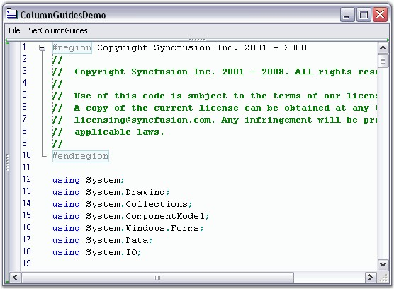

::: {style="DISPLAY: none"}
{#d2h_url_template}{#d2h_package_url style="WIDTH: 0px; DISPLAY: none; HEIGHT: 0px"}
:::

::::: {#nsbanner .d2h_main_nsbanner style="BORDER-BOTTOM: #999999 1px solid; POSITION: relative; PADDING-BOTTOM: 0px; BACKGROUND-COLOR: transparent; PADDING-LEFT: 0px; PADDING-RIGHT: 0px; DISPLAY: none; BORDER-TOP: #999999 1px solid; PADDING-TOP: 0px; LEFT: 0px"}
:::: {#TitleRow .d2h_main_titlerow style="PADDING-BOTTOM: 4px; BACKGROUND-COLOR: transparent; PADDING-LEFT: 22px; WIDTH: 100%; PADDING-RIGHT: 10px; DISPLAY: none; PADDING-TOP: 4px"}
::: {#ienav .d2h_main_ienav style="DISPLAY: none"}
{#D2HPrevious .D2HPreviousEnabled}  {#D2HNext .D2HNextEnabled}
:::
::::
:::::

::::: {#nstext .d2h_main_nstext style="PADDING-BOTTOM: 10px; BACKGROUND-COLOR: transparent; PADDING-LEFT: 22px; PADDING-RIGHT: 10px; HEIGHT: 100%; OVERFLOW: auto; PADDING-TOP: 5px" hasuserbackground="true" valign="bottom"}
::: {#d2h_breadcrumbs .d2h_breadcrumbs}
[Essential Studio User Guide Documentation](ms-xhelp:///?Id=12457748-09e3-4d74-a240-8e049cedf030){.d2h_breadcrumbsNormal}[ \> ]{.d2h_breadcrumbsLinkSeparator}[User Interface Edition](ms-xhelp:///?Id=c29296b7-531c-413b-a0ec-488ca1f7f669){.d2h_breadcrumbsNormal}[ \> ]{.d2h_breadcrumbsLinkSeparator}[Essential Windows](ms-xhelp:///?Id=e60759d8-47a4-4570-9d7a-16a68d63f2ea){.d2h_breadcrumbsNormal}[ \> ]{.d2h_breadcrumbsLinkSeparator}[Essential Edit]{.d2h_breadcrumbsContentsOnly}[ \> ]{.d2h_breadcrumbsLinkSeparator}[Concepts And Features](ms-xhelp:///?Id=7c39cee6-8434-4711-a18e-efaba8ac85c0){.d2h_breadcrumbsNormal}[ \> ]{.d2h_breadcrumbsLinkSeparator}[Text Visualization](ms-xhelp:///?Id=03937960-0195-4ded-b842-e48212f822d3){.d2h_breadcrumbsNormal}
:::

### Column Guides {#column-guides style="tab-stops: 0pt"}

 

Column Guides are used to highlight columns with special meaning. Essential Edit supports unlimited number of column guides.

 

Each column guide can be provided with a custom color and location. This can be done by setting the **ShowColumnGuides** property of the Edit Control to **True**, and then specifying the color and the location of the Column Guides using **ColumnGuideItem Collection Editor**. The font used to calculate the column location is customized by using             **ColumnGuidesMeasuringFont** property.

 

::: {align="center"}
  --------------------------- ----------------------------------------------------------------------------------
  Edit Control Property       Description
  ShowColumnGuides            Gets / sets value that indicates whether column guides should be drawn.
  ColumnGuideItems            Gets / sets array of ColumnGuideItem objects.
  ColumnGuidesMeasuringFont   Gets / sets font that is used while measuring the position of the column guides.
  --------------------------- ----------------------------------------------------------------------------------
:::

[]{style="FONT-FAMILY: 'Trebuchet MS','sans-serif'; COLOR: #15428b; FONT-SIZE: 9pt"} 

+-------------------------------------------------------------------------------------------------------------------------------------------------------------------------------------------------------------------------------------------------------+
| **[\[C#\]]{style="FONT-FAMILY: 'Courier New'; COLOR: black"}**                                                                                                                                                                                        |
|                                                                                                                                                                                                                                                       |
| []{style="FONT-FAMILY: 'Courier New'; COLOR: black"}                                                                                                                                                                                                  |
|                                                                                                                                                                                                                                                       |
| [// Enable Column Guides.]{style="FONT-FAMILY: 'Courier New'; COLOR: green"}                                                                                                                                                                          |
|                                                                                                                                                                                                                                                       |
| [this]{style="FONT-FAMILY: 'Courier New'; COLOR: blue"}[.editControl1.ShowColumnGuides = [true]{style="COLOR: blue"};]{style="FONT-FAMILY: 'Courier New'"}                                                                                            |
|                                                                                                                                                                                                                                                       |
| []{style="FONT-FAMILY: 'Courier New'"}                                                                                                                                                                                                                |
|                                                                                                                                                                                                                                                       |
| [// Specify the color and the location of the Column Guides.]{style="FONT-FAMILY: 'Courier New'; COLOR: green"}                                                                                                                                       |
|                                                                                                                                                                                                                                                       |
| [ColumnGuideItem\[\] columnGuideItem = [new]{style="COLOR: blue"} ColumnGuideItem\[2\];]{style="FONT-FAMILY: 'Courier New'"}                                                                                                                          |
|                                                                                                                                                                                                                                                       |
| [columnGuideItem\[0\] = [new]{style="COLOR: blue"} ColumnGuideItem(20, [Color]{style="COLOR: teal"}.Yellow);]{style="FONT-FAMILY: 'Courier New'"}                                                                                                     |
|                                                                                                                                                                                                                                                       |
| [columnGuideItem\[1\] = [new]{style="COLOR: blue"} ColumnGuideItem(40, [Color]{style="COLOR: teal"}.IndianRed);]{style="FONT-FAMILY: 'Courier New'"}                                                                                                  |
|                                                                                                                                                                                                                                                       |
| [this]{style="FONT-FAMILY: 'Courier New'; COLOR: blue"}[.editControl1.ColumnGuideItems = columnGuideItem;]{style="FONT-FAMILY: 'Courier New'"}                                                                                                        |
|                                                                                                                                                                                                                                                       |
| []{style="FONT-FAMILY: 'Courier New'"}                                                                                                                                                                                                                |
|                                                                                                                                                                                                                                                       |
| [// Font used to calculate the column location.]{style="FONT-FAMILY: 'Courier New'; COLOR: green"}                                                                                                                                                    |
|                                                                                                                                                                                                                                                       |
| [this]{style="FONT-FAMILY: 'Courier New'; COLOR: blue"}[.editControl1.ColumnGuidesMeasuringFont = [new]{style="COLOR: blue"} [Font]{style="COLOR: teal"}([\"Microsoft Sans Serif\"]{style="COLOR: maroon"}, 12);]{style="FONT-FAMILY: 'Courier New'"} |
+-------------------------------------------------------------------------------------------------------------------------------------------------------------------------------------------------------------------------------------------------------+

[]{style="FONT-FAMILY: 'Trebuchet MS','sans-serif'; COLOR: #15428b; FONT-SIZE: 9pt"} 

+----------------------------------------------------------------------------------------------------------------------------------------------------------------------------------------------------------------------------+
| **[\[VB.NET\]]{style="FONT-FAMILY: 'Courier New'; COLOR: black"}**                                                                                                                                                         |
|                                                                                                                                                                                                                            |
| []{style="FONT-FAMILY: 'Courier New'; COLOR: black"}                                                                                                                                                                       |
|                                                                                                                                                                                                                            |
| [\' Enable Column Guides.]{style="FONT-FAMILY: 'Courier New'; COLOR: green"}                                                                                                                                               |
|                                                                                                                                                                                                                            |
| [Me]{style="FONT-FAMILY: 'Courier New'; COLOR: blue"}[.editControl1.ShowColumnGuides = [True]{style="COLOR: blue"}]{style="FONT-FAMILY: 'Courier New'"}                                                                    |
|                                                                                                                                                                                                                            |
| []{style="FONT-FAMILY: 'Courier New'; COLOR: blue"}                                                                                                                                                                        |
|                                                                                                                                                                                                                            |
| [\' Specify the color and the location of the Column Guides.]{style="FONT-FAMILY: 'Courier New'; COLOR: green"}                                                                                                            |
|                                                                                                                                                                                                                            |
| [Dim]{style="FONT-FAMILY: 'Courier New'; COLOR: blue"}[ columnGuideItem() [As]{style="COLOR: blue"} ColumnGuideItem = [New]{style="COLOR: blue"} ColumnGuideItem(2)]{style="FONT-FAMILY: 'Courier New'"}                   |
|                                                                                                                                                                                                                            |
| [columnGuideItem(0) = [New]{style="COLOR: blue"} ColumnGuideItem(20, Color.Yellow)]{style="FONT-FAMILY: 'Courier New'"}                                                                                                    |
|                                                                                                                                                                                                                            |
| [columnGuideItem(1) = [New]{style="COLOR: blue"} ColumnGuideItem(40, Color.IndianRed) ]{style="FONT-FAMILY: 'Courier New'"}                                                                                                |
|                                                                                                                                                                                                                            |
| [Me]{style="FONT-FAMILY: 'Courier New'; COLOR: blue"}[.editControl1.ColumnGuideItems = columnGuideItem]{style="FONT-FAMILY: 'Courier New'"}                                                                                |
|                                                                                                                                                                                                                            |
| []{style="FONT-FAMILY: 'Courier New'"}                                                                                                                                                                                     |
|                                                                                                                                                                                                                            |
| [\' Font used to calculate the column location.]{style="FONT-FAMILY: 'Courier New'; COLOR: green"}                                                                                                                         |
|                                                                                                                                                                                                                            |
| [Me]{style="FONT-FAMILY: 'Courier New'; COLOR: blue"}[.editControl1.ColumnGuidesMeasuringFont = [New]{style="COLOR: blue"} Font([\"Microsoft Sans Serif\"]{style="COLOR: maroon"},12)]{style="FONT-FAMILY: 'Courier New'"} |
+----------------------------------------------------------------------------------------------------------------------------------------------------------------------------------------------------------------------------+

[]{style="FONT-FAMILY: 'Trebuchet MS','sans-serif'; COLOR: #15428b; FONT-SIZE: 9pt"} 

{border="0"}

Figure 16: Customized Column Guide Items positioned at Equal Intervals

 

A sample which illustrates the above feature is available in the following sample installation path.

 

***..\\My Documents\\Syncfusion\\EssentialStudio\\Version Number\\Windows\\Edit.Windows\\Samples\\2.0\\Advanced Editor Functions\\ColumnGuidesDemo***

[]{#p35} 

[]{#related-topics}
:::::
