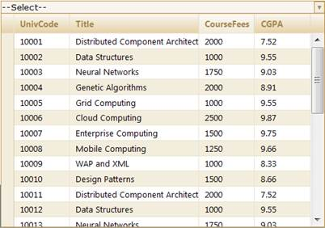

::: {style="DISPLAY: none"}
{#d2h_url_template}{#d2h_package_url style="WIDTH: 0px; DISPLAY: none; HEIGHT: 0px"}
:::

::::: {#nsbanner .d2h_main_nsbanner style="BORDER-BOTTOM: #999999 1px solid; POSITION: relative; PADDING-BOTTOM: 0px; BACKGROUND-COLOR: transparent; PADDING-LEFT: 0px; PADDING-RIGHT: 0px; DISPLAY: none; BORDER-TOP: #999999 1px solid; PADDING-TOP: 0px; LEFT: 0px"}
:::: {#TitleRow .d2h_main_titlerow style="PADDING-BOTTOM: 4px; BACKGROUND-COLOR: transparent; PADDING-LEFT: 22px; WIDTH: 100%; PADDING-RIGHT: 10px; DISPLAY: none; PADDING-TOP: 4px"}
::: {#ienav .d2h_main_ienav style="DISPLAY: none"}
{#D2HPrevious .D2HPreviousEnabled}  {#D2HNext .D2HNextEnabled}
:::
::::
:::::

::::: {#nstext .d2h_main_nstext style="PADDING-BOTTOM: 10px; BACKGROUND-COLOR: transparent; PADDING-LEFT: 22px; PADDING-RIGHT: 10px; HEIGHT: 100%; OVERFLOW: auto; PADDING-TOP: 5px" hasuserbackground="true" valign="bottom"}
::: {#d2h_breadcrumbs .d2h_breadcrumbs}
[Essential Studio User Guide Documentation](ms-xhelp:///?Id=12457748-09e3-4d74-a240-8e049cedf030){.d2h_breadcrumbsNormal}[ \> ]{.d2h_breadcrumbsLinkSeparator}[User Interface Edition](ms-xhelp:///?Id=c29296b7-531c-413b-a0ec-488ca1f7f669){.d2h_breadcrumbsNormal}[ \> ]{.d2h_breadcrumbsLinkSeparator}[Essential ASP.NET MVC](ms-xhelp:///?Id=4b14e7d1-65c4-4f67-b1aa-2c37709905a5){.d2h_breadcrumbsNormal}[ \> ]{.d2h_breadcrumbsLinkSeparator}[Essential Grid]{.d2h_breadcrumbsContentsOnly}[ \> ]{.d2h_breadcrumbsLinkSeparator}[Getting Started](ms-xhelp:///?Id=c7ed3902-b25b-4170-be58-1d3d0b57748a){.d2h_breadcrumbsNormal}[ \> ]{.d2h_breadcrumbsLinkSeparator}[Feature Summary](ms-xhelp:///?Id=1923e679-441a-44e0-9bca-e0e50988a857){.d2h_breadcrumbsNormal}[ \> ]{.d2h_breadcrumbsLinkSeparator}[Concepts and Features](ms-xhelp:///?Id=4a1657fa-4756-42b9-9153-aebf5dcfc503){.d2h_breadcrumbsNormal}[ \> ]{.d2h_breadcrumbsLinkSeparator}[MultiColumnDropDown](ms-xhelp:///?Id=cf0e6254-8964-4a67-b141-e26bc6e4f04a){.d2h_breadcrumbsNormal}
:::

### Column Mapping {#column-mapping style="tab-stops: 0pt"}

The **MultiColumnDropDown** control also supports column mapping. Column mapping also includes setting the header text of the column, visibility of the column, width of the column, enabling and disabling sorting, formatting the text, and so on.

 

Use Case Scenarios

Column mapping allows you to filter columns in the bound table so that you can choose the columns that need to be displayed.

 

Column mapping can be performed in two ways:

[·      ]{style="FONT-FAMILY: Symbol"}Using Builder

[·      ]{style="FONT-FAMILY: Symbol"}Using MultiColumnDropDownModel

 

Through Builder

To perform column mapping using **Builder**:

Create a model in the application. Refer to [[Getting Started\>]{style="COLOR: blue"}]{.underline}[[Adding a Model to the Application]{style="COLOR: blue"}]{.underline}[.]{style="COLOR: windowtext"}

Create a strongly typed view. Refer to [[How to\>]{style="COLOR: blue"}]{.underline}[[Strongly Typed View]{style="COLOR: blue"}]{.underline}.

In the view, use the **Model** property **Datasource()** to bind the data source.

Map the columns using the **Columns** method and **Add** method and set the **HeaderText**, **Format**, **AllowSorting**, **Width**, and **Visible**, and so on.

 

+----------------------------------------------------------------------------------------------------------------------------------------------------------------------------------------------------------------------------------------------------------------------------------------------------------------------------------------------------------------------------------------------------------------------+
| **[View ]{style="FONT-FAMILY: 'Courier New'"}[\[ASPX\]]{style="FONT-FAMILY: 'Courier New'"}**                                                                                                                                                                                                                                                                                                                        |
|                                                                                                                                                                                                                                                                                                                                                                                                                      |
| [\<%]{style="FONT-FAMILY: Consolas; BACKGROUND: yellow; FONT-SIZE: 9.5pt"}[=]{style="FONT-FAMILY: Consolas; COLOR: blue; FONT-SIZE: 9.5pt"}[Html.]{style="FONT-FAMILY: Consolas; FONT-SIZE: 9.5pt"}[Syncfusion().]{style="FONT-FAMILY: 'Courier New'"}[MultiColumnDropDown\<[Student]{style="COLOR: #2b91af"}\>([\"MultiColumnDropDown\"]{style="COLOR: #a31515"})]{style="FONT-FAMILY: Consolas; FONT-SIZE: 9.5pt"} |
|                                                                                                                                                                                                                                                                                                                                                                                                                      |
| [                .Datasource(Model)]{style="FONT-FAMILY: Consolas; FONT-SIZE: 9.5pt"}                                                                                                                                                                                                                                                                                                                                |
|                                                                                                                                                                                                                                                                                                                                                                                                                      |
| [                .DisplayExpression(new int\[\] { 0,1,3 })]{style="FONT-FAMILY: Consolas; FONT-SIZE: 9.5pt"}                                                                                                                                                                                                                                                                                                         |
|                                                                                                                                                                                                                                                                                                                                                                                                                      |
| [                .AllowSorting(true)     ]{style="FONT-FAMILY: Consolas; FONT-SIZE: 9.5pt"}                                                                                                                                                                                                                                                                                                                          |
|                                                                                                                                                                                                                                                                                                                                                                                                                      |
| [                .Columns(col =\> {]{style="FONT-FAMILY: Consolas; FONT-SIZE: 9.5pt"}                                                                                                                                                                                                                                                                                                                                |
|                                                                                                                                                                                                                                                                                                                                                                                                                      |
| [                    col.Add(m =\> m.UniversityCode).HeaderText(["UnivCode"]{style="COLOR: #a31515"});]{style="FONT-FAMILY: Consolas; FONT-SIZE: 9.5pt"}                                                                                                                                                                                                                                                             |
|                                                                                                                                                                                                                                                                                                                                                                                                                      |
| [                    col.Add(m =\> m.Title).Width(150);]{style="FONT-FAMILY: Consolas; FONT-SIZE: 9.5pt"}                                                                                                                                                                                                                                                                                                            |
|                                                                                                                                                                                                                                                                                                                                                                                                                      |
| [                    col.Add(m =\> m.CourseFees).AllowSorting(false);]{style="FONT-FAMILY: Consolas; FONT-SIZE: 9.5pt"}                                                                                                                                                                                                                                                                                              |
|                                                                                                                                                                                                                                                                                                                                                                                                                      |
| [                    col.Add(m =\> m.CGPA);    ]{style="FONT-FAMILY: Consolas; FONT-SIZE: 9.5pt"}                                                                                                                                                                                                                                                                                                                    |
|                                                                                                                                                                                                                                                                                                                                                                                                                      |
| [                })]{style="FONT-FAMILY: Consolas; FONT-SIZE: 9.5pt"}                                                                                                                                                                                                                                                                                                                                                |
|                                                                                                                                                                                                                                                                                                                                                                                                                      |
| [%\>]{style="FONT-FAMILY: Consolas; BACKGROUND: yellow; FONT-SIZE: 9.5pt"}                                                                                                                                                                                                                                                                                                                                           |
+----------------------------------------------------------------------------------------------------------------------------------------------------------------------------------------------------------------------------------------------------------------------------------------------------------------------------------------------------------------------------------------------------------------------+

 

 

+----------------------------------------------------------------------------------------------------------------------------------------------------------------------------------------------------------------------------------------------------------------------------------------------------------------------------------------------------------------------------------------------------------------------------------------------------------------------------------------------------------------+
| **[View \[cshtml\]]{style="FONT-FAMILY: 'Courier New'"}**                                                                                                                                                                                                                                                                                                                                                                                                                                                      |
|                                                                                                                                                                                                                                                                                                                                                                                                                                                                                                                |
| [@(]{style="FONT-FAMILY: Consolas; BACKGROUND: yellow; FONT-SIZE: 9.5pt"}[new]{style="FONT-FAMILY: Consolas; COLOR: blue; FONT-SIZE: 9.5pt"}[ [HtmlString]{style="COLOR: #2b91af"}(]{style="FONT-FAMILY: Consolas; FONT-SIZE: 9.5pt"}[Html.]{style="FONT-FAMILY: Consolas; FONT-SIZE: 9.5pt"}[Syncfusion().]{style="FONT-FAMILY: 'Courier New'"}[MultiColumnDropDown\<[Student]{style="COLOR: #2b91af"}\>([\"MultiColumnDropDown\"]{style="COLOR: #a31515"})]{style="FONT-FAMILY: Consolas; FONT-SIZE: 9.5pt"} |
|                                                                                                                                                                                                                                                                                                                                                                                                                                                                                                                |
| [                .Datasource(Model)]{style="FONT-FAMILY: Consolas; FONT-SIZE: 9.5pt"}                                                                                                                                                                                                                                                                                                                                                                                                                          |
|                                                                                                                                                                                                                                                                                                                                                                                                                                                                                                                |
| [                .DisplayExpression(new int\[\] { 0,1,3 })]{style="FONT-FAMILY: Consolas; FONT-SIZE: 9.5pt"}                                                                                                                                                                                                                                                                                                                                                                                                   |
|                                                                                                                                                                                                                                                                                                                                                                                                                                                                                                                |
| [                .AllowSorting(true)     ]{style="FONT-FAMILY: Consolas; FONT-SIZE: 9.5pt"}                                                                                                                                                                                                                                                                                                                                                                                                                    |
|                                                                                                                                                                                                                                                                                                                                                                                                                                                                                                                |
| [                .Columns(col =\> {]{style="FONT-FAMILY: Consolas; FONT-SIZE: 9.5pt"}                                                                                                                                                                                                                                                                                                                                                                                                                          |
|                                                                                                                                                                                                                                                                                                                                                                                                                                                                                                                |
| [                    col.Add(m =\> m.UniversityCode).HeaderText(["UnivCode"]{style="COLOR: #a31515"});]{style="FONT-FAMILY: Consolas; FONT-SIZE: 9.5pt"}                                                                                                                                                                                                                                                                                                                                                       |
|                                                                                                                                                                                                                                                                                                                                                                                                                                                                                                                |
| [                    col.Add(m =\> m.Title).Width(150);]{style="FONT-FAMILY: Consolas; FONT-SIZE: 9.5pt"}                                                                                                                                                                                                                                                                                                                                                                                                      |
|                                                                                                                                                                                                                                                                                                                                                                                                                                                                                                                |
| [                    col.Add(m =\> m.CourseFees).AllowSorting(false);]{style="FONT-FAMILY: Consolas; FONT-SIZE: 9.5pt"}                                                                                                                                                                                                                                                                                                                                                                                        |
|                                                                                                                                                                                                                                                                                                                                                                                                                                                                                                                |
| [                    col.Add(m =\> m.CGPA);       ]{style="FONT-FAMILY: Consolas; FONT-SIZE: 9.5pt"}                                                                                                                                                                                                                                                                                                                                                                                                           |
|                                                                                                                                                                                                                                                                                                                                                                                                                                                                                                                |
| [  })]{style="FONT-FAMILY: Consolas; FONT-SIZE: 9.5pt"}                                                                                                                                                                                                                                                                                                                                                                                                                                                        |
|                                                                                                                                                                                                                                                                                                                                                                                                                                                                                                                |
| [.ToString())[)]{style="BACKGROUND: yellow"}]{style="FONT-FAMILY: Consolas; FONT-SIZE: 9.5pt"}**[]{style="FONT-FAMILY: 'Courier New'; BACKGROUND: yellow"}**                                                                                                                                                                                                                                                                                                                                                   |
|                                                                                                                                                                                                                                                                                                                                                                                                                                                                                                                |
| []{style="FONT-FAMILY: 'Courier New'"}                                                                                                                                                                                                                                                                                                                                                                                                                                                                         |
+----------------------------------------------------------------------------------------------------------------------------------------------------------------------------------------------------------------------------------------------------------------------------------------------------------------------------------------------------------------------------------------------------------------------------------------------------------------------------------------------------------------+

 

Set its data source and render the view.

[]{style="FONT-FAMILY: 'Calibri','sans-serif'; COLOR: black"} 

+-----------------------------------------------------------------------------------------------------------------------------------------------------------------------------------------------------------------------------------------------+
| **[Controller]{style="FONT-FAMILY: 'Courier New'"}[]{style="FONT-FAMILY: 'Courier New'"}**                                                                                                                                                    |
|                                                                                                                                                                                                                                               |
| []{style="FONT-FAMILY: 'Courier New'"}                                                                                                                                                                                                        |
|                                                                                                                                                                                                                                               |
| [ [///]{style="COLOR: gray"}[ ]{style="COLOR: green"}[\<summary\>]{style="COLOR: gray"}]{style="FONT-FAMILY: 'Courier New'"}                                                                                                                  |
|                                                                                                                                                                                                                                               |
| [       [///]{style="COLOR: gray"}[ Used for rendering the MultiColumnDropDown initially.]{style="COLOR: green"}]{style="FONT-FAMILY: 'Courier New'"}                                                                                         |
|                                                                                                                                                                                                                                               |
| [       [///]{style="COLOR: gray"}[ ]{style="COLOR: green"}[\</summary\>]{style="COLOR: gray"}]{style="FONT-FAMILY: 'Courier New'"}                                                                                                           |
|                                                                                                                                                                                                                                               |
| [       [///]{style="COLOR: gray"}[ ]{style="COLOR: green"}[\<returns\>]{style="COLOR: gray"}[View page; it displays the  MultiColumnDropDown.]{style="COLOR: green"}[\</returns\>]{style="COLOR: gray"}]{style="FONT-FAMILY: 'Courier New'"} |
|                                                                                                                                                                                                                                               |
| [       [public]{style="COLOR: blue"} [ActionResult]{style="COLOR: #2b91af"} Index()]{style="FONT-FAMILY: 'Courier New'"}                                                                                                                     |
|                                                                                                                                                                                                                                               |
| [       {]{style="FONT-FAMILY: 'Courier New'"}                                                                                                                                                                                                |
|                                                                                                                                                                                                                                               |
| []{style="FONT-FAMILY: 'Courier New'"}                                                                                                                                                                                                        |
|                                                                                                                                                                                                                                               |
| [            [var]{style="COLOR: blue"} Data = [new]{style="COLOR: blue"} [StudentDataContext]{style="COLOR: #2b91af"}().AutoFormatStudent.Take(200);]{style="FONT-FAMILY: 'Courier New'"}                                                    |
|                                                                                                                                                                                                                                               |
| [           [return]{style="COLOR: blue"} View(Data);   ]{style="FONT-FAMILY: 'Courier New'"}                                                                                                                                                 |
|                                                                                                                                                                                                                                               |
| [       }]{style="FONT-FAMILY: 'Courier New'"}                                                                                                                                                                                                |
+-----------------------------------------------------------------------------------------------------------------------------------------------------------------------------------------------------------------------------------------------+

[]{style="FONT-FAMILY: 'Calibri','sans-serif'; COLOR: black"} 

 

In order to work with sorting actions, create a **Post** method for **Index** actions and bind the data source to the grid as shown in the following code sample.

 

+-----------------------------------------------------------------------------------------------------------------------------------------------------------------------------------------------+
| **[Controller]{style="FONT-FAMILY: 'Courier New'"}[]{style="FONT-FAMILY: 'Courier New'"}**                                                                                                    |
|                                                                                                                                                                                               |
| []{style="FONT-FAMILY: 'Courier New'"}                                                                                                                                                        |
|                                                                                                                                                                                               |
| [        \[[AcceptVerbs]{style="COLOR: #2b91af"}([HttpVerbs]{style="COLOR: #2b91af"}.Post)\]]{style="FONT-FAMILY: 'Courier New'"}                                                             |
|                                                                                                                                                                                               |
| [        [public]{style="COLOR: blue"} [ActionResult]{style="COLOR: #2b91af"} Index([PagingParams]{style="COLOR: #2b91af"} args)]{style="FONT-FAMILY: 'Courier New'"}                         |
|                                                                                                                                                                                               |
| [        {]{style="FONT-FAMILY: 'Courier New'"}                                                                                                                                               |
|                                                                                                                                                                                               |
| []{style="FONT-FAMILY: 'Courier New'"}                                                                                                                                                        |
|                                                                                                                                                                                               |
| [                [var]{style="COLOR: blue"} Data = [new]{style="COLOR: blue"} [StudentDataContext]{style="COLOR: #2b91af"}().AutoFormatStudent.Take(20);]{style="FONT-FAMILY: 'Courier New'"} |
|                                                                                                                                                                                               |
| [                [return]{style="COLOR: blue"} Data.GridActions\<[Student]{style="COLOR: #2b91af"}\>();          ]{style="FONT-FAMILY: 'Courier New'"}                                        |
|                                                                                                                                                                                               |
| [        }]{style="FONT-FAMILY: 'Courier New'"}                                                                                                                                               |
+-----------------------------------------------------------------------------------------------------------------------------------------------------------------------------------------------+

 

Run the application. The **MultiColumnDropDown** will appear as shown in the following screenshot.

 

 

{border="0"}

Figure 318: MultiColumnDropDown with HeaderText "UnivCode" and the Width of the Title Column Set to 150px

 

Through MultiColumnDropDownModel

To perform column mapping using **MultiColumnDropDownModel**:

 

Create a model in the application. Refer to [[Getting Started\>]{style="COLOR: blue"}]{.underline}[[Adding a Model to the Application]{style="COLOR: blue"}]{.underline}.

Add the following code[ in the **Index.aspx** file to create the **MultiColumnDropDown** control in the view.]{style="COLOR: black"}

+------------------------------------------------------------------------------------------------------------------------------------------------------------------------------------------------------------------------------------------------------------------------------------------------------------------------------------------------------------------------+
| **[View \[ASPX\]]{style="FONT-FAMILY: 'Courier New'"}**                                                                                                                                                                                                                                                                                                                |
|                                                                                                                                                                                                                                                                                                                                                                        |
| [\<%]{style="FONT-FAMILY: 'Courier New'; BACKGROUND: yellow"}[=]{style="FONT-FAMILY: 'Courier New'; COLOR: blue"}[ Html.Syncfusion().MultiColumnDropDown\<MvcSampleApplication.Models.[Student]{style="COLOR: #2b91af"}\>([\"MulticolumnControl1\"]{style="COLOR: #a31515"}, [\"DropDownModel\"]{style="COLOR: #a31515"}, col =\>]{style="FONT-FAMILY: 'Courier New'"} |
|                                                                                                                                                                                                                                                                                                                                                                        |
| [{]{style="FONT-FAMILY: 'Courier New'"}                                                                                                                                                                                                                                                                                                                                |
|                                                                                                                                                                                                                                                                                                                                                                        |
| [    col.Add(m =\> m.UniversityCode).HeaderText([\"UnivCode\"]{style="COLOR: #a31515"});]{style="FONT-FAMILY: 'Courier New'"}                                                                                                                                                                                                                                          |
|                                                                                                                                                                                                                                                                                                                                                                        |
| [    col.Add(m =\> m.Title).Width(150);]{style="FONT-FAMILY: 'Courier New'"}                                                                                                                                                                                                                                                                                           |
|                                                                                                                                                                                                                                                                                                                                                                        |
| [    col.Add(m =\> m.CourseFees).AllowSorting([false]{style="COLOR: blue"});]{style="FONT-FAMILY: 'Courier New'"}                                                                                                                                                                                                                                                      |
|                                                                                                                                                                                                                                                                                                                                                                        |
| [    col.Add(m =\> m.CGPA);]{style="FONT-FAMILY: 'Courier New'"}                                                                                                                                                                                                                                                                                                       |
|                                                                                                                                                                                                                                                                                                                                                                        |
| []{style="FONT-FAMILY: 'Courier New'"}                                                                                                                                                                                                                                                                                                                                 |
|                                                                                                                                                                                                                                                                                                                                                                        |
| [})[%\>]{style="BACKGROUND: yellow"}]{style="FONT-FAMILY: 'Courier New'"}                                                                                                                                                                                                                                                                                              |
+------------------------------------------------------------------------------------------------------------------------------------------------------------------------------------------------------------------------------------------------------------------------------------------------------------------------------------------------------------------------+

[  ]{style="FONT-FAMILY: Consolas; FONT-SIZE: 9.5pt"}      

 

 

 

+-------------------------------------------------------------------------------------------------------------------------------------------------------------------------------------------------------------------------------------------------------------------------------------------------------------------------------------------------------------------------------------------------------------------------------------------------------------------------------------------+
| **[View \[cshtml\]]{style="FONT-FAMILY: 'Courier New'"}**                                                                                                                                                                                                                                                                                                                                                                                                                                 |
|                                                                                                                                                                                                                                                                                                                                                                                                                                                                                           |
| [@(]{style="FONT-FAMILY: Consolas; BACKGROUND: yellow; FONT-SIZE: 9.5pt"}[new]{style="FONT-FAMILY: Consolas; COLOR: blue; FONT-SIZE: 9.5pt"}[ [HtmlString]{style="COLOR: #2b91af"}(]{style="FONT-FAMILY: Consolas; FONT-SIZE: 9.5pt"}[Html.Syncfusion().MultiColumnDropDown\<MvcSampleApplication.Models.[Student]{style="COLOR: #2b91af"}\>([\"MulticolumnControl1\"]{style="COLOR: #a31515"}, [\"DropDownModel\"]{style="COLOR: #a31515"}, col =\>]{style="FONT-FAMILY: 'Courier New'"} |
|                                                                                                                                                                                                                                                                                                                                                                                                                                                                                           |
| [{]{style="FONT-FAMILY: 'Courier New'"}                                                                                                                                                                                                                                                                                                                                                                                                                                                   |
|                                                                                                                                                                                                                                                                                                                                                                                                                                                                                           |
| [    col.Add(m =\> m.UniversityCode).HeaderText([\"UnivCode\"]{style="COLOR: #a31515"});]{style="FONT-FAMILY: 'Courier New'"}                                                                                                                                                                                                                                                                                                                                                             |
|                                                                                                                                                                                                                                                                                                                                                                                                                                                                                           |
| [    col.Add(m =\> m.Title).Width(150);]{style="FONT-FAMILY: 'Courier New'"}                                                                                                                                                                                                                                                                                                                                                                                                              |
|                                                                                                                                                                                                                                                                                                                                                                                                                                                                                           |
| [    col.Add(m =\> m.CourseFees).AllowSorting([false]{style="COLOR: blue"});]{style="FONT-FAMILY: 'Courier New'"}                                                                                                                                                                                                                                                                                                                                                                         |
|                                                                                                                                                                                                                                                                                                                                                                                                                                                                                           |
| [    col.Add(m =\> m.CGPA);]{style="FONT-FAMILY: 'Courier New'"}                                                                                                                                                                                                                                                                                                                                                                                                                          |
|                                                                                                                                                                                                                                                                                                                                                                                                                                                                                           |
| [})]{style="FONT-FAMILY: 'Courier New'"}[]{style="FONT-FAMILY: Consolas; FONT-SIZE: 9.5pt"}                                                                                                                                                                                                                                                                                                                                                                                               |
|                                                                                                                                                                                                                                                                                                                                                                                                                                                                                           |
| [.ToString())[)]{style="BACKGROUND: yellow"}]{style="FONT-FAMILY: Consolas; FONT-SIZE: 9.5pt"}**[]{style="FONT-FAMILY: 'Courier New'; BACKGROUND: yellow"}**                                                                                                                                                                                                                                                                                                                              |
|                                                                                                                                                                                                                                                                                                                                                                                                                                                                                           |
| []{style="FONT-FAMILY: 'Courier New'"}                                                                                                                                                                                                                                                                                                                                                                                                                                                    |
+-------------------------------------------------------------------------------------------------------------------------------------------------------------------------------------------------------------------------------------------------------------------------------------------------------------------------------------------------------------------------------------------------------------------------------------------------------------------------------------------+

 

Create a **MultiColumnDropDownModel** in **Index** action. Assign **MultiColumnDropDown** properties in this model and pass the model from the controller to the view using **ViewData** class as in step 6.

Set the **DataSource** and **DisplayExpression** as shown in the following code sample.

 

+----------------------------------------------------------------------------------------------------------------------------------------------------------------------------------------------------------------------------+
| **[Controller]{style="FONT-FAMILY: 'Courier New'"}[]{style="FONT-FAMILY: 'Courier New'"}**                                                                                                                                 |
|                                                                                                                                                                                                                            |
| [        AcceptVerbs]{style="FONT-FAMILY: 'Courier New'; COLOR: #2b91af"}[([HttpVerbs]{style="COLOR: #2b91af"}.Post)\]]{style="FONT-FAMILY: 'Courier New'"}                                                                |
|                                                                                                                                                                                                                            |
| [        [public]{style="COLOR: blue"} [ActionResult]{style="COLOR: #2b91af"} Index([MultiColumnDropDownModel]{style="COLOR: #2b91af"}\<[Student]{style="COLOR: #2b91af"}\> dropdown)]{style="FONT-FAMILY: 'Courier New'"} |
|                                                                                                                                                                                                                            |
| [        {]{style="FONT-FAMILY: 'Courier New'"}**[]{style="FONT-FAMILY: 'Courier New'"}**                                                                                                                                  |
|                                                                                                                                                                                                                            |
| [                dropdown.DataSource = [new]{style="COLOR: blue"} [StudentDataContext]{style="COLOR: #2b91af"}().AutoFormatStudent.Take(30);]{style="FONT-FAMILY: 'Courier New'"}                                          |
|                                                                                                                                                                                                                            |
| [                dropdown.DisplayExpression = [new]{style="COLOR: blue"} [int]{style="COLOR: blue"}\[2\] { 2, 3 };              ]{style="FONT-FAMILY: 'Courier New'"}                                                      |
|                                                                                                                                                                                                                            |
| [                ViewData\[[\"DropDownModel\"]{style="COLOR: #a31515"}\] = dropdown;]{style="FONT-FAMILY: 'Courier New'"}                                                                                                  |
|                                                                                                                                                                                                                            |
| []{style="FONT-FAMILY: 'Courier New'"}                                                                                                                                                                                     |
|                                                                                                                                                                                                                            |
| [                [return]{style="COLOR: blue"} PartialView([\"MultiColumnDropDownPartialView\"]{style="COLOR: #a31515"});]{style="FONT-FAMILY: 'Courier New'"}                                                             |
|                                                                                                                                                                                                                            |
| [        }]{style="FONT-FAMILY: 'Courier New'"}                                                                                                                                                                            |
+----------------------------------------------------------------------------------------------------------------------------------------------------------------------------------------------------------------------------+

         

In order to work with sorting actions, create a **Post** method for **Index** actions and bind the data source to **MultiColumnDropDown** as shown in the following code.

 

+----------------------------------------------------------------------------------------------------------------------------------------------------------------------------------------------------------------------------------------------------------------------------------------------+
| **[Controller]{style="FONT-FAMILY: 'Courier New'"}[]{style="FONT-FAMILY: 'Courier New'"}**                                                                                                                                                                                                   |
|                                                                                                                                                                                                                                                                                              |
| []{style="FONT-FAMILY: 'Courier New'"}                                                                                                                                                                                                                                                       |
|                                                                                                                                                                                                                                                                                              |
| [        \[[AcceptVerbs]{style="COLOR: #2b91af"}([HttpVerbs]{style="COLOR: #2b91af"}.Post)\]]{style="FONT-FAMILY: 'Courier New'"}                                                                                                                                                            |
|                                                                                                                                                                                                                                                                                              |
| [        [public]{style="COLOR: blue"} [ActionResult]{style="COLOR: #2b91af"} ]{style="FONT-FAMILY: 'Courier New'"}[Index]{style="FONT-FAMILY: 'Courier New'"}[ ([PagingParams]{style="COLOR: #2b91af"} args)]{style="FONT-FAMILY: 'Courier New'"}                                           |
|                                                                                                                                                                                                                                                                                              |
| [        {]{style="FONT-FAMILY: 'Courier New'"}                                                                                                                                                                                                                                              |
|                                                                                                                                                                                                                                                                                              |
| [       [IEnumerable]{style="COLOR: #2b91af"} data =]{style="FONT-FAMILY: 'Courier New'"}[new ]{style="FONT-FAMILY: 'Courier New'; COLOR: blue"}[StudentDataContext]{style="FONT-FAMILY: 'Courier New'; COLOR: #2b91af"}[().AutoFormatStudent.Take(20);]{style="FONT-FAMILY: 'Courier New'"} |
|                                                                                                                                                                                                                                                                                              |
| [       [return]{style="COLOR: blue"} data.GridActions\<[Student]{style="COLOR: #2b91af"}\>();]{style="FONT-FAMILY: 'Courier New'"}                                                                                                                                                          |
|                                                                                                                                                                                                                                                                                              |
| [        }]{style="FONT-FAMILY: 'Courier New'"}                                                                                                                                                                                                                                              |
+----------------------------------------------------------------------------------------------------------------------------------------------------------------------------------------------------------------------------------------------------------------------------------------------+

***[]{style="COLOR: #4f81bd"}*** 

         

Run the application. The MultiColumnDropDown control will appear as shown in the following screenshot.

 

 

{border="0"}

Figure 319: MultiColumnDropDown with HeaderText "UnivCode" and Width of Title Column set to 150px

 

 

Properties

 

 

::: {align="center"}
  Property       Description                                                                                                                                                                             Type          Type of the property   Value it accepts   Any other dependencies/sub-properties associated
  -------------- --------------------------------------------------------------------------------------------------------------------------------------------------------------------------------------- ------------- ---------------------- ------------------ --------------------------------------------------
  Visible        Used to set the visibility of the column.                                                                                                                                               ServerSide    Boolean                True/False         NA
  Width          Used to set the width of the column.                                                                                                                                                    Server Side   Unit                   Numeric Value      NA
  AllowSorting   If AllowSorting property of MultiColumnDropDown is true, AllowSorting property of all the columns will be set to true. It is used to enable/disable sorting for the specified column.   Server Side   Boolean                True/False         AllowSorting property of MultiColumnDropDown
  HeaderText     Used to set the HeaderText of the column.                                                                                                                                               Server Side   String                 Any String         NA
  Format         Used to format the value of the column                                                                                                                                                  Server side   String                 Any string         NA
  IsUnbound      Used to check whether the column is bound or not.                                                                                                                                       Server Side   String                 Any string         NA
:::

 

Sample Link

To access the samples:

1.   Go to **Grid MVC Demos** in SampleBrowser. Refer to Installation and Deployment\>Samples and Location.

2.   Select **MultiColumnDropDown** on the left side **Accordion**.

3.   Select the **Core Features** demo to view the **MultiColumnDropDown** full-fledged demo.

**[]{style="FONT-FAMILY: 'Calibri','sans-serif'; COLOR: black"}** 

[]{#related-topics}
:::::
