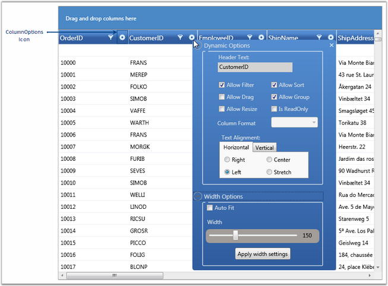

::: {style="DISPLAY: none"}
{#d2h_url_template}{#d2h_package_url style="WIDTH: 0px; DISPLAY: none; HEIGHT: 0px"}
:::

:::: {.d2h_secondary_topic style="PADDING-BOTTOM: 10pt; MARGIN: 0pt; PADDING-LEFT: 0pt; PADDING-RIGHT: 0pt; PADDING-TOP: 0pt"}
#### Column Options {#column-options style="tab-stops: 0pt"}

The GridData control provides support to customize the individual columns in the grid by using the Column Options feature. The customization options are wrapped up into a panel that pops up on clicking the ColumnOptions icon in the column header, so that the users can work with them in an interactive manner. With this feature now available, you can toggle the customization options within seconds, without writing much code.

 

You can enable or disable this feature by using the ShowColumnOptions property of the GridData control.

 

+------------------------------------------------------------------------------------------------------------------------------------------------------------------------------------------------------------------------------------------------------------------------------------------------------------------------------------------------------------------------------------------------------------------------------------------------------------------------------------------------------------------------------------------------------------------------------------------------------------------------------------------------------------------------------------------------------------------------------------------------------------------------------------------------------------------------------------------------------------------------------------------------------------------------------+
| [\[XAML\]]{style="FONT-FAMILY: 'Courier New'; COLOR: black"}                                                                                                                                                                                                                                                                                                                                                                                                                                                                                                                                                                                                                                                                                                                                                                                                                                                                 |
|                                                                                                                                                                                                                                                                                                                                                                                                                                                                                                                                                                                                                                                                                                                                                                                                                                                                                                                              |
| []{style="FONT-FAMILY: 'Courier New'; COLOR: black"}                                                                                                                                                                                                                                                                                                                                                                                                                                                                                                                                                                                                                                                                                                                                                                                                                                                                         |
|                                                                                                                                                                                                                                                                                                                                                                                                                                                                                                                                                                                                                                                                                                                                                                                                                                                                                                                              |
| [\<]{style="FONT-FAMILY: 'Courier New'; COLOR: blue"}[syncfusion]{style="FONT-FAMILY: 'Courier New'; COLOR: #a31515"}[:]{style="FONT-FAMILY: 'Courier New'; COLOR: blue"}[GridDataControl]{style="FONT-FAMILY: 'Courier New'; COLOR: #a31515"}[ x]{style="FONT-FAMILY: 'Courier New'; COLOR: red"}[:]{style="FONT-FAMILY: 'Courier New'; COLOR: blue"}[Name]{style="FONT-FAMILY: 'Courier New'; COLOR: red"}[=\"dataGrid\"]{style="FONT-FAMILY: 'Courier New'; COLOR: blue"}[ ShowColumnOptions]{style="FONT-FAMILY: 'Courier New'; COLOR: red"}[=\"True\"]{style="FONT-FAMILY: 'Courier New'; COLOR: blue"}[ ItemsSource]{style="FONT-FAMILY: 'Courier New'; COLOR: red"}[=\"{]{style="FONT-FAMILY: 'Courier New'; COLOR: blue"}[StaticResource]{style="FONT-FAMILY: 'Courier New'; COLOR: #a31515"}[ orderSource]{style="FONT-FAMILY: 'Courier New'; COLOR: red"}[}\" \>]{style="FONT-FAMILY: 'Courier New'; COLOR: blue"} |
|                                                                                                                                                                                                                                                                                                                                                                                                                                                                                                                                                                                                                                                                                                                                                                                                                                                                                                                              |
| [\</]{style="FONT-FAMILY: 'Courier New'; COLOR: blue"}[syncfusion]{style="FONT-FAMILY: 'Courier New'; COLOR: #a31515"}[:]{style="FONT-FAMILY: 'Courier New'; COLOR: blue"}[GridDataControl]{style="FONT-FAMILY: 'Courier New'; COLOR: #a31515"}[\>]{style="FONT-FAMILY: 'Courier New'; COLOR: blue"}                                                                                                                                                                                                                                                                                                                                                                                                                                                                                                                                                                                                                         |
+------------------------------------------------------------------------------------------------------------------------------------------------------------------------------------------------------------------------------------------------------------------------------------------------------------------------------------------------------------------------------------------------------------------------------------------------------------------------------------------------------------------------------------------------------------------------------------------------------------------------------------------------------------------------------------------------------------------------------------------------------------------------------------------------------------------------------------------------------------------------------------------------------------------------------+

[]{style="COLOR: #15428b"} 

+----------------------------------------------------------------------------------------------------------------------------------------------------------------+
| [\[C#\]]{style="FONT-FAMILY: 'Courier New'; COLOR: black"}                                                                                                     |
|                                                                                                                                                                |
| []{style="FONT-FAMILY: 'Courier New'; COLOR: black"}                                                                                                           |
|                                                                                                                                                                |
| [this]{style="FONT-FAMILY: 'Courier New'; COLOR: blue"}[.dataGridControl.ShowColumnOptions = [true]{style="COLOR: blue"};]{style="FONT-FAMILY: 'Courier New'"} |
+----------------------------------------------------------------------------------------------------------------------------------------------------------------+

 

The following screen shot illustrates how the ColumnOptions icon is displayed for individual columns.

 

{border="0"}

Figure 182: Column Options

[]{style="COLOR: #15428b"} 

Customization Options

 

The following are the column customization options provided by the GridData control.

 

Table 42: Column Option

::: {align="center"}
+-----------------------------------+----------------------------------------------------------------------------------------------------------------------------------------------------------------------------------------------------------------------------------------------------------------------------------------------------+
| Column Option                     | Description                                                                                                                                                                                                                                                                                        |
+-----------------------------------+----------------------------------------------------------------------------------------------------------------------------------------------------------------------------------------------------------------------------------------------------------------------------------------------------+
| Allow Filter                      | Selecting this check box, enables filtering on the respective column. To enable \"filtering\" on all the columns in the grid at once, set the ShowFilters property to *true*.                                                                                                                      |
+-----------------------------------+----------------------------------------------------------------------------------------------------------------------------------------------------------------------------------------------------------------------------------------------------------------------------------------------------+
| Allow Sort                        | Selecting this check box, enables sorting when the user clicks on the column header of the respective column. To enable \"sorting\" on all the columns in the grid at once, set the AllowSort property to *true*.                                                                                  |
+-----------------------------------+----------------------------------------------------------------------------------------------------------------------------------------------------------------------------------------------------------------------------------------------------------------------------------------------------+
| Allow Drag                        | Selecting this check box, enables you to rearrange columns in the grid by dragging the desired column headers. Also you can group the columns by dragging the column headers onto the Group Drop Area. Note that the \"Allow Group\" option must be set to *true* for this to take effect.         |
|                                   |                                                                                                                                                                                                                                                                                                    |
|                                   |                                                                                                                                                                                                                                                                                                    |
|                                   |                                                                                                                                                                                                                                                                                                    |
|                                   | To enable \"drag-and-drop\" feature on all the columns in the grid at once, set the AllowDragColumns property to *true*.                                                                                                                                                                           |
+-----------------------------------+----------------------------------------------------------------------------------------------------------------------------------------------------------------------------------------------------------------------------------------------------------------------------------------------------+
| Allow Group                       | Selecting this check box, enables you to create groups at run time by dragging column headers onto the Group Drop Area. Note that the \"Allow Drag\" option must be set to *true* for this to take effect.                                                                                         |
|                                   |                                                                                                                                                                                                                                                                                                    |
|                                   |                                                                                                                                                                                                                                                                                                    |
|                                   |                                                                                                                                                                                                                                                                                                    |
|                                   | To enable \"grouping\" on all the columns in the grid at once, set the ShowGroupDropArea to *true*.                                                                                                                                                                                                |
+-----------------------------------+----------------------------------------------------------------------------------------------------------------------------------------------------------------------------------------------------------------------------------------------------------------------------------------------------+
| Allow Resize                      | Selecting this check box, enables you to resize columns in the grid, by pressing and dragging the \"mouse-resize\" pointer which is displayed over the column divider. To enable the \"resizing\" operation on all the columns in the grid at once, set the AllowResizeColumns property to *true*. |
+-----------------------------------+----------------------------------------------------------------------------------------------------------------------------------------------------------------------------------------------------------------------------------------------------------------------------------------------------+
| Is ReadOnly                       | Selecting this check box, makes the respective column read-only, allowing no edits to be performed on the column. To enable the \"editing\" operation on all the columns in the grid at once, set the AllowEdit property to *true*.                                                                |
+-----------------------------------+----------------------------------------------------------------------------------------------------------------------------------------------------------------------------------------------------------------------------------------------------------------------------------------------------+
| Column Format                     | This drop-drown menu lists the available data formats for the respective columns types.                                                                                                                                                                                                            |
+-----------------------------------+----------------------------------------------------------------------------------------------------------------------------------------------------------------------------------------------------------------------------------------------------------------------------------------------------+
| Text Alignment                    | This option enables to align text both horizontally and vertically.                                                                                                                                                                                                                                |
+-----------------------------------+----------------------------------------------------------------------------------------------------------------------------------------------------------------------------------------------------------------------------------------------------------------------------------------------------+
| Auto Fit                          | Selecting this check box, adjusts the width of the corresponding column to fit its content and clearing it resets the column width to its default value (i.e., DefaultColumnWidth value). Note that you must click the Apply width settings button for this option to take effect.                 |
+-----------------------------------+----------------------------------------------------------------------------------------------------------------------------------------------------------------------------------------------------------------------------------------------------------------------------------------------------+
| Width                             | You can select the appropriate width for the respective column by pressing and dragging the slider handle with the mouse and clicking the Apply width settings button.                                                                                                                             |
|                                   |                                                                                                                                                                                                                                                                                                    |
|                                   |                                                                                                                                                                                                                                                                                                    |
+-----------------------------------+----------------------------------------------------------------------------------------------------------------------------------------------------------------------------------------------------------------------------------------------------------------------------------------------------+
:::

[]{#p280} 

 

[]{#related-topics}
::::
