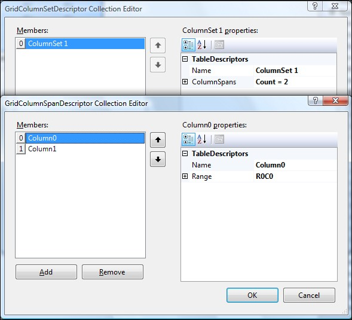
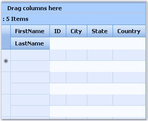

::: {style="DISPLAY: none"}
{#d2h_url_template}{#d2h_package_url style="WIDTH: 0px; DISPLAY: none; HEIGHT: 0px"}
:::

::::: {#nsbanner .d2h_main_nsbanner style="BORDER-BOTTOM: #999999 1px solid; POSITION: relative; PADDING-BOTTOM: 0px; BACKGROUND-COLOR: transparent; PADDING-LEFT: 0px; PADDING-RIGHT: 0px; DISPLAY: none; BORDER-TOP: #999999 1px solid; PADDING-TOP: 0px; LEFT: 0px"}
:::: {#TitleRow .d2h_main_titlerow style="PADDING-BOTTOM: 4px; BACKGROUND-COLOR: transparent; PADDING-LEFT: 22px; WIDTH: 100%; PADDING-RIGHT: 10px; DISPLAY: none; PADDING-TOP: 4px"}
::: {#ienav .d2h_main_ienav style="DISPLAY: none"}
{#D2HPrevious .D2HPreviousEnabled}  {#D2HNext .D2HNextEnabled}
:::
::::
:::::

:::: {#nstext .d2h_main_nstext style="PADDING-BOTTOM: 10px; BACKGROUND-COLOR: transparent; PADDING-LEFT: 22px; PADDING-RIGHT: 10px; HEIGHT: 100%; OVERFLOW: auto; PADDING-TOP: 5px" hasuserbackground="true" valign="bottom"}
::: {#d2h_breadcrumbs .d2h_breadcrumbs}
[Essential Studio User Guide Documentation](ms-xhelp:///?Id=12457748-09e3-4d74-a240-8e049cedf030){.d2h_breadcrumbsNormal}[ \> ]{.d2h_breadcrumbsLinkSeparator}[User Interface Edition](ms-xhelp:///?Id=c29296b7-531c-413b-a0ec-488ca1f7f669){.d2h_breadcrumbsNormal}[ \> ]{.d2h_breadcrumbsLinkSeparator}[Essential ASP.NET](ms-xhelp:///?Id=25c35330-c127-4dad-9a92-ed79dc7261a6){.d2h_breadcrumbsNormal}[ \> ]{.d2h_breadcrumbsLinkSeparator}[Essential Grid]{.d2h_breadcrumbsContentsOnly}[ \> ]{.d2h_breadcrumbsLinkSeparator}[Concepts and Features](ms-xhelp:///?Id=9e489974-524d-457c-9881-e458b1321685){.d2h_breadcrumbsNormal}[ \> ]{.d2h_breadcrumbsLinkSeparator}[Data Representation](ms-xhelp:///?Id=655eb33e-7999-4728-9936-2c769f430e87){.d2h_breadcrumbsNormal}
:::

### Column Span {#column-span style="tab-stops: 0pt"}

[]{style="FONT-FAMILY: 'Trebuchet MS','sans-serif'; COLOR: #15428b; FONT-SIZE: 9pt"} 

GridGroupingControl allows the user to span a column across multiple grid rows or columns. This is possible through the GridColumnSpanDescriptor, which provides information about a column that can span multiple grid rows or columns.

[]{style="FONT-FAMILY: 'Trebuchet MS','sans-serif'; COLOR: #15428b; FONT-SIZE: 9pt"} 

Creating Column Span

**[]{style="FONT-FAMILY: 'Trebuchet MS','sans-serif'; COLOR: #15428b"}** 

Through Designer

[]{style="FONT-FAMILY: 'Trebuchet MS','sans-serif'; COLOR: #15428b; FONT-SIZE: 9pt"} 

**GridColumnSpanDescriptor[ ]{style="FONT-FAMILY: 'Verdana','sans-serif'; COLOR: black; FONT-SIZE: 8pt"}**Collection Editor is used to span the columns, which are returned by the **ColumnSets** property from the TableDescriptor.

[]{style="FONT-FAMILY: 'Trebuchet MS','sans-serif'; COLOR: #15428b; FONT-SIZE: 9pt"} 

{border="0"}

Figure 52

[]{style="FONT-FAMILY: 'Trebuchet MS','sans-serif'; COLOR: #15428b; FONT-SIZE: 9pt"} 

Through Code

[]{style="COLOR: #4a5c8c; FONT-SIZE: 8pt"} 

+----------------------------------------------------------------------------------------------------------------------------------------------------------------------------------------------------------------------------------------------------------------------------------------------------------------------------------------------------------------+
| **[\[C#\]]{style="FONT-FAMILY: 'Courier New'; COLOR: black"}**                                                                                                                                                                                                                                                                                                 |
|                                                                                                                                                                                                                                                                                                                                                                |
| []{style="FONT-FAMILY: 'Courier New'; COLOR: black"}                                                                                                                                                                                                                                                                                                           |
|                                                                                                                                                                                                                                                                                                                                                                |
| [GridColumnSetDescriptor]{style="FONT-FAMILY: 'Courier New'; COLOR: #2b91af"}[ gridColumnSetDescriptor1 = [new]{style="COLOR: blue"} [GridColumnSetDescriptor]{style="COLOR: #2b91af"}();]{style="FONT-FAMILY: 'Courier New'"}                                                                                                                                 |
|                                                                                                                                                                                                                                                                                                                                                                |
| [// Add columns and specify span behavior]{style="FONT-FAMILY: 'Courier New'; COLOR: green"}                                                                                                                                                                                                                                                                   |
|                                                                                                                                                                                                                                                                                                                                                                |
| [gridColumnSetDescriptor1.ColumnSpans.AddRange([new]{style="COLOR: blue"} [GridColumnSpanDescriptor]{style="COLOR: #2b91af"}\[\] { [new]{style="COLOR: blue"}]{style="FONT-FAMILY: 'Courier New'"}                                                                                                                                                             |
|                                                                                                                                                                                                                                                                                                                                                                |
| [GridColumnSpanDescriptor]{style="FONT-FAMILY: 'Courier New'; COLOR: #2b91af"}[([\"FirstName\"]{style="COLOR: #a31515"}, [\"R0C0\"]{style="COLOR: #a31515"}),[new]{style="COLOR: blue"} [GridColumnSpanDescriptor]{style="COLOR: #2b91af"}([\"LastName\"]{style="COLOR: #a31515"}, [\"R1C1\"]{style="COLOR: #a31515"})});]{style="FONT-FAMILY: 'Courier New'"} |
|                                                                                                                                                                                                                                                                                                                                                                |
| [// Add GridColumnDescriptor to the GridGroupingControl]{style="FONT-FAMILY: 'Courier New'; COLOR: green"}                                                                                                                                                                                                                                                     |
|                                                                                                                                                                                                                                                                                                                                                                |
| [this]{style="FONT-FAMILY: 'Courier New'; COLOR: blue"}[.GridGroupingControl1.TableDescriptor.ColumnSets.AddRange([new]{style="COLOR: blue"} [GridColumnSetDescriptor]{style="COLOR: #2b91af"}\[\] {gridColumnSetDescriptor1});]{style="FONT-FAMILY: 'Courier New'"}                                                                                           |
+----------------------------------------------------------------------------------------------------------------------------------------------------------------------------------------------------------------------------------------------------------------------------------------------------------------------------------------------------------------+

[]{style="FONT-FAMILY: 'Trebuchet MS','sans-serif'; COLOR: #15428b; FONT-SIZE: 9pt"} 

+------------------------------------------------------------------------------------------------------------------------------------------------------------------------------------------------------------------------------------------------------------------------------------------------------------------------------------------------------------------------------------------------------------+
| **[\[VB.NET\]]{style="FONT-FAMILY: 'Courier New'; COLOR: black"}**                                                                                                                                                                                                                                                                                                                                         |
|                                                                                                                                                                                                                                                                                                                                                                                                            |
| []{style="FONT-FAMILY: 'Courier New'; COLOR: blue"}                                                                                                                                                                                                                                                                                                                                                        |
|                                                                                                                                                                                                                                                                                                                                                                                                            |
| [Dim]{style="FONT-FAMILY: 'Courier New'; COLOR: blue"}[ gridColumnSetDescriptor1 [As]{style="COLOR: blue"} Syncfusion.Web.UI.WebControls.Grid.Grouping.GridColumnSetDescriptor = [New]{style="COLOR: blue"} GridColumnSetDescriptor()]{style="FONT-FAMILY: 'Courier New'"}                                                                                                                                 |
|                                                                                                                                                                                                                                                                                                                                                                                                            |
| [\' Add columns and specify span behavior]{style="FONT-FAMILY: 'Courier New'; COLOR: green"}                                                                                                                                                                                                                                                                                                               |
|                                                                                                                                                                                                                                                                                                                                                                                                            |
| [gridColumnSetDescriptor1.ColumnSpans.AddRange([New]{style="COLOR: blue"} GridColumnSpanDescriptor() { [New]{style="COLOR: blue"} GridColumnSpanDescriptor([\"FirstName\"]{style="COLOR: maroon"}, [\"R0C0\"]{style="COLOR: maroon"}),[New]{style="COLOR: blue"} GridColumnSpanDescriptor([\"LastName\"]{style="COLOR: maroon"}, [\"R1C1\"]{style="COLOR: maroon"})})]{style="FONT-FAMILY: 'Courier New'"} |
|                                                                                                                                                                                                                                                                                                                                                                                                            |
| [\' Add GridColumnDescriptor to the GridGroupingControl]{style="FONT-FAMILY: 'Courier New'; COLOR: green"}                                                                                                                                                                                                                                                                                                 |
|                                                                                                                                                                                                                                                                                                                                                                                                            |
| [Me]{style="FONT-FAMILY: 'Courier New'; COLOR: blue"}[.GridGroupingControl1.TableDescriptor.ColumnSets.AddRange([New]{style="COLOR: blue"} GridColumnSetDescriptor() {gridColumnSetDescriptor1})]{style="FONT-FAMILY: 'Courier New'"}                                                                                                                                                                      |
+------------------------------------------------------------------------------------------------------------------------------------------------------------------------------------------------------------------------------------------------------------------------------------------------------------------------------------------------------------------------------------------------------------+

[]{style="COLOR: red; FONT-SIZE: 8pt"} 

{border="0"}

Figure 53

[]{#p41} 

[]{#related-topics}
::::
