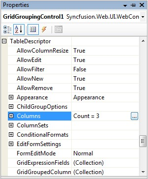
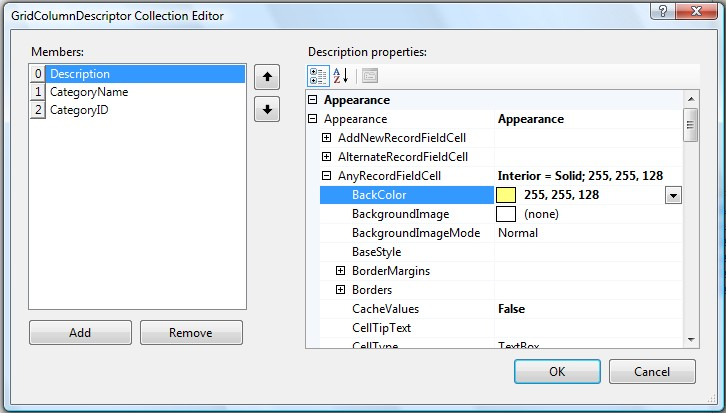

::: {style="DISPLAY: none"}
{#d2h_url_template}{#d2h_package_url style="WIDTH: 0px; DISPLAY: none; HEIGHT: 0px"}
:::

:::: {.d2h_secondary_topic style="PADDING-BOTTOM: 10pt; MARGIN: 0pt; PADDING-LEFT: 0pt; PADDING-RIGHT: 0pt; PADDING-TOP: 0pt"}
#### Column Style {#column-style style="tab-stops: 0pt"}

[]{style="FONT-FAMILY: 'Trebuchet MS','sans-serif'; COLOR: #15428b; FONT-SIZE: 9pt"} 

This section discusses formatting specific columns. This can be achieved via the corresponding GridColumnDescriptor.

[]{style="FONT-FAMILY: 'Trebuchet MS','sans-serif'; COLOR: #15428b; FONT-SIZE: 9pt"} 

Through Designer

[]{style="FONT-FAMILY: 'Trebuchet MS','sans-serif'; COLOR: #15428b; FONT-SIZE: 9pt"} 

Clicking the **Columns** property of the Grid\'s TableDescriptor launches the **GridColumnDescriptor Collection Editor**, which can be used to modify the appearance of a particular column.

[]{style="FONT-FAMILY: 'Trebuchet MS','sans-serif'; COLOR: #15428b; FONT-SIZE: 9pt"} 

{border="0"}

Figure 117

[]{style="FONT-FAMILY: 'Trebuchet MS','sans-serif'; COLOR: #15428b; FONT-SIZE: 9pt"} 

Specify the interior color for alternate and non-alternate rows by using the options provided by the **Appearance** property as shown below.

[]{style="FONT-FAMILY: 'Trebuchet MS','sans-serif'; COLOR: #15428b; FONT-SIZE: 9pt"} 

{border="0"}

Figure 118[]{style="FONT-FAMILY: 'Trebuchet MS','sans-serif'; COLOR: #15428b"}

::: {style="BORDER-BOTTOM: windowtext 1pt solid; BORDER-LEFT: medium none; PADDING-BOTTOM: 1pt; MARGIN-TOP: 9pt; PADDING-LEFT: 0pt; PADDING-RIGHT: 0pt; MARGIN-BOTTOM: 9pt; BORDER-TOP: windowtext 1pt solid; BORDER-RIGHT: medium none; PADDING-TOP: 1pt"}
 

{border="0"}Note: Make sure GridGroupingControl is bound to a data source.
:::

[]{style="FONT-FAMILY: 'Trebuchet MS','sans-serif'; COLOR: #15428b; FONT-SIZE: 9pt"} 

Through Code

**[]{style="COLOR: black; FONT-SIZE: 8pt"}** 

+----------------------------------------------------------------------------------------------------------------------------------------------------------------------------------------------------------------------------------------------------------------------------------------------------------------------------------------------------+
| **[\[C#\]]{style="FONT-FAMILY: 'Courier New'; COLOR: black"}**                                                                                                                                                                                                                                                                                     |
|                                                                                                                                                                                                                                                                                                                                                    |
| []{style="FONT-FAMILY: 'Courier New'; COLOR: black"}                                                                                                                                                                                                                                                                                               |
|                                                                                                                                                                                                                                                                                                                                                    |
| [// Declare descriptors]{style="FONT-FAMILY: 'Courier New'; COLOR: green"}                                                                                                                                                                                                                                                                         |
|                                                                                                                                                                                                                                                                                                                                                    |
| [GridColumnDescriptor gridColumnDescriptor1 = [this]{style="COLOR: blue"}.GridGroupingControl1.TableDescriptor.Columns.FindByMappingName([\"CategoryID\"]{style="COLOR: #a31515"});]{style="FONT-FAMILY: 'Courier New'"}                                                                                                                           |
|                                                                                                                                                                                                                                                                                                                                                    |
| [// Specify the appearance for alternate record cells and non-alternate record rows.]{style="FONT-FAMILY: 'Courier New'; COLOR: green"}                                                                                                                                                                                                            |
|                                                                                                                                                                                                                                                                                                                                                    |
| [gridColumnDescriptor1.Appearance.AlternateRecordFieldCell.Interior = [new]{style="COLOR: blue"} Syncfusion.Drawing.BrushInfo(System.Drawing.Color.FromArgb(((System.[Byte]{style="COLOR: #2b91af"})(218)), ((System.[Byte]{style="COLOR: #2b91af"})(229)), ((System.[Byte]{style="COLOR: #2b91af"})(245))));]{style="FONT-FAMILY: 'Courier New'"} |
+----------------------------------------------------------------------------------------------------------------------------------------------------------------------------------------------------------------------------------------------------------------------------------------------------------------------------------------------------+

[]{style="FONT-FAMILY: 'Trebuchet MS','sans-serif'; COLOR: #4a5c8c; FONT-SIZE: 9pt"} 

+-----------------------------------------------------------------------------------------------------------------------------------------------------------------------------------------------------------------------------------------------------------------------------------------------------------------------------------------------------------------------------+
| **[\[VB\]]{style="FONT-FAMILY: 'Courier New'; COLOR: black"}**                                                                                                                                                                                                                                                                                                              |
|                                                                                                                                                                                                                                                                                                                                                                             |
| []{style="FONT-FAMILY: 'Courier New'; COLOR: black"}                                                                                                                                                                                                                                                                                                                        |
|                                                                                                                                                                                                                                                                                                                                                                             |
| [\' Declare descriptors]{style="FONT-FAMILY: 'Courier New'; COLOR: green"}                                                                                                                                                                                                                                                                                                  |
|                                                                                                                                                                                                                                                                                                                                                                             |
| [Private]{style="FONT-FAMILY: 'Courier New'; COLOR: blue"}[ gridColumnDescriptor1 [As]{style="COLOR: blue"} GridColumnDescriptor = [Me]{style="COLOR: blue"}.GridGroupingControl1.TableDescriptor.Columns.FindByMappingName([\"CategoryID\"]{style="COLOR: maroon"})]{style="FONT-FAMILY: 'Courier New'"}                                                                   |
|                                                                                                                                                                                                                                                                                                                                                                             |
| [\' Specify the appearance for alternate record cells and non-alternate record rows.]{style="FONT-FAMILY: 'Courier New'; COLOR: green"}                                                                                                                                                                                                                                     |
|                                                                                                                                                                                                                                                                                                                                                                             |
| [Private]{style="FONT-FAMILY: 'Courier New'; COLOR: blue"}[ gridColumnDescriptor1.Appearance.AlternateRecordFieldCell.Interior = [New]{style="COLOR: blue"} Syncfusion.Drawing.BrushInfo(System.Drawing.Color.FromArgb(([CByte]{style="COLOR: blue"}(218)), ([CByte]{style="COLOR: blue"}(229)), ([CByte]{style="COLOR: blue"}(245))))]{style="FONT-FAMILY: 'Courier New'"} |
+-----------------------------------------------------------------------------------------------------------------------------------------------------------------------------------------------------------------------------------------------------------------------------------------------------------------------------------------------------------------------------+

 

[]{#p100} 

[]{#related-topics}
::::
