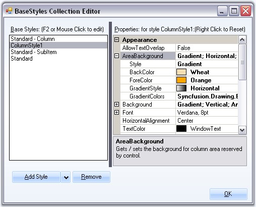
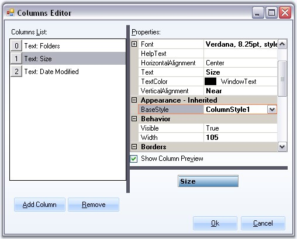

::: {style="DISPLAY: none"}
{#d2h_url_template}{#d2h_package_url style="WIDTH: 0px; DISPLAY: none; HEIGHT: 0px"}
:::

:::: {.d2h_secondary_topic style="PADDING-BOTTOM: 10pt; MARGIN: 0pt; PADDING-LEFT: 0pt; PADDING-RIGHT: 0pt; PADDING-TOP: 0pt"}
##### Column Styles {#column-styles style="MARGIN-LEFT: 18pt; tab-stops: 18.0pt"}

[]{style="COLOR: #15428b"} 

Standard - Column style is default style that will applied for all the columns of the MultiColumnTreeView control. The style settings can be edited by the user.

 

**Column Style Properties**

 

The below properties controls the appearance of the columns.

[]{style="COLOR: #15428b"} 

::: {align="center"}
+-----------------------------------+----------------------------------------------------------------------------------------------------------+
| TreeColumnAdv Property            | Description                                                                                              |
+-----------------------------------+----------------------------------------------------------------------------------------------------------+
| AllowTextOverlap                  | Indicates whether the text can overlap or not. By default it false.                                      |
+-----------------------------------+----------------------------------------------------------------------------------------------------------+
| AreaBackground                    | Gets / sets the background for the column area.                                                          |
+-----------------------------------+----------------------------------------------------------------------------------------------------------+
| Background                        | Sets the background for the column (column header).                                                      |
+-----------------------------------+----------------------------------------------------------------------------------------------------------+
| Font                              | Sets the foreground style for the columns.                                                               |
+-----------------------------------+----------------------------------------------------------------------------------------------------------+
| HorizontalAlignment               | Sets the horizontal alignment of the text in the columns.                                                |
+-----------------------------------+----------------------------------------------------------------------------------------------------------+
| TextColor                         | Sets the text color for the columns.                                                                     |
+-----------------------------------+----------------------------------------------------------------------------------------------------------+
| Vertical Alignment                | Sets the vertical alignment of the text in the columns.                                                  |
+-----------------------------------+----------------------------------------------------------------------------------------------------------+
| BaseStyle                         | Sets the base style to be applied to the column.                                                         |
+-----------------------------------+----------------------------------------------------------------------------------------------------------+
| Width                             | Specifies Column width.                                                                                  |
+-----------------------------------+----------------------------------------------------------------------------------------------------------+
| Border3DStyle                     | Sets the 3D border style for the column.                                                                 |
+-----------------------------------+----------------------------------------------------------------------------------------------------------+
| BorderColor                       | Border color for the column.                                                                             |
+-----------------------------------+----------------------------------------------------------------------------------------------------------+
| BorderSides                       | Specifies the sides of the column which should have border.                                              |
+-----------------------------------+----------------------------------------------------------------------------------------------------------+
| BorderStyle                       | Sets 2D or 3D border. The options are,                                                                   |
|                                   |                                                                                                          |
|                                   |                                                                                                          |
|                                   |                                                                                                          |
|                                   | [·      ]{style="FONT-FAMILY: Symbol"}FixedSingle and                                                    |
|                                   |                                                                                                          |
|                                   | [·      ]{style="FONT-FAMILY: Symbol"}Fixed3D.                                                           |
+-----------------------------------+----------------------------------------------------------------------------------------------------------+
| BorderSingle                      | Specifies the 2D border style for the columns, when BorderStyle is set to Fixed Single. The options are, |
|                                   |                                                                                                          |
|                                   |                                                                                                          |
|                                   |                                                                                                          |
|                                   | [·      ]{style="FONT-FAMILY: Symbol"}Dotted,                                                            |
|                                   |                                                                                                          |
|                                   | [·      ]{style="FONT-FAMILY: Symbol"}Dashed,                                                            |
|                                   |                                                                                                          |
|                                   | [·      ]{style="FONT-FAMILY: Symbol"}Solid,                                                             |
|                                   |                                                                                                          |
|                                   | [·      ]{style="FONT-FAMILY: Symbol"}Inset and                                                          |
|                                   |                                                                                                          |
|                                   | [·      ]{style="FONT-FAMILY: Symbol"}Outset.                                                            |
+-----------------------------------+----------------------------------------------------------------------------------------------------------+
:::

[]{style="COLOR: #15428b"} 

Adding ColumnStyle

[]{style="COLOR: #15428b"} 

The editor also lets you add user defined column styles like other styles as follows.

[]{style="COLOR: #15428b"} 

{border="0"}

[]{style="COLOR: #15428b"} 

Figure 1202: New ColumnStyle1 Added

[]{style="COLOR: #15428b"} 

The user-defined column style can be applied to any of the columns, using Columns Editor. This setting overrides the default settings.

[]{style="COLOR: #15428b"} 

{border="0"}

[]{style="COLOR: #15428b"} 

Figure 1203: Column Style applied by using the Columns Editor

 

 

 

 

[]{#related-topics}
::::
