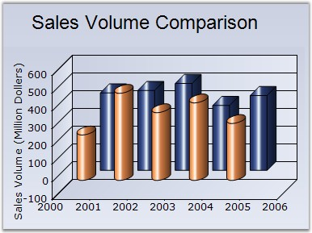

::: {style="DISPLAY: none"}
{#d2h_url_template}{#d2h_package_url style="WIDTH: 0px; DISPLAY: none; HEIGHT: 0px"}
:::

:::: {.d2h_secondary_topic style="PADDING-BOTTOM: 10pt; MARGIN: 0pt; PADDING-LEFT: 0pt; PADDING-RIGHT: 0pt; PADDING-TOP: 0pt"}
#### ColumnType {#columntype style="tab-stops: 0pt"}

**[]{style="FONT-FAMILY: 'Trebuchet MS','sans-serif'"}** 

Specifies whether the columns should be rendered as bars or cylinders.

[]{style="FONT-FAMILY: 'Trebuchet MS','sans-serif'; FONT-SIZE: 9pt"} 

::: {align="center"}
+-------------------------------------+------------------------------------------------------------------------------------------------------+
| Details                                                                                                                                    |
+-------------------------------------+------------------------------------------------------------------------------------------------------+
| Possible Values                     | Box - Renders the columns as boxes.\                                                                 |
|                                     | Cylinder - Renders the columns as cylinders.                                                         |
+-------------------------------------+------------------------------------------------------------------------------------------------------+
| Default Value                       | Box                                                                                                  |
+-------------------------------------+------------------------------------------------------------------------------------------------------+
| 2D / 3D Limitations                 | 3D only                                                                                              |
+-------------------------------------+------------------------------------------------------------------------------------------------------+
| Applies to Chart Element            | All series                                                                                           |
+-------------------------------------+------------------------------------------------------------------------------------------------------+
| Applies to Chart Types              | Column Chart, Column Range Chart, Stacking Column Chart, Candle Chart, Bar Chart, Stacking Bar Chart |
+-------------------------------------+------------------------------------------------------------------------------------------------------+
:::

**[]{style="FONT-FAMILY: 'Trebuchet MS','sans-serif'; FONT-SIZE: 9pt"}** 

Here is some sample.

[]{style="FONT-FAMILY: 'Trebuchet MS','sans-serif'; FONT-SIZE: 9pt"} 

+-----------------------------------------------------------------------------------------------------------------------------------------------------------------------------------------------------------------+
| **[\[C#\]]{style="FONT-FAMILY: 'Courier New'; COLOR: black"}**                                                                                                                                                  |
|                                                                                                                                                                                                                 |
| **[]{style="FONT-FAMILY: 'Courier New'; COLOR: black"}**                                                                                                                                                        |
|                                                                                                                                                                                                                 |
| [this]{style="FONT-FAMILY: 'Courier New'; COLOR: blue"}[.ChartWebControl1.Series\[0\].ConfigItems.ColumnItem.ColumnType = [ChartColumnType]{style="COLOR: teal"}.Cylinder;]{style="FONT-FAMILY: 'Courier New'"} |
|                                                                                                                                                                                                                 |
| [this]{style="FONT-FAMILY: 'Courier New'; COLOR: blue"}[.ChartWebControl1.Series\[1\].ConfigItems.ColumnItem.ColumnType = [ChartColumnType]{style="COLOR: teal"}.Box;]{style="FONT-FAMILY: 'Courier New'"}      |
+-----------------------------------------------------------------------------------------------------------------------------------------------------------------------------------------------------------------+

[]{style="FONT-FAMILY: 'Trebuchet MS','sans-serif'; FONT-SIZE: 9pt"} 

+----------------------------------------------------------------------------------------------------------------------------------------------------------------------------------------------------------------------------------------------------------------------------------------------------------+
| **[\[VB.NET\]]{style="FONT-FAMILY: 'Courier New'; COLOR: black"}**                                                                                                                                                                                                                                       |
|                                                                                                                                                                                                                                                                                                          |
| **[]{style="FONT-FAMILY: 'Courier New'; COLOR: black"}**                                                                                                                                                                                                                                                 |
|                                                                                                                                                                                                                                                                                                          |
| [Me]{style="FONT-FAMILY: 'Courier New'; COLOR: blue"}[.ChartWebControl1.Series(0).ConfigItems.ColumnItem.ColumnType = ]{style="FONT-FAMILY: 'Courier New'; COLOR: black"}[ChartColumnType]{style="FONT-FAMILY: 'Courier New'; COLOR: teal"}[.Cylinder]{style="FONT-FAMILY: 'Courier New'; COLOR: black"} |
|                                                                                                                                                                                                                                                                                                          |
| [Me]{style="FONT-FAMILY: 'Courier New'; COLOR: blue"}[.ChartWebControl1.Series(1).ConfigItems.ColumnItem.ColumnType = ]{style="FONT-FAMILY: 'Courier New'; COLOR: black"}[ChartColumnType]{style="FONT-FAMILY: 'Courier New'; COLOR: teal"}[.Box]{style="FONT-FAMILY: 'Courier New'; COLOR: black"}      |
+----------------------------------------------------------------------------------------------------------------------------------------------------------------------------------------------------------------------------------------------------------------------------------------------------------+

**[]{style="FONT-FAMILY: 'Trebuchet MS','sans-serif'"}** 

{border="0"}

**[]{style="COLOR: black; FONT-SIZE: 8pt"}** 

Figure 105: Column Chart

[]{style="COLOR: black; FONT-SIZE: 8pt"} 

See Also

[]{style="FONT-FAMILY: 'Trebuchet MS','sans-serif'; FONT-SIZE: 9pt"} 

[[Stacking Column Chart]{.UGHyperlink}](ms-xhelp:///?Id=07dff027-c96d-450f-9a9b-6037f838f4da)[, ]{.UGHyperlink}[[Stacking Bar Chart]{.UGHyperlink}](ms-xhelp:///?Id=07dff027-c96d-450f-9a9b-6037f838f4da)[, ]{.UGHyperlink}[[Column Chart]{.UGHyperlink}](ms-xhelp:///?Id=07dff027-c96d-450f-9a9b-6037f838f4da)[, ]{.UGHyperlink}[[ColumnRange Chart]{.UGHyperlink}](ms-xhelp:///?Id=f6d7bb1e-6e5a-4165-9dda-eab8aceb7e4d)[, ]{.UGHyperlink}[[Bar Chart]{.UGHyperlink}](ms-xhelp:///?Id=f561904f-bd17-40a3-a1b6-498ed5d46c43)[, ]{.UGHyperlink}[[Candle Chart]{.UGHyperlink}](ms-xhelp:///?Id=07dff027-c96d-450f-9a9b-6037f838f4da)[]{.UGHyperlink}

[]{#p86} 

[]{#related-topics}
::::
