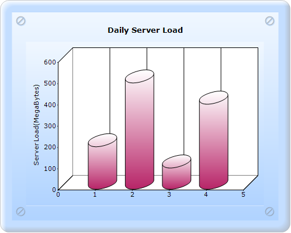

::: {style="DISPLAY: none"}
{#d2h_url_template}{#d2h_package_url style="WIDTH: 0px; DISPLAY: none; HEIGHT: 0px"}
:::

:::: {.d2h_secondary_topic style="PADDING-BOTTOM: 10pt; MARGIN: 0pt; PADDING-LEFT: 0pt; PADDING-RIGHT: 0pt; PADDING-TOP: 0pt"}
##### Column Type {#column-type style="tab-stops: 0pt"}

Column Type specifies whether the columns should be rendered as bars or cylinders.

::: {align="center"}
+-------------------------------------+-----------------------------------------------------------------------------------------------------------+
| Details                                                                                                                                         |
+-------------------------------------+-----------------------------------------------------------------------------------------------------------+
| Possible values                     | Box - Renders the columns as boxes.\                                                                      |
|                                     | Cylinder - Renders the columns as cylinders.                                                              |
+-------------------------------------+-----------------------------------------------------------------------------------------------------------+
| Default value                       | Box                                                                                                       |
+-------------------------------------+-----------------------------------------------------------------------------------------------------------+
| 2D/3D limitations                   | 3D only                                                                                                   |
+-------------------------------------+-----------------------------------------------------------------------------------------------------------+
| Application to chart element        | All series                                                                                                |
+-------------------------------------+-----------------------------------------------------------------------------------------------------------+
| Application to chart types          | Column chart, Column Range chart, Stacking Column chart, Candle chart, Bar chart, and Stacking Bar chart. |
+-------------------------------------+-----------------------------------------------------------------------------------------------------------+
:::

[]{style="FONT-FAMILY: 'Calibri','sans-serif'"} 

Column chart with the Column Type property can be created in two ways:

[·      ]{style="FONT-FAMILY: Symbol"}Builder

[·      ]{style="FONT-FAMILY: Symbol"}ChartModel

 

###### 5.2.1.3.2.1 Builder {#builder style="tab-stops: 0pt"}

[]{style="FONT-FAMILY: 'Calibri','sans-serif'"} 

To create a Column chart with the Column Type property through Builder:

1.   In Controller, return View to the Aspx page.

[]{style="FONT-FAMILY: 'Calibri','sans-serif'"} 

+----------------------------------------------------------------------------------------------------------------------------------+
| \[C#\]                                                                                                                           |
|                                                                                                                                  |
| [        [public]{style="COLOR: blue"} [ActionResult]{style="COLOR: #2b91af"} SimpleChart()]{style="FONT-FAMILY: 'Courier New'"} |
|                                                                                                                                  |
| [        {            ]{style="FONT-FAMILY: 'Courier New'"}                                                                      |
|                                                                                                                                  |
| [            [return]{style="COLOR: blue"} View();]{style="FONT-FAMILY: 'Courier New'"}                                          |
|                                                                                                                                  |
| [        }]{style="FONT-FAMILY: 'Courier New'"}                                                                                  |
|                                                                                                                                  |
| []{style="FONT-FAMILY: Consolas; COLOR: blue; FONT-SIZE: 9.5pt"}                                                                 |
+----------------------------------------------------------------------------------------------------------------------------------+

[]{style="FONT-FAMILY: 'Calibri','sans-serif'"} 

[]{style="FONT-FAMILY: Consolas; FONT-SIZE: 9.5pt"} 

2.   In **View**, invoke the ChartBuilder with the control ID as the first argument.

3.   Create the **Series** and **Points**, and set the style for the chart.

4.   Set the **ColumnType** to **Cylinder**.

[]{style="FONT-FAMILY: 'Calibri','sans-serif'"} 

+----------------------------------------------------------------------------------------------------------------------------------------------------------------------------------------------------------------------------------------------------------------------------------------+
| View\[ASPX\]                                                                                                                                                                                                                                                                           |
|                                                                                                                                                                                                                                                                                        |
| []{style="FONT-FAMILY: 'Calibri','sans-serif'"}                                                                                                                                                                                                                                        |
|                                                                                                                                                                                                                                                                                        |
| [    ]{style="FONT-FAMILY: Consolas; FONT-SIZE: 9.5pt"}[\<%]{style="FONT-FAMILY: 'Courier New'; BACKGROUND: yellow"}[=]{style="FONT-FAMILY: 'Courier New'; COLOR: blue"}[ Html.Chart([\"SimpleChart\"]{style="COLOR: #a31515"}).Series(series =\>]{style="FONT-FAMILY: 'Courier New'"} |
|                                                                                                                                                                                                                                                                                        |
| [{]{style="FONT-FAMILY: 'Courier New'"}                                                                                                                                                                                                                                                |
|                                                                                                                                                                                                                                                                                        |
| [    series.Add().Type(Syncfusion.Windows.Forms.Chart.[ChartSeriesType]{style="COLOR: #2b91af"}.Column)]{style="FONT-FAMILY: 'Courier New'"}                                                                                                                                           |
|                                                                                                                                                                                                                                                                                        |
| [                .Text([\"Server 1\"]{style="COLOR: #a31515"})]{style="FONT-FAMILY: 'Courier New'"}                                                                                                                                                                                    |
|                                                                                                                                                                                                                                                                                        |
| [                .Points(point =\>]{style="FONT-FAMILY: 'Courier New'"}                                                                                                                                                                                                                |
|                                                                                                                                                                                                                                                                                        |
| [                {]{style="FONT-FAMILY: 'Courier New'"}                                                                                                                                                                                                                                |
|                                                                                                                                                                                                                                                                                        |
| **[                    point.Add(1, [new]{style="COLOR: blue"} [double]{style="COLOR: blue"}\[\] { 200 });]{style="FONT-FAMILY: 'Courier New'"}**                                                                                                                                      |
|                                                                                                                                                                                                                                                                                        |
| **[                    point.Add(2, [new]{style="COLOR: blue"} [double]{style="COLOR: blue"}\[\] { 500 });]{style="FONT-FAMILY: 'Courier New'"}**                                                                                                                                      |
|                                                                                                                                                                                                                                                                                        |
| **[                    point.Add(3, [new]{style="COLOR: blue"} [double]{style="COLOR: blue"}\[\] { 100 });]{style="FONT-FAMILY: 'Courier New'"}**                                                                                                                                      |
|                                                                                                                                                                                                                                                                                        |
| **[                    point.Add(4, [new]{style="COLOR: blue"} [double]{style="COLOR: blue"}\[\] { 400 });]{style="FONT-FAMILY: 'Courier New'"}**                                                                                                                                      |
|                                                                                                                                                                                                                                                                                        |
| [                })]{style="FONT-FAMILY: 'Courier New'"}                                                                                                                                                                                                                               |
|                                                                                                                                                                                                                                                                                        |
| **[                .ConfigItems(configItems =\> {]{style="FONT-FAMILY: 'Courier New'"}**                                                                                                                                                                                               |
|                                                                                                                                                                                                                                                                                        |
| **[                    configItems.ColumnItem(item =\> {                        item.ColumnType(Syncfusion.Windows.Forms.Chart.[ChartColumnType]{style="COLOR: #2b91af"}.Cylinder);]{style="FONT-FAMILY: 'Courier New'"}**                                                             |
|                                                                                                                                                                                                                                                                                        |
| **[                    });]{style="FONT-FAMILY: 'Courier New'"}**                                                                                                                                                                                                                      |
|                                                                                                                                                                                                                                                                                        |
| **[                });]{style="FONT-FAMILY: 'Courier New'"}**                                                                                                                                                                                                                          |
|                                                                                                                                                                                                                                                                                        |
| []{style="FONT-FAMILY: 'Courier New'"}                                                                                                                                                                                                                                                 |
|                                                                                                                                                                                                                                                                                        |
| [})]{style="FONT-FAMILY: 'Courier New'"}                                                                                                                                                                                                                                               |
|                                                                                                                                                                                                                                                                                        |
| [// \-\-\-\-\-\-\-\-\-\-\-\-- Set all styling properties to ChartModel\-\-\-\--]{style="FONT-FAMILY: 'Courier New'; COLOR: green"}[                ]{style="FONT-FAMILY: 'Courier New'"}                                                                                               |
|                                                                                                                                                                                                                                                                                        |
| [        ]{style="FONT-FAMILY: 'Courier New'"}                                                                                                                                                                                                                                         |
|                                                                                                                                                                                                                                                                                        |
| [    [%\>]{style="BACKGROUND: yellow"}]{style="FONT-FAMILY: 'Courier New'"}[]{style="FONT-FAMILY: Consolas; COLOR: blue; FONT-SIZE: 9.5pt"}                                                                                                                                            |
+----------------------------------------------------------------------------------------------------------------------------------------------------------------------------------------------------------------------------------------------------------------------------------------+

[]{style="FONT-FAMILY: 'Calibri','sans-serif'"} 

[]{style="FONT-FAMILY: 'Calibri','sans-serif'"} 

+-----------------------------------------------------------------------------------------------------------------------------------------------------------------------------------------------------------------------------------+
| View\[cshtml\]                                                                                                                                                                                                                    |
|                                                                                                                                                                                                                                   |
| []{style="FONT-FAMILY: 'Calibri','sans-serif'"}                                                                                                                                                                                   |
|                                                                                                                                                                                                                                   |
| [   ]{style="FONT-FAMILY: Consolas; FONT-SIZE: 9.5pt"}[\@{]{style="FONT-FAMILY: 'Courier New'; BACKGROUND: yellow"}[ Html.Chart([\"SimpleChart\"]{style="COLOR: #a31515"}).Series(series =\>]{style="FONT-FAMILY: 'Courier New'"} |
|                                                                                                                                                                                                                                   |
| [{]{style="FONT-FAMILY: 'Courier New'"}                                                                                                                                                                                           |
|                                                                                                                                                                                                                                   |
| [    series.Add().Type(Syncfusion.Windows.Forms.Chart.[ChartSeriesType]{style="COLOR: #2b91af"}.Column)]{style="FONT-FAMILY: 'Courier New'"}                                                                                      |
|                                                                                                                                                                                                                                   |
| [                .Text([\"Server 1\"]{style="COLOR: #a31515"})]{style="FONT-FAMILY: 'Courier New'"}                                                                                                                               |
|                                                                                                                                                                                                                                   |
| [                .Points(point =\>]{style="FONT-FAMILY: 'Courier New'"}                                                                                                                                                           |
|                                                                                                                                                                                                                                   |
| [                {]{style="FONT-FAMILY: 'Courier New'"}                                                                                                                                                                           |
|                                                                                                                                                                                                                                   |
| **[                    point.Add(1, [new]{style="COLOR: blue"} [double]{style="COLOR: blue"}\[\] { 200 });]{style="FONT-FAMILY: 'Courier New'"}**                                                                                 |
|                                                                                                                                                                                                                                   |
| **[                    point.Add(2, [new]{style="COLOR: blue"} [double]{style="COLOR: blue"}\[\] { 500 });]{style="FONT-FAMILY: 'Courier New'"}**                                                                                 |
|                                                                                                                                                                                                                                   |
| **[                    point.Add(3, [new]{style="COLOR: blue"} [double]{style="COLOR: blue"}\[\] { 100 });]{style="FONT-FAMILY: 'Courier New'"}**                                                                                 |
|                                                                                                                                                                                                                                   |
| **[                    point.Add(4, [new]{style="COLOR: blue"} [double]{style="COLOR: blue"}\[\] { 400 });]{style="FONT-FAMILY: 'Courier New'"}**                                                                                 |
|                                                                                                                                                                                                                                   |
| [                })]{style="FONT-FAMILY: 'Courier New'"}                                                                                                                                                                          |
|                                                                                                                                                                                                                                   |
| **[                .ConfigItems(configItems =\> {]{style="FONT-FAMILY: 'Courier New'"}**                                                                                                                                          |
|                                                                                                                                                                                                                                   |
| **[                    configItems.ColumnItem(item =\> {                        item.ColumnType(Syncfusion.Windows.Forms.Chart.[ChartColumnType]{style="COLOR: #2b91af"}.Cylinder);]{style="FONT-FAMILY: 'Courier New'"}**        |
|                                                                                                                                                                                                                                   |
| **[                    });]{style="FONT-FAMILY: 'Courier New'"}**                                                                                                                                                                 |
|                                                                                                                                                                                                                                   |
| **[                });]{style="FONT-FAMILY: 'Courier New'"}**                                                                                                                                                                     |
|                                                                                                                                                                                                                                   |
| []{style="FONT-FAMILY: 'Courier New'"}                                                                                                                                                                                            |
|                                                                                                                                                                                                                                   |
| [}).Render();]{style="FONT-FAMILY: 'Courier New'"}                                                                                                                                                                                |
|                                                                                                                                                                                                                                   |
| [// \-\-\-\-\-\-\-\-\-\-\-\-- Set all styling properties to ChartModel\-\-\-\--]{style="FONT-FAMILY: 'Courier New'; COLOR: green"}[              ]{style="FONT-FAMILY: 'Courier New'"}                                            |
|                                                                                                                                                                                                                                   |
| [            [}]{style="BACKGROUND: yellow"}]{style="FONT-FAMILY: 'Courier New'"}[]{style="FONT-FAMILY: Consolas; COLOR: blue; FONT-SIZE: 9.5pt"}                                                                                 |
+-----------------------------------------------------------------------------------------------------------------------------------------------------------------------------------------------------------------------------------+

[]{style="FONT-FAMILY: Consolas; BACKGROUND: yellow; FONT-SIZE: 9.5pt"} 

5.   Build and run the application.

###### 5.2.1.3.2.2 ChartModel {#chartmodel style="tab-stops: 0pt"}

[]{style="FONT-FAMILY: 'Calibri','sans-serif'"} 

To create a Column chart with the Column Type property through ChartModel:

1.   In Controller, create an instance for MVCChartModel.

2.   Create an instance for ChartSeries, add the Points, set any style, and add the Series to the ChartModel.

3.   Set the style for the chart.

4.   Set the ColumnType to Cylinder.

5.   Return the view by setting the ChartModel in the ViewData.

[]{style="FONT-FAMILY: Consolas; FONT-SIZE: 9.5pt"} 

+--------------------------------------------------------------------------------------------------------------------------------------------------------------------------------------------------------------------------------------------------------------+
| \[C#\]                                                                                                                                                                                                                                                       |
|                                                                                                                                                                                                                                                              |
| [        ]{style="FONT-FAMILY: Consolas; FONT-SIZE: 9.5pt"}[public]{style="FONT-FAMILY: 'Courier New'; COLOR: blue"}[ [ActionResult]{style="COLOR: #2b91af"} SimpleChart()]{style="FONT-FAMILY: 'Courier New'"}                                              |
|                                                                                                                                                                                                                                                              |
| [        {            ]{style="FONT-FAMILY: 'Courier New'"}                                                                                                                                                                                                  |
|                                                                                                                                                                                                                                                              |
| [            [MVCChartModel]{style="COLOR: #2b91af"} chartModel = [new]{style="COLOR: blue"} [MVCChartModel]{style="COLOR: #2b91af"}();]{style="FONT-FAMILY: 'Courier New'"}                                                                                 |
|                                                                                                                                                                                                                                                              |
| [            [// Create chart series and add data points to it.]{style="COLOR: green"}]{style="FONT-FAMILY: 'Courier New'"}                                                                                                                                  |
|                                                                                                                                                                                                                                                              |
| []{style="FONT-FAMILY: 'Courier New'"}                                                                                                                                                                                                                       |
|                                                                                                                                                                                                                                                              |
| [            [ChartSeries]{style="COLOR: #2b91af"} series1 = [new]{style="COLOR: blue"} [ChartSeries]{style="COLOR: #2b91af"}([\"Server1\"]{style="COLOR: #a31515"}, [ChartSeriesType]{style="COLOR: #2b91af"}.Column);]{style="FONT-FAMILY: 'Courier New'"} |
|                                                                                                                                                                                                                                                              |
| []{style="FONT-FAMILY: 'Courier New'"}                                                                                                                                                                                                                       |
|                                                                                                                                                                                                                                                              |
| **[            series1.Points.Add(1, 200);]{style="FONT-FAMILY: 'Courier New'"}**                                                                                                                                                                            |
|                                                                                                                                                                                                                                                              |
| **[]{style="FONT-FAMILY: 'Courier New'"}**                                                                                                                                                                                                                   |
|                                                                                                                                                                                                                                                              |
| **[            series1.Points.Add(2, 500);]{style="FONT-FAMILY: 'Courier New'"}**                                                                                                                                                                            |
|                                                                                                                                                                                                                                                              |
| **[]{style="FONT-FAMILY: 'Courier New'"}**                                                                                                                                                                                                                   |
|                                                                                                                                                                                                                                                              |
| **[            series1.Points.Add(3, 100);]{style="FONT-FAMILY: 'Courier New'"}**                                                                                                                                                                            |
|                                                                                                                                                                                                                                                              |
| **[]{style="FONT-FAMILY: 'Courier New'"}**                                                                                                                                                                                                                   |
|                                                                                                                                                                                                                                                              |
| **[            series1.Points.Add(4, 400);]{style="FONT-FAMILY: 'Courier New'"}**                                                                                                                                                                            |
|                                                                                                                                                                                                                                                              |
| [            ]{style="FONT-FAMILY: 'Courier New'"}                                                                                                                                                                                                           |
|                                                                                                                                                                                                                                                              |
| **[            series1.ConfigItems.ColumnItem.ColumnType = [ChartColumnType]{style="COLOR: #2b91af"}.Cylinder;]{style="FONT-FAMILY: 'Courier New'"}**                                                                                                        |
|                                                                                                                                                                                                                                                              |
| []{style="FONT-FAMILY: 'Courier New'"}                                                                                                                                                                                                                       |
|                                                                                                                                                                                                                                                              |
| [            [// Add the series to the chart series collection.]{style="COLOR: green"}]{style="FONT-FAMILY: 'Courier New'"}                                                                                                                                  |
|                                                                                                                                                                                                                                                              |
| []{style="FONT-FAMILY: 'Courier New'"}                                                                                                                                                                                                                       |
|                                                                                                                                                                                                                                                              |
| [            chartModel.Series.Add(series1);]{style="FONT-FAMILY: 'Courier New'"}                                                                                                                                                                            |
|                                                                                                                                                                                                                                                              |
| []{style="FONT-FAMILY: 'Courier New'"}                                                                                                                                                                                                                       |
|                                                                                                                                                                                                                                                              |
| [// \-\-\-\-\-\-\-\-\-\-\-\-- Set all styling properties to the ChartModel\-\-\-\--]{style="FONT-FAMILY: 'Courier New'; COLOR: green"}[                                ViewData.Model = chartModel;]{style="FONT-FAMILY: 'Courier New'"}                     |
|                                                                                                                                                                                                                                                              |
| [                  [return]{style="COLOR: blue"} View();    ]{style="FONT-FAMILY: 'Courier New'"}                                                                                                                                                            |
|                                                                                                                                                                                                                                                              |
| [ }]{style="FONT-FAMILY: 'Courier New'"}[]{style="FONT-FAMILY: Consolas; COLOR: blue; FONT-SIZE: 9.5pt"}                                                                                                                                                     |
+--------------------------------------------------------------------------------------------------------------------------------------------------------------------------------------------------------------------------------------------------------------+

[]{style="FONT-FAMILY: Consolas; FONT-SIZE: 9.5pt"} 

6.   Invoke the ChartBuilder by using the control ID as the first argument, and convert the passed ViewData to **MVCChartModel** and pass it as the second argument.

[]{style="FONT-FAMILY: 'Calibri','sans-serif'"} 

+-------------------------------------------------------------------------------------------------------------------------------------------------------------------------------------------------------------------------------------------------------------------------------------------------------------------------------------------------------------------------------------+
| View\[ASPX\]                                                                                                                                                                                                                                                                                                                                                                        |
|                                                                                                                                                                                                                                                                                                                                                                                     |
| []{style="FONT-FAMILY: 'Calibri','sans-serif'"}                                                                                                                                                                                                                                                                                                                                     |
|                                                                                                                                                                                                                                                                                                                                                                                     |
| [\<%]{style="FONT-FAMILY: 'Courier New'; BACKGROUND: yellow"}[=]{style="FONT-FAMILY: 'Courier New'; COLOR: blue"}[ Html.Chart([\"SimpleChart\"]{style="COLOR: #a31515"},([MVCChartModel]{style="COLOR: #2b91af"})ViewData.Model) [%\>]{style="BACKGROUND: yellow"}]{style="FONT-FAMILY: 'Courier New'"}[]{style="FONT-FAMILY: 'Courier New'; BACKGROUND: yellow; FONT-SIZE: 9.5pt"} |
|                                                                                                                                                                                                                                                                                                                                                                                     |
| []{style="FONT-FAMILY: Consolas; COLOR: blue; FONT-SIZE: 9.5pt"}                                                                                                                                                                                                                                                                                                                    |
+-------------------------------------------------------------------------------------------------------------------------------------------------------------------------------------------------------------------------------------------------------------------------------------------------------------------------------------------------------------------------------------+

[]{style="FONT-FAMILY: 'Calibri','sans-serif'"} 

[]{style="FONT-FAMILY: 'Calibri','sans-serif'"} 

+--------------------------------------------------------------------------------------------------------------------------------------------------------------------------------------------------------------------------------------------------------------------------------------------------------------------------------------------------------------------------------------------------------+
| View\[cshtml\]                                                                                                                                                                                                                                                                                                                                                                                         |
|                                                                                                                                                                                                                                                                                                                                                                                                        |
| [  [@(]{style="BACKGROUND: yellow"}[new]{style="COLOR: blue"} [HtmlString]{style="COLOR: #2b91af"}(]{style="FONT-FAMILY: Consolas; FONT-SIZE: 9.5pt"}[Html.Chart([\"SimpleChart\"]{style="COLOR: #a31515"},([MVCChartModel]{style="COLOR: #2b91af"})ViewData.Model)]{style="FONT-FAMILY: 'Courier New'"}[.ToString())[)]{style="BACKGROUND: yellow"}]{style="FONT-FAMILY: Consolas; FONT-SIZE: 9.5pt"} |
|                                                                                                                                                                                                                                                                                                                                                                                                        |
| []{style="FONT-FAMILY: Consolas; COLOR: blue; FONT-SIZE: 9.5pt"}                                                                                                                                                                                                                                                                                                                                       |
+--------------------------------------------------------------------------------------------------------------------------------------------------------------------------------------------------------------------------------------------------------------------------------------------------------------------------------------------------------------------------------------------------------+

7.   Build and run the application. You will get the following output, now the ColumnType is cylinder.

[]{style="FONT-FAMILY: 'Calibri','sans-serif'"} 

{border="0"}

Figure 192: Cylinder Column Type

[]{style="FONT-FAMILY: 'Calibri','sans-serif'"} 

See Also

[Column Chart]{style="COLOR: windowtext; TEXT-DECORATION: none; text-underline: none"}, [Column Range Chart]{style="COLOR: windowtext; TEXT-DECORATION: none; text-underline: none"},[ Stacking Column Chart]{style="COLOR: windowtext; TEXT-DECORATION: none; text-underline: none"},[ Candle Chart]{style="COLOR: windowtext; TEXT-DECORATION: none; text-underline: none"},[ Bar Chart]{style="COLOR: windowtext; TEXT-DECORATION: none; text-underline: none"},[ Stacking Bar Chart]{style="COLOR: windowtext; TEXT-DECORATION: none; text-underline: none"}

[]{#related-topics}
::::
