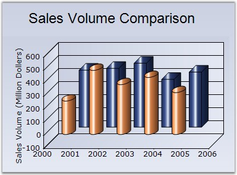

::: {style="DISPLAY: none"}
{#d2h_url_template}{#d2h_package_url style="WIDTH: 0px; DISPLAY: none; HEIGHT: 0px"}
:::

:::: {.d2h_secondary_topic style="PADDING-BOTTOM: 10pt; MARGIN: 0pt; PADDING-LEFT: 0pt; PADDING-RIGHT: 0pt; PADDING-TOP: 0pt"}
#### ColumnType {#columntype style="tab-stops: 0pt"}

 

Specifies whether the columns should be rendered as bars or cylinders.

 

::: {align="center"}
+-------------------------------------+------------------------------------------------------------------------------------------------------+
| Details                                                                                                                                    |
+-------------------------------------+------------------------------------------------------------------------------------------------------+
| **Possible Values**                 | Box - Renders the columns as boxes.\                                                                 |
|                                     | Cylinder - Renders the columns as cylinders.                                                         |
+-------------------------------------+------------------------------------------------------------------------------------------------------+
| **Default Value    **               | **Box**                                                                                              |
+-------------------------------------+------------------------------------------------------------------------------------------------------+
| **2D / 3D Limitations**             | 3D only                                                                                              |
+-------------------------------------+------------------------------------------------------------------------------------------------------+
| **Applies to Chart Element**        | All series                                                                                           |
+-------------------------------------+------------------------------------------------------------------------------------------------------+
| **Applies to Chart Types**          | Column Chart, Column Range Chart, Stacking Column Chart, Candle Chart, Bar Chart, Stacking Bar Chart |
+-------------------------------------+------------------------------------------------------------------------------------------------------+
:::

 

Here is some sample.

 

+--------------------------------------------------------------------------------------------------------------------------------------------------------------------------------------------------------------+
| **[\[C#\]]{style="FONT-FAMILY: 'Courier New'; COLOR: black"}**                                                                                                                                               |
|                                                                                                                                                                                                              |
| **[]{style="FONT-FAMILY: 'Courier New'; COLOR: black"}**                                                                                                                                                     |
|                                                                                                                                                                                                              |
| [this]{style="FONT-FAMILY: 'Courier New'; COLOR: blue"}[.chartControl1.Series\[0\].ConfigItems.ColumnItem.ColumnType = [ChartColumnType]{style="COLOR: teal"}.Cylinder;]{style="FONT-FAMILY: 'Courier New'"} |
|                                                                                                                                                                                                              |
| [this]{style="FONT-FAMILY: 'Courier New'; COLOR: blue"}[.chartControl1.Series\[1\].ConfigItems.ColumnItem.ColumnType = [ChartColumnType]{style="COLOR: teal"}.Box;]{style="FONT-FAMILY: 'Courier New'"}      |
+--------------------------------------------------------------------------------------------------------------------------------------------------------------------------------------------------------------+

 

+-------------------------------------------------------------------------------------------------------------------------------------------------------------------------------------------------------------------------------------------------------------------------------------------------------+
| **[\[VB.NET\]]{style="FONT-FAMILY: 'Courier New'; COLOR: black"}**                                                                                                                                                                                                                                    |
|                                                                                                                                                                                                                                                                                                       |
| **[]{style="FONT-FAMILY: 'Courier New'; COLOR: black"}**                                                                                                                                                                                                                                              |
|                                                                                                                                                                                                                                                                                                       |
| [Me]{style="FONT-FAMILY: 'Courier New'; COLOR: blue"}[.chartControl1.Series(0).ConfigItems.ColumnItem.ColumnType = ]{style="FONT-FAMILY: 'Courier New'; COLOR: black"}[ChartColumnType]{style="FONT-FAMILY: 'Courier New'; COLOR: teal"}[.Cylinder]{style="FONT-FAMILY: 'Courier New'; COLOR: black"} |
|                                                                                                                                                                                                                                                                                                       |
| [Me]{style="FONT-FAMILY: 'Courier New'; COLOR: blue"}[.chartControl1.Series(1).ConfigItems.ColumnItem.ColumnType = ]{style="FONT-FAMILY: 'Courier New'; COLOR: black"}[ChartColumnType]{style="FONT-FAMILY: 'Courier New'; COLOR: teal"}[.Box]{style="FONT-FAMILY: 'Courier New'; COLOR: black"}      |
+-------------------------------------------------------------------------------------------------------------------------------------------------------------------------------------------------------------------------------------------------------------------------------------------------------+

 

{border="0"}

**[]{style="COLOR: black; FONT-SIZE: 8pt"}** 

Figure 107: Column Chart

[]{style="COLOR: black; FONT-SIZE: 8pt"} 

See Also

 

[Column Chart]{.UGHyperlink}, [Column Range Chart]{.UGHyperlink}, [Stacking Column Chart]{.UGHyperlink}, [Candle Chart]{.UGHyperlink}, [Bar Chart]{.UGHyperlink}, [Stacking Bar Chart]{.UGHyperlink}[]{style="COLOR: black"}

 

[]{#p84} 

 

[]{#related-topics}
::::
