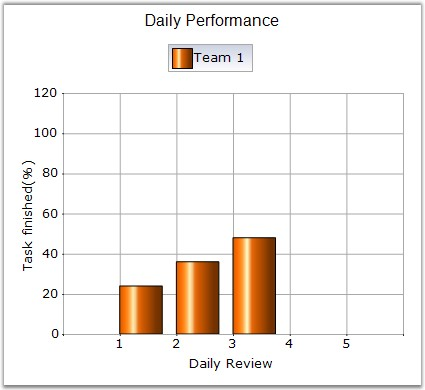
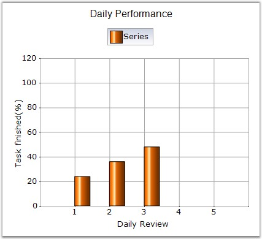

::: {style="DISPLAY: none"}
{#d2h_url_template}{#d2h_package_url style="WIDTH: 0px; DISPLAY: none; HEIGHT: 0px"}
:::

::::: {.d2h_secondary_topic style="PADDING-BOTTOM: 10pt; MARGIN: 0pt; PADDING-LEFT: 0pt; PADDING-RIGHT: 0pt; PADDING-TOP: 0pt"}
#### ColumnWidthMode {#columnwidthmode style="tab-stops: 0pt"}

[]{style="FONT-FAMILY: 'Trebuchet MS','sans-serif'; FONT-SIZE: 9pt"} 

Specifies the width drawing mode for columns in a column chart.

[]{style="FONT-FAMILY: 'Trebuchet MS','sans-serif'; FONT-SIZE: 9pt"} 

::: {align="center"}
+-------------------------------------+------------------------------------------------------------------------------------------------------------------------------------------------------------------------------------------------------------------------+
|                                                                                                                                                                                                                                                              |
|                                                                                                                                                                                                                                                              |
| Details                                                                                                                                                                                                                                                      |
+-------------------------------------+------------------------------------------------------------------------------------------------------------------------------------------------------------------------------------------------------------------------+
| Possible Values                     | DefaultWidthMode - The width of the columns will always be calculated to fill the space between columns.                                                                                                               |
|                                     |                                                                                                                                                                                                                        |
|                                     | FixedWidthMode - The width should be given in Series.Points\[i\].YValues\[1\], in pixels. If the width of the columns are not given in point YValues\[1\], then they are calculated to fill the space between columns. |
|                                     |                                                                                                                                                                                                                        |
|                                     | RelativeWidthMode - Similar to the FixedWidthMode, the width is specified in YValues\[1\], but in units of X-axis range.                                                                                               |
+-------------------------------------+------------------------------------------------------------------------------------------------------------------------------------------------------------------------------------------------------------------------+
| Default Value                       | DefaultWidthMode                                                                                                                                                                                                       |
+-------------------------------------+------------------------------------------------------------------------------------------------------------------------------------------------------------------------------------------------------------------------+
| 2D / 3D Limitations                 | No                                                                                                                                                                                                                     |
+-------------------------------------+------------------------------------------------------------------------------------------------------------------------------------------------------------------------------------------------------------------------+
| Applies to Chart Element            | All Series                                                                                                                                                                                                             |
+-------------------------------------+------------------------------------------------------------------------------------------------------------------------------------------------------------------------------------------------------------------------+
| Applies to Chart Types              | Column charts, BoxAndWhiskerChart, Candle Chart                                                                                                                                                                        |
+-------------------------------------+------------------------------------------------------------------------------------------------------------------------------------------------------------------------------------------------------------------------+
:::

**[]{style="COLOR: red; FONT-SIZE: 8pt"}** 

Here is some sample code.

[]{style="FONT-FAMILY: 'Trebuchet MS','sans-serif'; FONT-SIZE: 9pt"} 

+--------------------------------------------------------------------------------------------------------------------------------------------------------------------------------------------------------------------+
| **[\[C#\]]{style="FONT-FAMILY: 'Courier New'; COLOR: black"}**                                                                                                                                                     |
|                                                                                                                                                                                                                    |
| **[]{style="FONT-FAMILY: 'Courier New'; COLOR: black"}**                                                                                                                                                           |
|                                                                                                                                                                                                                    |
| [ChartSeries]{style="FONT-FAMILY: 'Courier New'; COLOR: teal"}[ series1 = [new]{style="COLOR: blue"} [ChartSeries]{style="COLOR: teal"}([\"Series\"]{style="COLOR: maroon"});]{style="FONT-FAMILY: 'Courier New'"} |
|                                                                                                                                                                                                                    |
| [series.Points.Add(1, 24);]{style="FONT-FAMILY: 'Courier New'"}                                                                                                                                                    |
|                                                                                                                                                                                                                    |
| [series.Points.Add(2, 36);]{style="FONT-FAMILY: 'Courier New'"}                                                                                                                                                    |
|                                                                                                                                                                                                                    |
| [series.Points.Add(3, 48);]{style="FONT-FAMILY: 'Courier New'"}                                                                                                                                                    |
|                                                                                                                                                                                                                    |
| [ChartWebControl1.Series.Add(series1);]{style="FONT-FAMILY: 'Courier New'"}                                                                                                                                        |
|                                                                                                                                                                                                                    |
| [ChartWebControl1.ColumnWidthMode = [ChartColumnWidthMode]{style="COLOR: teal"}.DefaultWidthMode;]{style="FONT-FAMILY: 'Courier New'"}                                                                             |
+--------------------------------------------------------------------------------------------------------------------------------------------------------------------------------------------------------------------+

[]{style="FONT-FAMILY: 'Trebuchet MS','sans-serif'; FONT-SIZE: 9pt"} 

+--------------------------------------------------------------------------------------------------------------------------------------------------------------------------------------------------------------------------------------------------+
| **[\[VB.NET\]]{style="FONT-FAMILY: 'Courier New'; COLOR: black"}**                                                                                                                                                                               |
|                                                                                                                                                                                                                                                  |
| **[]{style="FONT-FAMILY: 'Courier New'; COLOR: black"}**                                                                                                                                                                                         |
|                                                                                                                                                                                                                                                  |
| [Dim]{style="FONT-FAMILY: 'Courier New'; COLOR: blue"}[ series1 [As]{style="COLOR: blue"} [ChartSeries]{style="COLOR: teal"} = [New]{style="COLOR: blue"} ChartSeries(\"[Series]{style="COLOR: #993300"}\")]{style="FONT-FAMILY: 'Courier New'"} |
|                                                                                                                                                                                                                                                  |
| [series.Points.Add(1, 24)]{style="FONT-FAMILY: 'Courier New'"}                                                                                                                                                                                   |
|                                                                                                                                                                                                                                                  |
| [series.Points.Add(2, 36)]{style="FONT-FAMILY: 'Courier New'"}                                                                                                                                                                                   |
|                                                                                                                                                                                                                                                  |
| [series.Points.Add(3, 48)]{style="FONT-FAMILY: 'Courier New'"}                                                                                                                                                                                   |
|                                                                                                                                                                                                                                                  |
| [ChartWebControl1.Series.Add(series1)]{style="FONT-FAMILY: 'Courier New'"}                                                                                                                                                                       |
|                                                                                                                                                                                                                                                  |
| [ChartWebControl1.ColumnWidthMode = [ChartColumnWidthMode]{style="COLOR: teal"}.DefaultWidthMode ]{style="FONT-FAMILY: 'Courier New'"}                                                                                                           |
+--------------------------------------------------------------------------------------------------------------------------------------------------------------------------------------------------------------------------------------------------+

**[]{style="FONT-FAMILY: 'Trebuchet MS','sans-serif'; FONT-SIZE: 9pt"}** 

{border="0"}

**[]{style="FONT-FAMILY: 'Trebuchet MS','sans-serif'; FONT-SIZE: 9pt"}** 

Figure 101: Column Chart with DefaultWidthMode

**[]{style="FONT-FAMILY: 'Trebuchet MS','sans-serif'; FONT-SIZE: 9pt"}** 

+----------------------------------------------------------------------------------------------------------------------------------------------------------------------------------------------------------------------------------+
| **[\[C#\]]{style="FONT-FAMILY: 'Courier New'; COLOR: black"}**                                                                                                                                                                   |
|                                                                                                                                                                                                                                  |
| **[]{style="FONT-FAMILY: 'Courier New'; COLOR: black"}**                                                                                                                                                                         |
|                                                                                                                                                                                                                                  |
| [double]{style="FONT-FAMILY: 'Courier New'; COLOR: blue"}[ Interval = [this]{style="COLOR: blue"}.ChartWebControl1.PrimaryXAxis.Range.Interval;]{style="FONT-FAMILY: 'Courier New'"}                                             |
|                                                                                                                                                                                                                                  |
| []{style="FONT-FAMILY: 'Courier New'"}                                                                                                                                                                                           |
|                                                                                                                                                                                                                                  |
| [ChartSeries]{style="FONT-FAMILY: 'Courier New'; COLOR: teal"}[ series = [this]{style="COLOR: blue"}.ChartWebControl1.Model.NewSeries([\"Team 1\"]{style="COLOR: maroon"});                ]{style="FONT-FAMILY: 'Courier New'"} |
|                                                                                                                                                                                                                                  |
| [// 2nd Y value specifies the column width]{style="FONT-FAMILY: 'Courier New'"}                                                                                                                                                  |
|                                                                                                                                                                                                                                  |
| [series.Points.Add(1, [new]{style="COLOR: blue"} [double]{style="COLOR: blue"}\[\] { 24, Interval \* 0.75 });]{style="FONT-FAMILY: 'Courier New'"}                                                                               |
|                                                                                                                                                                                                                                  |
| [series.Points.Add(2, [new]{style="COLOR: blue"} [double]{style="COLOR: blue"}\[\] { 36, Interval \* 0.75 });]{style="FONT-FAMILY: 'Courier New'"}                                                                               |
|                                                                                                                                                                                                                                  |
| [series.Points.Add(3, [new]{style="COLOR: blue"} [double]{style="COLOR: blue"}\[\] { 48, Interval \* 0.75 }); ]{style="FONT-FAMILY: 'Courier New'"}                                                                              |
|                                                                                                                                                                                                                                  |
| [this]{style="FONT-FAMILY: 'Courier New'; COLOR: blue"}[.ChartWebControl1.Series.Add(series);]{style="FONT-FAMILY: 'Courier New'"}                                                                                               |
|                                                                                                                                                                                                                                  |
| []{style="FONT-FAMILY: 'Courier New'"}                                                                                                                                                                                           |
|                                                                                                                                                                                                                                  |
| [this]{style="FONT-FAMILY: 'Courier New'; COLOR: blue"}[.ChartWebControl1.ColumnWidthMode = [ChartColumnWidthMode]{style="COLOR: teal"}.RelativeWidthMode;]{style="FONT-FAMILY: 'Courier New'"}                                  |
+----------------------------------------------------------------------------------------------------------------------------------------------------------------------------------------------------------------------------------+

[]{style="FONT-FAMILY: 'Trebuchet MS','sans-serif'; FONT-SIZE: 9pt"} 

+---------------------------------------------------------------------------------------------------------------------------------------------------------------------------------------------------------------------------------------------------------------------+
| **[\[VB.NET\]]{style="FONT-FAMILY: 'Courier New'; COLOR: black"}**                                                                                                                                                                                                  |
|                                                                                                                                                                                                                                                                     |
| **[]{style="FONT-FAMILY: 'Courier New'; COLOR: black"}**                                                                                                                                                                                                            |
|                                                                                                                                                                                                                                                                     |
| [Dim]{style="FONT-FAMILY: 'Courier New'; COLOR: blue"}[ Interval [As]{style="COLOR: blue"} [Double]{style="COLOR: blue"} = [Me]{style="COLOR: blue"}.ChartWebControl1.PrimaryXAxis.Range.Interval]{style="FONT-FAMILY: 'Courier New'"}                              |
|                                                                                                                                                                                                                                                                     |
| []{style="FONT-FAMILY: 'Courier New'"}                                                                                                                                                                                                                              |
|                                                                                                                                                                                                                                                                     |
| [Dim]{style="FONT-FAMILY: 'Courier New'; COLOR: blue"}[ series [As]{style="COLOR: blue"} [ChartSeries]{style="COLOR: teal"} = [Me]{style="COLOR: blue"}.ChartWebControl1.Model.NewSeries(\"[Team 1]{style="COLOR: #993300"}\")]{style="FONT-FAMILY: 'Courier New'"} |
|                                                                                                                                                                                                                                                                     |
| [\' 2nd Y value specifies the column width]{style="FONT-FAMILY: 'Courier New'"}                                                                                                                                                                                     |
|                                                                                                                                                                                                                                                                     |
| [series.Points.Add(1, [New]{style="COLOR: blue"} [Double]{style="COLOR: blue"}() { 24, Interval \* 0.75 })]{style="FONT-FAMILY: 'Courier New'"}                                                                                                                     |
|                                                                                                                                                                                                                                                                     |
| [series.Points.Add(2, [New]{style="COLOR: blue"} [Double]{style="COLOR: blue"}() { 36, Interval \* 0.75 })]{style="FONT-FAMILY: 'Courier New'"}                                                                                                                     |
|                                                                                                                                                                                                                                                                     |
| [series.Points.Add(3, [New]{style="COLOR: blue"} [Double]{style="COLOR: blue"}() { 48, Interval \* 0.75 })]{style="FONT-FAMILY: 'Courier New'"}                                                                                                                     |
|                                                                                                                                                                                                                                                                     |
| [Me]{style="FONT-FAMILY: 'Courier New'; COLOR: blue"}[.ChartWebControl1.Series.Add(series)]{style="FONT-FAMILY: 'Courier New'"}                                                                                                                                     |
|                                                                                                                                                                                                                                                                     |
| []{style="FONT-FAMILY: 'Courier New'"}                                                                                                                                                                                                                              |
|                                                                                                                                                                                                                                                                     |
| [Me]{style="FONT-FAMILY: 'Courier New'; COLOR: blue"}[.ChartWebControl1.ColumnWidthMode = [ChartColumnWidthMode]{style="COLOR: teal"}.RelativeWidthMode]{style="FONT-FAMILY: 'Courier New'"}                                                                        |
+---------------------------------------------------------------------------------------------------------------------------------------------------------------------------------------------------------------------------------------------------------------------+

**[]{style="FONT-FAMILY: 'Trebuchet MS','sans-serif'; FONT-SIZE: 9pt"}** 

{border="0"}

**[]{style="FONT-FAMILY: 'Trebuchet MS','sans-serif'; FONT-SIZE: 9pt"}** 

Figure 102: Column Chart with RelativeWidthMode

**[]{style="FONT-FAMILY: 'Trebuchet MS','sans-serif'; FONT-SIZE: 9pt"}** 

+--------------------------------------------------------------------------------------------------------------------------------------------------------------------------------------------------------------------+
| **[\[C#\]]{style="FONT-FAMILY: 'Courier New'; COLOR: black"}**                                                                                                                                                     |
|                                                                                                                                                                                                                    |
| **[]{style="FONT-FAMILY: 'Courier New'; COLOR: black"}**                                                                                                                                                           |
|                                                                                                                                                                                                                    |
| [ChartSeries]{style="FONT-FAMILY: 'Courier New'; COLOR: teal"}[ series1 = [new]{style="COLOR: blue"} [ChartSeries]{style="COLOR: teal"}([\"Series\"]{style="COLOR: maroon"});]{style="FONT-FAMILY: 'Courier New'"} |
|                                                                                                                                                                                                                    |
| [// 2nd Y value specifies the column width]{style="FONT-FAMILY: 'Courier New'"}                                                                                                                                    |
|                                                                                                                                                                                                                    |
| [series1.Points.Add(1, [new]{style="COLOR: blue"} [double]{style="COLOR: blue"}\[\] { 24, 25});]{style="FONT-FAMILY: 'Courier New'"}                                                                               |
|                                                                                                                                                                                                                    |
| [series1.Points.Add(2, [new]{style="COLOR: blue"} [double]{style="COLOR: blue"}\[\] { 36, 25});]{style="FONT-FAMILY: 'Courier New'"}                                                                               |
|                                                                                                                                                                                                                    |
| [series1.Points.Add(3, [new]{style="COLOR: blue"} [double]{style="COLOR: blue"}\[\] { 48, 25});]{style="FONT-FAMILY: 'Courier New'"}                                                                               |
|                                                                                                                                                                                                                    |
| [ChartWebControl1.Series.Add(series1);]{style="FONT-FAMILY: 'Courier New'"}                                                                                                                                        |
|                                                                                                                                                                                                                    |
| [ChartWebControl1.ColumnWidthMode = [ChartColumnWidthMode]{style="COLOR: teal"}.FixedWidthMode;]{style="FONT-FAMILY: 'Courier New'"}                                                                               |
+--------------------------------------------------------------------------------------------------------------------------------------------------------------------------------------------------------------------+

[]{style="FONT-FAMILY: 'Trebuchet MS','sans-serif'; FONT-SIZE: 9pt"} 

+---------------------------------------------------------------------------------------------------------------------------------------------------------------------------------------------------------------------------+
| **[\[VB.NET\]]{style="FONT-FAMILY: 'Courier New'; COLOR: black"}**                                                                                                                                                        |
|                                                                                                                                                                                                                           |
| **[]{style="FONT-FAMILY: 'Courier New'; COLOR: black"}**                                                                                                                                                                  |
|                                                                                                                                                                                                                           |
| [Dim]{style="FONT-FAMILY: 'Courier New'; COLOR: blue"}[ series1 [As]{style="COLOR: blue"} ChartSeries = [New]{style="COLOR: blue"} ChartSeries(\"[Series]{style="COLOR: #993300"}\")]{style="FONT-FAMILY: 'Courier New'"} |
|                                                                                                                                                                                                                           |
| [\' 2nd Y value specifies the column width]{style="FONT-FAMILY: 'Courier New'"}                                                                                                                                           |
|                                                                                                                                                                                                                           |
| [series1.Points.Add(1, [New]{style="COLOR: blue"} [Double]{style="COLOR: blue"}() { 24, 25})]{style="FONT-FAMILY: 'Courier New'"}                                                                                         |
|                                                                                                                                                                                                                           |
| [series1.Points.Add(2, [New]{style="COLOR: blue"} [Double]{style="COLOR: blue"}() { 36, 25})]{style="FONT-FAMILY: 'Courier New'"}                                                                                         |
|                                                                                                                                                                                                                           |
| [series1.Points.Add(3, [New]{style="COLOR: blue"} [Double]{style="COLOR: blue"}() { 48, 25})]{style="FONT-FAMILY: 'Courier New'"}                                                                                         |
|                                                                                                                                                                                                                           |
| [ChartWebControl1.Series.Add(series1) ]{style="FONT-FAMILY: 'Courier New'"}                                                                                                                                               |
|                                                                                                                                                                                                                           |
| [ChartWebControl1.ColumnWidthMode = [ChartColumnWidthMode]{style="COLOR: teal"}.FixedWidthMode ]{style="FONT-FAMILY: 'Courier New'"}                                                                                      |
+---------------------------------------------------------------------------------------------------------------------------------------------------------------------------------------------------------------------------+

**[]{style="FONT-FAMILY: 'Trebuchet MS','sans-serif'; FONT-SIZE: 9pt"}** 

::: {style="BORDER-BOTTOM: windowtext 1pt solid; BORDER-LEFT: medium none; PADDING-BOTTOM: 1pt; MARGIN-TOP: 9pt; PADDING-LEFT: 0pt; PADDING-RIGHT: 0pt; MARGIN-BOTTOM: 9pt; BORDER-TOP: windowtext 1pt solid; BORDER-RIGHT: medium none; PADDING-TOP: 1pt"}
{border="0"}Note: The width of the column can also be specified by ColumnFixedWidth property. If both second Y value and ColumnFixedWidth are specified, second Y value takes higher priority.
:::

[]{style="FONT-FAMILY: 'Trebuchet MS','sans-serif'; FONT-SIZE: 9pt"} 

{border="0"}

**[]{style="FONT-FAMILY: 'Trebuchet MS','sans-serif'; FONT-SIZE: 9pt"}** 

Figure 103: Column Chart with FixedWidthMode

[]{style="FONT-FAMILY: 'Trebuchet MS','sans-serif'; FONT-SIZE: 9pt"} 

See Also

**[]{style="FONT-FAMILY: 'Trebuchet MS','sans-serif'; FONT-SIZE: 9pt"}** 

[[ColumnFixedWidth]{.UGHyperlink}](ms-xhelp:///?Id=f561904f-bd17-40a3-a1b6-498ed5d46c43)[, ]{.UGHyperlink}[[Column Charts]{.UGHyperlink}](ms-xhelp:///?Id=07dff027-c96d-450f-9a9b-6037f838f4da)[, ]{.UGHyperlink}[[Candle Chart]{.UGHyperlink}](ms-xhelp:///?Id=f6d7bb1e-6e5a-4165-9dda-eab8aceb7e4d)[, ]{.UGHyperlink}[[Box and Whisker Chart]{.UGHyperlink}](ms-xhelp:///?Id=f561904f-bd17-40a3-a1b6-498ed5d46c43)[]{.UGHyperlink}

[]{#p84} 

[]{#related-topics}
:::::
