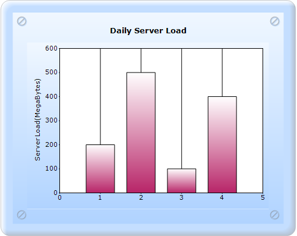
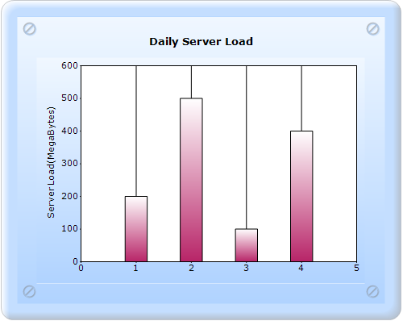
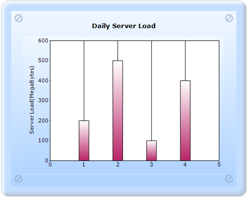

::: {style="DISPLAY: none"}
{#d2h_url_template}{#d2h_package_url style="WIDTH: 0px; DISPLAY: none; HEIGHT: 0px"}
:::

:::::::: {.d2h_secondary_topic style="PADDING-BOTTOM: 10pt; MARGIN: 0pt; PADDING-LEFT: 0pt; PADDING-RIGHT: 0pt; PADDING-TOP: 0pt"}
##### ColumnWidthMode and ColumnFixedWidth {#columnwidthmode-and-columnfixedwidth style="tab-stops: 0pt"}

###### 5.2.1.3.1.1 ColumnWidthMode {#columnwidthmode style="tab-stops: 0pt"}

ColumnWidthMode specifies the width drawing mode for the columns in a Column chart.

::: {align="center"}
+-------------------------------------+----------------------------------------------------------------------------------------------------------------------------------------------------------------------------------------------------------------------------+
| Details                                                                                                                                                                                                                                                          |
+-------------------------------------+----------------------------------------------------------------------------------------------------------------------------------------------------------------------------------------------------------------------------+
| Possible values                     | **DefaultWidthMode** - The width of the columns will always be calculated to fill the space between columns.                                                                                                               |
|                                     |                                                                                                                                                                                                                            |
|                                     | **FixedWidthMode** - The width should be given in Series.Points\[i\].YValues\[1\], in pixels. If the width of the columns are not given in point YValues\[1\], then they are calculated to fill the space between columns. |
|                                     |                                                                                                                                                                                                                            |
|                                     | **RelativeWidthMode** - Similar to the FixedWidthMode, the width is specified in YValues\[1\] but in units of X-axis range.                                                                                                |
+-------------------------------------+----------------------------------------------------------------------------------------------------------------------------------------------------------------------------------------------------------------------------+
| Default value                       | DefaultWidthMode                                                                                                                                                                                                           |
+-------------------------------------+----------------------------------------------------------------------------------------------------------------------------------------------------------------------------------------------------------------------------+
| 2D/3D limitations                   | No                                                                                                                                                                                                                         |
+-------------------------------------+----------------------------------------------------------------------------------------------------------------------------------------------------------------------------------------------------------------------------+
| Application to chart element        | All series                                                                                                                                                                                                                 |
+-------------------------------------+----------------------------------------------------------------------------------------------------------------------------------------------------------------------------------------------------------------------------+
| Application to chart types          | Column charts, Box and Whisker chart, and Candle chart.                                                                                                                                                                    |
+-------------------------------------+----------------------------------------------------------------------------------------------------------------------------------------------------------------------------------------------------------------------------+
:::

 

The following is the DefaultWidthMode chart image:

{border="0"}

Figure 189: Chart with default ColumnWidthMode

[]{style="FONT-FAMILY: 'Calibri','sans-serif'"} 

###### []{#_ColumnFixedWidth}5.2.1.3.1.2 ColumnFixedWidth {#columnfixedwidth style="tab-stops: 0pt"}

ColumnFixedWidth specifies the width of each column when ColumnWidthMode is set to FixedWidthMode.

::: {align="center"}
+------------------------------+---------------------------------------------------------+
| Details                                                                                |
+------------------------------+---------------------------------------------------------+
| Possible values              | An integer value.                                       |
+------------------------------+---------------------------------------------------------+
| Default value                | 20                                                      |
+------------------------------+---------------------------------------------------------+
| 2D/3D limitations            | None                                                    |
+------------------------------+---------------------------------------------------------+
| Application to chart element | All series                                              |
+------------------------------+---------------------------------------------------------+
| Application to chart types   | Column charts, Box and Whisker chart, and Candle chart. |
+------------------------------+---------------------------------------------------------+
:::

Chart with the ColumnWidthMode and ColumnFixedWidth properties can be created through two ways:

[·      ]{style="FONT-FAMILY: Symbol"}Builder

[·      ]{style="FONT-FAMILY: Symbol"}ChartModel

###### 5.2.1.3.1.3 Implementation For Relative Width Mode {#implementation-for-relative-width-mode style="tab-stops: 0pt"}

5.2.1.3.1.3.1      Builder

[]{style="FONT-FAMILY: 'Calibri','sans-serif'"} 

The steps to create a chart with the ColumnWidthMode and ColumnFixedWidth properties through Builder are as follows:

1.   In Controller, return view to the Aspx page.

[]{style="FONT-FAMILY: 'Calibri','sans-serif'"} 

::: {style="BORDER-BOTTOM: #c8c8c8 1pt solid; BORDER-LEFT: #c8c8c8 1pt solid; PADDING-BOTTOM: 1pt; MARGIN-TOP: 0pt; PADDING-LEFT: 4pt; PADDING-RIGHT: 4pt; MARGIN-BOTTOM: 0pt; BACKGROUND: #f0f0f0; BORDER-TOP: #c8c8c8 1pt solid; BORDER-RIGHT: #c8c8c8 1pt solid; PADDING-TOP: 1pt"}
\[C#\]

[        [public]{style="COLOR: blue"} [ActionResult]{style="COLOR: #2b91af"} SimpleChart()]{style="FONT-FAMILY: 'Courier New'"}

[        {            ]{style="FONT-FAMILY: 'Courier New'"}

[            [return]{style="COLOR: blue"} View();]{style="FONT-FAMILY: 'Courier New'"}

[        }]{style="FONT-FAMILY: 'Courier New'"}
:::

[]{style="FONT-FAMILY: 'Calibri','sans-serif'"} 

2.   In View, invoke the ChartBuilder with the control ID as the first argument.

3.   Create the **Series** and **Points**, and set the style for the chart.

4.   Set the ColumnWidthMode to **RelativeWidthMode**.

[]{style="FONT-FAMILY: 'Calibri','sans-serif'"} 

::: {style="BORDER-BOTTOM: #c8c8c8 1pt solid; BORDER-LEFT: #c8c8c8 1pt solid; PADDING-BOTTOM: 1pt; MARGIN-TOP: 0pt; PADDING-LEFT: 4pt; PADDING-RIGHT: 4pt; MARGIN-BOTTOM: 0pt; BACKGROUND: #f0f0f0; BORDER-TOP: #c8c8c8 1pt solid; BORDER-RIGHT: #c8c8c8 1pt solid; PADDING-TOP: 1pt"}
View \[ASPX\]

[    [\<%]{style="BACKGROUND: yellow"}[=]{style="COLOR: blue"} Html.Chart([\"SimpleChart\"]{style="COLOR: #a31515"}).Series(series =\>]{style="FONT-FAMILY: 'Courier New'"}

[{]{style="FONT-FAMILY: 'Courier New'"}

[    series.Add().Type(Syncfusion.Windows.Forms.Chart.[ChartSeriesType]{style="COLOR: #2b91af"}.Column)]{style="FONT-FAMILY: 'Courier New'"}

[                .Text([\"Server 1\"]{style="COLOR: #a31515"})]{style="FONT-FAMILY: 'Courier New'"}

[                .Points(point =\>]{style="FONT-FAMILY: 'Courier New'"}

[                {]{style="FONT-FAMILY: 'Courier New'"}

**[                    point.Add(1, [new]{style="COLOR: blue"} [double]{style="COLOR: blue"}\[\] { 200, 0.4 });]{style="FONT-FAMILY: 'Courier New'"}**

**[                    point.Add(2, [new]{style="COLOR: blue"} [double]{style="COLOR: blue"}\[\] { 500, 0.4 });]{style="FONT-FAMILY: 'Courier New'"}**

**[                    point.Add(3, [new]{style="COLOR: blue"} [double]{style="COLOR: blue"}\[\] { 100, 0.4 });]{style="FONT-FAMILY: 'Courier New'"}**

**[                    point.Add(4, [new]{style="COLOR: blue"} [double]{style="COLOR: blue"}\[\] { 400, 0.4 });]{style="FONT-FAMILY: 'Courier New'"}**

[                });]{style="FONT-FAMILY: 'Courier New'"}

[})]{style="FONT-FAMILY: 'Courier New'"}

[// \-\-\-\-\-\-\-\-\-\-\-\-- Set all styling properties to ChartModel\-\-\-\--]{style="FONT-FAMILY: 'Courier New'; COLOR: green"}[                **.ColumnWidthMode(Syncfusion.Windows.Forms.Chart.[ChartColumnWidthMode]{style="COLOR: #2b91af"}.RelativeWidthMode)**]{style="FONT-FAMILY: 'Courier New'"}

[        ]{style="FONT-FAMILY: 'Courier New'"}

[    [%\>]{style="BACKGROUND: yellow"}]{style="FONT-FAMILY: 'Courier New'"}
:::

[]{style="FONT-FAMILY: 'Calibri','sans-serif'"} 

::: {style="BORDER-BOTTOM: #c8c8c8 1pt solid; BORDER-LEFT: #c8c8c8 1pt solid; PADDING-BOTTOM: 1pt; MARGIN-TOP: 0pt; PADDING-LEFT: 4pt; PADDING-RIGHT: 4pt; MARGIN-BOTTOM: 0pt; BACKGROUND: #f0f0f0; BORDER-TOP: #c8c8c8 1pt solid; BORDER-RIGHT: #c8c8c8 1pt solid; PADDING-TOP: 1pt"}
View \[cshtml\]

[   [\@{]{style="BACKGROUND: yellow"} Html.Chart([\"SimpleChart\"]{style="COLOR: #a31515"}).Series(series =\>]{style="FONT-FAMILY: 'Courier New'"}

[{]{style="FONT-FAMILY: 'Courier New'"}

[    series.Add().Type(Syncfusion.Windows.Forms.Chart.[ChartSeriesType]{style="COLOR: #2b91af"}.Column)]{style="FONT-FAMILY: 'Courier New'"}

[                .Text([\"Server 1\"]{style="COLOR: #a31515"})]{style="FONT-FAMILY: 'Courier New'"}

[                .Points(point =\>]{style="FONT-FAMILY: 'Courier New'"}

[                {]{style="FONT-FAMILY: 'Courier New'"}

**[                    point.Add(1, [new]{style="COLOR: blue"} [double]{style="COLOR: blue"}\[\] { 200, 0.4 });]{style="FONT-FAMILY: 'Courier New'"}**

**[                    point.Add(2, [new]{style="COLOR: blue"} [double]{style="COLOR: blue"}\[\] { 500, 0.4 });]{style="FONT-FAMILY: 'Courier New'"}**

**[                    point.Add(3, [new]{style="COLOR: blue"} [double]{style="COLOR: blue"}\[\] { 100, 0.4 });]{style="FONT-FAMILY: 'Courier New'"}**

**[                    point.Add(4, [new]{style="COLOR: blue"} [double]{style="COLOR: blue"}\[\] { 400, 0.4 });]{style="FONT-FAMILY: 'Courier New'"}**

[                });]{style="FONT-FAMILY: 'Courier New'"}

[})]{style="FONT-FAMILY: 'Courier New'"}

[// \-\-\-\-\-\-\-\-\-\-\-\-- Set all styling properties to ChartModel\-\-\-\--]{style="FONT-FAMILY: 'Courier New'; COLOR: green"}[                **.ColumnWidthMode(Syncfusion.Windows.Forms.Chart.[ChartColumnWidthMode]{style="COLOR: #2b91af"}.RelativeWidthMode)**.Render();]{style="FONT-FAMILY: 'Courier New'"}

[        ]{style="FONT-FAMILY: 'Courier New'"}

[    [}]{style="BACKGROUND: yellow"}]{style="FONT-FAMILY: 'Courier New'"}
:::

 

5.2.1.3.1.3.2      ChartModel

[]{style="FONT-FAMILY: 'Calibri','sans-serif'"} 

To create a chart with the ColumnWidthMode and ColumnFixedWidth properties through ChartModel:

1.   In Controller, create an instance for **MVCChartModel**.

2.   Create an instance for **ChartSeries**, add the **Points**, set any*[ ]{style="COLOR: #404040"}*style, and add the **Series** to the Chart[M]{style="COLOR: #404040"}odel.

3.   Set the style for the [chart]{style="COLOR: #404040"}.

4.   Set the ColumnWidthMode to **RelativeWidthMode**.

5.   Return the view by setting the ChartModel in the ViewData.

 

+--------------------------------------------------------------------------------------------------------------------------------------------------------------------------------------------------------------------------------------------------------------+
| \[C#\]                                                                                                                                                                                                                                                       |
|                                                                                                                                                                                                                                                              |
| [        ]{style="FONT-FAMILY: Consolas; FONT-SIZE: 9.5pt"}[public]{style="FONT-FAMILY: 'Courier New'; COLOR: blue"}[ [ActionResult]{style="COLOR: #2b91af"} SimpleChart()]{style="FONT-FAMILY: 'Courier New'"}                                              |
|                                                                                                                                                                                                                                                              |
| [        {            ]{style="FONT-FAMILY: 'Courier New'"}                                                                                                                                                                                                  |
|                                                                                                                                                                                                                                                              |
| [            [MVCChartModel]{style="COLOR: #2b91af"} chartModel = [new]{style="COLOR: blue"} [MVCChartModel]{style="COLOR: #2b91af"}();]{style="FONT-FAMILY: 'Courier New'"}                                                                                 |
|                                                                                                                                                                                                                                                              |
| [            [// Create chart series and add data points to it.]{style="COLOR: green"}]{style="FONT-FAMILY: 'Courier New'"}                                                                                                                                  |
|                                                                                                                                                                                                                                                              |
| []{style="FONT-FAMILY: 'Courier New'"}                                                                                                                                                                                                                       |
|                                                                                                                                                                                                                                                              |
| [            [ChartSeries]{style="COLOR: #2b91af"} series1 = [new]{style="COLOR: blue"} [ChartSeries]{style="COLOR: #2b91af"}([\"Server1\"]{style="COLOR: #a31515"}, [ChartSeriesType]{style="COLOR: #2b91af"}.Column);]{style="FONT-FAMILY: 'Courier New'"} |
|                                                                                                                                                                                                                                                              |
| []{style="FONT-FAMILY: 'Courier New'"}                                                                                                                                                                                                                       |
|                                                                                                                                                                                                                                                              |
| **[            series1.Points.Add(1, 200, 0.4);]{style="FONT-FAMILY: 'Courier New'"}**                                                                                                                                                                       |
|                                                                                                                                                                                                                                                              |
| **[]{style="FONT-FAMILY: 'Courier New'"}**                                                                                                                                                                                                                   |
|                                                                                                                                                                                                                                                              |
| **[            series1.Points.Add(2, 500, 0.4);]{style="FONT-FAMILY: 'Courier New'"}**                                                                                                                                                                       |
|                                                                                                                                                                                                                                                              |
| **[]{style="FONT-FAMILY: 'Courier New'"}**                                                                                                                                                                                                                   |
|                                                                                                                                                                                                                                                              |
| **[            series1.Points.Add(3, 100, 0.4);]{style="FONT-FAMILY: 'Courier New'"}**                                                                                                                                                                       |
|                                                                                                                                                                                                                                                              |
| **[]{style="FONT-FAMILY: 'Courier New'"}**                                                                                                                                                                                                                   |
|                                                                                                                                                                                                                                                              |
| **[            series1.Points.Add(4, 400, 0.4);]{style="FONT-FAMILY: 'Courier New'"}**                                                                                                                                                                       |
|                                                                                                                                                                                                                                                              |
| [            ]{style="FONT-FAMILY: 'Courier New'"}                                                                                                                                                                                                           |
|                                                                                                                                                                                                                                                              |
| []{style="FONT-FAMILY: 'Courier New'"}                                                                                                                                                                                                                       |
|                                                                                                                                                                                                                                                              |
| [            [// Add the series to the chart series collection.]{style="COLOR: green"}]{style="FONT-FAMILY: 'Courier New'"}                                                                                                                                  |
|                                                                                                                                                                                                                                                              |
| []{style="FONT-FAMILY: 'Courier New'"}                                                                                                                                                                                                                       |
|                                                                                                                                                                                                                                                              |
| [            chartModel.Series.Add(series1);]{style="FONT-FAMILY: 'Courier New'"}                                                                                                                                                                            |
|                                                                                                                                                                                                                                                              |
| []{style="FONT-FAMILY: 'Courier New'"}                                                                                                                                                                                                                       |
|                                                                                                                                                                                                                                                              |
| [            **chartModel.ColumnWidthMode = [ChartColumnWidthMode]{style="COLOR: #2b91af"}.RelativeWidthMode;**]{style="FONT-FAMILY: 'Courier New'"}                                                                                                         |
|                                                                                                                                                                                                                                                              |
| []{style="FONT-FAMILY: 'Courier New'"}                                                                                                                                                                                                                       |
|                                                                                                                                                                                                                                                              |
| [// \-\-\-\-\-\-\-\-\-\-\-\-- Set all styling properties to ChartModel\-\-\-\--]{style="FONT-FAMILY: 'Courier New'; COLOR: green"}[                                ViewData.Model = chartModel;]{style="FONT-FAMILY: 'Courier New'"}                         |
|                                                                                                                                                                                                                                                              |
| [                  [return]{style="COLOR: blue"} View();    ]{style="FONT-FAMILY: 'Courier New'"}                                                                                                                                                            |
|                                                                                                                                                                                                                                                              |
| [ }]{style="FONT-FAMILY: 'Courier New'"}                                                                                                                                                                                                                     |
|                                                                                                                                                                                                                                                              |
| []{style="FONT-FAMILY: Consolas; COLOR: blue; FONT-SIZE: 9.5pt"}                                                                                                                                                                                             |
+--------------------------------------------------------------------------------------------------------------------------------------------------------------------------------------------------------------------------------------------------------------+

[]{style="FONT-FAMILY: Consolas; FONT-SIZE: 9.5pt"} 

6.   Invoke the ChartBuilder by using the control ID as the first argument, and convert the passed ViewData to **MVCChartModel** and pass it as the second argument.

[]{style="FONT-FAMILY: 'Calibri','sans-serif'"} 

+---------------------------------------------------------------------------------------------------------------------------------------------------------------------------------------------------------------------------------------------------------------------------------------------------------+
| View \[ASPX\]                                                                                                                                                                                                                                                                                           |
|                                                                                                                                                                                                                                                                                                         |
| [\<%]{style="FONT-FAMILY: 'Courier New'; BACKGROUND: yellow"}[=]{style="FONT-FAMILY: 'Courier New'; COLOR: blue"}[ Html.Chart([\"SimpleChart\"]{style="COLOR: #a31515"},([MVCChartModel]{style="COLOR: #2b91af"})ViewData.Model) [%\>]{style="BACKGROUND: yellow"}]{style="FONT-FAMILY: 'Courier New'"} |
|                                                                                                                                                                                                                                                                                                         |
| []{style="FONT-FAMILY: Consolas; COLOR: blue; FONT-SIZE: 9.5pt"}                                                                                                                                                                                                                                        |
+---------------------------------------------------------------------------------------------------------------------------------------------------------------------------------------------------------------------------------------------------------------------------------------------------------+

[]{style="FONT-FAMILY: 'Calibri','sans-serif'"} 

+--------------------------------------------------------------------------------------------------------------------------------------------------------------------------------------------------------------------------------------------------------------------------------------------------------------------------------------------------------------------------------------------------------+
| View \[cshtml\]                                                                                                                                                                                                                                                                                                                                                                                        |
|                                                                                                                                                                                                                                                                                                                                                                                                        |
| [  [@(]{style="BACKGROUND: yellow"}[new]{style="COLOR: blue"} [HtmlString]{style="COLOR: #2b91af"}(]{style="FONT-FAMILY: Consolas; FONT-SIZE: 9.5pt"}[Html.Chart([\"SimpleChart\"]{style="COLOR: #a31515"},([MVCChartModel]{style="COLOR: #2b91af"})ViewData.Model)]{style="FONT-FAMILY: 'Courier New'"}[.ToString())[)]{style="BACKGROUND: yellow"}]{style="FONT-FAMILY: Consolas; FONT-SIZE: 9.5pt"} |
|                                                                                                                                                                                                                                                                                                                                                                                                        |
| []{style="FONT-FAMILY: Consolas; COLOR: blue; FONT-SIZE: 9.5pt"}                                                                                                                                                                                                                                                                                                                                       |
+--------------------------------------------------------------------------------------------------------------------------------------------------------------------------------------------------------------------------------------------------------------------------------------------------------------------------------------------------------------------------------------------------------+

[]{style="FONT-FAMILY: 'Calibri','sans-serif'"} 

7.   Build and run the application. You will get the following output, now the column width is YValues\[1\] in every chart point.

[]{style="FONT-FAMILY: 'Calibri','sans-serif'"} 

{border="0"}

Figure 190: Column Width mode as RelativeWidthMode

[]{style="FONT-FAMILY: 'Calibri','sans-serif'"} 

###### 5.2.1.3.1.4 Implementation For Fixed Width Mode {#implementation-for-fixed-width-mode style="tab-stops: 0pt"}

5.2.1.3.1.4.1      Builder

[]{style="FONT-FAMILY: 'Calibri','sans-serif'"} 

To create a chart with the ColumnWidthMode and ColumnFixedWidth properties through Builder:

1.   In Controller, return View to the Aspx page.

[]{style="FONT-FAMILY: 'Calibri','sans-serif'"} 

+-----------------------------------------------------------------------------------------------------------------------------------------------------------------------------------------------------------------+
| \[C#\]                                                                                                                                                                                                          |
|                                                                                                                                                                                                                 |
| [        ]{style="FONT-FAMILY: Consolas; FONT-SIZE: 9.5pt"}[public]{style="FONT-FAMILY: 'Courier New'; COLOR: blue"}[ [ActionResult]{style="COLOR: #2b91af"} SimpleChart()]{style="FONT-FAMILY: 'Courier New'"} |
|                                                                                                                                                                                                                 |
| [        {            ]{style="FONT-FAMILY: 'Courier New'"}                                                                                                                                                     |
|                                                                                                                                                                                                                 |
| [            [return]{style="COLOR: blue"} View();]{style="FONT-FAMILY: 'Courier New'"}                                                                                                                         |
|                                                                                                                                                                                                                 |
| [        }]{style="FONT-FAMILY: 'Courier New'"}                                                                                                                                                                 |
|                                                                                                                                                                                                                 |
| []{style="FONT-FAMILY: Consolas; COLOR: blue; FONT-SIZE: 9.5pt"}                                                                                                                                                |
+-----------------------------------------------------------------------------------------------------------------------------------------------------------------------------------------------------------------+

[]{style="FONT-FAMILY: 'Calibri','sans-serif'"} 

2.   In View, invoke the ChartBuilder with the control ID as the first argument.

3.   Create the **Series** and **Points**, and set the style for the chart.

4.   Set the ColumnWidthMode to **FixedWidthMode**, and set the Column Fixed width in the **integer** format.

[]{style="FONT-FAMILY: 'Calibri','sans-serif'"} 

+------------------------------------------------------------------------------------------------------------------------------------------------------------------------------------------------------------------------------------------------------------------------------------------------------------+
| View \[ASPX\]                                                                                                                                                                                                                                                                                              |
|                                                                                                                                                                                                                                                                                                            |
| [    [\<%]{style="BACKGROUND: yellow"}[=]{style="COLOR: blue"} Html.Chart([\"SimpleChart\"]{style="COLOR: #a31515"}).Series(series =\>]{style="FONT-FAMILY: 'Courier New'"}                                                                                                                                |
|                                                                                                                                                                                                                                                                                                            |
| [{]{style="FONT-FAMILY: 'Courier New'"}                                                                                                                                                                                                                                                                    |
|                                                                                                                                                                                                                                                                                                            |
| [    series.Add().Type(Syncfusion.Windows.Forms.Chart.[ChartSeriesType]{style="COLOR: #2b91af"}.Column)]{style="FONT-FAMILY: 'Courier New'"}                                                                                                                                                               |
|                                                                                                                                                                                                                                                                                                            |
| [                .Text([\"Server 1\"]{style="COLOR: #a31515"})]{style="FONT-FAMILY: 'Courier New'"}                                                                                                                                                                                                        |
|                                                                                                                                                                                                                                                                                                            |
| [                .Points(point =\>]{style="FONT-FAMILY: 'Courier New'"}                                                                                                                                                                                                                                    |
|                                                                                                                                                                                                                                                                                                            |
| [                {]{style="FONT-FAMILY: 'Courier New'"}                                                                                                                                                                                                                                                    |
|                                                                                                                                                                                                                                                                                                            |
| **[                    point.Add(1, [new]{style="COLOR: blue"} [double]{style="COLOR: blue"}\[\] { 200 });]{style="FONT-FAMILY: 'Courier New'"}**                                                                                                                                                          |
|                                                                                                                                                                                                                                                                                                            |
| **[                    point.Add(2, [new]{style="COLOR: blue"} [double]{style="COLOR: blue"}\[\] { 500 });]{style="FONT-FAMILY: 'Courier New'"}**                                                                                                                                                          |
|                                                                                                                                                                                                                                                                                                            |
| **[                    point.Add(3, [new]{style="COLOR: blue"} [double]{style="COLOR: blue"}\[\] { 100 });]{style="FONT-FAMILY: 'Courier New'"}**                                                                                                                                                          |
|                                                                                                                                                                                                                                                                                                            |
| **[                    point.Add(4, [new]{style="COLOR: blue"} [double]{style="COLOR: blue"}\[\] { 400 });]{style="FONT-FAMILY: 'Courier New'"}**                                                                                                                                                          |
|                                                                                                                                                                                                                                                                                                            |
| [                });]{style="FONT-FAMILY: 'Courier New'"}                                                                                                                                                                                                                                                  |
|                                                                                                                                                                                                                                                                                                            |
| [})]{style="FONT-FAMILY: 'Courier New'"}                                                                                                                                                                                                                                                                   |
|                                                                                                                                                                                                                                                                                                            |
| [// \-\-\-\-\-\-\-\-\-\-\-\-- Set all styling properties to ChartModel\-\-\-\--]{style="FONT-FAMILY: 'Courier New'; COLOR: green"}[                **.ColumnWidthMode(Syncfusion.Windows.Forms.Chart.[ChartColumnWidthMode]{style="COLOR: #2b91af"}.FixedWidthMode)**]{style="FONT-FAMILY: 'Courier New'"} |
|                                                                                                                                                                                                                                                                                                            |
| **[.ColumnFixedWidth(30)]{style="FONT-FAMILY: 'Courier New'"}**[        ]{style="FONT-FAMILY: 'Courier New'"}                                                                                                                                                                                              |
|                                                                                                                                                                                                                                                                                                            |
| [    [%\>]{style="BACKGROUND: yellow"}]{style="FONT-FAMILY: 'Courier New'"}[]{style="FONT-FAMILY: Consolas; COLOR: blue; FONT-SIZE: 9.5pt"}                                                                                                                                                                |
+------------------------------------------------------------------------------------------------------------------------------------------------------------------------------------------------------------------------------------------------------------------------------------------------------------+

[]{style="FONT-FAMILY: 'Calibri','sans-serif'"} 

[]{style="FONT-FAMILY: 'Calibri','sans-serif'"} 

+------------------------------------------------------------------------------------------------------------------------------------------------------------------------------------------------------------------------------------------------------------------------------------------------------------+
| View \[cshtml\]                                                                                                                                                                                                                                                                                            |
|                                                                                                                                                                                                                                                                                                            |
| [    [\@{]{style="BACKGROUND: yellow"} Html.Chart([\"SimpleChart\"]{style="COLOR: #a31515"}).Series(series =\>]{style="FONT-FAMILY: 'Courier New'"}                                                                                                                                                        |
|                                                                                                                                                                                                                                                                                                            |
| [{]{style="FONT-FAMILY: 'Courier New'"}                                                                                                                                                                                                                                                                    |
|                                                                                                                                                                                                                                                                                                            |
| [    series.Add().Type(Syncfusion.Windows.Forms.Chart.[ChartSeriesType]{style="COLOR: #2b91af"}.Column)]{style="FONT-FAMILY: 'Courier New'"}                                                                                                                                                               |
|                                                                                                                                                                                                                                                                                                            |
| [                .Text([\"Server 1\"]{style="COLOR: #a31515"})]{style="FONT-FAMILY: 'Courier New'"}                                                                                                                                                                                                        |
|                                                                                                                                                                                                                                                                                                            |
| [                .Points(point =\>]{style="FONT-FAMILY: 'Courier New'"}                                                                                                                                                                                                                                    |
|                                                                                                                                                                                                                                                                                                            |
| [                {]{style="FONT-FAMILY: 'Courier New'"}                                                                                                                                                                                                                                                    |
|                                                                                                                                                                                                                                                                                                            |
| **[                    point.Add(1, [new]{style="COLOR: blue"} [double]{style="COLOR: blue"}\[\] { 200 });]{style="FONT-FAMILY: 'Courier New'"}**                                                                                                                                                          |
|                                                                                                                                                                                                                                                                                                            |
| **[                    point.Add(2, [new]{style="COLOR: blue"} [double]{style="COLOR: blue"}\[\] { 500 });]{style="FONT-FAMILY: 'Courier New'"}**                                                                                                                                                          |
|                                                                                                                                                                                                                                                                                                            |
| **[                    point.Add(3, [new]{style="COLOR: blue"} [double]{style="COLOR: blue"}\[\] { 100 });]{style="FONT-FAMILY: 'Courier New'"}**                                                                                                                                                          |
|                                                                                                                                                                                                                                                                                                            |
| **[                    point.Add(4, [new]{style="COLOR: blue"} [double]{style="COLOR: blue"}\[\] { 400 });]{style="FONT-FAMILY: 'Courier New'"}**                                                                                                                                                          |
|                                                                                                                                                                                                                                                                                                            |
| [                });]{style="FONT-FAMILY: 'Courier New'"}                                                                                                                                                                                                                                                  |
|                                                                                                                                                                                                                                                                                                            |
| [})]{style="FONT-FAMILY: 'Courier New'"}                                                                                                                                                                                                                                                                   |
|                                                                                                                                                                                                                                                                                                            |
| [// \-\-\-\-\-\-\-\-\-\-\-\-- Set all styling properties to ChartModel\-\-\-\--]{style="FONT-FAMILY: 'Courier New'; COLOR: green"}[                **.ColumnWidthMode(Syncfusion.Windows.Forms.Chart.[ChartColumnWidthMode]{style="COLOR: #2b91af"}.FixedWidthMode)**]{style="FONT-FAMILY: 'Courier New'"} |
|                                                                                                                                                                                                                                                                                                            |
| **[.ColumnFixedWidth(30)]{style="FONT-FAMILY: 'Courier New'"}**[.Render();        ]{style="FONT-FAMILY: 'Courier New'"}                                                                                                                                                                                    |
|                                                                                                                                                                                                                                                                                                            |
| [    [}]{style="BACKGROUND: yellow"}]{style="FONT-FAMILY: 'Courier New'"}[]{style="FONT-FAMILY: Consolas; COLOR: blue; FONT-SIZE: 9.5pt"}                                                                                                                                                                  |
+------------------------------------------------------------------------------------------------------------------------------------------------------------------------------------------------------------------------------------------------------------------------------------------------------------+

[]{style="FONT-FAMILY: 'Calibri','sans-serif'"} 

5.2.1.3.1.4.2      ChartModel

[]{style="FONT-FAMILY: 'Calibri','sans-serif'"} 

To create a chart with the ColumnWidthMode and ColumnFixedWidth properties through ChartModel:

1.   In Controller, create an instance for MVCChartModel.

2.   Create an instance for ChartSeries, add the Points, set the style, and add the Series to the ChartModel.

3.   Set the style for the chart.

4.   Set the ColumnWidthMode to FixedWidthMode, and set the ColumnFixedWidth.

5.   Return the view by setting the ChartModel in the ViewData.

[]{style="FONT-FAMILY: Consolas; FONT-SIZE: 9.5pt"} 

+--------------------------------------------------------------------------------------------------------------------------------------------------------------------------------------------------------------------------------------------------------------+
| \[C#\]                                                                                                                                                                                                                                                       |
|                                                                                                                                                                                                                                                              |
| [        ]{style="FONT-FAMILY: Consolas; FONT-SIZE: 9.5pt"}[public]{style="FONT-FAMILY: 'Courier New'; COLOR: blue"}[ [ActionResult]{style="COLOR: #2b91af"} SimpleChart()]{style="FONT-FAMILY: 'Courier New'"}                                              |
|                                                                                                                                                                                                                                                              |
| [        {            ]{style="FONT-FAMILY: 'Courier New'"}                                                                                                                                                                                                  |
|                                                                                                                                                                                                                                                              |
| [            [MVCChartModel]{style="COLOR: #2b91af"} chartModel = [new]{style="COLOR: blue"} [MVCChartModel]{style="COLOR: #2b91af"}();]{style="FONT-FAMILY: 'Courier New'"}                                                                                 |
|                                                                                                                                                                                                                                                              |
| [            [// Create chart series and add data points to it.]{style="COLOR: green"}]{style="FONT-FAMILY: 'Courier New'"}                                                                                                                                  |
|                                                                                                                                                                                                                                                              |
| []{style="FONT-FAMILY: 'Courier New'"}                                                                                                                                                                                                                       |
|                                                                                                                                                                                                                                                              |
| [            [ChartSeries]{style="COLOR: #2b91af"} series1 = [new]{style="COLOR: blue"} [ChartSeries]{style="COLOR: #2b91af"}([\"Server1\"]{style="COLOR: #a31515"}, [ChartSeriesType]{style="COLOR: #2b91af"}.Column);]{style="FONT-FAMILY: 'Courier New'"} |
|                                                                                                                                                                                                                                                              |
| []{style="FONT-FAMILY: 'Courier New'"}                                                                                                                                                                                                                       |
|                                                                                                                                                                                                                                                              |
| **[            series1.Points.Add(1, 200);]{style="FONT-FAMILY: 'Courier New'"}**                                                                                                                                                                            |
|                                                                                                                                                                                                                                                              |
| **[]{style="FONT-FAMILY: 'Courier New'"}**                                                                                                                                                                                                                   |
|                                                                                                                                                                                                                                                              |
| **[            series1.Points.Add(2, 500);]{style="FONT-FAMILY: 'Courier New'"}**                                                                                                                                                                            |
|                                                                                                                                                                                                                                                              |
| **[]{style="FONT-FAMILY: 'Courier New'"}**                                                                                                                                                                                                                   |
|                                                                                                                                                                                                                                                              |
| **[            series1.Points.Add(3, 100);]{style="FONT-FAMILY: 'Courier New'"}**                                                                                                                                                                            |
|                                                                                                                                                                                                                                                              |
| **[]{style="FONT-FAMILY: 'Courier New'"}**                                                                                                                                                                                                                   |
|                                                                                                                                                                                                                                                              |
| **[            series1.Points.Add(4, 400);]{style="FONT-FAMILY: 'Courier New'"}**                                                                                                                                                                            |
|                                                                                                                                                                                                                                                              |
| [            ]{style="FONT-FAMILY: 'Courier New'"}                                                                                                                                                                                                           |
|                                                                                                                                                                                                                                                              |
| []{style="FONT-FAMILY: 'Courier New'"}                                                                                                                                                                                                                       |
|                                                                                                                                                                                                                                                              |
| [            [// Add the series to the chart series collection.]{style="COLOR: green"}]{style="FONT-FAMILY: 'Courier New'"}                                                                                                                                  |
|                                                                                                                                                                                                                                                              |
| []{style="FONT-FAMILY: 'Courier New'"}                                                                                                                                                                                                                       |
|                                                                                                                                                                                                                                                              |
| [            chartModel.Series.Add(series1);]{style="FONT-FAMILY: 'Courier New'"}                                                                                                                                                                            |
|                                                                                                                                                                                                                                                              |
| []{style="FONT-FAMILY: 'Courier New'"}                                                                                                                                                                                                                       |
|                                                                                                                                                                                                                                                              |
| [            **chartModel.ColumnWidthMode = [ChartColumnWidthMode]{style="COLOR: #2b91af"}.RelativeWidthMode;**]{style="FONT-FAMILY: 'Courier New'"}                                                                                                         |
|                                                                                                                                                                                                                                                              |
| **[    chartModel.ColumnFixedWidth = 30;]{style="FONT-FAMILY: 'Courier New'"}**                                                                                                                                                                              |
|                                                                                                                                                                                                                                                              |
| []{style="FONT-FAMILY: 'Courier New'"}                                                                                                                                                                                                                       |
|                                                                                                                                                                                                                                                              |
| [// \-\-\-\-\-\-\-\-\-\-\-\-- Set all styling properties to ChartModel\-\-\-\--]{style="FONT-FAMILY: 'Courier New'; COLOR: green"}[                                ViewData.Model = chartModel;]{style="FONT-FAMILY: 'Courier New'"}                         |
|                                                                                                                                                                                                                                                              |
| [                  [return]{style="COLOR: blue"} View();    ]{style="FONT-FAMILY: 'Courier New'"}                                                                                                                                                            |
|                                                                                                                                                                                                                                                              |
| [ }]{style="FONT-FAMILY: 'Courier New'"}[]{style="FONT-FAMILY: Consolas; COLOR: blue; FONT-SIZE: 9.5pt"}                                                                                                                                                     |
+--------------------------------------------------------------------------------------------------------------------------------------------------------------------------------------------------------------------------------------------------------------+

[]{style="FONT-FAMILY: Consolas; FONT-SIZE: 9.5pt"} 

6.   Invoke the ChartBuilder by using the control ID as the first argument, and convert the passed ViewData to MVCChartModel and pass it as the second argument.

[]{style="FONT-FAMILY: 'Calibri','sans-serif'"} 

+---------------------------------------------------------------------------------------------------------------------------------------------------------------------------------------------------------------------------------------------------------------------------------------------------------+
| View \[ASPX\]                                                                                                                                                                                                                                                                                           |
|                                                                                                                                                                                                                                                                                                         |
| []{style="FONT-FAMILY: 'Courier New'; FONT-SIZE: 12pt"}                                                                                                                                                                                                                                                 |
|                                                                                                                                                                                                                                                                                                         |
| [\<%]{style="FONT-FAMILY: 'Courier New'; BACKGROUND: yellow"}[=]{style="FONT-FAMILY: 'Courier New'; COLOR: blue"}[ Html.Chart([\"SimpleChart\"]{style="COLOR: #a31515"},([MVCChartModel]{style="COLOR: #2b91af"})ViewData.Model) [%\>]{style="BACKGROUND: yellow"}]{style="FONT-FAMILY: 'Courier New'"} |
|                                                                                                                                                                                                                                                                                                         |
| []{style="FONT-FAMILY: Consolas; COLOR: blue; FONT-SIZE: 9.5pt"}                                                                                                                                                                                                                                        |
+---------------------------------------------------------------------------------------------------------------------------------------------------------------------------------------------------------------------------------------------------------------------------------------------------------+

[]{style="FONT-FAMILY: 'Calibri','sans-serif'"} 

[]{style="FONT-FAMILY: 'Calibri','sans-serif'"} 

+--------------------------------------------------------------------------------------------------------------------------------------------------------------------------------------------------------------------------------------------------------------------------------------------------------------------------------------------------------------------------------------------------------+
| View \[cshtml\]                                                                                                                                                                                                                                                                                                                                                                                        |
|                                                                                                                                                                                                                                                                                                                                                                                                        |
| [  [@(]{style="BACKGROUND: yellow"}[new]{style="COLOR: blue"} [HtmlString]{style="COLOR: #2b91af"}(]{style="FONT-FAMILY: Consolas; FONT-SIZE: 9.5pt"}[Html.Chart([\"SimpleChart\"]{style="COLOR: #a31515"},([MVCChartModel]{style="COLOR: #2b91af"})ViewData.Model)]{style="FONT-FAMILY: 'Courier New'"}[.ToString())[)]{style="BACKGROUND: yellow"}]{style="FONT-FAMILY: Consolas; FONT-SIZE: 9.5pt"} |
|                                                                                                                                                                                                                                                                                                                                                                                                        |
| []{style="FONT-FAMILY: Consolas; COLOR: blue; FONT-SIZE: 9.5pt"}                                                                                                                                                                                                                                                                                                                                       |
+--------------------------------------------------------------------------------------------------------------------------------------------------------------------------------------------------------------------------------------------------------------------------------------------------------------------------------------------------------------------------------------------------------+

[]{style="FONT-FAMILY: 'Calibri','sans-serif'"} 

[]{style="FONT-FAMILY: 'Calibri','sans-serif'"} 

7.   Build and run the application. You will get the following output, [now]{style="FONT-FAMILY: 'Calibri','sans-serif'"} the column width is always the ColumnFixedWidth value.[]{style="FONT-FAMILY: 'Calibri','sans-serif'"}

[]{style="FONT-FAMILY: 'Calibri','sans-serif'"} 

{border="0"}

Figure 191: ColumnWidthMode as ColumnFixedWidthMode and ColumnFixedWidth as 30

[]{style="FONT-FAMILY: 'Calibri','sans-serif'"} 

See Also

[Column charts]{style="COLOR: windowtext; TEXT-DECORATION: none; text-underline: none"}, [BoxAndWhiskerChart]{style="COLOR: windowtext; TEXT-DECORATION: none; text-underline: none"}, [Candle Chart]{style="COLOR: windowtext; TEXT-DECORATION: none; text-underline: none"}, [[ColumnFixedWidth]{style="COLOR: windowtext; TEXT-DECORATION: none; text-underline: none"}]()

[]{#related-topics}
::::::::
