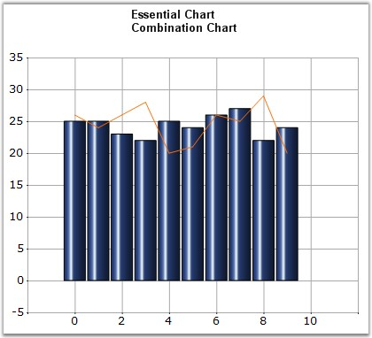

::: {style="DISPLAY: none"}
{#d2h_url_template}{#d2h_package_url style="WIDTH: 0px; DISPLAY: none; HEIGHT: 0px"}
:::

::::: {#nsbanner .d2h_main_nsbanner style="BORDER-BOTTOM: #999999 1px solid; POSITION: relative; PADDING-BOTTOM: 0px; BACKGROUND-COLOR: transparent; PADDING-LEFT: 0px; PADDING-RIGHT: 0px; DISPLAY: none; BORDER-TOP: #999999 1px solid; PADDING-TOP: 0px; LEFT: 0px"}
:::: {#TitleRow .d2h_main_titlerow style="PADDING-BOTTOM: 4px; BACKGROUND-COLOR: transparent; PADDING-LEFT: 22px; WIDTH: 100%; PADDING-RIGHT: 10px; DISPLAY: none; PADDING-TOP: 4px"}
::: {#ienav .d2h_main_ienav style="DISPLAY: none"}
{#D2HPrevious .D2HPreviousEnabled}  {#D2HNext .D2HNextEnabled}
:::
::::
:::::

::::: {#nstext .d2h_main_nstext style="PADDING-BOTTOM: 10px; BACKGROUND-COLOR: transparent; PADDING-LEFT: 22px; PADDING-RIGHT: 10px; HEIGHT: 100%; OVERFLOW: auto; PADDING-TOP: 5px" hasuserbackground="true" valign="bottom"}
::: {#d2h_breadcrumbs .d2h_breadcrumbs}
[Essential Studio User Guide Documentation](ms-xhelp:///?Id=12457748-09e3-4d74-a240-8e049cedf030){.d2h_breadcrumbsNormal}[ \> ]{.d2h_breadcrumbsLinkSeparator}[User Interface Edition](ms-xhelp:///?Id=c29296b7-531c-413b-a0ec-488ca1f7f669){.d2h_breadcrumbsNormal}[ \> ]{.d2h_breadcrumbsLinkSeparator}[Essential Windows](ms-xhelp:///?Id=e60759d8-47a4-4570-9d7a-16a68d63f2ea){.d2h_breadcrumbsNormal}[ \> ]{.d2h_breadcrumbsLinkSeparator}[Essential Chart]{.d2h_breadcrumbsContentsOnly}[ \> ]{.d2h_breadcrumbsLinkSeparator}[Concepts and Features](ms-xhelp:///?Id=71321e9c-336c-4c1c-a127-be9f135ad4bb){.d2h_breadcrumbsNormal}[ \> ]{.d2h_breadcrumbsLinkSeparator}[Chart Types](ms-xhelp:///?Id=cf461556-638d-4482-bf48-b839cfdbac14){.d2h_breadcrumbsNormal}
:::

### Combination Chart {#combination-chart style="tab-stops: 0pt"}

 

Combination Charts refers to the ability to display multiple data series in the same chart with each series visualized using different chart types. In Essential Chart, Chart types that are compatible with each other may be combined in the same Chart Area.

 

Typically it is a combination of a Line chart and a Column chart, sharing a common x-axis but with separate y-axes, one on either side of the chart.

 

One can change an existing chart to a combination chart by selecting the data series you want to change and then changing the chart type for that series.

 

{border="0"}

 

Figure 86: Chart displaying Line and Column Chart

 

 

Chart Details

 

::: {align="center"}
+--------------------------------+-------------------------+
| Details                                                  |
+--------------------------------+-------------------------+
| **Number of Series         **  | One or more.            |
+--------------------------------+-------------------------+
| **Cannot be Combined with   ** | Pie, Bar, Polar, Radar. |
+--------------------------------+-------------------------+
:::

 

Combination series can be added to the chart using the following code.

 

+---------------------------------------------------------------------------------------------------------------------------------------------------------------------------------------------------------------------------------------------------------------+
| **[\[C#\]]{style="FONT-FAMILY: 'Courier New'; COLOR: black"}**                                                                                                                                                                                                |
|                                                                                                                                                                                                                                                               |
| []{style="COLOR: black; FONT-SIZE: 12pt"}                                                                                                                                                                                                                     |
|                                                                                                                                                                                                                                                               |
| [ChartSeries series = ]{style="FONT-FAMILY: 'Courier New'; COLOR: black"}[this]{style="FONT-FAMILY: 'Courier New'; COLOR: blue"}[.chartControl1.Model.NewSeries (\"Series Name\",ChartSeriesType.Line);]{style="FONT-FAMILY: 'Courier New'; COLOR: black"}    |
|                                                                                                                                                                                                                                                               |
| [series.Points.Add (0, 2);]{style="FONT-FAMILY: 'Courier New'; COLOR: black"}                                                                                                                                                                                 |
|                                                                                                                                                                                                                                                               |
| [series.Points.Add (1, 1);]{style="FONT-FAMILY: 'Courier New'; COLOR: black"}                                                                                                                                                                                 |
|                                                                                                                                                                                                                                                               |
| [series.Points.Add (2, 1);]{style="FONT-FAMILY: 'Courier New'; COLOR: black"}                                                                                                                                                                                 |
|                                                                                                                                                                                                                                                               |
| []{style="FONT-FAMILY: 'Courier New'; COLOR: black"}                                                                                                                                                                                                          |
|                                                                                                                                                                                                                                                               |
| [// Create chart series and add data points into it.]{style="FONT-FAMILY: 'Courier New'; COLOR: green"}                                                                                                                                                       |
|                                                                                                                                                                                                                                                               |
| [ChartSeries series2 = ]{style="FONT-FAMILY: 'Courier New'; COLOR: black"}[this]{style="FONT-FAMILY: 'Courier New'; COLOR: blue"}[.chartControl1.Model.NewSeries (\"Series Name\",ChartSeriesType.Column);]{style="FONT-FAMILY: 'Courier New'; COLOR: black"} |
|                                                                                                                                                                                                                                                               |
| [series2.Points.Add (0, 1);]{style="FONT-FAMILY: 'Courier New'; COLOR: black"}                                                                                                                                                                                |
|                                                                                                                                                                                                                                                               |
| [series2.Points.Add (1, 3);]{style="FONT-FAMILY: 'Courier New'; COLOR: black"}                                                                                                                                                                                |
|                                                                                                                                                                                                                                                               |
| [series2.Points.Add (2, 4);]{style="FONT-FAMILY: 'Courier New'; COLOR: black"}                                                                                                                                                                                |
|                                                                                                                                                                                                                                                               |
| []{style="FONT-FAMILY: 'Courier New'; COLOR: black"}                                                                                                                                                                                                          |
|                                                                                                                                                                                                                                                               |
| [// Add the series to the chart series collection.]{style="FONT-FAMILY: 'Courier New'; COLOR: green"}                                                                                                                                                         |
|                                                                                                                                                                                                                                                               |
| [this]{style="FONT-FAMILY: 'Courier New'; COLOR: blue"}[.chartControl1.Series.Add (series);]{style="FONT-FAMILY: 'Courier New'; COLOR: black"}                                                                                                                |
|                                                                                                                                                                                                                                                               |
| [this]{style="FONT-FAMILY: 'Courier New'; COLOR: blue"}[.chartControl1.Series.Add (series2);]{style="FONT-FAMILY: 'Courier New'; COLOR: black"}                                                                                                               |
+---------------------------------------------------------------------------------------------------------------------------------------------------------------------------------------------------------------------------------------------------------------+

 

+------------------------------------------------------------------------------------------------------------------------------------------------------------------------------------------------------------------------------------------------------------------------------------------------------------------------------------------------------------------------------------------------------------------------------+
| **[\[VB.NET\]]{style="FONT-FAMILY: 'Courier New'; COLOR: black"}**                                                                                                                                                                                                                                                                                                                                                           |
|                                                                                                                                                                                                                                                                                                                                                                                                                              |
| []{style="COLOR: black; FONT-SIZE: 12pt"}                                                                                                                                                                                                                                                                                                                                                                                    |
|                                                                                                                                                                                                                                                                                                                                                                                                                              |
| [Dim]{style="FONT-FAMILY: 'Courier New'; COLOR: blue"}[ series]{style="FONT-FAMILY: 'Courier New'; COLOR: black"}[ As]{style="FONT-FAMILY: 'Courier New'; COLOR: blue"}[ ChartSeries = ]{style="FONT-FAMILY: 'Courier New'; COLOR: black"}[Me]{style="FONT-FAMILY: 'Courier New'; COLOR: blue"}[.chartControl1.Model.NewSeries (\"Series Name\", ChartSeriesType.Line)]{style="FONT-FAMILY: 'Courier New'; COLOR: black"}    |
|                                                                                                                                                                                                                                                                                                                                                                                                                              |
| [series.Points.Add (0, 2)]{style="FONT-FAMILY: 'Courier New'; COLOR: black"}                                                                                                                                                                                                                                                                                                                                                 |
|                                                                                                                                                                                                                                                                                                                                                                                                                              |
| [series.Points.Add (1, 1)]{style="FONT-FAMILY: 'Courier New'; COLOR: black"}                                                                                                                                                                                                                                                                                                                                                 |
|                                                                                                                                                                                                                                                                                                                                                                                                                              |
| [series.Points.Add (2, 1)]{style="FONT-FAMILY: 'Courier New'; COLOR: black"}                                                                                                                                                                                                                                                                                                                                                 |
|                                                                                                                                                                                                                                                                                                                                                                                                                              |
| []{style="FONT-FAMILY: 'Courier New'; COLOR: black"}                                                                                                                                                                                                                                                                                                                                                                         |
|                                                                                                                                                                                                                                                                                                                                                                                                                              |
| [\' Create chart series and add data points into it.]{style="FONT-FAMILY: 'Courier New'; COLOR: green"}                                                                                                                                                                                                                                                                                                                      |
|                                                                                                                                                                                                                                                                                                                                                                                                                              |
| [Dim]{style="FONT-FAMILY: 'Courier New'; COLOR: blue"}[ series2 ]{style="FONT-FAMILY: 'Courier New'; COLOR: black"}[As]{style="FONT-FAMILY: 'Courier New'; COLOR: blue"}[ ChartSeries = ]{style="FONT-FAMILY: 'Courier New'; COLOR: black"}[Me]{style="FONT-FAMILY: 'Courier New'; COLOR: blue"}[.chartControl1.Model.NewSeries (\"Series Name\", ChartSeriesType.Column)]{style="FONT-FAMILY: 'Courier New'; COLOR: black"} |
|                                                                                                                                                                                                                                                                                                                                                                                                                              |
| [series2.Points.Add (0, 1)]{style="FONT-FAMILY: 'Courier New'; COLOR: black"}                                                                                                                                                                                                                                                                                                                                                |
|                                                                                                                                                                                                                                                                                                                                                                                                                              |
| [series2.Points.Add (1, 3)]{style="FONT-FAMILY: 'Courier New'; COLOR: black"}                                                                                                                                                                                                                                                                                                                                                |
|                                                                                                                                                                                                                                                                                                                                                                                                                              |
| [series2.Points.Add (2, 4)]{style="FONT-FAMILY: 'Courier New'; COLOR: black"}                                                                                                                                                                                                                                                                                                                                                |
|                                                                                                                                                                                                                                                                                                                                                                                                                              |
| []{style="FONT-FAMILY: 'Courier New'; COLOR: black"}                                                                                                                                                                                                                                                                                                                                                                         |
|                                                                                                                                                                                                                                                                                                                                                                                                                              |
| [\' Add the series to the chart series collection.]{style="FONT-FAMILY: 'Courier New'; COLOR: green"}                                                                                                                                                                                                                                                                                                                        |
|                                                                                                                                                                                                                                                                                                                                                                                                                              |
| [Me]{style="FONT-FAMILY: 'Courier New'; COLOR: blue"}[.chartControl1.Series.Add (series)]{style="FONT-FAMILY: 'Courier New'; COLOR: black"}                                                                                                                                                                                                                                                                                  |
|                                                                                                                                                                                                                                                                                                                                                                                                                              |
| [Me]{style="FONT-FAMILY: 'Courier New'; COLOR: blue"}[.chartControl1.Series.Add (series2) ]{style="FONT-FAMILY: 'Courier New'; COLOR: black"}                                                                                                                                                                                                                                                                                |
+------------------------------------------------------------------------------------------------------------------------------------------------------------------------------------------------------------------------------------------------------------------------------------------------------------------------------------------------------------------------------------------------------------------------------+

 

+----------------------------------------------------------------------------------------------------------------------------------------------------------------------------------------------------------------------------------------------------------------------------------------------------------------------------------------------------------+
| []{style="FONT-FAMILY: 'Segoe UI','sans-serif'; COLOR: black"}                                                                                                                                                                                                                                                                                           |
|                                                                                                                                                                                                                                                                                                                                                          |
| Customization Options                                                                                                                                                                                                                                                                                                                                    |
+----------------------------------------------------------------------------------------------------------------------------------------------------------------------------------------------------------------------------------------------------------------------------------------------------------------------------------------------------------+
| Border, DisplayShadow, DisplayText, DrawColumnSeparatingLines, ElementBorders, ImageIndex, Images, LightAngle, LightColor, PhongAlpha, Spacing Between Series, ShadowInterior ShadowOffset, FancyToolTip, Font, Interior, LegendItem, Name, PointsToolTipFormat, SmartLabels, Summary, Text, TextColor, TextFormat, TextOffset, TextOrientation, Visible |
+----------------------------------------------------------------------------------------------------------------------------------------------------------------------------------------------------------------------------------------------------------------------------------------------------------------------------------------------------------+

 

[]{#p72} 

[]{#related-topics}
:::::
