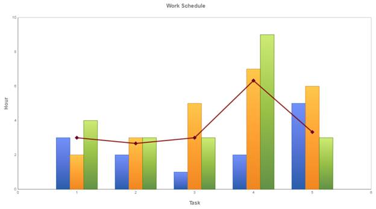

::: {style="DISPLAY: none"}
{#d2h_url_template}{#d2h_package_url style="WIDTH: 0px; DISPLAY: none; HEIGHT: 0px"}
:::

::::: {#nsbanner .d2h_main_nsbanner style="BORDER-BOTTOM: #999999 1px solid; POSITION: relative; PADDING-BOTTOM: 0px; BACKGROUND-COLOR: transparent; PADDING-LEFT: 0px; PADDING-RIGHT: 0px; DISPLAY: none; BORDER-TOP: #999999 1px solid; PADDING-TOP: 0px; LEFT: 0px"}
:::: {#TitleRow .d2h_main_titlerow style="PADDING-BOTTOM: 4px; BACKGROUND-COLOR: transparent; PADDING-LEFT: 22px; WIDTH: 100%; PADDING-RIGHT: 10px; DISPLAY: none; PADDING-TOP: 4px"}
::: {#ienav .d2h_main_ienav style="DISPLAY: none"}
{#D2HPrevious .D2HPreviousEnabled}  {#D2HNext .D2HNextEnabled}
:::
::::
:::::

:::: {#nstext .d2h_main_nstext style="PADDING-BOTTOM: 10px; BACKGROUND-COLOR: transparent; PADDING-LEFT: 22px; PADDING-RIGHT: 10px; HEIGHT: 100%; OVERFLOW: auto; PADDING-TOP: 5px" hasuserbackground="true" valign="bottom"}
::: {#d2h_breadcrumbs .d2h_breadcrumbs}
[Essential Studio User Guide Documentation](ms-xhelp:///?Id=12457748-09e3-4d74-a240-8e049cedf030){.d2h_breadcrumbsNormal}[ \> ]{.d2h_breadcrumbsLinkSeparator}[User Interface Edition](ms-xhelp:///?Id=c29296b7-531c-413b-a0ec-488ca1f7f669){.d2h_breadcrumbsNormal}[ \> ]{.d2h_breadcrumbsLinkSeparator}[Essential ASP.NET](ms-xhelp:///?Id=25c35330-c127-4dad-9a92-ed79dc7261a6){.d2h_breadcrumbsNormal}[ \> ]{.d2h_breadcrumbsLinkSeparator}[Essential Chart in HTML 5]{.d2h_breadcrumbsContentsOnly}[ \> ]{.d2h_breadcrumbsLinkSeparator}[Concepts and Features](ms-xhelp:///?Id=895ee437-1738-49ea-b2a5-247d41ce7a5b){.d2h_breadcrumbsNormal}[ \> ]{.d2h_breadcrumbsLinkSeparator}[Chart Types](ms-xhelp:///?Id=59d0a638-d4ee-4651-8f42-fae3a6ce7e78){.d2h_breadcrumbsNormal}
:::

### Combination Chart {#combination-chart style="tab-stops: 0pt"}

Combination charts refer to the ability to display multiple data series in the same chart with each series visualized by using different chart types. In Essential Chart, chart types that are compatible with each other may be combined in the same chart area.

Typically it is a combination of a line chart and column chart sharing a common x-axis but with separate y-axes, one on either side of the chart.

You can change an existing chart to a combination chart by selecting the data series you want to change and then changing the chart type for that series.    

[]{style="FONT-STYLE: normal"} 

Combination series can be added to the chart using the following code.

+------------------------------------------------------------------------------------------------------------------------------------------------------------------------------------------------------------------------------+
| **[\[C#\]]{style="FONT-FAMILY: 'Courier New'"}[      ]{style="FONT-FAMILY: Consolas; FONT-SIZE: 9.5pt"}[]{style="FONT-FAMILY: 'Courier New'"}**                                                                              |
|                                                                                                                                                                                                                              |
| [       [ ]{style="COLOR: blue"}[Series]{style="COLOR: #2b91af"} series = [new]{style="COLOR: blue"} [Series]{style="COLOR: #2b91af"}([\"John\"]{style="COLOR: #a31515"});]{style="FONT-FAMILY: Consolas; FONT-SIZE: 9.5pt"} |
|                                                                                                                                                                                                                              |
| [        series.Type= [SeriesType]{style="COLOR: #2b91af"}.Column;]{style="FONT-FAMILY: Consolas; FONT-SIZE: 9.5pt"}                                                                                                         |
|                                                                                                                                                                                                                              |
| [        series.Points.Add(1, 3);]{style="FONT-FAMILY: Consolas; FONT-SIZE: 9.5pt"}                                                                                                                                          |
|                                                                                                                                                                                                                              |
| [        series.Points.Add(2, 2);]{style="FONT-FAMILY: Consolas; FONT-SIZE: 9.5pt"}                                                                                                                                          |
|                                                                                                                                                                                                                              |
| [        series.Points.Add(3, 1);]{style="FONT-FAMILY: Consolas; FONT-SIZE: 9.5pt"}                                                                                                                                          |
|                                                                                                                                                                                                                              |
| [        series.Points.Add(4, 2);]{style="FONT-FAMILY: Consolas; FONT-SIZE: 9.5pt"}                                                                                                                                          |
|                                                                                                                                                                                                                              |
| [        series.Points.Add(5, 5);]{style="FONT-FAMILY: Consolas; FONT-SIZE: 9.5pt"}                                                                                                                                          |
|                                                                                                                                                                                                                              |
| [        [this]{style="COLOR: blue"}.ChartAdv1.Series.Add(series);]{style="FONT-FAMILY: Consolas; FONT-SIZE: 9.5pt"}                                                                                                         |
|                                                                                                                                                                                                                              |
| []{style="FONT-FAMILY: Consolas; FONT-SIZE: 9.5pt"}                                                                                                                                                                          |
|                                                                                                                                                                                                                              |
| [         [Series]{style="COLOR: #2b91af"} series1 = [new]{style="COLOR: blue"} [Series]{style="COLOR: #2b91af"}([\"Andrew\"]{style="COLOR: #a31515"});]{style="FONT-FAMILY: Consolas; FONT-SIZE: 9.5pt"}                    |
|                                                                                                                                                                                                                              |
| [        series1.Type= [SeriesType]{style="COLOR: #2b91af"}.Column;]{style="FONT-FAMILY: Consolas; FONT-SIZE: 9.5pt"}                                                                                                        |
|                                                                                                                                                                                                                              |
| [        series1.Points.Add(1, 2);]{style="FONT-FAMILY: Consolas; FONT-SIZE: 9.5pt"}                                                                                                                                         |
|                                                                                                                                                                                                                              |
| [        series1.Points.Add(2, 3);]{style="FONT-FAMILY: Consolas; FONT-SIZE: 9.5pt"}                                                                                                                                         |
|                                                                                                                                                                                                                              |
| [        series1.Points.Add(3, 5);]{style="FONT-FAMILY: Consolas; FONT-SIZE: 9.5pt"}                                                                                                                                         |
|                                                                                                                                                                                                                              |
| [        series1.Points.Add(4, 7);]{style="FONT-FAMILY: Consolas; FONT-SIZE: 9.5pt"}                                                                                                                                         |
|                                                                                                                                                                                                                              |
| [        series1.Points.Add(5, 6);]{style="FONT-FAMILY: Consolas; FONT-SIZE: 9.5pt"}                                                                                                                                         |
|                                                                                                                                                                                                                              |
| [        [this]{style="COLOR: blue"}.ChartAdv1.Series.Add(series1);]{style="FONT-FAMILY: Consolas; FONT-SIZE: 9.5pt"}                                                                                                        |
|                                                                                                                                                                                                                              |
| []{style="FONT-FAMILY: Consolas; FONT-SIZE: 9.5pt"}                                                                                                                                                                          |
|                                                                                                                                                                                                                              |
| [         [Series]{style="COLOR: #2b91af"} series2 = [new]{style="COLOR: blue"} [Series]{style="COLOR: #2b91af"}([\"Henry\"]{style="COLOR: #a31515"});]{style="FONT-FAMILY: Consolas; FONT-SIZE: 9.5pt"}                     |
|                                                                                                                                                                                                                              |
| [        series2.Type= [SeriesType]{style="COLOR: #2b91af"}.Column;]{style="FONT-FAMILY: Consolas; FONT-SIZE: 9.5pt"}                                                                                                        |
|                                                                                                                                                                                                                              |
| [        series2.Points.Add(1, 4);]{style="FONT-FAMILY: Consolas; FONT-SIZE: 9.5pt"}                                                                                                                                         |
|                                                                                                                                                                                                                              |
| [        series2.Points.Add(2, 3);]{style="FONT-FAMILY: Consolas; FONT-SIZE: 9.5pt"}                                                                                                                                         |
|                                                                                                                                                                                                                              |
| [        series2.Points.Add(3, 3);]{style="FONT-FAMILY: Consolas; FONT-SIZE: 9.5pt"}                                                                                                                                         |
|                                                                                                                                                                                                                              |
| [        series2.Points.Add(4, 9);]{style="FONT-FAMILY: Consolas; FONT-SIZE: 9.5pt"}                                                                                                                                         |
|                                                                                                                                                                                                                              |
| [        series2.Points.Add(5, 3);]{style="FONT-FAMILY: Consolas; FONT-SIZE: 9.5pt"}                                                                                                                                         |
|                                                                                                                                                                                                                              |
| [        [this]{style="COLOR: blue"}.ChartAdv1.Series.Add(series2);]{style="FONT-FAMILY: Consolas; FONT-SIZE: 9.5pt"}                                                                                                        |
|                                                                                                                                                                                                                              |
| []{style="FONT-FAMILY: Consolas; FONT-SIZE: 9.5pt"}                                                                                                                                                                          |
|                                                                                                                                                                                                                              |
| [         [Series]{style="COLOR: #2b91af"} series4 = [new]{style="COLOR: blue"} [Series]{style="COLOR: #2b91af"}([\"Average\"]{style="COLOR: #a31515"});]{style="FONT-FAMILY: Consolas; FONT-SIZE: 9.5pt"}                   |
|                                                                                                                                                                                                                              |
| [        series4.Type= [SeriesType]{style="COLOR: #2b91af"}.Line;]{style="FONT-FAMILY: Consolas; FONT-SIZE: 9.5pt"}                                                                                                          |
|                                                                                                                                                                                                                              |
| [        series4.Points.Add(1, 3); ]{style="FONT-FAMILY: Consolas; FONT-SIZE: 9.5pt"}                                                                                                                                        |
|                                                                                                                                                                                                                              |
| [        series4.Points.Add(2, 2.67);]{style="FONT-FAMILY: Consolas; FONT-SIZE: 9.5pt"}                                                                                                                                      |
|                                                                                                                                                                                                                              |
| [        series4.Points.Add(3, 3); ]{style="FONT-FAMILY: Consolas; FONT-SIZE: 9.5pt"}                                                                                                                                        |
|                                                                                                                                                                                                                              |
| [        series4.Points.Add(4, 6.33);]{style="FONT-FAMILY: Consolas; FONT-SIZE: 9.5pt"}                                                                                                                                      |
|                                                                                                                                                                                                                              |
| [        series4.Points.Add(5, 3.33);]{style="FONT-FAMILY: Consolas; FONT-SIZE: 9.5pt"}                                                                                                                                      |
|                                                                                                                                                                                                                              |
| [        [this]{style="COLOR: blue"}.ChartAdv1.Series.Add(series4);]{style="FONT-FAMILY: Consolas; FONT-SIZE: 9.5pt"}                                                                                                        |
|                                                                                                                                                                                                                              |
| []{style="FONT-FAMILY: Consolas; FONT-SIZE: 9.5pt"}                                                                                                                                                                          |
|                                                                                                                                                                                                                              |
| [  ]{style="FONT-FAMILY: Consolas; FONT-SIZE: 9.5pt"}                                                                                                                                                                        |
|                                                                                                                                                                                                                              |
| []{style="FONT-FAMILY: Consolas; FONT-SIZE: 9.5pt"}                                                                                                                                                                          |
+------------------------------------------------------------------------------------------------------------------------------------------------------------------------------------------------------------------------------+

 

+---------------------------------------------------------------------------------------------------------------------------------------------------------------------------------------------------------------------------------------------------------------+
| **[\[VB\]]{style="FONT-FAMILY: 'Courier New'"}[      ]{style="FONT-FAMILY: Consolas; FONT-SIZE: 9.5pt"}[]{style="FONT-FAMILY: 'Courier New'"}**                                                                                                               |
|                                                                                                                                                                                                                                                               |
| [       [ Dim]{style="COLOR: blue"} series [As]{style="COLOR: blue"} [Series]{style="COLOR: #2b91af"} = [New]{style="COLOR: blue"} [Series]{style="COLOR: #2b91af"}([\"John\"]{style="COLOR: #a31515"})]{style="FONT-FAMILY: Consolas; FONT-SIZE: 9.5pt"}     |
|                                                                                                                                                                                                                                                               |
| [        series.Type = [SeriesType]{style="COLOR: #2b91af"}.Column]{style="FONT-FAMILY: Consolas; FONT-SIZE: 9.5pt"}                                                                                                                                          |
|                                                                                                                                                                                                                                                               |
| [        series.Points.Add(1, 3)]{style="FONT-FAMILY: Consolas; FONT-SIZE: 9.5pt"}                                                                                                                                                                            |
|                                                                                                                                                                                                                                                               |
| [        series.Points.Add(2, 2)]{style="FONT-FAMILY: Consolas; FONT-SIZE: 9.5pt"}                                                                                                                                                                            |
|                                                                                                                                                                                                                                                               |
| [        series.Points.Add(3, 1)]{style="FONT-FAMILY: Consolas; FONT-SIZE: 9.5pt"}                                                                                                                                                                            |
|                                                                                                                                                                                                                                                               |
| [        series.Points.Add(4, 2)]{style="FONT-FAMILY: Consolas; FONT-SIZE: 9.5pt"}                                                                                                                                                                            |
|                                                                                                                                                                                                                                                               |
| [        series.Points.Add(5, 5)]{style="FONT-FAMILY: Consolas; FONT-SIZE: 9.5pt"}                                                                                                                                                                            |
|                                                                                                                                                                                                                                                               |
| [        [Me]{style="COLOR: blue"}.ChartAdv1.Series.Add(series)]{style="FONT-FAMILY: Consolas; FONT-SIZE: 9.5pt"}                                                                                                                                             |
|                                                                                                                                                                                                                                                               |
| []{style="FONT-FAMILY: Consolas; FONT-SIZE: 9.5pt"}                                                                                                                                                                                                           |
|                                                                                                                                                                                                                                                               |
| [        [Dim]{style="COLOR: blue"} series1 [As]{style="COLOR: blue"} [Series]{style="COLOR: #2b91af"} = [New]{style="COLOR: blue"} [Series]{style="COLOR: #2b91af"}([\"Andrew\"]{style="COLOR: #a31515"})]{style="FONT-FAMILY: Consolas; FONT-SIZE: 9.5pt"}  |
|                                                                                                                                                                                                                                                               |
| [        series1.Type = [SeriesType]{style="COLOR: #2b91af"}.Column]{style="FONT-FAMILY: Consolas; FONT-SIZE: 9.5pt"}                                                                                                                                         |
|                                                                                                                                                                                                                                                               |
| [        series1.Points.Add(1, 2)]{style="FONT-FAMILY: Consolas; FONT-SIZE: 9.5pt"}                                                                                                                                                                           |
|                                                                                                                                                                                                                                                               |
| [        series1.Points.Add(2, 3)]{style="FONT-FAMILY: Consolas; FONT-SIZE: 9.5pt"}                                                                                                                                                                           |
|                                                                                                                                                                                                                                                               |
| [        series1.Points.Add(3, 5)]{style="FONT-FAMILY: Consolas; FONT-SIZE: 9.5pt"}                                                                                                                                                                           |
|                                                                                                                                                                                                                                                               |
| [        series1.Points.Add(4, 7)]{style="FONT-FAMILY: Consolas; FONT-SIZE: 9.5pt"}                                                                                                                                                                           |
|                                                                                                                                                                                                                                                               |
| [        series1.Points.Add(5, 6)]{style="FONT-FAMILY: Consolas; FONT-SIZE: 9.5pt"}                                                                                                                                                                           |
|                                                                                                                                                                                                                                                               |
| [        [Me]{style="COLOR: blue"}.ChartAdv1.Series.Add(series1)]{style="FONT-FAMILY: Consolas; FONT-SIZE: 9.5pt"}                                                                                                                                            |
|                                                                                                                                                                                                                                                               |
| []{style="FONT-FAMILY: Consolas; FONT-SIZE: 9.5pt"}                                                                                                                                                                                                           |
|                                                                                                                                                                                                                                                               |
| [        [Dim]{style="COLOR: blue"} series2 [As]{style="COLOR: blue"} [Series]{style="COLOR: #2b91af"} = [New]{style="COLOR: blue"} [Series]{style="COLOR: #2b91af"}([\"Henry\"]{style="COLOR: #a31515"})]{style="FONT-FAMILY: Consolas; FONT-SIZE: 9.5pt"}   |
|                                                                                                                                                                                                                                                               |
| [        series2.Type = [SeriesType]{style="COLOR: #2b91af"}.Column]{style="FONT-FAMILY: Consolas; FONT-SIZE: 9.5pt"}                                                                                                                                         |
|                                                                                                                                                                                                                                                               |
| [        series2.Points.Add(1, 4)]{style="FONT-FAMILY: Consolas; FONT-SIZE: 9.5pt"}                                                                                                                                                                           |
|                                                                                                                                                                                                                                                               |
| [        series2.Points.Add(2, 3)]{style="FONT-FAMILY: Consolas; FONT-SIZE: 9.5pt"}                                                                                                                                                                           |
|                                                                                                                                                                                                                                                               |
| [        series2.Points.Add(3, 3)]{style="FONT-FAMILY: Consolas; FONT-SIZE: 9.5pt"}                                                                                                                                                                           |
|                                                                                                                                                                                                                                                               |
| [        series2.Points.Add(4, 9)]{style="FONT-FAMILY: Consolas; FONT-SIZE: 9.5pt"}                                                                                                                                                                           |
|                                                                                                                                                                                                                                                               |
| [        series2.Points.Add(5, 3)]{style="FONT-FAMILY: Consolas; FONT-SIZE: 9.5pt"}                                                                                                                                                                           |
|                                                                                                                                                                                                                                                               |
| [        [Me]{style="COLOR: blue"}.ChartAdv1.Series.Add(series2)]{style="FONT-FAMILY: Consolas; FONT-SIZE: 9.5pt"}                                                                                                                                            |
|                                                                                                                                                                                                                                                               |
| []{style="FONT-FAMILY: Consolas; FONT-SIZE: 9.5pt"}                                                                                                                                                                                                           |
|                                                                                                                                                                                                                                                               |
| [        [Dim]{style="COLOR: blue"} series4 [As]{style="COLOR: blue"} [Series]{style="COLOR: #2b91af"} = [New]{style="COLOR: blue"} [Series]{style="COLOR: #2b91af"}([\"Average\"]{style="COLOR: #a31515"})]{style="FONT-FAMILY: Consolas; FONT-SIZE: 9.5pt"} |
|                                                                                                                                                                                                                                                               |
| [        series4.Type = [SeriesType]{style="COLOR: #2b91af"}.Line]{style="FONT-FAMILY: Consolas; FONT-SIZE: 9.5pt"}                                                                                                                                           |
|                                                                                                                                                                                                                                                               |
| [        series4.Points.Add(1, 3)]{style="FONT-FAMILY: Consolas; FONT-SIZE: 9.5pt"}                                                                                                                                                                           |
|                                                                                                                                                                                                                                                               |
| [        series4.Points.Add(2, 2.67)]{style="FONT-FAMILY: Consolas; FONT-SIZE: 9.5pt"}                                                                                                                                                                        |
|                                                                                                                                                                                                                                                               |
| [        series4.Points.Add(3, 3)]{style="FONT-FAMILY: Consolas; FONT-SIZE: 9.5pt"}                                                                                                                                                                           |
|                                                                                                                                                                                                                                                               |
| [        series4.Points.Add(4, 6.33)]{style="FONT-FAMILY: Consolas; FONT-SIZE: 9.5pt"}                                                                                                                                                                        |
|                                                                                                                                                                                                                                                               |
| [        series4.Points.Add(5, 3.33)]{style="FONT-FAMILY: Consolas; FONT-SIZE: 9.5pt"}                                                                                                                                                                        |
|                                                                                                                                                                                                                                                               |
| [        [Me]{style="COLOR: blue"}.ChartAdv1.Series.Add(series4)]{style="FONT-FAMILY: Consolas; FONT-SIZE: 9.5pt"}                                                                                                                                            |
|                                                                                                                                                                                                                                                               |
| []{style="FONT-FAMILY: Consolas; FONT-SIZE: 9.5pt"}                                                                                                                                                                                                           |
|                                                                                                                                                                                                                                                               |
| [         ]{style="FONT-FAMILY: Consolas; FONT-SIZE: 9.5pt"}                                                                                                                                                                                                  |
|                                                                                                                                                                                                                                                               |
| []{style="FONT-FAMILY: Consolas; FONT-SIZE: 9.5pt"}                                                                                                                                                                                                           |
|                                                                                                                                                                                                                                                               |
| [  ]{style="FONT-FAMILY: Consolas; FONT-SIZE: 9.5pt"}                                                                                                                                                                                                         |
|                                                                                                                                                                                                                                                               |
| []{style="FONT-FAMILY: Consolas; FONT-SIZE: 9.5pt"}                                                                                                                                                                                                           |
+---------------------------------------------------------------------------------------------------------------------------------------------------------------------------------------------------------------------------------------------------------------+

 

 

 

{border="0"}

Figure 17: Combination Chart

 

[]{#related-topics}
::::
