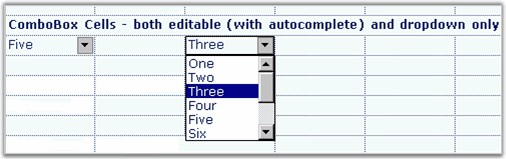

::: {style="DISPLAY: none"}
{#d2h_url_template}{#d2h_package_url style="WIDTH: 0px; DISPLAY: none; HEIGHT: 0px"}
:::

::::: {.d2h_secondary_topic style="PADDING-BOTTOM: 10pt; MARGIN: 0pt; PADDING-LEFT: 0pt; PADDING-RIGHT: 0pt; PADDING-TOP: 0pt"}
##### Combo Box {#combo-box style="tab-stops: 0pt"}

[]{style="FONT-FAMILY: 'Trebuchet MS','sans-serif'; COLOR: #15428b; FONT-SIZE: 9pt"} 

When you add a combo box to a grid cell, it will enable you to choose from a drop-down list of choices. You can populate this list in several ways by setting the appropriate **GridStyleInfo** properties. Other properties restrict the choices to those items listed in the drop down, and enable auto completion of possible matches as the user types new items.

[]{style="FONT-FAMILY: 'Trebuchet MS','sans-serif'; COLOR: #15428b; FONT-SIZE: 9pt"} 

::: {align="center"}
  ------------------------ ----------------------------------------------------------------------------------------------------------------------------------------------------------------------------------
  GridStyleInfo Property   Description
  CellType                 Set to \"combo box\" for a combo box control.
  ChoiceList               StringCollection holding the strings for the drop down.
  ExclusiveChoiceList      *True* if you want to list the items in the drop-down, *false* otherwise.
  DataSource               This property lets you to populate the drop-down list from by using an object that implements IListSource or IList. Examples include DataTable, DataSet, DataView and ArrayList.
  DisplayMember            String that names the public property from the data source object to be displayed in the cell.
  ValueMember              String that names the public property from the data source object to be used as the value for this cell.
  ------------------------ ----------------------------------------------------------------------------------------------------------------------------------------------------------------------------------
:::

[]{style="FONT-FAMILY: 'Trebuchet MS','sans-serif'; COLOR: #15428b; FONT-SIZE: 9pt"} 

The following code example illustrates how to set the cell type to ComboBox.

[]{style="FONT-FAMILY: 'Trebuchet MS','sans-serif'; COLOR: #15428b; FONT-SIZE: 9pt"} 

+-----------------------------------------------------------------------------------------------------------------------------------------------------------------------------------------------+
| **[\[C#\]]{style="FONT-FAMILY: 'Courier New'; COLOR: black"}**                                                                                                                                |
|                                                                                                                                                                                               |
| []{style="FONT-FAMILY: 'Courier New'; COLOR: black"}                                                                                                                                          |
|                                                                                                                                                                                               |
| [// Generate the choices.]{style="FONT-FAMILY: 'Courier New'; COLOR: green"}                                                                                                                  |
|                                                                                                                                                                                               |
| [StringCollection]{style="FONT-FAMILY: 'Courier New'; COLOR: #2b91af"}[ items = [new]{style="COLOR: blue"} [StringCollection]{style="COLOR: #2b91af"}();]{style="FONT-FAMILY: 'Courier New'"} |
|                                                                                                                                                                                               |
| [items.Add([\"One\"]{style="COLOR: #a31515"});]{style="FONT-FAMILY: 'Courier New'"}                                                                                                           |
|                                                                                                                                                                                               |
| [items.Add([\"Two\"]{style="COLOR: #a31515"});]{style="FONT-FAMILY: 'Courier New'"}                                                                                                           |
|                                                                                                                                                                                               |
| [items.Add([\"Three\"]{style="COLOR: #a31515"});]{style="FONT-FAMILY: 'Courier New'"}                                                                                                         |
|                                                                                                                                                                                               |
| [items.Add([\"Four\"]{style="COLOR: #a31515"});]{style="FONT-FAMILY: 'Courier New'"}                                                                                                          |
|                                                                                                                                                                                               |
| [items.Add([\"Five\"]{style="COLOR: #a31515"});]{style="FONT-FAMILY: 'Courier New'"}                                                                                                          |
|                                                                                                                                                                                               |
| []{style="FONT-FAMILY: 'Courier New'"}                                                                                                                                                        |
|                                                                                                                                                                                               |
| [// Set up the control.]{style="FONT-FAMILY: 'Courier New'; COLOR: green"}                                                                                                                    |
|                                                                                                                                                                                               |
| [gridControl1\[rowIndex, colIndex\].CellType = [\"ComboBox\"]{style="COLOR: #a31515"};]{style="FONT-FAMILY: 'Courier New'"}                                                                   |
|                                                                                                                                                                                               |
| [gridControl1\[rowIndex, colIndex\].ChoiceList = items;]{style="FONT-FAMILY: 'Courier New'"}                                                                                                  |
|                                                                                                                                                                                               |
| [gridControl1\[rowIndex, colIndex\].Text = [\"Five\"]{style="COLOR: #a31515"};]{style="FONT-FAMILY: 'Courier New'"}                                                                           |
|                                                                                                                                                                                               |
| [gridControl1\[rowIndex, colIndex\].CellType = [\"ComboBox\"]{style="COLOR: #a31515"};]{style="FONT-FAMILY: 'Courier New'"}                                                                   |
|                                                                                                                                                                                               |
| [gridControl1\[rowIndex, colIndex\].ExclusiveChoiceList = [true]{style="COLOR: blue"};]{style="FONT-FAMILY: 'Courier New'"}                                                                   |
|                                                                                                                                                                                               |
| []{style="FONT-FAMILY: 'Courier New'"}                                                                                                                                                        |
|                                                                                                                                                                                               |
| [// Or use a data source such as a table in a data set.]{style="FONT-FAMILY: 'Courier New'; COLOR: green"}                                                                                    |
|                                                                                                                                                                                               |
| [gridControl1\[2, 2\].CellType = [\"ComboBox\"]{style="COLOR: #a31515"};]{style="FONT-FAMILY: 'Courier New'"}                                                                                 |
|                                                                                                                                                                                               |
| [gridControl1\[2, 2\].DataSource = [this]{style="COLOR: blue"}.dataSet11.Tables\[[\"Customers\"]{style="COLOR: #a31515"}\];]{style="FONT-FAMILY: 'Courier New'"}                              |
|                                                                                                                                                                                               |
| [gridControl1\[2, 2\].DisplayMember = [\"CustomerID\"]{style="COLOR: #a31515"};]{style="FONT-FAMILY: 'Courier New'"}                                                                          |
|                                                                                                                                                                                               |
| [gridControl1\[2, 2\].ValueMember = [\"CustomerID\"]{style="COLOR: #a31515"};]{style="FONT-FAMILY: 'Courier New'"}                                                                            |
+-----------------------------------------------------------------------------------------------------------------------------------------------------------------------------------------------+

[]{style="FONT-FAMILY: 'Trebuchet MS','sans-serif'; COLOR: #15428b; FONT-SIZE: 9pt"} 

+-----------------------------------------------------------------------------------------------------------------------------------------------------------------------------------------------+
| **[\[VB.NET\]]{style="FONT-FAMILY: 'Courier New'; COLOR: black"}**                                                                                                                            |
|                                                                                                                                                                                               |
| []{style="FONT-FAMILY: 'Courier New'; COLOR: black"}                                                                                                                                          |
|                                                                                                                                                                                               |
| [\' Generate the choices.]{style="FONT-FAMILY: 'Courier New'; COLOR: green"}                                                                                                                  |
|                                                                                                                                                                                               |
| [Dim]{style="FONT-FAMILY: 'Courier New'; COLOR: blue"}[ items [As]{style="COLOR: blue"} StringCollection = [New]{style="COLOR: blue"} StringCollection()]{style="FONT-FAMILY: 'Courier New'"} |
|                                                                                                                                                                                               |
| [items.Add([\"One\"]{style="COLOR: #a31515"})]{style="FONT-FAMILY: 'Courier New'"}                                                                                                            |
|                                                                                                                                                                                               |
| [items.Add([\"Two\"]{style="COLOR: #a31515"})]{style="FONT-FAMILY: 'Courier New'"}                                                                                                            |
|                                                                                                                                                                                               |
| [items.Add([\"Three\"]{style="COLOR: #a31515"})]{style="FONT-FAMILY: 'Courier New'"}                                                                                                          |
|                                                                                                                                                                                               |
| [items.Add([\"Four\"]{style="COLOR: #a31515"})]{style="FONT-FAMILY: 'Courier New'"}                                                                                                           |
|                                                                                                                                                                                               |
| [items.Add([\"Five\"]{style="COLOR: #a31515"})]{style="FONT-FAMILY: 'Courier New'"}                                                                                                           |
|                                                                                                                                                                                               |
| []{style="FONT-FAMILY: 'Courier New'"}                                                                                                                                                        |
|                                                                                                                                                                                               |
| [\' Set up the control. ]{style="FONT-FAMILY: 'Courier New'; COLOR: green"}                                                                                                                   |
|                                                                                                                                                                                               |
| [gridControl1(rowIndex, colIndex).CellType = [\"ComboBox\"]{style="COLOR: #a31515"}]{style="FONT-FAMILY: 'Courier New'"}                                                                      |
|                                                                                                                                                                                               |
| [gridControl1(rowIndex, colIndex).ChoiceList = items]{style="FONT-FAMILY: 'Courier New'"}                                                                                                     |
|                                                                                                                                                                                               |
| [gridControl1(rowIndex, colIndex).Text = [\"Five\"]{style="COLOR: #a31515"}]{style="FONT-FAMILY: 'Courier New'"}                                                                              |
|                                                                                                                                                                                               |
| [gridControl1(rowIndex, colIndex).CellType = [\"ComboBox\"]{style="COLOR: #a31515"}]{style="FONT-FAMILY: 'Courier New'"}                                                                      |
|                                                                                                                                                                                               |
| [gridControl1(rowIndex, colIndex).ExclusiveChoiceList = [True]{style="COLOR: blue"}]{style="FONT-FAMILY: 'Courier New'"}                                                                      |
|                                                                                                                                                                                               |
| []{style="FONT-FAMILY: 'Courier New'; COLOR: blue"}                                                                                                                                           |
|                                                                                                                                                                                               |
| [\' Or use a data source such as a table in a dataset.]{style="FONT-FAMILY: 'Courier New'; COLOR: green"}                                                                                     |
|                                                                                                                                                                                               |
| [gridControl1(2, 2).CellType = [\"ComboBox\"]{style="COLOR: #a31515"}]{style="FONT-FAMILY: 'Courier New'"}                                                                                    |
|                                                                                                                                                                                               |
| [gridControl1(2, 2).DataSource = [Me]{style="COLOR: blue"}.dataSet11.Tables([\"Customers\"]{style="COLOR: #a31515"})]{style="FONT-FAMILY: 'Courier New'"}                                     |
|                                                                                                                                                                                               |
| [gridControl1(2, 2).DisplayMember = [\"CustomerID\"]{style="COLOR: #a31515"}]{style="FONT-FAMILY: 'Courier New'"}                                                                             |
|                                                                                                                                                                                               |
| [gridControl1(2, 2).ValueMember = [\"CustomerID\"]{style="COLOR: #a31515"}]{style="FONT-FAMILY: 'Courier New'"}                                                                               |
+-----------------------------------------------------------------------------------------------------------------------------------------------------------------------------------------------+

[]{style="FONT-FAMILY: 'Trebuchet MS','sans-serif'; COLOR: #15428b; FONT-SIZE: 9pt"} 

{border="0"}

[]{style="FONT-FAMILY: 'Trebuchet MS','sans-serif'; COLOR: #15428b; FONT-SIZE: 9pt"} 

Figure 76: Combo Box Cells

 

###### []{#p53}4.1.4.1.3.1 AutoComplete Support for Combo Box in Edit Mode {#autocomplete-support-for-combo-box-in-edit-mode style="tab-stops: 0pt"}

 

Essential Grid provides AutoComplete support for combo box cells. The AutoComplete feature is a filtered suggestion list presented in a drop-down that is pulled from a mapped data source as the user enters text into a text box.  AutoComplete for combo box cells provides the following properties:

 

[·      ]{style="FONT-FAMILY: Symbol"}AutoComplete---Displays suggestion in the text box. The content other than what you have typed will be highlighted.

[·      ]{style="FONT-FAMILY: Symbol"}AutoSuggest---Dynamically populates a list based on the entered text.

[·      ]{style="FONT-FAMILY: Symbol"}Both---Enables normal editable behavior.

[·      ]{style="FONT-FAMILY: Symbol"}None---No operations will be performed in the text box and list box areas.

 

Use Case Scenarios

You can choose the suggestion instead of typing the entire content.

 

Properties

 

Table 1: Properties Table

::: {align="center"}
+--------------+---------------------------------------------------------------------+-------------+---------------+---------------------+
| **Property** | **Description**                                                     | **Type**    | **Data Type** | **Reference links** |
+--------------+---------------------------------------------------------------------+-------------+---------------+---------------------+
| AutoComplete | Gets the a suggestion from the list based on the entered text.      | Enumerator  | N/A           | N/A                 |
|              |                                                                     |             |               |                     |
|              | The suggestion will be highlighted.                                 |             |               |                     |
|              |                                                                     |             |               |                     |
|              |                                                                     |             |               |                     |
+--------------+---------------------------------------------------------------------+-------------+---------------+---------------------+
| AutoSuggest  | Dynamically populate a list based on the entered text.              | Enumerator  | N/A           | N/A                 |
+--------------+---------------------------------------------------------------------+-------------+---------------+---------------------+
| Both         | Enables normal editable behavior.                                   | Enumerator  | N/A           | N/A                 |
+--------------+---------------------------------------------------------------------+-------------+---------------+---------------------+
| None         | No operations will be performed in the text box and list box areas. | Enumerator  | N/A           | N/A                 |
+--------------+---------------------------------------------------------------------+-------------+---------------+---------------------+
:::

[]{style="COLOR: #c00000"} 

Enabling AutoComplete in EditMode for a Combo Box Celltype

The following steps illustrates enabling AutoComplete in EditMode for a combo Box celltype:

1.   Declare the Celltype as Combo Box as given in the following code:

[]{style="FONT-FAMILY: 'Courier New'"} 

+-----------------------------------------------------------------------------------------------------------------------------------------------------------------------------------------------------------------------------------------+
| [\[C#\]]{style="FONT-FAMILY: 'Courier New'"}                                                                                                                                                                                            |
|                                                                                                                                                                                                                                         |
| []{style="FONT-FAMILY: 'Courier New'"}                                                                                                                                                                                                  |
|                                                                                                                                                                                                                                         |
| [this]{style="FONT-FAMILY: 'Courier New'; COLOR: blue"}[.gridControl1\[RowIndex,ColIndex\].CellType = [GridCellTypeName]{style="COLOR: #2b91af"}.ComboBox;]{style="FONT-FAMILY: 'Courier New'"}[  ]{style="FONT-FAMILY: 'Courier New'"} |
|                                                                                                                                                                                                                                         |
| []{style="FONT-FAMILY: 'Courier New'"}                                                                                                                                                                                                  |
+-----------------------------------------------------------------------------------------------------------------------------------------------------------------------------------------------------------------------------------------+

 

+--------------------------------------------------------------------------------------------------------------------------------------------------------------------------------------------+
| [ \[VB\]]{style="FONT-FAMILY: 'Courier New'"}                                                                                                                                              |
|                                                                                                                                                                                            |
| []{style="FONT-FAMILY: 'Courier New'"}                                                                                                                                                     |
|                                                                                                                                                                                            |
| [Me]{style="FONT-FAMILY: 'Courier New'; COLOR: blue"}[.gridControl1(RowIndex,ColIndex).CellType = [GridCellTypeName]{style="COLOR: #2b91af"}.ComboBox]{style="FONT-FAMILY: 'Courier New'"} |
|                                                                                                                                                                                            |
| [  ]{style="FONT-FAMILY: 'Courier New'"}                                                                                                                                                   |
|                                                                                                                                                                                            |
| []{style="FONT-FAMILY: 'Courier New'"}                                                                                                                                                     |
+--------------------------------------------------------------------------------------------------------------------------------------------------------------------------------------------+

 

2.   Set the Dropdown style as Editable as given in the following code:

[]{style="FONT-FAMILY: 'Courier New'"} 

+---------------------------------------------------------------------------------------------------------------------------------------------------------------------------------------------------------------------------------------------+
| [\[C#\]]{style="FONT-FAMILY: 'Courier New'"}                                                                                                                                                                                                |
|                                                                                                                                                                                                                                             |
| []{style="FONT-FAMILY: 'Courier New'"}                                                                                                                                                                                                      |
|                                                                                                                                                                                                                                             |
| [this]{style="FONT-FAMILY: 'Courier New'; COLOR: blue"}[.gridControl1\[RowIndex,ColIndex\].DropDownStyle = [GridDropDownStyle]{style="COLOR: #2b91af"}.Editable;]{style="FONT-FAMILY: 'Courier New'"}[]{style="FONT-FAMILY: 'Courier New'"} |
|                                                                                                                                                                                                                                             |
| []{style="FONT-FAMILY: 'Courier New'"}                                                                                                                                                                                                      |
|                                                                                                                                                                                                                                             |
| [\[VB\]]{style="FONT-FAMILY: 'Courier New'"}                                                                                                                                                                                                |
|                                                                                                                                                                                                                                             |
| []{style="FONT-FAMILY: 'Courier New'"}                                                                                                                                                                                                      |
|                                                                                                                                                                                                                                             |
| [Me]{style="FONT-FAMILY: 'Courier New'; COLOR: blue"}[.gridControl1(RowIndex,ColIndex).DropDownStyle = [GridDropDownStyle]{style="COLOR: #2b91af"}.Editable  ]{style="FONT-FAMILY: 'Courier New'"}                                          |
|                                                                                                                                                                                                                                             |
| []{style="FONT-FAMILY: 'Courier New'"}                                                                                                                                                                                                      |
+---------------------------------------------------------------------------------------------------------------------------------------------------------------------------------------------------------------------------------------------+

 

3.   Set the *GridComboSelectionOptions* using the *AutoCompleteInEditMode* property as given in the following code:

 

+--------------------------------------------------------------------------------------------------------------------------------------------------------------------------------------------+
| [ ]{style="FONT-FAMILY: 'Courier New'"}[\[VB\]]{style="FONT-FAMILY: 'Courier New'"}                                                                                                        |
|                                                                                                                                                                                            |
| []{style="FONT-FAMILY: 'Courier New'"}                                                                                                                                                     |
|                                                                                                                                                                                            |
| [Me]{style="FONT-FAMILY: 'Courier New'; COLOR: blue"}[.gridControl1(RowIndex,ColIndex).AutoCompleteInEditMode = GridComboSelectionOptions.AutoSuggest]{style="FONT-FAMILY: 'Courier New'"} |
|                                                                                                                                                                                            |
| []{style="FONT-FAMILY: 'Courier New'"}                                                                                                                                                     |
+--------------------------------------------------------------------------------------------------------------------------------------------------------------------------------------------+

 

+--------------------------------------------------------------------------------------------------------------------------------------------------------------------------------------------+
| [ \[VB\]]{style="FONT-FAMILY: 'Courier New'"}                                                                                                                                              |
|                                                                                                                                                                                            |
| []{style="FONT-FAMILY: 'Courier New'"}                                                                                                                                                     |
|                                                                                                                                                                                            |
| [Me]{style="FONT-FAMILY: 'Courier New'; COLOR: blue"}[.gridControl1(RowIndex,ColIndex).AutoCompleteInEditMode = GridComboSelectionOptions.AutoSuggest]{style="FONT-FAMILY: 'Courier New'"} |
|                                                                                                                                                                                            |
| []{style="FONT-FAMILY: 'Courier New'"}                                                                                                                                                     |
+--------------------------------------------------------------------------------------------------------------------------------------------------------------------------------------------+

 

 

[]{#related-topics}
:::::
