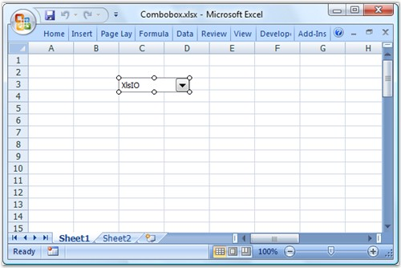

::: {style="DISPLAY: none"}
{#d2h_url_template}{#d2h_package_url style="WIDTH: 0px; DISPLAY: none; HEIGHT: 0px"}
:::

::: {.d2h_secondary_topic style="PADDING-BOTTOM: 10pt; MARGIN: 0pt; PADDING-LEFT: 0pt; PADDING-RIGHT: 0pt; PADDING-TOP: 0pt"}
#### Combo Box {#combo-box style="tab-stops: 0pt"}

**[]{style="FONT-FAMILY: 'Segoe UI','sans-serif'; COLOR: black"}** 

Essential XlsIO now provides support to read/write a Combo Box control. This is achieved by using the **IComboBoxShape** interface which is used to add a combo box inside a worksheet.

[]{style="FONT-FAMILY: 'Trebuchet MS','sans-serif'; COLOR: #15428b; FONT-SIZE: 9pt"} 

The following code example illustrates how to read/write a combo box control.

[]{style="FONT-FAMILY: 'Trebuchet MS','sans-serif'; COLOR: #15428b; FONT-SIZE: 9pt"} 

+----------------------------------------------------------------------------------------------------------------+
| **[\[C#\]]{style="FONT-FAMILY: 'Courier New'"}**                                                               |
|                                                                                                                |
| **[]{style="FONT-FAMILY: 'Courier New'"}**                                                                     |
|                                                                                                                |
| [// Create a Combo Box.]{style="FONT-FAMILY: 'Courier New'; COLOR: green"}                                     |
|                                                                                                                |
| [IComboBoxShape comboBox1 = sheet.ComboBoxes.AddComboBox(27, 5, 20, 100);]{style="FONT-FAMILY: 'Courier New'"} |
|                                                                                                                |
| []{style="FONT-FAMILY: 'Courier New'"}                                                                         |
|                                                                                                                |
| [// Assign a value to the Combo Box.]{style="FONT-FAMILY: 'Courier New'; COLOR: green"}                        |
|                                                                                                                |
| [comboBox1.ListFillRange = sheet\[[\"A1:A12\"]{style="COLOR: #a31515"}\];]{style="FONT-FAMILY: 'Courier New'"} |
|                                                                                                                |
| [comboBox1.LinkedCell = sheet\[[\"C3\"]{style="COLOR: #a31515"}\];]{style="FONT-FAMILY: 'Courier New'"}        |
|                                                                                                                |
| []{style="FONT-FAMILY: 'Courier New'"}                                                                         |
|                                                                                                                |
| [// Select an item.]{style="FONT-FAMILY: 'Courier New'; COLOR: green"}                                         |
|                                                                                                                |
| [comboBox1.SelectedIndex = 6;]{style="FONT-FAMILY: 'Courier New'"}                                             |
|                                                                                                                |
| []{style="FONT-FAMILY: 'Courier New'"}                                                                         |
|                                                                                                                |
| [// Read a Combo Box.]{style="FONT-FAMILY: 'Courier New'; COLOR: green"}                                       |
|                                                                                                                |
| [IComboBoxShape comboBox2 = sheet.ComboBoxes\[0\];]{style="FONT-FAMILY: 'Courier New'"}                        |
|                                                                                                                |
| [comboBox2.SelectedIndex = 3;]{style="FONT-FAMILY: 'Courier New'"}                                             |
+----------------------------------------------------------------------------------------------------------------+

[]{style="FONT-FAMILY: 'Trebuchet MS','sans-serif'; COLOR: #15428b; FONT-SIZE: 9pt"} 

+------------------------------------------------------------------------------------------------------------------------------------------------------------------------------------------------+
| **[\[VB.NET\]]{style="FONT-FAMILY: 'Courier New'"}**                                                                                                                                           |
|                                                                                                                                                                                                |
| []{style="FONT-FAMILY: 'Courier New'; COLOR: green"}                                                                                                                                           |
|                                                                                                                                                                                                |
| [\' Create a Combo Box.]{style="FONT-FAMILY: 'Courier New'; COLOR: green"}                                                                                                                     |
|                                                                                                                                                                                                |
| [Dim]{style="FONT-FAMILY: 'Courier New'; COLOR: blue"}[ comboBox1 [As]{style="COLOR: blue"} IComboBoxShape = sheet.ComboBoxes.AddComboBox(27, 5, 20, 100)]{style="FONT-FAMILY: 'Courier New'"} |
|                                                                                                                                                                                                |
| []{style="FONT-FAMILY: 'Courier New'; COLOR: green"}                                                                                                                                           |
|                                                                                                                                                                                                |
| [\' Assign a value to the Combo Box.]{style="FONT-FAMILY: 'Courier New'; COLOR: green"}                                                                                                        |
|                                                                                                                                                                                                |
| [comboBox1.ListFillRange = sheet([\"A1:A12\"]{style="COLOR: #a31515"})]{style="FONT-FAMILY: 'Courier New'"}                                                                                    |
|                                                                                                                                                                                                |
| [comboBox1.LinkedCell = sheet([\"C3\"]{style="COLOR: #a31515"})]{style="FONT-FAMILY: 'Courier New'"}                                                                                           |
|                                                                                                                                                                                                |
| []{style="FONT-FAMILY: 'Courier New'; COLOR: green"}                                                                                                                                           |
|                                                                                                                                                                                                |
| [\' Select an item.]{style="FONT-FAMILY: 'Courier New'; COLOR: green"}                                                                                                                         |
|                                                                                                                                                                                                |
| [comboBox1.SelectedIndex = 6]{style="FONT-FAMILY: 'Courier New'"}                                                                                                                              |
|                                                                                                                                                                                                |
| []{style="FONT-FAMILY: 'Courier New'; COLOR: green"}                                                                                                                                           |
|                                                                                                                                                                                                |
| [\' Read a Combo Box.]{style="FONT-FAMILY: 'Courier New'; COLOR: green"}                                                                                                                       |
|                                                                                                                                                                                                |
| [Dim]{style="FONT-FAMILY: 'Courier New'; COLOR: blue"}[ comboBox2 [As]{style="COLOR: blue"} IComboBoxShape = sheet.ComboBoxes(0)]{style="FONT-FAMILY: 'Courier New'"}                          |
|                                                                                                                                                                                                |
| [comboBox2.SelectedIndex = 3]{style="FONT-FAMILY: 'Courier New'"}                                                                                                                              |
+------------------------------------------------------------------------------------------------------------------------------------------------------------------------------------------------+

[]{style="FONT-FAMILY: 'Trebuchet MS','sans-serif'; COLOR: #15428b; FONT-SIZE: 9pt"} 

{border="0"}

Figure 98: Combo Box control added to the Spreadsheet by using Essential XlsIO[]{style="FONT-FAMILY: 'Trebuchet MS','sans-serif'; COLOR: #15428b"}

***[]{style="FONT-FAMILY: 'Trebuchet MS','sans-serif'; COLOR: #15428b; FONT-SIZE: 9pt"}*** 

[]{#related-topics}
:::
