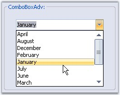

::: {style="DISPLAY: none"}
{#d2h_url_template}{#d2h_package_url style="WIDTH: 0px; DISPLAY: none; HEIGHT: 0px"}
:::

::: {.d2h_secondary_topic style="PADDING-BOTTOM: 10pt; MARGIN: 0pt; PADDING-LEFT: 0pt; PADDING-RIGHT: 0pt; PADDING-TOP: 0pt"}
#### ComboBoxAdv {#comboboxadv style="tab-stops: 0pt"}

[]{style="COLOR: #15428b"} 

**ComboBoxAdv** is an advanced combo box control that provides a similar object model as the framework of ComboBox control, with a lot of additional features. ComboBoxAdv is inherited from ComboBoxBaseDataBound which is derived from ComboBoxBase control.

 

Based on our ComboBoxBase control, the ComboBoxAdv pre-binds a list box in its drop-down area and includes some additional API to provide a framework combo box-like object model and data binding support. Written from scratch, this control exposes the text box and the list box controls used internally to let you customize the different parts of the control.

**[]{style="COLOR: #15428b"}** 

{border="0"}

[]{style="COLOR: #15428b"} 

Figure 343: ComboBoxAdv Control

More:

[ ]{#related-topics}

[{border="0" align="absMiddle"}Features](ms-xhelp:///?Id=9afa6f82-f6e9-4ffa-ac31-6d2cd6ed015e){style="TEXT-DECORATION: none"}

[{border="0" align="absMiddle"}Creating ComboBoxAdv](ms-xhelp:///?Id=6622cbd3-0109-402d-98d8-09c8b52e8464){style="TEXT-DECORATION: none"}

[{border="0" align="absMiddle"}Concepts and Features](ms-xhelp:///?Id=911b5fef-b424-43a6-8482-79ac8fc2908b){style="TEXT-DECORATION: none"}

[{border="0" align="absMiddle"}Event Handling](ms-xhelp:///?Id=c54b7924-1daf-4d9d-a0c5-3466c1fd029f){style="TEXT-DECORATION: none"}

[{border="0" align="absMiddle"}Frequently Asked Questions](ms-xhelp:///?Id=9f6f6e93-2f96-42ca-b8af-a69ea6ed06d1){style="TEXT-DECORATION: none"}
:::
