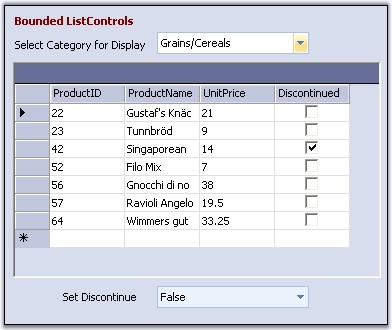

::: {style="DISPLAY: none"}
{#d2h_url_template}{#d2h_package_url style="WIDTH: 0px; DISPLAY: none; HEIGHT: 0px"}
:::

::: {.d2h_secondary_topic style="PADDING-BOTTOM: 10pt; MARGIN: 0pt; PADDING-LEFT: 0pt; PADDING-RIGHT: 0pt; PADDING-TOP: 0pt"}
#### ComboBoxBase {#comboboxbase style="tab-stops: 0pt"}

[]{style="COLOR: #15428b"} 

The flexible **ComboBoxBase control** is an alternative to the standard combo box control. It separates the edit portion from the drop-down list portion thereby making this architecture powerful and flexible. However, due to this separation, the object model of this control is different from that of the combo box.

 

There is however, a [ComboBoxAdv]{style="COLOR: black"}, which is based on the ComboBoxBase and provides an identical object model to that of the framework combo box. You can also get a framework combo box like look-and-feel (without a similar object model) by attaching a list box control to the ComboBoxBase.

 

Note that Essential Grid comes with a **ListControl-derived GridListControl**, which you can place in the drop-down area to get a multi-column drop-down combo.

[]{style="COLOR: #15428b"} 

{border="0"}

**[]{style="COLOR: #15428b"}** 

Figure 359: ComboBoxBase Control

 

With the ComboBoxBase, you can plug in any ListControl-derived class as the list for the list portion of the combo box using the ListControl property.

 

This version of ComboBoxBase does not support any kind of owner drawing to customize painting. Note however that you could still use a ListControl that supports owner drawing.

 

See also

[]{style="COLOR: blue"} 

[ComboBoxAdv]{.UGHyperlink}[]{.UGHyperlink}

More:

[ ]{#related-topics}

[{border="0" align="absMiddle"}Features](ms-xhelp:///?Id=8ed83993-32b6-414d-8aa4-ce2c8cebae83){style="TEXT-DECORATION: none"}

[{border="0" align="absMiddle"}Creating ComboBoxBase](ms-xhelp:///?Id=9f88c593-2474-4118-91c1-d2f161983975){style="TEXT-DECORATION: none"}

[{border="0" align="absMiddle"}Concepts and Features](ms-xhelp:///?Id=8d2f8d88-6a97-40f0-9fa3-07e90863a9b2){style="TEXT-DECORATION: none"}

[{border="0" align="absMiddle"}Event Handling](ms-xhelp:///?Id=66235837-299c-4189-9403-241cd825b1c5){style="TEXT-DECORATION: none"}
:::
