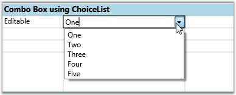
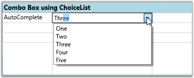
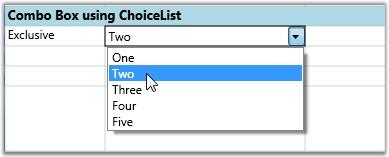
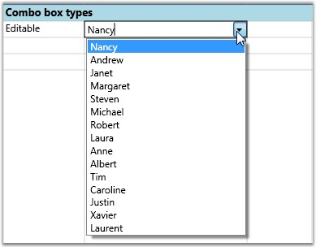
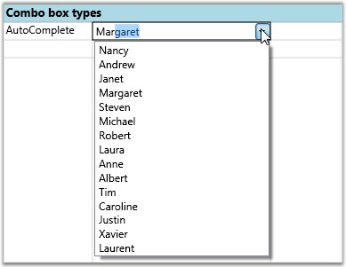
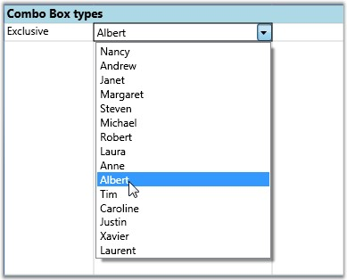

::: {style="DISPLAY: none"}
{#d2h_url_template}{#d2h_package_url style="WIDTH: 0px; DISPLAY: none; HEIGHT: 0px"}
:::

:::::::: {.d2h_secondary_topic style="PADDING-BOTTOM: 10pt; MARGIN: 0pt; PADDING-LEFT: 0pt; PADDING-RIGHT: 0pt; PADDING-TOP: 0pt"}
##### Combo Box Cells {#combo-box-cells style="tab-stops: 0pt"}

A combo box is a component with a drop-down arrow that users click to display an associated list of choices. The user displays the list by clicking or dragging the drop-down arrow.

 

This cell type allows you to choose the cell value from a drop-down list. You can customize this list in many ways by setting the appropriate GridStyleInfo property. Some interesting options are Autocomplete, associate a string collection, associate LINQ source etc. You can also use this drop-down like a foreign key-- for example, displaying one column in the drop-down while saving the cell value from another column in the data source.

**[]{style="COLOR: #15428b"}** 

::: {style="BORDER-BOTTOM: windowtext 1pt solid; BORDER-LEFT: medium none; PADDING-BOTTOM: 1pt; MARGIN-TOP: 9pt; PADDING-LEFT: 0pt; PADDING-RIGHT: 0pt; MARGIN-BOTTOM: 9pt; BORDER-TOP: windowtext 1pt solid; BORDER-RIGHT: medium none; PADDING-TOP: 1pt"}
 

{border="0"}Note: A foreign key is a field in a relational table that matches the primary key column of another table. The foreign key can be used to cross-reference tables.
:::

**[]{style="COLOR: #15428b"}** 

The table below lists various properties that can affect combo box cells.

 

Table 6: GridStyleInfo Property[]{style="FONT-FAMILY: 'Times New Roman','serif'"}

::: {align="center"}
+-----------------------------------+----------------------------------------------------------------------------------------------------------+
| GridStyleInfo Property            | Description                                                                                              |
+-----------------------------------+----------------------------------------------------------------------------------------------------------+
| CellType                          | Set to "ComboBox" for a Combo box control                                                                |
+-----------------------------------+----------------------------------------------------------------------------------------------------------+
| ChoiceList                        | String collection for the drop-down                                                                      |
+-----------------------------------+----------------------------------------------------------------------------------------------------------+
| DropDownStyle                     | Determines the drop-down cell behavior.                                                                  |
|                                   |                                                                                                          |
|                                   | Editable                                                                                                 |
|                                   |                                                                                                          |
|                                   | Autocomplete                                                                                             |
|                                   |                                                                                                          |
|                                   | Exclusive                                                                                                |
+-----------------------------------+----------------------------------------------------------------------------------------------------------+
| ItemsSource                       | Specifies the binding source for the Combo box.                                                          |
+-----------------------------------+----------------------------------------------------------------------------------------------------------+
| Display Member                    | String that names the public property from the data source object to be displayed in the cell.           |
+-----------------------------------+----------------------------------------------------------------------------------------------------------+
| Value Member                      | String that names the public property from the data source object to be used as the value for this cell. |
+-----------------------------------+----------------------------------------------------------------------------------------------------------+
:::

[]{style="COLOR: #15428b"} 

Before we proceed further the following note provides more information on the drop-down styles:

**[]{style="COLOR: #15428b"}** 

::: {style="BORDER-BOTTOM: windowtext 1pt solid; BORDER-LEFT: medium none; PADDING-BOTTOM: 1pt; MARGIN-TOP: 9pt; PADDING-LEFT: 0pt; PADDING-RIGHT: 0pt; MARGIN-BOTTOM: 9pt; BORDER-TOP: windowtext 1pt solid; BORDER-RIGHT: medium none; PADDING-TOP: 1pt"}
{border="0"}Note:
:::

::: {style="BORDER-BOTTOM: windowtext 1pt solid; BORDER-LEFT: medium none; PADDING-BOTTOM: 1pt; MARGIN: 9pt 0pt 9pt 18pt; PADDING-LEFT: 0pt; PADDING-RIGHT: 0pt; BORDER-TOP: windowtext 1pt solid; BORDER-RIGHT: medium none; PADDING-TOP: 1pt"}
***[·    ]{style="FONT-FAMILY: Symbol"}***Editable-Editable combo boxes combine an editable text field and provide users the additional option of typing an item that might or might not be on the list. The item to be typed in the text field need not be case-sensitive.

***[·    ]{style="FONT-FAMILY: Symbol"}***Autocomplete-Autocomplete combo boxes predict a word or phrase that the user wants to type in the associated text box without the user actually typing it completely.

***[·    ]{style="FONT-FAMILY: Symbol"}***Exclusive-This is a non-editable combo box where user is allowed to select only the options available from the drop-down list.
:::

**[]{style="COLOR: #15428b"}** 

Combo-boxes can be added to the Grid in two different ways as follows:

**[]{style="COLOR: #15428b"}** 

1.   Using ChoiceList

2.   Using ItemsSource

**[]{style="COLOR: #15428b"}** 

Using ChoiceList

Let us see how to build different kinds of combo boxes using ChoiceList. This allows you to customize the options to be displayed in a drop-down.

 

Setting Up an Editable Combo Box

+----------------------------------------------------------------------------------------------------------------------------------------------------------------------------------------+
| [\[C#\]]{style="FONT-FAMILY: 'Courier New'; COLOR: black"}                                                                                                                             |
|                                                                                                                                                                                        |
| []{style="FONT-FAMILY: 'Courier New'"}                                                                                                                                                 |
|                                                                                                                                                                                        |
| [StringCollection]{style="FONT-FAMILY: 'Courier New'; COLOR: teal"}[ list = [new]{style="COLOR: blue"} [StringCollection]{style="COLOR: teal"}();]{style="FONT-FAMILY: 'Courier New'"} |
|                                                                                                                                                                                        |
| [list.Add([\"One\"]{style="COLOR: #a31515"});]{style="FONT-FAMILY: 'Courier New'"}                                                                                                     |
|                                                                                                                                                                                        |
| [list.Add([\"Two\"]{style="COLOR: #a31515"});]{style="FONT-FAMILY: 'Courier New'"}                                                                                                     |
|                                                                                                                                                                                        |
| [list.Add([\"Three\"]{style="COLOR: #a31515"});]{style="FONT-FAMILY: 'Courier New'"}                                                                                                   |
|                                                                                                                                                                                        |
| [list.Add([\"Four\"]{style="COLOR: #a31515"});]{style="FONT-FAMILY: 'Courier New'"}                                                                                                    |
|                                                                                                                                                                                        |
| [list.Add([\"Five\"]{style="COLOR: #a31515"});]{style="FONT-FAMILY: 'Courier New'"}                                                                                                    |
|                                                                                                                                                                                        |
| []{style="FONT-FAMILY: 'Courier New'"}                                                                                                                                                 |
|                                                                                                                                                                                        |
| [//Editable Combo]{style="FONT-FAMILY: 'Courier New'; COLOR: green"}                                                                                                                   |
|                                                                                                                                                                                        |
| [var combo1 = [this]{style="COLOR: blue"}.grid.Model\[1, 2\];]{style="FONT-FAMILY: 'Courier New'"}                                                                                     |
|                                                                                                                                                                                        |
| [combo1.CellType = [\"ComboBox\"]{style="COLOR: #a31515"};]{style="FONT-FAMILY: 'Courier New'"}                                                                                        |
|                                                                                                                                                                                        |
| [combo1.ChoiceList = list;]{style="FONT-FAMILY: 'Courier New'"}                                                                                                                        |
|                                                                                                                                                                                        |
| [combo1.DropDownStyle = GridDropDownStyle.Editable;]{style="FONT-FAMILY: 'Courier New'"}                                                                                               |
+----------------------------------------------------------------------------------------------------------------------------------------------------------------------------------------+

[]{style="COLOR: #15428b"} 

Output

The following output is generated using the code above.

**[]{style="COLOR: #15428b"}** 

{border="0"}

Figure 16:  Editable Combo Box using ChoiceList

 

An Editable Combo Box in a Grid is created

Setting Up Autocomplete Combo Box

+----------------------------------------------------------------------------------------------------+
| [\[C#\]]{style="FONT-FAMILY: 'Courier New'; COLOR: black"}                                         |
|                                                                                                    |
| []{style="FONT-FAMILY: 'Courier New'"}                                                             |
|                                                                                                    |
| [//Autocomplete combo]{style="FONT-FAMILY: 'Courier New'; COLOR: green"}                           |
|                                                                                                    |
| [var combo2 = [this]{style="COLOR: blue"}.grid.Model\[2, 2\];]{style="FONT-FAMILY: 'Courier New'"} |
|                                                                                                    |
| [combo2.CellType = [\"ComboBox\"]{style="COLOR: #a31515"};]{style="FONT-FAMILY: 'Courier New'"}    |
|                                                                                                    |
| [combo2.ChoiceList = list;]{style="FONT-FAMILY: 'Courier New'"}                                    |
|                                                                                                    |
| [combo2.DropDownStyle = GridDropDownStyle.AutoComplete;]{style="FONT-FAMILY: 'Courier New'"}       |
+----------------------------------------------------------------------------------------------------+

[]{style="COLOR: #15428b"} 

Output

The following output is generated using the code above.

[]{style="COLOR: #15428b"} 

{border="0"}

Figure 17:  Autocomplete Combo box using  ChoiceList

 

An Autocomplete Combo Box in a Grid is created

Setting Up Exclusive Combo Box

**[]{style="COLOR: #15428b"}** 

+----------------------------------------------------------------------------------------------------+
| [\[C#\]]{style="FONT-FAMILY: 'Courier New'; COLOR: black"}                                         |
|                                                                                                    |
| []{style="FONT-FAMILY: 'Courier New'"}                                                             |
|                                                                                                    |
| [//Exclusive Combo]{style="FONT-FAMILY: 'Courier New'; COLOR: green"}                              |
|                                                                                                    |
| [var combo3 = [this]{style="COLOR: blue"}.grid.Model\[3, 2\];]{style="FONT-FAMILY: 'Courier New'"} |
|                                                                                                    |
| [combo3.CellType = [\"ComboBox\"]{style="COLOR: #a31515"};]{style="FONT-FAMILY: 'Courier New'"}    |
|                                                                                                    |
| [combo3.ChoiceList = list;]{style="FONT-FAMILY: 'Courier New'"}                                    |
|                                                                                                    |
| [combo3.DropDownStyle = GridDropDownStyle.Exclusive;]{style="FONT-FAMILY: 'Courier New'"}          |
+----------------------------------------------------------------------------------------------------+

 

Output

The following output is generated using the code above.

[]{style="COLOR: #15428b"} 

{border="0"}

Figure 18: Exclusive Combo box using ChoiceList

 

An Exclusive Combo Box in a Grid is created.

Using ItemsSource

The combo boxes created using ItemsSource class ensure that the options available in the drop-down list are populated from the data source the combo box is bound to. The user cannot customize the list unlike combo boxes created using ChoiceList class. The combo boxes in the following examples are bound to Northwind Employee table. The values of the FirstName column form the ItemsSource. The FirstName column is used as the display member of the combo box whose value member is EmployeeID.

**[]{style="COLOR: #15428b"}** 

Setting up editable combo box

+-----------------------------------------------------------------------------------------------------------------------------------+
| [\[C#\]]{style="FONT-FAMILY: 'Courier New'; COLOR: black"}                                                                        |
|                                                                                                                                   |
| **[]{style="FONT-FAMILY: 'Courier New'; COLOR: black"}**                                                                          |
|                                                                                                                                   |
| [//Editable Combo bound to the "FirstName" column of Northwind Employee Table.]{style="FONT-FAMILY: 'Courier New'; COLOR: green"} |
|                                                                                                                                   |
| [var combo1 = [this]{style="COLOR: blue"}.grid.Model\[4, 2\];]{style="FONT-FAMILY: 'Courier New'"}                                |
|                                                                                                                                   |
| [combo1.CellType = [\"ComboBox\"]{style="COLOR: #a31515"};]{style="FONT-FAMILY: 'Courier New'"}                                   |
|                                                                                                                                   |
| [combo1.ItemsSource = northWind.Employees.Select(emp =\> emp.FirstName).ToList();]{style="FONT-FAMILY: 'Courier New'"}            |
|                                                                                                                                   |
| [combo1.DropDownStyle = GridDropDownStyle.Editable;]{style="FONT-FAMILY: 'Courier New'"}                                          |
+-----------------------------------------------------------------------------------------------------------------------------------+

[]{style="COLOR: #15428b"} 

Output

The following output is generated using the code above.

[]{style="COLOR: #15428b"} 

{border="0"}

Figure 19:  : Editable Combo box using ItemsSource

 

An editable Combo Box in a Grid is created.

 

Setting Up an Autocomplete Combo Box

+---------------------------------------------------------------------------------------------------------------------------------------+
| [\[C#\]]{style="FONT-FAMILY: 'Courier New'; COLOR: black"}                                                                            |
|                                                                                                                                       |
| **[]{style="FONT-FAMILY: 'Courier New'; COLOR: black"}**                                                                              |
|                                                                                                                                       |
| [//Autocomplete Combo bound to the "FirstName" column of Northwind Employee Table.]{style="FONT-FAMILY: 'Courier New'; COLOR: green"} |
|                                                                                                                                       |
| [var combo2 = [this]{style="COLOR: blue"}.grid.Model\[5, 2\];]{style="FONT-FAMILY: 'Courier New'"}                                    |
|                                                                                                                                       |
| [combo2.CellType = [\"ComboBox\"]{style="COLOR: #a31515"};]{style="FONT-FAMILY: 'Courier New'"}                                       |
|                                                                                                                                       |
| [combo2.ItemsSource = northWind.Employees.Select(emp =\> emp.FirstName).ToList();]{style="FONT-FAMILY: 'Courier New'"}                |
|                                                                                                                                       |
| [combo2.DropDownStyle = GridDropDownStyle.AutoComplete;]{style="FONT-FAMILY: 'Courier New'"}                                          |
|                                                                                                                                       |
| [combo2.DisplayMember = [\"FirstName\"]{style="COLOR: #a31515"};]{style="FONT-FAMILY: 'Courier New'"}                                 |
|                                                                                                                                       |
| [combo2.ValueMember = [\"EmployeeID\"]{style="COLOR: #a31515"};]{style="FONT-FAMILY: 'Courier New'"}                                  |
+---------------------------------------------------------------------------------------------------------------------------------------+

[]{style="COLOR: #15428b"} 

Output

The following output is generated using the code above.

[]{style="COLOR: #15428b"} 

{border="0"}

Figure 20:  Autocomplete Combo box using ItemsSource

 

An Autocomplete Combo Box in a Grid is created

Setting Up an Exclusive Combo Box

[]{style="COLOR: #15428b"} 

+------------------------------------------------------------------------------------------------------------------------------------+
| [\[C#\]]{style="FONT-FAMILY: 'Courier New'; COLOR: black"}                                                                         |
|                                                                                                                                    |
| []{style="FONT-FAMILY: 'Courier New'"}                                                                                             |
|                                                                                                                                    |
| [//Exclusive Combo bound to the "FirstName" column of Northwind Employee Table.]{style="FONT-FAMILY: 'Courier New'; COLOR: green"} |
|                                                                                                                                    |
| [var combo3 = [this]{style="COLOR: blue"}.grid.Model\[6, 2\];]{style="FONT-FAMILY: 'Courier New'"}                                 |
|                                                                                                                                    |
| [combo3.CellType = [\"ComboBox\"]{style="COLOR: #a31515"};]{style="FONT-FAMILY: 'Courier New'"}                                    |
|                                                                                                                                    |
| [combo3.ItemsSource = northWind.Employees.Select(emp =\> emp.FirstName).ToList();]{style="FONT-FAMILY: 'Courier New'"}             |
|                                                                                                                                    |
| [combo3.DropDownStyle = GridDropDownStyle.Exclusive;]{style="FONT-FAMILY: 'Courier New'"}                                          |
+------------------------------------------------------------------------------------------------------------------------------------+

 

Output

The following output is generated using the code above.

[]{style="COLOR: #15428b"} 

{border="0"}

Figure 21:  Exclusive Combo box using ItemsSource

 

An Exclusive Combo Box in a Grid is created.

::: {style="BORDER-BOTTOM: windowtext 1pt solid; BORDER-LEFT: medium none; PADDING-BOTTOM: 1pt; MARGIN-TOP: 9pt; PADDING-LEFT: 0pt; PADDING-RIGHT: 0pt; MARGIN-BOTTOM: 9pt; BORDER-TOP: windowtext 1pt solid; BORDER-RIGHT: medium none; PADDING-TOP: 1pt"}
[{border="0"}]{style="FONT-FAMILY: 'Courier New'"}Note: For complete code, please refer to the following browser sample.
:::

[]{style="COLOR: #15428b"} 

***\...\\My Documents\\Syncfusion\\EssentialStudio\\\<Version Number\>\\WPF\\Grid.WPF\\Samples\\3.5\\WindowsSamples\\Cell Types\\Combo Box Cell Demo***

**** 

[]{#related-topics}
::::::::
