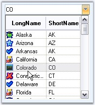

::: {style="DISPLAY: none"}
{#d2h_url_template}{#d2h_package_url style="WIDTH: 0px; DISPLAY: none; HEIGHT: 0px"}
:::

::: {.d2h_secondary_topic style="PADDING-BOTTOM: 10pt; MARGIN: 0pt; PADDING-LEFT: 0pt; PADDING-RIGHT: 0pt; PADDING-TOP: 0pt"}
#### ComboDropDown {#combodropdown style="tab-stops: 0pt"}

[]{style="COLOR: #15428b"} 

The ComboDropDown control is a lightweight, combo box-like control that can host any control in the dropdown area. This control can be used to create a combo box that shows, for example, a TreeView or a ListView with multiple columns or any other control that helps in displaying the data appropriately. The control is used to host any control where ComboBoxBase hosts only ListBox derived controls. This flexible combo box control provides a standard combo box look-and-feel with the ability to host any control in the dropdown.

[]{style="COLOR: #15428b"} 

Once a control is associated with the **ComboDropDown** to be displayed in the drop-down area, the developer is responsible for handling the data interaction between the combo\'s edit portion and the control in the drop-down. For example, if the ComboDropDown is used with a TreeView control in a dropdown, the developer has to provide the code to transfer the selected item from the TreeView control to the combo box and also from the combo box to the TreeView. You should also determine when the dropdown should close. In this case, the dropdown could close when the user double-clicks on a node.

[]{style="COLOR: #15428b"} 

{border="0"}

**[]{style="COLOR: #15428b"}** 

Figure 329: ComboDropDown Control

**[]{style="COLOR: #15428b"}** 

[]{style="COLOR: #15428b"} 

More:

[ ]{#related-topics}

[{border="0" align="absMiddle"}Features](ms-xhelp:///?Id=8f3dcfb2-4218-4213-bd83-70ae62393a62){style="TEXT-DECORATION: none"}

[{border="0" align="absMiddle"}Creating ComboDropDown](ms-xhelp:///?Id=81b799ac-bb86-4f56-8f6d-5e523b569e42){style="TEXT-DECORATION: none"}

[{border="0" align="absMiddle"}Concepts and Features](ms-xhelp:///?Id=9b76752f-92e8-4cd6-8223-6ec06a688ab3){style="TEXT-DECORATION: none"}

[{border="0" align="absMiddle"}Event Handling](ms-xhelp:///?Id=65f0a8a1-0d3f-474d-8850-769299a6b6f1){style="TEXT-DECORATION: none"}

[{border="0" align="absMiddle"}Frequently Asked Questions](ms-xhelp:///?Id=66f181a2-78e8-4814-9f2f-a22c53f838aa){style="TEXT-DECORATION: none"}
:::
