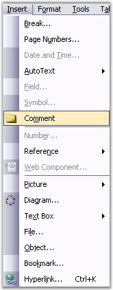
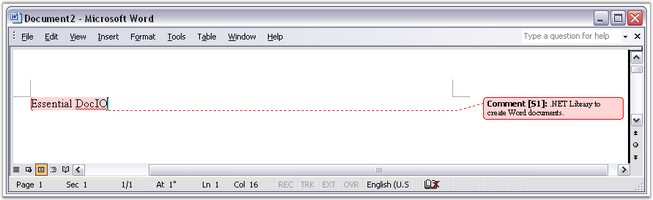

::: {style="DISPLAY: none"}
{#d2h_url_template}{#d2h_package_url style="WIDTH: 0px; DISPLAY: none; HEIGHT: 0px"}
:::

:::::::: {.d2h_secondary_topic style="PADDING-BOTTOM: 10pt; MARGIN: 0pt; PADDING-LEFT: 0pt; PADDING-RIGHT: 0pt; PADDING-TOP: 0pt"}
##### Comment {#comment style="tab-stops: 0pt"}

 

You can add comments to a Word document. To add a comment to a document, select the text to which you want to apply the comment, open the **Insert** menu and click **Comment**.

 

{border="0"}

Figure 63: Comment option in Insert Menu

 

{border="0"}

Figure 64: Comment inserted into a Word Document

 

 

DocIO has the ability to preserve Word comments, but the creation of comments from APIs or its modification is limited.

 

Comment is one of the subdocuments of Word. Presentation of this subdocument in the Word document consists of two parts -- **special marker**, which defines the comment location in the document, and **special data**, which defines the text and formatting of the comment.

 

**WComment** class models the structure and properties of the comments. The following are the main properties of the WComment class.

 

[·      ]{style="FONT-FAMILY: Symbol"}**TextBody**: contains text of the comment

[·      ]{style="FONT-FAMILY: Symbol"}**Format**: specifies the format for the comment

 

TextBody property returns the object of the **WTextBody** type. Format returns the object of the **WCommentFormat** type.

 

**Class Hierarchy**

 

ParagraphItem

              \|

            WComment

 

**Public Constructor**

 

::: {align="center"}
  ---------- -----------------------------------------------------
  Name       Description
  WComment   Initializes a new instance of the WComment class.  
  ---------- -----------------------------------------------------
:::

 

Public Properties

 

::: {align="center"}
  ------------ --------------------------------
  Name         Description
  EntityType   Gets the type of the entity.  
  Format       Gets the format.  
  TextBody     Gets comment body.  
  ------------ --------------------------------
:::

 

WCommentFormat has the following public properties and methods.

 

Public Methods

 

::: {align="center"}
+-----------------------------------+----------------------------------------------------------------+
| Name                              | Description                                                    |
+-----------------------------------+----------------------------------------------------------------+
| Clone                             | Creates a new object that is a copy of the current instance.   |
|                                   |                                                                |
|                                   |                                                                |
+-----------------------------------+----------------------------------------------------------------+
| WCommentFormat                    | Initializes a new instance of the WCommentFormat class.        |
+-----------------------------------+----------------------------------------------------------------+
| RemoveCommentedItems              | To remove all the items from the comments.                     |
+-----------------------------------+----------------------------------------------------------------+
| ReplaceCommentedItems             | Replace the commented document content.                        |
+-----------------------------------+----------------------------------------------------------------+
:::

 

Public Properties

 

::: {align="center"}
  -------------- ---------------------------------
  **Name**       **Description**
  User           Gets or sets the user. 
  UserInitials   Gets or sets the user initials.
  -------------- ---------------------------------
:::

 

The following example illustrates how to search for a comment in the last section of a document. When it is found, the text and format of the comment is changed.

 

+-----------------------------------------------------------------------------------------------------------------------------------------------------------------------------------------+
| **[\[C#\]]{style="FONT-FAMILY: 'Courier New'; COLOR: black"}**                                                                                                                          |
|                                                                                                                                                                                         |
| []{style="COLOR: black"}                                                                                                                                                                |
|                                                                                                                                                                                         |
| [WSection]{style="FONT-FAMILY: 'Courier New'; COLOR: teal"}[ section = sourceDoc.LastSection;]{style="FONT-FAMILY: 'Courier New'"}                                                      |
|                                                                                                                                                                                         |
| [foreach]{style="FONT-FAMILY: 'Courier New'; COLOR: blue"}[ ([IWParagraph]{style="COLOR: teal"} para [in]{style="COLOR: blue"} section.Paragraphs)]{style="FONT-FAMILY: 'Courier New'"} |
|                                                                                                                                                                                         |
| [{]{style="FONT-FAMILY: 'Courier New'"}                                                                                                                                                 |
|                                                                                                                                                                                         |
| [    [foreach]{style="COLOR: blue"} ([ParagraphItem]{style="COLOR: teal"} item [in]{style="COLOR: blue"} para.Items)]{style="FONT-FAMILY: 'Courier New'"}                               |
|                                                                                                                                                                                         |
| [    {]{style="FONT-FAMILY: 'Courier New'"}                                                                                                                                             |
|                                                                                                                                                                                         |
| [        [if]{style="COLOR: blue"} (item [is]{style="COLOR: blue"} [WComment]{style="COLOR: teal"})]{style="FONT-FAMILY: 'Courier New'"}                                                |
|                                                                                                                                                                                         |
| [        {]{style="FONT-FAMILY: 'Courier New'"}                                                                                                                                         |
|                                                                                                                                                                                         |
| [            [WComment]{style="COLOR: teal"} comment = item [as]{style="COLOR: blue"} [WComment]{style="COLOR: teal"};]{style="FONT-FAMILY: 'Courier New'"}                             |
|                                                                                                                                                                                         |
| [            comment.TextBody.LastParagraph.Text = [\"NewText\"]{style="COLOR: maroon"};]{style="FONT-FAMILY: 'Courier New'"}                                                           |
|                                                                                                                                                                                         |
| [            comment.Format.User = [\"TestUser\"]{style="COLOR: maroon"};]{style="FONT-FAMILY: 'Courier New'"}                                                                          |
|                                                                                                                                                                                         |
| [        }]{style="FONT-FAMILY: 'Courier New'"}                                                                                                                                         |
|                                                                                                                                                                                         |
| [    }]{style="FONT-FAMILY: 'Courier New'"}                                                                                                                                             |
|                                                                                                                                                                                         |
| [}]{style="FONT-FAMILY: 'Courier New'"}                                                                                                                                                 |
+-----------------------------------------------------------------------------------------------------------------------------------------------------------------------------------------+

 

+----------------------------------------------------------------------------------------------------------------------------------------------------------------------------------------------------------------------------------------------------------------------------------------------------+
| **[\[VB.NET\]]{style="FONT-FAMILY: 'Courier New'; COLOR: black"}**                                                                                                                                                                                                                                 |
|                                                                                                                                                                                                                                                                                                    |
| []{style="COLOR: black"}                                                                                                                                                                                                                                                                           |
|                                                                                                                                                                                                                                                                                                    |
| [Dim]{style="FONT-FAMILY: 'Courier New'; COLOR: blue"}[ section [As]{style="COLOR: blue"} WSection = sourceDoc.LastSection]{style="FONT-FAMILY: 'Courier New'"}                                                                                                                                    |
|                                                                                                                                                                                                                                                                                                    |
| [For]{style="FONT-FAMILY: 'Courier New'; COLOR: blue"}[ [Each]{style="COLOR: blue"} para [As]{style="COLOR: blue"} IWParagraph [In]{style="COLOR: blue"} section.Paragraphs]{style="FONT-FAMILY: 'Courier New'"}                                                                                   |
|                                                                                                                                                                                                                                                                                                    |
| [      [For]{style="COLOR: blue"} [Each]{style="COLOR: blue"} item [As]{style="COLOR: blue"} ParagraphItem [In]{style="COLOR: blue"} para.Items]{style="FONT-FAMILY: 'Courier New'"}                                                                                                               |
|                                                                                                                                                                                                                                                                                                    |
| [            [If]{style="COLOR: blue"} [TypeOf]{style="COLOR: blue"} item [Is]{style="COLOR: blue"} WComment [Then]{style="COLOR: blue"}]{style="FONT-FAMILY: 'Courier New'"}                                                                                                                      |
|                                                                                                                                                                                                                                                                                                    |
| [Dim]{style="FONT-FAMILY: 'Courier New'; COLOR: blue"}[ comment [As]{style="COLOR: blue"} WComment = [CType]{style="COLOR: blue"}(IIf([TypeOf]{style="COLOR: blue"} item [Is]{style="COLOR: blue"} WComment, item, [Nothing]{style="COLOR: blue"}), WComment)]{style="FONT-FAMILY: 'Courier New'"} |
|                                                                                                                                                                                                                                                                                                    |
| [                  comment.TextBody.LastParagraph.Text = [\"NewText\"]{style="COLOR: maroon"}]{style="FONT-FAMILY: 'Courier New'"}                                                                                                                                                                 |
|                                                                                                                                                                                                                                                                                                    |
| [                  comment.Format.User = [\"TestUser\"]{style="COLOR: maroon"}]{style="FONT-FAMILY: 'Courier New'"}                                                                                                                                                                                |
|                                                                                                                                                                                                                                                                                                    |
| [            [End]{style="COLOR: blue"} [If]{style="COLOR: blue"}]{style="FONT-FAMILY: 'Courier New'"}                                                                                                                                                                                             |
|                                                                                                                                                                                                                                                                                                    |
| [      [Next]{style="COLOR: blue"} item]{style="FONT-FAMILY: 'Courier New'"}                                                                                                                                                                                                                       |
|                                                                                                                                                                                                                                                                                                    |
| [Next]{style="FONT-FAMILY: 'Courier New'; COLOR: blue"}[ para]{style="FONT-FAMILY: 'Courier New'"}                                                                                                                                                                                                 |
+----------------------------------------------------------------------------------------------------------------------------------------------------------------------------------------------------------------------------------------------------------------------------------------------------+

 

Comments Collection

 

You can access comments while browsing through the collection of paragraph items or through the collection of comments by using the **WordDocument.GetComments** method.

 

**Public Methods**

 

::: {align="center"}
  ---------- -------------------------------------------
  Name       Description
  Clear      Remove all comments from the document.
  RemoveAt   Remove second comments from the document.
  ---------- -------------------------------------------
:::

 

The following example illustrates how to get all the comments from the document and remove them.

*[]{style="COLOR: red"}* 

+-----------------------------------------------------------------------------------------------------------------------------------------------------------------------------------------------------------------------------+
| **[\[C#\]]{style="FONT-FAMILY: 'Courier New'; COLOR: black"}**                                                                                                                                                              |
|                                                                                                                                                                                                                             |
| []{style="COLOR: black"}                                                                                                                                                                                                    |
|                                                                                                                                                                                                                             |
| [WordDocument]{style="FONT-FAMILY: 'Courier New'; COLOR: #2b91af"}[ doc = [new]{style="COLOR: blue"} [WordDocument]{style="COLOR: #2b91af"}([\"sample.doc\"]{style="COLOR: #a31515"});]{style="FONT-FAMILY: 'Courier New'"} |
|                                                                                                                                                                                                                             |
| [commentsCollection comments = doc.GetComments();]{style="FONT-FAMILY: 'Courier New'"}                                                                                                                                      |
|                                                                                                                                                                                                                             |
| []{style="FONT-FAMILY: 'Courier New'"}                                                                                                                                                                                      |
|                                                                                                                                                                                                                             |
| [// Remove second comments from the document.]{style="FONT-FAMILY: 'Courier New'; COLOR: green"}                                                                                                                            |
|                                                                                                                                                                                                                             |
| [comments.RemoveAt(1);]{style="FONT-FAMILY: 'Courier New'"}                                                                                                                                                                 |
|                                                                                                                                                                                                                             |
| []{style="FONT-FAMILY: 'Courier New'"}                                                                                                                                                                                      |
|                                                                                                                                                                                                                             |
| [// Remove all comments from the document.]{style="FONT-FAMILY: 'Courier New'; COLOR: green"}                                                                                                                               |
|                                                                                                                                                                                                                             |
| [comments.Clear();]{style="FONT-FAMILY: 'Courier New'"}                                                                                                                                                                     |
+-----------------------------------------------------------------------------------------------------------------------------------------------------------------------------------------------------------------------------+

 

+-------------------------------------------------------------------------------------------------------------------------------------------------------------------------------------------------------------+
| **[\[VB\]]{style="FONT-FAMILY: 'Courier New'; COLOR: black"}**                                                                                                                                              |
|                                                                                                                                                                                                             |
| []{style="FONT-FAMILY: 'Courier New'; COLOR: blue"}                                                                                                                                                         |
|                                                                                                                                                                                                             |
| [Dim]{style="FONT-FAMILY: 'Courier New'; COLOR: blue"}[ doc [As]{style="COLOR: blue"} [New]{style="COLOR: blue"} WordDocument([\"sample.doc\"]{style="COLOR: maroon"})]{style="FONT-FAMILY: 'Courier New'"} |
|                                                                                                                                                                                                             |
| [Dim]{style="FONT-FAMILY: 'Courier New'; COLOR: blue"}[ comments [As]{style="COLOR: blue"} CommentsCollection = doc.GetComments()]{style="FONT-FAMILY: 'Courier New'"}                                      |
|                                                                                                                                                                                                             |
| []{style="FONT-FAMILY: 'Courier New'"}                                                                                                                                                                      |
|                                                                                                                                                                                                             |
| [\' Remove second comments from the document.]{style="FONT-FAMILY: 'Courier New'; COLOR: green"}                                                                                                            |
|                                                                                                                                                                                                             |
| [comments.RemoveAt(1)]{style="FONT-FAMILY: 'Courier New'"}                                                                                                                                                  |
|                                                                                                                                                                                                             |
| []{style="FONT-FAMILY: 'Courier New'"}                                                                                                                                                                      |
|                                                                                                                                                                                                             |
| [\' Remove all comments from the document.]{style="FONT-FAMILY: 'Courier New'; COLOR: green"}                                                                                                               |
|                                                                                                                                                                                                             |
| [comments.Clear() ]{style="FONT-FAMILY: 'Courier New'"}                                                                                                                                                     |
+-------------------------------------------------------------------------------------------------------------------------------------------------------------------------------------------------------------+

[]{#related-topics}
::::::::
