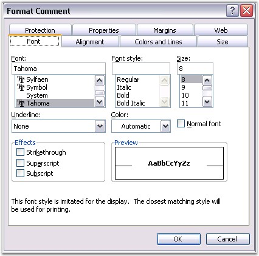
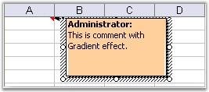
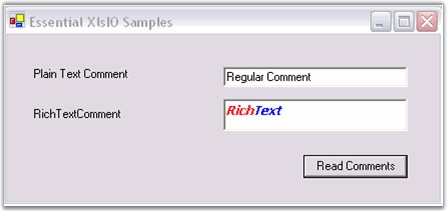

::: {style="DISPLAY: none"}
{#d2h_url_template}{#d2h_package_url style="WIDTH: 0px; DISPLAY: none; HEIGHT: 0px"}
:::

::::: {#nsbanner .d2h_main_nsbanner style="BORDER-BOTTOM: #999999 1px solid; POSITION: relative; PADDING-BOTTOM: 0px; BACKGROUND-COLOR: transparent; PADDING-LEFT: 0px; PADDING-RIGHT: 0px; DISPLAY: none; BORDER-TOP: #999999 1px solid; PADDING-TOP: 0px; LEFT: 0px"}
:::: {#TitleRow .d2h_main_titlerow style="PADDING-BOTTOM: 4px; BACKGROUND-COLOR: transparent; PADDING-LEFT: 22px; WIDTH: 100%; PADDING-RIGHT: 10px; DISPLAY: none; PADDING-TOP: 4px"}
::: {#ienav .d2h_main_ienav style="DISPLAY: none"}
{#D2HPrevious .D2HPreviousEnabled}  {#D2HNext .D2HNextEnabled}
:::
::::
:::::

::::: {#nstext .d2h_main_nstext style="PADDING-BOTTOM: 10px; BACKGROUND-COLOR: transparent; PADDING-LEFT: 22px; PADDING-RIGHT: 10px; HEIGHT: 100%; OVERFLOW: auto; PADDING-TOP: 5px" hasuserbackground="true" valign="bottom"}
::: {#d2h_breadcrumbs .d2h_breadcrumbs}
[Essential Studio User Guide Documentation](ms-xhelp:///?Id=12457748-09e3-4d74-a240-8e049cedf030){.d2h_breadcrumbsNormal}[ \> ]{.d2h_breadcrumbsLinkSeparator}[Reporting Edition](ms-xhelp:///?Id=027aa5b6-6676-4f93-ad23-c20e8c45792e){.d2h_breadcrumbsNormal}[ \> ]{.d2h_breadcrumbsLinkSeparator}[Essential XlsIO](ms-xhelp:///?Id=b01a1b50-1d7d-40c0-bc83-af67e57c9005){.d2h_breadcrumbsNormal}[ \> ]{.d2h_breadcrumbsLinkSeparator}[Concepts and Features](ms-xhelp:///?Id=21b26556-5905-4ad9-90b4-40320db25faf){.d2h_breadcrumbsNormal}[ \> ]{.d2h_breadcrumbsLinkSeparator}[Review](ms-xhelp:///?Id=b4add9bb-1a7a-44e2-8122-b84f6a6c79a0){.d2h_breadcrumbsNormal}
:::

### Comments {#comments style="tab-stops: 0pt"}

 

Microsoft Excel has the ability to insert Comments in cells. Comments enable a user to get additional information about a cell, such as, what the value represents. You can insert and format comments through the Insert menu in Excel. You can also format the comments inserted through the Format Comment dialog box.

 

{border="0"}

Figure 141: Format Comment Dialog Box[]{style="FONT-FAMILY: 'Trebuchet MS','sans-serif'; COLOR: #15428b"}

 

XlsIO has APIs for inserting both **Regular** and **Rich Text** comments by using the **ICommentShape** interface. It has various properties to format the comments. Following code example illustrates how to insert comments.

 

+-----------------------------------------------------------------------------------------------------------------------------------------------------------------------------------------------+
| **[\[C#\]]{style="FONT-FAMILY: 'Courier New'; FONT-SIZE: 11pt"}**                                                                                                                             |
|                                                                                                                                                                                               |
| **[]{style="FONT-FAMILY: 'Courier New'; FONT-SIZE: 11pt"}**                                                                                                                                   |
|                                                                                                                                                                                               |
| [// Insert Comments.]{style="FONT-FAMILY: 'Courier New'; COLOR: green; FONT-SIZE: 11pt"}                                                                                                      |
|                                                                                                                                                                                               |
| [// Adding comments to a cell.]{style="FONT-FAMILY: 'Courier New'; COLOR: green; FONT-SIZE: 11pt"}                                                                                            |
|                                                                                                                                                                                               |
| [sheet.Range\[[\"A1\"]{style="COLOR: #a31515"}\].AddComment().Text = [\"Regular Comment\"]{style="COLOR: #a31515"};]{style="FONT-FAMILY: 'Courier New'; FONT-SIZE: 11pt"}                     |
|                                                                                                                                                                                               |
| []{style="FONT-FAMILY: 'Courier New'; FONT-SIZE: 11pt"}                                                                                                                                       |
|                                                                                                                                                                                               |
| [// Sets author of the comment.]{style="FONT-FAMILY: 'Courier New'; COLOR: green; FONT-SIZE: 11pt"}                                                                                           |
|                                                                                                                                                                                               |
| [sheet.Range\[[\"A1\"]{style="COLOR: #a31515"}\].AddComment().Author = [\"Syncfusion\"]{style="COLOR: #a31515"};]{style="FONT-FAMILY: 'Courier New'; FONT-SIZE: 11pt"}                        |
|                                                                                                                                                                                               |
| []{style="FONT-FAMILY: 'Courier New'; FONT-SIZE: 11pt"}                                                                                                                                       |
|                                                                                                                                                                                               |
| [// Add Rich Text Comments.]{style="FONT-FAMILY: 'Courier New'; COLOR: green; FONT-SIZE: 11pt"}                                                                                               |
|                                                                                                                                                                                               |
| [IRange]{style="FONT-FAMILY: 'Courier New'; COLOR: #2b91af; FONT-SIZE: 11pt"}[ range = sheet.Range\[[\"A2\"]{style="COLOR: #a31515"}\];]{style="FONT-FAMILY: 'Courier New'; FONT-SIZE: 11pt"} |
|                                                                                                                                                                                               |
| [range.AddComment().RichText.Text = [\"RichText\"]{style="COLOR: #a31515"};]{style="FONT-FAMILY: 'Courier New'; FONT-SIZE: 11pt"}                                                             |
|                                                                                                                                                                                               |
| [IRichTextString]{style="FONT-FAMILY: 'Courier New'; COLOR: #2b91af; FONT-SIZE: 11pt"}[ rtf = range.Comment.RichText;]{style="FONT-FAMILY: 'Courier New'; FONT-SIZE: 11pt"}                   |
|                                                                                                                                                                                               |
| []{style="FONT-FAMILY: 'Courier New'; FONT-SIZE: 11pt"}                                                                                                                                       |
|                                                                                                                                                                                               |
| [// Formatting first 4 characters.]{style="FONT-FAMILY: 'Courier New'; COLOR: green; FONT-SIZE: 11pt"}                                                                                        |
|                                                                                                                                                                                               |
| [IFont]{style="FONT-FAMILY: 'Courier New'; COLOR: #2b91af; FONT-SIZE: 11pt"}[ redFont = workbook.CreateFont();]{style="FONT-FAMILY: 'Courier New'; FONT-SIZE: 11pt"}                          |
|                                                                                                                                                                                               |
| [redFont.Bold = [true]{style="COLOR: blue"};]{style="FONT-FAMILY: 'Courier New'; FONT-SIZE: 11pt"}                                                                                            |
|                                                                                                                                                                                               |
| [rtf.SetFont(0, 3, redFont);]{style="FONT-FAMILY: 'Courier New'; FONT-SIZE: 11pt"}                                                                                                            |
+-----------------------------------------------------------------------------------------------------------------------------------------------------------------------------------------------+

[]{style="FONT-FAMILY: 'Trebuchet MS','sans-serif'; COLOR: #15428b; FONT-SIZE: 9pt"} 

+----------------------------------------------------------------------------------------------------------------------------------------------------------------------------------------------------------------------+
| **[\[VB.NET\]]{style="FONT-FAMILY: 'Courier New'; FONT-SIZE: 11pt"}**                                                                                                                                                |
|                                                                                                                                                                                                                      |
| []{style="FONT-FAMILY: 'Courier New'; FONT-SIZE: 11pt"}                                                                                                                                                              |
|                                                                                                                                                                                                                      |
| [\' Insert Comments.]{style="FONT-FAMILY: 'Courier New'; COLOR: green; FONT-SIZE: 11pt"}                                                                                                                             |
|                                                                                                                                                                                                                      |
| [\' Adding comments to a cell.]{style="FONT-FAMILY: 'Courier New'; COLOR: green; FONT-SIZE: 11pt"}                                                                                                                   |
|                                                                                                                                                                                                                      |
| [sheet.Range([\"A1\"]{style="COLOR: maroon"}).AddComment().Text= [\"Regular Comment\"]{style="COLOR: maroon"}]{style="FONT-FAMILY: 'Courier New'; FONT-SIZE: 11pt"}                                                  |
|                                                                                                                                                                                                                      |
| []{style="FONT-FAMILY: 'Courier New'; COLOR: maroon; FONT-SIZE: 11pt"}                                                                                                                                               |
|                                                                                                                                                                                                                      |
| [\' Sets author of the comment.]{style="FONT-FAMILY: 'Courier New'; COLOR: green; FONT-SIZE: 11pt"}                                                                                                                  |
|                                                                                                                                                                                                                      |
| [sheet.Range([\"A1\"]{style="COLOR: maroon"}).AddComment().Author = [\"Syncfusion\"]{style="COLOR: maroon"}]{style="FONT-FAMILY: 'Courier New'; FONT-SIZE: 11pt"}                                                    |
|                                                                                                                                                                                                                      |
| []{style="FONT-FAMILY: 'Courier New'; COLOR: maroon; FONT-SIZE: 11pt"}                                                                                                                                               |
|                                                                                                                                                                                                                      |
| [\' Add Rich Text Comments.]{style="FONT-FAMILY: 'Courier New'; COLOR: green; FONT-SIZE: 11pt"}                                                                                                                      |
|                                                                                                                                                                                                                      |
| [Dim]{style="FONT-FAMILY: 'Courier New'; COLOR: blue; FONT-SIZE: 11pt"}[ range [As]{style="COLOR: blue"} IRange = sheet.Range([\"A2\"]{style="COLOR: maroon"})]{style="FONT-FAMILY: 'Courier New'; FONT-SIZE: 11pt"} |
|                                                                                                                                                                                                                      |
| [range.AddComment().RichText.Text = [\"RichText\"]{style="COLOR: maroon"}]{style="FONT-FAMILY: 'Courier New'; FONT-SIZE: 11pt"}                                                                                      |
|                                                                                                                                                                                                                      |
| [Dim]{style="FONT-FAMILY: 'Courier New'; COLOR: blue; FONT-SIZE: 11pt"}[ rtf [As]{style="COLOR: blue"} IRichTextString = range.Comment.RichText]{style="FONT-FAMILY: 'Courier New'; FONT-SIZE: 11pt"}                |
|                                                                                                                                                                                                                      |
| []{style="FONT-FAMILY: 'Courier New'; FONT-SIZE: 11pt"}                                                                                                                                                              |
|                                                                                                                                                                                                                      |
| [\' Formatting first 4 characters.]{style="FONT-FAMILY: 'Courier New'; COLOR: green; FONT-SIZE: 11pt"}                                                                                                               |
|                                                                                                                                                                                                                      |
| [Dim]{style="FONT-FAMILY: 'Courier New'; COLOR: blue; FONT-SIZE: 11pt"}[ redFont [As]{style="COLOR: blue"} IFont = workbook.CreateFont()]{style="FONT-FAMILY: 'Courier New'; FONT-SIZE: 11pt"}                       |
|                                                                                                                                                                                                                      |
| [redFont.Bold = [True]{style="COLOR: blue"}]{style="FONT-FAMILY: 'Courier New'; FONT-SIZE: 11pt"}                                                                                                                    |
|                                                                                                                                                                                                                      |
| [rtf.SetFont(0, 3, redFont)]{style="FONT-FAMILY: 'Courier New'; FONT-SIZE: 11pt"}                                                                                                                                    |
+----------------------------------------------------------------------------------------------------------------------------------------------------------------------------------------------------------------------+

[]{style="FONT-FAMILY: 'Trebuchet MS','sans-serif'; COLOR: #15428b; FONT-SIZE: 9pt"} 

[{border="0"}]{style="FONT-FAMILY: 'Trebuchet MS','sans-serif'; COLOR: #15428b; FONT-SIZE: 9pt"}

Figure 142: XlsIO with Comments Inserted[]{style="FONT-FAMILY: 'Trebuchet MS','sans-serif'; COLOR: #15428b"}

 

It is also possible to read the Rich Text string formatting. The following code example illustrates how rich text comments from a cell are read by using XlsIO, and then displayed in a RichTextBox.

 

+-------------------------------------------------------------------------------------------------------------------------------------------------------------------------------------------------------------------------------+
| **[\[C#\]]{style="FONT-FAMILY: 'Courier New'; FONT-SIZE: 11pt"}**                                                                                                                                                             |
|                                                                                                                                                                                                                               |
| []{style="FONT-FAMILY: 'Courier New'; FONT-SIZE: 11pt"}                                                                                                                                                                       |
|                                                                                                                                                                                                                               |
| [// Read plain text comment.]{style="FONT-FAMILY: 'Courier New'; COLOR: green; FONT-SIZE: 11pt"}                                                                                                                              |
|                                                                                                                                                                                                                               |
| [this]{style="FONT-FAMILY: 'Courier New'; COLOR: blue; FONT-SIZE: 11pt"}[.txtPlainText.Text = sheet.Range\[[\"A1\"]{style="COLOR: #a31515"}\].Comment.Text;]{style="FONT-FAMILY: 'Courier New'; FONT-SIZE: 11pt"}             |
|                                                                                                                                                                                                                               |
| []{style="FONT-FAMILY: 'Courier New'; FONT-SIZE: 11pt"}                                                                                                                                                                       |
|                                                                                                                                                                                                                               |
| [// Read Rich Text Comment.]{style="FONT-FAMILY: 'Courier New'; COLOR: green; FONT-SIZE: 11pt"}                                                                                                                               |
|                                                                                                                                                                                                                               |
| [this]{style="FONT-FAMILY: 'Courier New'; COLOR: blue; FONT-SIZE: 11pt"}[.richTextBox1.Rtf = sheet.Range\[[\"A2\"]{style="COLOR: #a31515"}\].Comment.RichText.RtfText; ]{style="FONT-FAMILY: 'Courier New'; FONT-SIZE: 11pt"} |
+-------------------------------------------------------------------------------------------------------------------------------------------------------------------------------------------------------------------------------+

[]{style="FONT-FAMILY: 'Trebuchet MS','sans-serif'; COLOR: #15428b; FONT-SIZE: 9pt"} 

+-----------------------------------------------------------------------------------------------------------------------------------------------------------------------------------------------------------------------+
| **[\[VB.NET\]]{style="FONT-FAMILY: 'Courier New'; FONT-SIZE: 11pt"}**                                                                                                                                                 |
|                                                                                                                                                                                                                       |
| []{style="FONT-FAMILY: 'Courier New'; COLOR: green; FONT-SIZE: 11pt"}                                                                                                                                                 |
|                                                                                                                                                                                                                       |
| [\' Read plain text comment.]{style="FONT-FAMILY: 'Courier New'; COLOR: green; FONT-SIZE: 11pt"}                                                                                                                      |
|                                                                                                                                                                                                                       |
| [Me]{style="FONT-FAMILY: 'Courier New'; COLOR: blue; FONT-SIZE: 11pt"}[.txtPlainText.Text = sheet.Range([\"A1\"]{style="COLOR: maroon"}).Comment.Text]{style="FONT-FAMILY: 'Courier New'; FONT-SIZE: 11pt"}           |
|                                                                                                                                                                                                                       |
| []{style="FONT-FAMILY: 'Courier New'; FONT-SIZE: 11pt"}                                                                                                                                                               |
|                                                                                                                                                                                                                       |
| [\' Read Rich Text Comment.]{style="FONT-FAMILY: 'Courier New'; COLOR: green; FONT-SIZE: 11pt"}                                                                                                                       |
|                                                                                                                                                                                                                       |
| [Me]{style="FONT-FAMILY: 'Courier New'; COLOR: blue; FONT-SIZE: 11pt"}[.richTextBox1.Rtf =sheet.Range([\"A2\"]{style="COLOR: maroon"}).Comment.RichText.RtfText]{style="FONT-FAMILY: 'Courier New'; FONT-SIZE: 11pt"} |
+-----------------------------------------------------------------------------------------------------------------------------------------------------------------------------------------------------------------------+

**[]{style="FONT-FAMILY: 'Trebuchet MS','sans-serif'; COLOR: #15428b; FONT-SIZE: 9pt"}** 

{border="0"}

Figure 143: Reading Rich Text Comments**[]{style="FONT-FAMILY: 'Trebuchet MS','sans-serif'; COLOR: #15428b"}**

 

You can also fill the comments with various types of fills by using the **IFill** interface. Following code example illustrates how to fill the comment shape with a TwoColor gradient.

 

+----------------------------------------------------------------------------------------------------------------------------------------------+
| **[\[C#\]]{style="FONT-FAMILY: 'Courier New'; FONT-SIZE: 11pt"}**                                                                            |
|                                                                                                                                              |
| []{style="FONT-FAMILY: 'Courier New'; FONT-SIZE: 11pt"}                                                                                      |
|                                                                                                                                              |
| [shape.Fill.TwoColorGradient();]{style="FONT-FAMILY: 'Courier New'; FONT-SIZE: 11pt"}                                                        |
|                                                                                                                                              |
| [shape.Fill.GradientStyle = [ExcelGradientStyle]{style="COLOR: teal"}.Horizontal;]{style="FONT-FAMILY: 'Courier New'; FONT-SIZE: 11pt"}      |
|                                                                                                                                              |
| [shape.Fill.GradientColorType = [ExcelGradientColor]{style="COLOR: teal"}.TwoColor;]{style="FONT-FAMILY: 'Courier New'; FONT-SIZE: 11pt"}    |
|                                                                                                                                              |
| [shape.Fill.ForeColorIndex = [ExcelKnownColors]{style="COLOR: teal"}.Red;]{style="FONT-FAMILY: 'Courier New'; FONT-SIZE: 11pt"}              |
|                                                                                                                                              |
| [shape.Fill.BackColorIndex = [ExcelKnownColors]{style="COLOR: teal"}.White;           ]{style="FONT-FAMILY: 'Courier New'; FONT-SIZE: 11pt"} |
+----------------------------------------------------------------------------------------------------------------------------------------------+

[]{style="FONT-FAMILY: 'Trebuchet MS','sans-serif'; COLOR: #15428b; FONT-SIZE: 9pt"} 

+------------------------------------------------------------------------------------------------------------------------------------------+
| **[\[VB.NET\]]{style="FONT-FAMILY: 'Courier New'; FONT-SIZE: 11pt"}**                                                                    |
|                                                                                                                                          |
| []{style="FONT-FAMILY: 'Courier New'; FONT-SIZE: 11pt"}                                                                                  |
|                                                                                                                                          |
| [shape.Fill.TwoColorGradient()]{style="FONT-FAMILY: 'Courier New'; FONT-SIZE: 11pt"}                                                     |
|                                                                                                                                          |
| [shape.Fill.GradientStyle = [ExcelGradientStyle]{style="COLOR: teal"}.Horizontal]{style="FONT-FAMILY: 'Courier New'; FONT-SIZE: 11pt"}   |
|                                                                                                                                          |
| [shape.Fill.GradientColorType = [ExcelGradientColor]{style="COLOR: teal"}.TwoColor]{style="FONT-FAMILY: 'Courier New'; FONT-SIZE: 11pt"} |
|                                                                                                                                          |
| [shape.Fill.ForeColorIndex = [ExcelKnownColors]{style="COLOR: teal"}.Red]{style="FONT-FAMILY: 'Courier New'; FONT-SIZE: 11pt"}           |
|                                                                                                                                          |
| [shape.Fill.BackColorIndex = [ExcelKnownColors]{style="COLOR: teal"}.White]{style="FONT-FAMILY: 'Courier New'; FONT-SIZE: 11pt"}         |
+------------------------------------------------------------------------------------------------------------------------------------------+

[]{style="FONT-FAMILY: 'Trebuchet MS','sans-serif'; COLOR: #15428b; FONT-SIZE: 9pt"} 

XlsIO also provides options to resize the comment size, and move/size with cell by using the **IsMoveWithCell** and **IsSizeWithCell** properties. You can also autofit the size of the comment by using the **AutoFit** property.

[]{style="FONT-FAMILY: 'Trebuchet MS','sans-serif'; COLOR: #15428b; FONT-SIZE: 9pt"} 

::: {style="BORDER-BOTTOM: windowtext 1pt solid; BORDER-LEFT: medium none; PADDING-BOTTOM: 1pt; MARGIN-TOP: 9pt; PADDING-LEFT: 0pt; PADDING-RIGHT: 0pt; MARGIN-BOTTOM: 9pt; BORDER-TOP: windowtext 1pt solid; BORDER-RIGHT: medium none; PADDING-TOP: 1pt"}
{border="0"}Note: Currently it is not possible to insert preformatted RTF tags in Excel by using XlsIO.
:::

 

[]{#p114} 

[]{#related-topics}
:::::
