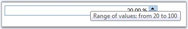
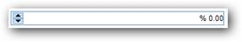
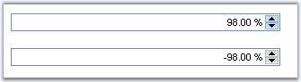
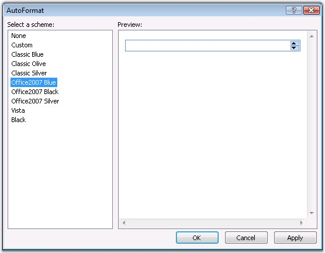
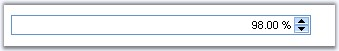

::: {style="DISPLAY: none"}
{#d2h_url_template}{#d2h_package_url style="WIDTH: 0px; DISPLAY: none; HEIGHT: 0px"}
:::

::::::::::::: {.d2h_secondary_topic style="PADDING-BOTTOM: 10pt; MARGIN: 0pt; PADDING-LEFT: 0pt; PADDING-RIGHT: 0pt; PADDING-TOP: 0pt"}
##### Concepts and Features {#concepts-and-features style="tab-stops: 0pt"}

 

 This section discusses the various features of the PercentTextBox control.

 

###### 5.1.2.6.2.1 Behavior Settings {#behavior-settings style="tab-stops: 0pt"}

[]{style="FONT-FAMILY: 'Trebuchet MS','sans-serif'; COLOR: #15428b; FONT-SIZE: 9pt"} 

Setting Limits for the Value

[]{style="FONT-FAMILY: 'Trebuchet MS','sans-serif'; COLOR: #15428b; FONT-SIZE: 9pt"} 

**MaxValue** and **MinValue** allows to set the maximum and the minimum percent values beyond which the user is restricted to enter any values. Setting **IncrementStep** increases the values in steps of the number when the arrow keys are pressed.

[]{style="FONT-FAMILY: 'Trebuchet MS','sans-serif'; COLOR: #15428b; FONT-SIZE: 9pt"} 

::: {align="center"}
+-----------------------------------+----------------------------------------------------+
|                                   |                                                    |
|                                   |                                                    |
| Property                          | Description                                        |
+-----------------------------------+----------------------------------------------------+
| IncrementStep                     | Specifies the increment value. Default value is 1. |
+-----------------------------------+----------------------------------------------------+
| MaxValue                          | Specifies maximum value the control allows.        |
+-----------------------------------+----------------------------------------------------+
| MinValue                          | Specifies minimum value the control allows.        |
+-----------------------------------+----------------------------------------------------+
:::

[]{style="FONT-FAMILY: 'Trebuchet MS','sans-serif'; COLOR: #15428b; FONT-SIZE: 9pt"} 

Programmatically the limit and increment properties can be set as follows.

[]{style="FONT-FAMILY: 'Trebuchet MS','sans-serif'; COLOR: #15428b; FONT-SIZE: 9pt"} 

+------------------------------------------------------------------------------------------+
| **[\[C#\]]{style="FONT-FAMILY: 'Courier New'; FONT-SIZE: 9pt"}**                         |
|                                                                                          |
| []{style="FONT-FAMILY: 'Courier New'; COLOR: blue; FONT-SIZE: 9pt"}                      |
|                                                                                          |
| [PercentTextBox1.IncrementStep = 1;]{style="FONT-FAMILY: 'Courier New'; FONT-SIZE: 9pt"} |
|                                                                                          |
| [PercentTextBox1.MaxValue = 100;]{style="FONT-FAMILY: 'Courier New'; FONT-SIZE: 9pt"}    |
|                                                                                          |
| [PercentTextBox1.MinValue = 20;]{style="FONT-FAMILY: 'Courier New'; FONT-SIZE: 9pt"}     |
+------------------------------------------------------------------------------------------+

[]{style="FONT-FAMILY: 'Trebuchet MS','sans-serif'; COLOR: #15428b; FONT-SIZE: 9pt"} 

+--------------------------------------------------------------------------------------------------------------------------------------------------------------------+
| **[\[VB\]]{style="FONT-FAMILY: 'Courier New'; FONT-SIZE: 9pt"}**                                                                                                   |
|                                                                                                                                                                    |
| []{style="FONT-FAMILY: 'Courier New'; COLOR: blue; FONT-SIZE: 9pt"}                                                                                                |
|                                                                                                                                                                    |
| [Private]{style="FONT-FAMILY: 'Courier New'; COLOR: blue; FONT-SIZE: 9pt"}[ PercentTextBox1.IncrementStep = 1]{style="FONT-FAMILY: 'Courier New'; FONT-SIZE: 9pt"} |
|                                                                                                                                                                    |
| [Private]{style="FONT-FAMILY: 'Courier New'; COLOR: blue; FONT-SIZE: 9pt"}[ PercentTextBox1.MaxValue = 100]{style="FONT-FAMILY: 'Courier New'; FONT-SIZE: 9pt"}    |
|                                                                                                                                                                    |
| [Private]{style="FONT-FAMILY: 'Courier New'; COLOR: blue; FONT-SIZE: 9pt"}[ PercentTextBox1.MinValue = 20]{style="FONT-FAMILY: 'Courier New'; FONT-SIZE: 9pt"}     |
+--------------------------------------------------------------------------------------------------------------------------------------------------------------------+

[]{style="FONT-FAMILY: 'Trebuchet MS','sans-serif'; COLOR: #15428b; FONT-SIZE: 9pt"} 

{border="0"}

[]{style="FONT-FAMILY: 'Trebuchet MS','sans-serif'; COLOR: #15428b; FONT-SIZE: 9pt"} 

Figure 71: Value range with Text align settings

[]{style="FONT-FAMILY: 'Trebuchet MS','sans-serif'; COLOR: #15428b; FONT-SIZE: 9pt"} 

Aligning the Value

[]{style="FONT-FAMILY: 'Trebuchet MS','sans-serif'; COLOR: #15428b; FONT-SIZE: 9pt"} 

The value can be aligned by setting the **TextAlignment** property to the required options.

[]{style="FONT-FAMILY: 'Trebuchet MS','sans-serif'; COLOR: #15428b; FONT-SIZE: 9pt"} 

::: {align="center"}
+-----------------------------------+------------------------------------------------------------------------------------------------+
| Property                          | Description                                                                                    |
+-----------------------------------+------------------------------------------------------------------------------------------------+
| TextAlignment                     | Specifies the alignment for text. Default value is Right. The options included are as follows: |
|                                   |                                                                                                |
|                                   | [·      ]{style="FONT-FAMILY: Symbol"}Left                                                     |
|                                   |                                                                                                |
|                                   | [·      ]{style="FONT-FAMILY: Symbol"}Right                                                    |
|                                   |                                                                                                |
|                                   | [·      ]{style="FONT-FAMILY: Symbol"}Center                                                   |
|                                   |                                                                                                |
|                                   | [·      ]{style="FONT-FAMILY: Symbol"}Justify                                                  |
+-----------------------------------+------------------------------------------------------------------------------------------------+
:::

[]{style="FONT-FAMILY: 'Trebuchet MS','sans-serif'; COLOR: #15428b; FONT-SIZE: 9pt"} 

Programmatically the text can be aligned as follows.

[]{style="FONT-FAMILY: 'Trebuchet MS','sans-serif'; COLOR: #15428b; FONT-SIZE: 9pt"} 

+-------------------------------------------------------------------------------------------------------------------------------------------------+
| **[\[C#\]]{style="FONT-FAMILY: 'Courier New'; FONT-SIZE: 9pt"}**                                                                                |
|                                                                                                                                                 |
| []{style="FONT-FAMILY: 'Courier New'; COLOR: blue; FONT-SIZE: 9pt"}                                                                             |
|                                                                                                                                                 |
| [PercentTextBox1.TextAlignment = Syncfusion.Web.UI.[TextAlign]{style="COLOR: teal"}.Right;]{style="FONT-FAMILY: 'Courier New'; FONT-SIZE: 9pt"} |
+-------------------------------------------------------------------------------------------------------------------------------------------------+

[]{style="FONT-FAMILY: 'Trebuchet MS','sans-serif'; COLOR: #15428b; FONT-SIZE: 9pt"} 

+----------------------------------------------------------------------------------------------------------------------------------------------------------------------------------------------------+
| **[\[VB\]]{style="FONT-FAMILY: 'Courier New'; FONT-SIZE: 9pt"}**                                                                                                                                   |
|                                                                                                                                                                                                    |
| []{style="FONT-FAMILY: 'Courier New'; COLOR: blue; FONT-SIZE: 9pt"}                                                                                                                                |
|                                                                                                                                                                                                    |
| [Private]{style="FONT-FAMILY: 'Courier New'; COLOR: blue; FONT-SIZE: 9pt"}[ PercentTextBox1.TextAlignment = Syncfusion.Web.UI.TextAlign.Right]{style="FONT-FAMILY: 'Courier New'; FONT-SIZE: 9pt"} |
+----------------------------------------------------------------------------------------------------------------------------------------------------------------------------------------------------+

[]{style="FONT-FAMILY: 'Trebuchet MS','sans-serif'; COLOR: black; FONT-SIZE: 9pt"} 

RightToLeft property

[]{style="FONT-FAMILY: 'Trebuchet MS','sans-serif'; COLOR: #15428b; FONT-SIZE: 9pt"} 

You can align the elements of the PercentTextBox using this property.

[]{style="FONT-FAMILY: 'Trebuchet MS','sans-serif'; COLOR: #15428b; FONT-SIZE: 9pt"} 

::: {align="center"}
  ------------- ------------------------------------------------------------------------------------------------------------------------------
  Property      Description
  RightToLeft   Gets / sets a value indicating whether the elements of the control are aligned to support locales using right-to-left fonts.
  ------------- ------------------------------------------------------------------------------------------------------------------------------
:::

[]{style="FONT-FAMILY: 'Trebuchet MS','sans-serif'; COLOR: #15428b; FONT-SIZE: 9pt"} 

+------------------------------------------------------------------------------------------------------------------+
| **[\[C#\]]{style="FONT-FAMILY: 'Courier New'"}**                                                                 |
|                                                                                                                  |
| []{style="FONT-FAMILY: 'Courier New'; COLOR: blue; FONT-SIZE: 9pt"}                                              |
|                                                                                                                  |
| [PercentTextBox1.RightToLeft = [true]{style="COLOR: blue"};]{style="FONT-FAMILY: 'Courier New'; FONT-SIZE: 9pt"} |
+------------------------------------------------------------------------------------------------------------------+

[]{style="FONT-FAMILY: 'Trebuchet MS','sans-serif'; COLOR: #15428b; FONT-SIZE: 9pt"} 

+--------------------------------------------------------------------------------------------------------------------------------------------------------------------------------------------+
| **[\[VB\]]{style="FONT-FAMILY: 'Courier New'"}**                                                                                                                                           |
|                                                                                                                                                                                            |
| []{style="FONT-FAMILY: 'Courier New'; COLOR: blue; FONT-SIZE: 9pt"}                                                                                                                        |
|                                                                                                                                                                                            |
| [Private]{style="FONT-FAMILY: 'Courier New'; COLOR: blue; FONT-SIZE: 9pt"}[ PercentTextBox1.RightToLeft = [True]{style="COLOR: blue"}]{style="FONT-FAMILY: 'Courier New'; FONT-SIZE: 9pt"} |
+--------------------------------------------------------------------------------------------------------------------------------------------------------------------------------------------+

 

{border="0"}

Figure 72: Elements of the PercentTextBox is Aligned to Right

 

###### 5.1.2.6.2.2 Culture Settings {#culture-settings style="tab-stops: 0pt"}

[]{style="FONT-FAMILY: 'Trebuchet MS','sans-serif'; COLOR: #15428b; FONT-SIZE: 9pt"} 

Setting **CultureSource** property to **UserOverride** displays a set of properties that allows you to customize the entered values. Setting it to the **FromClient** or **FromServer**, obtains the values from client and server respectively.

[]{style="FONT-FAMILY: 'Trebuchet MS','sans-serif'; COLOR: #15428b; FONT-SIZE: 9pt"} 

::: {align="center"}
+-----------------------------------+------------------------------------------------------------------------------------------------------------------+
| Property                          | Description                                                                                                      |
+-----------------------------------+------------------------------------------------------------------------------------------------------------------+
| CultureSource                     | Specifies the source for the culture settings. Default value is FromClient. The options included are as follows: |
|                                   |                                                                                                                  |
|                                   | [·      ]{style="FONT-FAMILY: Symbol"}*FromClient*: culture is obtained from data posted by browser              |
|                                   |                                                                                                                  |
|                                   | [·      ]{style="FONT-FAMILY: Symbol"}*FromServer*: culture is obtained from web-server hosting page             |
|                                   |                                                                                                                  |
|                                   | [·      ]{style="FONT-FAMILY: Symbol"}*UserOverride*: user-defined culture                                       |
+-----------------------------------+------------------------------------------------------------------------------------------------------------------+
:::

[]{style="FONT-FAMILY: 'Trebuchet MS','sans-serif'; COLOR: #15428b; FONT-SIZE: 9pt"} 

Globalization

[]{style="FONT-FAMILY: 'Trebuchet MS','sans-serif'; COLOR: #15428b; FONT-SIZE: 9pt"} 

**PercentSymbol** allows you to specify the symbol to use instead of the default percent symbol. **UserOvrrideCulture** allows you to set the required culture to represent the value to the specific requirement.

[]{style="FONT-FAMILY: 'Trebuchet MS','sans-serif'; COLOR: #15428b; FONT-SIZE: 9pt"} 

::: {align="center"}
  --------------------- ---------------------------------------------------------------------------------------------------
  Property              Description
  PercentSymbol         Specifies the PercentSymbol for this control. The default value is English(United States).
  UserOverrideCulture   When CultureSource is set to UserOverride, culture is obtained from UserOverrideCulture property.
  --------------------- ---------------------------------------------------------------------------------------------------
:::

[]{style="FONT-FAMILY: 'Trebuchet MS','sans-serif'; COLOR: #15428b; FONT-SIZE: 9pt"} 

Programmatically the culture settings can be coded as follows.

[]{style="FONT-FAMILY: 'Trebuchet MS','sans-serif'; COLOR: #15428b; FONT-SIZE: 9pt"} 

+----------------------------------------------------------------------------------------------------------------------------------------------+
| **[\[C#\]]{style="FONT-FAMILY: 'Courier New'; FONT-SIZE: 9pt"}**                                                                             |
|                                                                                                                                              |
| []{style="FONT-FAMILY: 'Courier New'; COLOR: blue; FONT-SIZE: 9pt"}                                                                          |
|                                                                                                                                              |
| [PercentTextBox1.CultureSource = [CultureSourceType]{style="COLOR: teal"}.UserOverride;]{style="FONT-FAMILY: 'Courier New'; FONT-SIZE: 9pt"} |
|                                                                                                                                              |
| [PercentTextBox1.PercentSymbol = [\" %\"]{style="COLOR: maroon"};]{style="FONT-FAMILY: 'Courier New'; FONT-SIZE: 9pt"}                       |
+----------------------------------------------------------------------------------------------------------------------------------------------+

[]{style="FONT-FAMILY: 'Trebuchet MS','sans-serif'; COLOR: #15428b; FONT-SIZE: 9pt"} 

+--------------------------------------------------------------------------------------------------------------------------------------------------------------------------------------------------+
| **[\[VB\]]{style="FONT-FAMILY: 'Courier New'; FONT-SIZE: 9pt"}**                                                                                                                                 |
|                                                                                                                                                                                                  |
| []{style="FONT-FAMILY: 'Courier New'; COLOR: blue; FONT-SIZE: 9pt"}                                                                                                                              |
|                                                                                                                                                                                                  |
| [Private]{style="FONT-FAMILY: 'Courier New'; COLOR: blue; FONT-SIZE: 9pt"}[ PercentTextBox1.CultureSource = CultureSourceType.UserOverride]{style="FONT-FAMILY: 'Courier New'; FONT-SIZE: 9pt"}  |
|                                                                                                                                                                                                  |
| [Private]{style="FONT-FAMILY: 'Courier New'; COLOR: blue; FONT-SIZE: 9pt"}[ PercentTextBox1.PercentSymbol = [\" %\"]{style="COLOR: maroon"}]{style="FONT-FAMILY: 'Courier New'; FONT-SIZE: 9pt"} |
+--------------------------------------------------------------------------------------------------------------------------------------------------------------------------------------------------+

[]{style="FONT-FAMILY: 'Trebuchet MS','sans-serif'; COLOR: #15428b; FONT-SIZE: 9pt"} 

Customizing value format

[]{style="FONT-FAMILY: 'Trebuchet MS','sans-serif'; COLOR: #15428b; FONT-SIZE: 9pt"} 

**DecimalDigits** allows to set the number of digits to be allowed after the decimal separator and **DecimalSeparator** allows to set the separator to be used as the decimal point.

For example: Setting DecimalDigits property to \'**2\'** and DecimalSeparator property to \'**.\'**, displays the value as \'**0.28\'**.

**GroupSize** allows to set the number of digits in a group which will be separated by the **GroupSeparator** which is the character to be used as the separator of the groups.

For example: Setting GroupSize property to \'**3\'** and GroupSeparator property to \'**,\'**, displays the value as \'**4,567,234\'**.

[]{style="FONT-FAMILY: 'Trebuchet MS','sans-serif'; COLOR: #15428b; FONT-SIZE: 9pt"} 

::: {align="center"}
  ------------------ --------------------------------------------------------------------------------------------------------
  Property           Description
  DecimalDigits      Specifies the number of decimal digits that will be allowed.
  DecimalSeparator   Specifies the string to be used as decimal separator. The default value is \'.\'.
  GroupSeparator     Specifies the string to be used when GroupSeparator position is specified. The default value is \',\'.
  GroupSizes         The integer to use when GroupSize is specified. The default value is 3.
  ------------------ --------------------------------------------------------------------------------------------------------
:::

[]{style="FONT-FAMILY: 'Trebuchet MS','sans-serif'; COLOR: black"} 

Programmatically the culture properties can be set as follows.

[]{style="FONT-FAMILY: 'Trebuchet MS','sans-serif'; COLOR: #15428b; FONT-SIZE: 9pt"} 

+--------------------------------------------------------------------------------------------------------------------------------------------------+
| **[\[C#\]]{style="FONT-FAMILY: 'Courier New'; FONT-SIZE: 9pt"}**                                                                                 |
|                                                                                                                                                  |
| []{style="FONT-FAMILY: 'Courier New'; COLOR: blue; FONT-SIZE: 9pt"}                                                                              |
|                                                                                                                                                  |
| [PercentTextBox1.GroupSeparator = [\",\"]{style="COLOR: maroon"};]{style="FONT-FAMILY: 'Courier New'; FONT-SIZE: 9pt"}                           |
|                                                                                                                                                  |
| [PercentTextBox1.GroupSizes = [new]{style="COLOR: blue"} [int]{style="COLOR: blue"}\[\]{3};]{style="FONT-FAMILY: 'Courier New'; FONT-SIZE: 9pt"} |
|                                                                                                                                                  |
| [PercentTextBox1.DecimalSeparator = [\".\"]{style="COLOR: maroon"};]{style="FONT-FAMILY: 'Courier New'; FONT-SIZE: 9pt"}                         |
|                                                                                                                                                  |
| [PercentTextBox1.DecimalDigits = 2;]{style="FONT-FAMILY: 'Courier New'; FONT-SIZE: 9pt"}                                                         |
+--------------------------------------------------------------------------------------------------------------------------------------------------+

[]{style="FONT-FAMILY: 'Trebuchet MS','sans-serif'; COLOR: #15428b; FONT-SIZE: 9pt"} 

+------------------------------------------------------------------------------------------------------------------------------------------------------------------------------------------------------------------------------+
| **[\[VB\]]{style="FONT-FAMILY: 'Courier New'; FONT-SIZE: 9pt"}**                                                                                                                                                             |
|                                                                                                                                                                                                                              |
| []{style="FONT-FAMILY: 'Courier New'; COLOR: blue; FONT-SIZE: 9pt"}                                                                                                                                                          |
|                                                                                                                                                                                                                              |
| [Private]{style="FONT-FAMILY: 'Courier New'; COLOR: blue; FONT-SIZE: 9pt"}[ PercentTextBox1.GroupSeparator = [\",\"]{style="COLOR: maroon"}]{style="FONT-FAMILY: 'Courier New'; FONT-SIZE: 9pt"}                             |
|                                                                                                                                                                                                                              |
| [Private]{style="FONT-FAMILY: 'Courier New'; COLOR: blue; FONT-SIZE: 9pt"}[ PercentTextBox1.GroupSizes = [New]{style="COLOR: blue"} [Integer]{style="COLOR: blue"}(){3}]{style="FONT-FAMILY: 'Courier New'; FONT-SIZE: 9pt"} |
|                                                                                                                                                                                                                              |
| [Private]{style="FONT-FAMILY: 'Courier New'; COLOR: blue; FONT-SIZE: 9pt"}[ PercentTextBox1.DecimalSeparator = [\".\"]{style="COLOR: maroon"}]{style="FONT-FAMILY: 'Courier New'; FONT-SIZE: 9pt"}                           |
|                                                                                                                                                                                                                              |
| [Private]{style="FONT-FAMILY: 'Courier New'; COLOR: blue; FONT-SIZE: 9pt"}[ PercentTextBox1.DecimalDigits = 2]{style="FONT-FAMILY: 'Courier New'; FONT-SIZE: 9pt"}                                                           |
+------------------------------------------------------------------------------------------------------------------------------------------------------------------------------------------------------------------------------+

[]{style="FONT-FAMILY: 'Trebuchet MS','sans-serif'; COLOR: #15428b; FONT-SIZE: 9pt"} 

Customizing Positive and Negative values

[]{style="FONT-FAMILY: 'Trebuchet MS','sans-serif'; COLOR: #15428b; FONT-SIZE: 9pt"} 

Positive and negative patterns in which the values should be set can be specified by the user with one of the provided options.

[]{style="FONT-FAMILY: 'Trebuchet MS','sans-serif'; COLOR: #15428b; FONT-SIZE: 9pt"} 

{border="0"}

[]{style="FONT-FAMILY: 'Trebuchet MS','sans-serif'; COLOR: #15428b; FONT-SIZE: 9pt"} 

Figure 73: Positive and Negative patterns

[]{style="FONT-FAMILY: 'Trebuchet MS','sans-serif'; COLOR: #15428b; FONT-SIZE: 9pt"} 

::: {align="center"}
+-----------------------------------+----------------------------------------------------------------------------------------------------------------------+
| Property                          | Description                                                                                                          |
+-----------------------------------+----------------------------------------------------------------------------------------------------------------------+
| NegativePattern                   | Specifies format pattern for negative percent values. This property can have one of the values:                      |
|                                   |                                                                                                                      |
|                                   |                                                                                                                      |
|                                   |                                                                                                                      |
|                                   | ::: {align="center"}                                                                                                 |
|                                   |   ------- --------                                                                                                   |
|                                   |   Value   Format                                                                                                     |
|                                   |   0       -n %                                                                                                       |
|                                   |   1       -n%                                                                                                        |
|                                   |   2        -%n                                                                                                       |
|                                   |   ------- --------                                                                                                   |
|                                   | :::                                                                                                                  |
|                                   |                                                                                                                      |
|                                   |                                                                                                                      |
|                                   |                                                                                                                      |
|                                   | \'%\' is the percent symbol , \'-\' is negative sign and n is a number. The default is 0, which represents \'-n %\'. |
+-----------------------------------+----------------------------------------------------------------------------------------------------------------------+
| NegativeSign                      | The string which, denotes that the associated number is negative. The default value is \'-\'.                        |
+-----------------------------------+----------------------------------------------------------------------------------------------------------------------+
| PositivePattern                   | Specifies the format Pattern for positive percent values. This property can take one of the following values:        |
|                                   |                                                                                                                      |
|                                   |                                                                                                                      |
|                                   |                                                                                                                      |
|                                   | ::: {align="center"}                                                                                                 |
|                                   |   ------- --------                                                                                                   |
|                                   |   Value   Format                                                                                                     |
|                                   |   0        n %                                                                                                       |
|                                   |   1        n%                                                                                                        |
|                                   |   2       %n                                                                                                         |
|                                   |   ------- --------                                                                                                   |
|                                   | :::                                                                                                                  |
|                                   |                                                                                                                      |
|                                   | []{style="COLOR: black"}                                                                                             |
|                                   |                                                                                                                      |
|                                   | \'%\' is the percent symbol and n is a number. The default is 0.                                                     |
+-----------------------------------+----------------------------------------------------------------------------------------------------------------------+
:::

[]{style="FONT-FAMILY: 'Trebuchet MS','sans-serif'; COLOR: #15428b; FONT-SIZE: 9pt"} 

Programmatically the positive and negative pattern and sign can be set as follows.

[]{style="FONT-FAMILY: 'Trebuchet MS','sans-serif'; COLOR: #15428b; FONT-SIZE: 9pt"} 

+----------------------------------------------------------------------------------------------------------------------+
| **[\[C#\]]{style="FONT-FAMILY: 'Courier New'; FONT-SIZE: 9pt"}**                                                     |
|                                                                                                                      |
| []{style="FONT-FAMILY: 'Courier New'; COLOR: blue; FONT-SIZE: 9pt"}                                                  |
|                                                                                                                      |
| [PercentTextBox1.PositivePattern = 1;]{style="FONT-FAMILY: 'Courier New'; FONT-SIZE: 9pt"}                           |
|                                                                                                                      |
| [PercentTextBox1.NegativePattern = 1;]{style="FONT-FAMILY: 'Courier New'; FONT-SIZE: 9pt"}                           |
|                                                                                                                      |
| [PercentTextBox1.NegativeSign = [\"-\"]{style="COLOR: maroon"};]{style="FONT-FAMILY: 'Courier New'; FONT-SIZE: 9pt"} |
+----------------------------------------------------------------------------------------------------------------------+

[]{style="FONT-FAMILY: 'Trebuchet MS','sans-serif'; COLOR: #15428b; FONT-SIZE: 9pt"} 

+----------------------------------------------------------------------------------------------------------------------------------------------------------------------+
| **[\[VB\]]{style="FONT-FAMILY: 'Courier New'; FONT-SIZE: 9pt"}**                                                                                                     |
|                                                                                                                                                                      |
| []{style="FONT-FAMILY: 'Courier New'; COLOR: blue; FONT-SIZE: 9pt"}                                                                                                  |
|                                                                                                                                                                      |
| [Private]{style="FONT-FAMILY: 'Courier New'; COLOR: blue; FONT-SIZE: 9pt"}[ PercentTextBox1.PositivePattern = 1]{style="FONT-FAMILY: 'Courier New'; FONT-SIZE: 9pt"} |
|                                                                                                                                                                      |
| [Private]{style="FONT-FAMILY: 'Courier New'; COLOR: blue; FONT-SIZE: 9pt"}[ PercentTextBox1.NegativePattern = 1]{style="FONT-FAMILY: 'Courier New'; FONT-SIZE: 9pt"} |
|                                                                                                                                                                      |
| [Private]{style="FONT-FAMILY: 'Courier New'; COLOR: blue; FONT-SIZE: 9pt"}[ PercentTextBox1.NegativeSign = -]{style="FONT-FAMILY: 'Courier New'; FONT-SIZE: 9pt"}    |
+----------------------------------------------------------------------------------------------------------------------------------------------------------------------+

 

###### 5.1.2.6.2.3 ClientObjectID {#clientobjectid style="tab-stops: 0pt"}

[]{style="FONT-FAMILY: 'Trebuchet MS','sans-serif'; COLOR: #15428b; FONT-SIZE: 9pt"} 

The ClientObjectID can be used to access the control\'s object model on the client side.

ClientObjectID can be effectively used to refer the control\'s objects when used with MasterPages and UserControls. By default, a client object id is computed by concatenating \'\_sf\' and the control\'s **ID** property. However in the case of hosting the control in a MasterPage or UserControl, the computed client object id is very unintuitive. To make things simpler you can specify a custom value on this property and access the client side object model using that value.

[]{style="FONT-FAMILY: 'Trebuchet MS','sans-serif'; COLOR: #15428b; FONT-SIZE: 9pt"} 

::: {align="center"}
  ---------------- ------------------------------------------------------------------------
  Property         Description
  ClientObjectID   Specifies the user defined id for accessing the object on client side.
  ---------------- ------------------------------------------------------------------------
:::

[]{style="FONT-FAMILY: 'Trebuchet MS','sans-serif'; COLOR: #15428b; FONT-SIZE: 9pt"} 

Programmatically the ClientObjectID can be set as follows.

[  ]{style="FONT-FAMILY: 'Trebuchet MS','sans-serif'; COLOR: #15428b; FONT-SIZE: 9pt"}

+--------------------------------------------------------------------------------------------------------------------------------+
| **[\[C#\]]{style="FONT-FAMILY: 'Courier New'; FONT-SIZE: 9pt"}**                                                               |
|                                                                                                                                |
| []{style="FONT-FAMILY: 'Courier New'; COLOR: blue; FONT-SIZE: 9pt"}                                                            |
|                                                                                                                                |
| [PercentTextBox1.ClientObjectID = [\"Custom ID\"]{style="COLOR: maroon"};]{style="FONT-FAMILY: 'Courier New'; FONT-SIZE: 9pt"} |
+--------------------------------------------------------------------------------------------------------------------------------+

[]{style="FONT-FAMILY: 'Trebuchet MS','sans-serif'; COLOR: #15428b; FONT-SIZE: 9pt"} 

+----------------------------------------------------------------------------------------------------------------------------------------------------------------------------------------------------------+
| **[\[VB\]]{style="FONT-FAMILY: 'Courier New'; FONT-SIZE: 9pt"}**                                                                                                                                         |
|                                                                                                                                                                                                          |
| []{style="FONT-FAMILY: 'Courier New'; COLOR: blue; FONT-SIZE: 9pt"}                                                                                                                                      |
|                                                                                                                                                                                                          |
| [Private]{style="FONT-FAMILY: 'Courier New'; COLOR: blue; FONT-SIZE: 9pt"}[ PercentTextBox1.ClientObjectID = [\"Custom ID\"]{style="COLOR: maroon"}]{style="FONT-FAMILY: 'Courier New'; FONT-SIZE: 9pt"} |
+----------------------------------------------------------------------------------------------------------------------------------------------------------------------------------------------------------+

 

###### 5.1.2.6.2.4 AutoFormat Style Options {#autoformat-style-options style="tab-stops: 0pt"}

[]{style="FONT-FAMILY: 'Trebuchet MS','sans-serif'; COLOR: #15428b; FONT-SIZE: 9pt"} 

The PercentTextBox control provides pre-defined set of styles that can be applied to your control just on a click of the button. You can set the desired look and feel for the control that includes some popular styles too.

Right clicking the control and selecting the \'Auto Format\...\' option opens the following Auto Format dialog box.

[]{style="FONT-FAMILY: 'Trebuchet MS','sans-serif'; COLOR: #15428b; FONT-SIZE: 9pt"} 

{border="0"}

Figure 74

[]{style="FONT-FAMILY: 'Trebuchet MS','sans-serif'; COLOR: #15428b; FONT-SIZE: 9pt"} 

The left pane lists the various pre-defined style scheme that are available. The right pane shows the preview of the currently selected scheme. Select the required style and click OK to apply the selected scheme to the control.

[]{style="FONT-FAMILY: 'Trebuchet MS','sans-serif'; COLOR: #15428b; FONT-SIZE: 9pt"} 

Example of a popular look and feel

[]{style="FONT-FAMILY: 'Trebuchet MS','sans-serif'; COLOR: #15428b; FONT-SIZE: 9pt"} 

The following image shows the PercentTextBox with **Custom** style setting.

[]{style="FONT-FAMILY: 'Trebuchet MS','sans-serif'; COLOR: #15428b; FONT-SIZE: 9pt"} 

{border="0"}

Figure 75

 

###### 5.1.2.6.2.5 Client-Side Object Model {#client-side-object-model style="tab-stops: 0pt"}

[]{style="FONT-FAMILY: 'Trebuchet MS','sans-serif'; COLOR: #15428b; FONT-SIZE: 9pt"} 

The client side methods can be used to control the behavior of the PercentTextBox, that allows to interact with it. All the following methods are inherited from PercentTextBox client side object.

[]{style="FONT-FAMILY: 'Trebuchet MS','sans-serif'; COLOR: #15428b; FONT-SIZE: 9pt"} 

::: {align="center"}
  ---------- ----------- ------------- ----------------------------------------------
  Method     Parameter   Return Type   Description
  Validate   string      bool          Verifies whether value has valid expression.
  GetText    \-          string        Get text of PercentTextBox.
  GetValue   \-          Date          Get value of PercentTextBox.
  SetValue   Date        \-            Set value of PercentTextBox.
  ---------- ----------- ------------- ----------------------------------------------
:::

[]{style="FONT-FAMILY: 'Trebuchet MS','sans-serif'; COLOR: #15428b; FONT-SIZE: 9pt"} 

The following code example demonstrates how to change value for PercentTextBox.

[]{style="FONT-FAMILY: 'Trebuchet MS','sans-serif'; COLOR: #15428b; FONT-SIZE: 9pt"} 

+-------------------------------------------------------------------------------------------------------------------------------------------------------------------------------------------------------------------------------------------------------------------------------------------------------------------------------------------------------------------------------------------------------------------------------------------------------------------------------------------------------------------------------------------------------------------------------------+
| [\<]{style="FONT-FAMILY: 'Courier New'; COLOR: blue; FONT-SIZE: 9pt"}[ssw]{style="FONT-FAMILY: 'Courier New'; COLOR: maroon; FONT-SIZE: 9pt"}[:]{style="FONT-FAMILY: 'Courier New'; COLOR: blue; FONT-SIZE: 9pt"}[PercentTextBox]{style="FONT-FAMILY: 'Courier New'; COLOR: maroon; FONT-SIZE: 9pt"}[ [ID]{style="COLOR: red"}[=\"PercentTextBox1\"]{style="COLOR: blue"} [ClientObjectId]{style="COLOR: red"}[=\"\_sfPercentTextBox1\"]{style="COLOR: blue"} [runat]{style="COLOR: red"}[=\"server\"/\>]{style="COLOR: blue"}]{style="FONT-FAMILY: 'Courier New'; FONT-SIZE: 9pt"} |
|                                                                                                                                                                                                                                                                                                                                                                                                                                                                                                                                                                                     |
| [\<]{style="FONT-FAMILY: 'Courier New'; COLOR: blue; FONT-SIZE: 9pt"}[input]{style="FONT-FAMILY: 'Courier New'; COLOR: maroon; FONT-SIZE: 9pt"}[ [type]{style="COLOR: red"}[=\"button\"]{style="COLOR: blue"} [value]{style="COLOR: red"}[=\"Set 100%\"]{style="COLOR: blue"} [onclick]{style="COLOR: red"}[=\"\_sfPercentTextBox1.SetText(\'100%\')\"]{style="COLOR: blue"} [/\>]{style="COLOR: blue"}]{style="FONT-FAMILY: 'Courier New'; FONT-SIZE: 9pt"}                                                                                                                        |
+-------------------------------------------------------------------------------------------------------------------------------------------------------------------------------------------------------------------------------------------------------------------------------------------------------------------------------------------------------------------------------------------------------------------------------------------------------------------------------------------------------------------------------------------------------------------------------------+

**[]{style="FONT-FAMILY: 'Trebuchet MS','sans-serif'; COLOR: #15428b"}** 

ClientEventData object for PercentTextBox client-side events

**[]{style="FONT-FAMILY: 'Trebuchet MS','sans-serif'; COLOR: #15428b"}** 

::: {align="center"}
  -------------- -------- -----------------------------------------------------------------------------
  Property       Type     Description
  ID             string   Specifies the client side identifier.
  Text           string   Specifies the text of textbox.
  Tooltip        string   Specifies the help message that showing when user moves mouse over control.
  Value          int      Specifies optional internal string value of this node.
  InstanceName   string   Specifies the client-side PercentTextBox object identifier.
  Instance       object   Represents PercentTextBox client-side object.
  HtmlID         string   Specifies PercentTextBox HTML-element identifier.
  Element        object   Represents PercentTextBox HTML-element.
  TextBox        object   Represents textbox HTML-element.
  Event          object   Represents event.
  -------------- -------- -----------------------------------------------------------------------------
:::

[]{style="FONT-FAMILY: 'Trebuchet MS','sans-serif'; COLOR: #15428b; FONT-SIZE: 9pt"} 

See Also

[]{style="FONT-FAMILY: 'Trebuchet MS','sans-serif'; COLOR: #15428b; FONT-SIZE: 9pt"} 

[Client-Side Events]{.UGHyperlink}[]{.UGHyperlink}

 

 

[]{#related-topics}
:::::::::::::
