::: {style="DISPLAY: none"}
{#d2h_url_template}{#d2h_package_url style="WIDTH: 0px; DISPLAY: none; HEIGHT: 0px"}
:::

:::::::::::::::::::::: {.d2h_secondary_topic style="PADDING-BOTTOM: 10pt; MARGIN: 0pt; PADDING-LEFT: 0pt; PADDING-RIGHT: 0pt; PADDING-TOP: 0pt"}
##### Concepts and Features {#concepts-and-features style="tab-stops: 0pt"}

 

[]{#p166}The following topics will help you become more familiar in using the AutoComplete control.

[]{style="COLOR: #15428b"} 

###### 3.3.1.1.3.1 AutoComplete Popup {#autocomplete-popup style="tab-stops: 0pt"}

[]{style="COLOR: #15428b"} 

When a control is associated with an AutoComplete control, a popup will be displayed, based on the []{#OLE_LINK1}[source]{style="COLOR: blue; TEXT-DECORATION: none; text-underline: none"}. This section illustrates various components of the AutoComplete Popup with their properties which can control the appearance and behavior of the components.

[]{style="COLOR: #15428b"} 

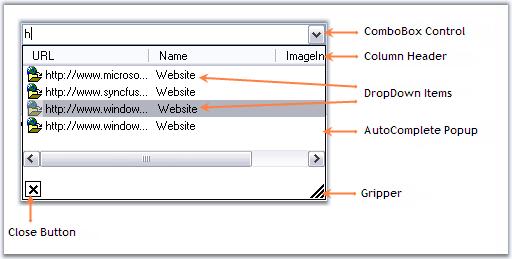{border="0"}

***[]{style="COLOR: #15428b"}*** 

Figure 117: AutoComplete Popup Components

[]{style="COLOR: #15428b"} 

This section will discuss various components in the AutoComplete popup.

[]{style="COLOR: #15428b"} 

 

[]{#p167}[]{#_Header,_Close_Button}3.3.1.1.3.1.1      Header, Close Button and Gripper

 

Header Settings

[]{style="COLOR: #15428b"} 

DropDown item can have a header which is enabled using **AutoComplete.ShowColumnHeader** property. AutoAddItem property should be set to true.

[]{style="COLOR: #15428b"} 

::: {align="center"}
  ------------------------- -----------------------------------------------------------------------------------------------------------------------------------------
  AutoComplete Properties   Description
  AutoAddItem               Specifies whether the current item in the target control is to be automatically added during validation, when the ENTER key is pressed.
  ------------------------- -----------------------------------------------------------------------------------------------------------------------------------------
:::

[]{style="COLOR: #15428b"} 

::: {style="BORDER-BOTTOM: windowtext 1pt solid; BORDER-LEFT: medium none; PADDING-BOTTOM: 1pt; MARGIN-TOP: 9pt; PADDING-LEFT: 0pt; PADDING-RIGHT: 0pt; MARGIN-BOTTOM: 9pt; BORDER-TOP: windowtext 1pt solid; BORDER-RIGHT: medium none; PADDING-TOP: 1pt"}
{border="0"} Note: The header will be shown only for the text that is saved at run time. Set AutoCompleteMode and AutoCompleteSource properties to None.
:::

[]{style="COLOR: #15428b"} 

+-------------------------------------------------------------------------------------------------------------------------------------------------------------------------------------+
| **[\[C#\]]{style="FONT-FAMILY: 'Courier New'; COLOR: black"}**                                                                                                                      |
|                                                                                                                                                                                     |
| []{style="COLOR: #15428b"}                                                                                                                                                          |
|                                                                                                                                                                                     |
| [this]{style="FONT-FAMILY: 'Courier New'; COLOR: blue"}[.autoComplete1.AutoAddItem = [true]{style="COLOR: blue"};]{style="FONT-FAMILY: 'Courier New'"}                              |
|                                                                                                                                                                                     |
| [this]{style="FONT-FAMILY: 'Courier New'; COLOR: blue"}[.autoComplete2.ShowColumnHeader = [true]{style="COLOR: blue"}; ]{style="FONT-FAMILY: 'Courier New'"}                        |
|                                                                                                                                                                                     |
| [this]{style="FONT-FAMILY: 'Courier New'; COLOR: blue"}[.autoCompleteDataColumnInfo1.ColumnHeaderText = [\"Contents\"]{style="COLOR: maroon"};]{style="FONT-FAMILY: 'Courier New'"} |
+-------------------------------------------------------------------------------------------------------------------------------------------------------------------------------------+

[]{style="COLOR: #15428b"} 

+----------------------------------------------------------------------------------------------------------------------------------------------------------------------------------+
| **[\[VB.NET\]]{style="FONT-FAMILY: 'Courier New'; COLOR: black"}**                                                                                                               |
|                                                                                                                                                                                  |
| []{style="COLOR: #15428b"}                                                                                                                                                       |
|                                                                                                                                                                                  |
| [Me]{style="FONT-FAMILY: 'Courier New'; COLOR: blue"}[.autoComplete1.AutoAddItem = [True]{style="COLOR: blue"}]{style="FONT-FAMILY: 'Courier New'"}                              |
|                                                                                                                                                                                  |
| [Me]{style="FONT-FAMILY: 'Courier New'; COLOR: blue"}[.autoComplete2.ShowColumnHeader = [True]{style="COLOR: blue"}]{style="FONT-FAMILY: 'Courier New'"}                         |
|                                                                                                                                                                                  |
| [Me]{style="FONT-FAMILY: 'Courier New'; COLOR: blue"}[.autoCompleteDataColumnInfo1.ColumnHeaderText = [\"Contents\"]{style="COLOR: maroon"}]{style="FONT-FAMILY: 'Courier New'"} |
+----------------------------------------------------------------------------------------------------------------------------------------------------------------------------------+

[]{style="COLOR: #15428b"} 

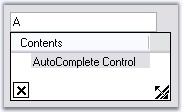{border="0"}

[]{style="COLOR: #15428b"} 

Figure 118: DropDownItem with ColumnHeaderText = \"Contents\"

**[]{style="COLOR: #15428b"}** 

::: {style="BORDER-BOTTOM: windowtext 1pt solid; BORDER-LEFT: medium none; PADDING-BOTTOM: 1pt; MARGIN-TOP: 9pt; PADDING-LEFT: 0pt; PADDING-RIGHT: 0pt; MARGIN-BOTTOM: 9pt; BORDER-TOP: windowtext 1pt solid; BORDER-RIGHT: medium none; PADDING-TOP: 1pt"}
{border="0"} Note:[ ]{style="COLOR: black; FONT-SIZE: 8pt"}You can also set multiple columns. Refer [Multiple Columns]{style="FONT-SIZE: 8pt"} to know more.
:::

[]{style="COLOR: #15428b"} 

Close Button and Gripper Settings

[]{style="COLOR: #15428b"} 

Visibility of close button and the gripper in the popup can be determined by **ShowCloseButton** and **ShowGripper** properties.

**[]{style="COLOR: black"}** 

::: {align="center"}
  ------------------------- ----------------------------------------------------------------------------------------------------------------
  AutoComplete Properties   Description
  ShowCloseButton           Specifies whether to show the CloseButton at the bottom right of the DropDownContainer. By default it is true.
  ShowGripper               Specifies whether to show gripper at the bottom right of a DropDownContainer. By default it is true.
  ------------------------- ----------------------------------------------------------------------------------------------------------------
:::

[]{style="FONT-SIZE: 8pt"} 

::: {style="BORDER-BOTTOM: windowtext 1pt solid; BORDER-LEFT: medium none; PADDING-BOTTOM: 1pt; MARGIN-TOP: 9pt; PADDING-LEFT: 0pt; PADDING-RIGHT: 0pt; MARGIN-BOTTOM: 9pt; BORDER-TOP: windowtext 1pt solid; BORDER-RIGHT: medium none; PADDING-TOP: 1pt"}
[{border="0"}]{style="FONT-SIZE: 8pt"} Note:[ ]{style="FONT-SIZE: 8pt"}The AutoComplete dropdown can be closed by calling AutoComplete.CloseDropDown() method.
:::

[]{style="COLOR: #15428b"} 

+------------------------------------------------------------------------------------------------------------------------------------------------------------+
| **[\[C#\]]{style="FONT-FAMILY: 'Courier New'; COLOR: black"}**                                                                                             |
|                                                                                                                                                            |
| []{style="COLOR: #15428b"}                                                                                                                                 |
|                                                                                                                                                            |
| [this]{style="FONT-FAMILY: 'Courier New'; COLOR: blue"}[.autoComplete1.ShowCloseButton = [true]{style="COLOR: blue"};]{style="FONT-FAMILY: 'Courier New'"} |
|                                                                                                                                                            |
| [this]{style="FONT-FAMILY: 'Courier New'; COLOR: blue"}[.autoComplete1.ShowGripper = [true]{style="COLOR: blue"};]{style="FONT-FAMILY: 'Courier New'"}     |
+------------------------------------------------------------------------------------------------------------------------------------------------------------+

[]{style="COLOR: #15428b"} 

+---------------------------------------------------------------------------------------------------------------------------------------------------------+
| **[\[VB.NET\]]{style="FONT-FAMILY: 'Courier New'; COLOR: black"}**                                                                                      |
|                                                                                                                                                         |
| []{style="COLOR: #15428b"}                                                                                                                              |
|                                                                                                                                                         |
| [Me]{style="FONT-FAMILY: 'Courier New'; COLOR: blue"}[.autoComplete1.ShowCloseButton = [True]{style="COLOR: blue"}]{style="FONT-FAMILY: 'Courier New'"} |
|                                                                                                                                                         |
| [Me]{style="FONT-FAMILY: 'Courier New'; COLOR: blue"}[.autoComplete1.ShowGripper = [True]{style="COLOR: blue"}]{style="FONT-FAMILY: 'Courier New'"}     |
+---------------------------------------------------------------------------------------------------------------------------------------------------------+

[]{#p168}3.3.1.1.3.1.2      Behavior Settings

**[]{style="COLOR: #15428b"}** 

Case Sensitivity

[]{style="COLOR: #15428b"} 

At run time, the string entered in a textbox (for example), can be made case sensitive using the below properties.

[]{style="COLOR: #15428b"} 

::: {align="center"}
  ------------------------- --------------------------------------------------------------------------------------------
  AutoComplete Properties   Description
  IgnoreCase                Specifies whether to ignore case sensitivity for string comparison. Default value is true.
  CaseSensitive             Specifies if the replacement of the matching entry is to be case sensitive.
  ------------------------- --------------------------------------------------------------------------------------------
:::

[]{style="COLOR: #15428b"} 

+----------------------------------------------------------------------------------------------------------------------------------------------------------+
| **[\[C#\]]{style="FONT-FAMILY: 'Courier New'; COLOR: black"}**                                                                                           |
|                                                                                                                                                          |
| []{style="COLOR: #15428b"}                                                                                                                               |
|                                                                                                                                                          |
| [this]{style="FONT-FAMILY: 'Courier New'; COLOR: blue"}[.autoComplete1.IgnoreCase = [false]{style="COLOR: blue"};]{style="FONT-FAMILY: 'Courier New'"}   |
|                                                                                                                                                          |
| [this]{style="FONT-FAMILY: 'Courier New'; COLOR: blue"}[.autoComplete1.CaseSensitive = [true]{style="COLOR: blue"};]{style="FONT-FAMILY: 'Courier New'"} |
+----------------------------------------------------------------------------------------------------------------------------------------------------------+

[]{style="COLOR: #15428b"} 

+-------------------------------------------------------------------------------------------------------------------------------------------------------+
| **[\[VB.NET\]]{style="FONT-FAMILY: 'Courier New'; COLOR: black"}**                                                                                    |
|                                                                                                                                                       |
| []{style="COLOR: #15428b"}                                                                                                                            |
|                                                                                                                                                       |
| [Me]{style="FONT-FAMILY: 'Courier New'; COLOR: blue"}[.autoComplete1.IgnoreCase = [False]{style="COLOR: blue"}]{style="FONT-FAMILY: 'Courier New'"}   |
|                                                                                                                                                       |
| [Me]{style="FONT-FAMILY: 'Courier New'; COLOR: blue"}[.autoComplete1.CaseSensitive = [True]{style="COLOR: blue"}]{style="FONT-FAMILY: 'Courier New'"} |
+-------------------------------------------------------------------------------------------------------------------------------------------------------+

[]{style="COLOR: #15428b"} 

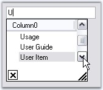{border="0"}

Figure 119: CaseSensitive = \"True\"

**[]{style="COLOR: #15428b"}** 

Overriding Combo

**[]{style="COLOR: #15428b"}** 

The Combobox drop down can be suppressed and overridden by the AutoComplete control using **OverrideCombo** property.

[]{style="COLOR: #15428b"} 

+----------------------------------------------------------------------------------------------------------------------------------------------------------+
| **[\[C#\]]{style="FONT-FAMILY: 'Courier New'; COLOR: black"}**                                                                                           |
|                                                                                                                                                          |
| []{style="COLOR: #15428b"}                                                                                                                               |
|                                                                                                                                                          |
| [this]{style="FONT-FAMILY: 'Courier New'; COLOR: blue"}[.autoComplete1.OverrideCombo = [true]{style="COLOR: blue"};]{style="FONT-FAMILY: 'Courier New'"} |
+----------------------------------------------------------------------------------------------------------------------------------------------------------+

[]{style="COLOR: #15428b"} 

+-------------------------------------------------------------------------------------------------------------------------------------------------------+
| **[\[VB.NET\]]{style="FONT-FAMILY: 'Courier New'; COLOR: black"}**                                                                                    |
|                                                                                                                                                       |
| []{style="COLOR: #15428b"}                                                                                                                            |
|                                                                                                                                                       |
| [Me]{style="FONT-FAMILY: 'Courier New'; COLOR: blue"}[.autoComplete1.OverrideCombo = [True]{style="COLOR: blue"}]{style="FONT-FAMILY: 'Courier New'"} |
+-------------------------------------------------------------------------------------------------------------------------------------------------------+

[]{style="COLOR: #15428b"} 

Sorting

[]{style="COLOR: #15428b"} 

The items in the list can be sorted automatically by setting **AutoSortList** to true.

[]{style="COLOR: #15428b"} 

::: {align="center"}
  ------------------------- -------------------------------------------------------
  AutoComplete Properties   Description
  AutoSortList              Specifies whether default sorting is to be performed.
  ------------------------- -------------------------------------------------------
:::

[]{style="COLOR: #15428b"} 

+---------------------------------------------------------------------------------------------------------------------------------------------------------+
| **[\[C#\]]{style="FONT-FAMILY: 'Courier New'; COLOR: black"}**                                                                                          |
|                                                                                                                                                         |
| []{style="COLOR: #15428b"}                                                                                                                              |
|                                                                                                                                                         |
| [this]{style="FONT-FAMILY: 'Courier New'; COLOR: blue"}[.autoComplete1.AutoSortList = [true]{style="COLOR: blue"};]{style="FONT-FAMILY: 'Courier New'"} |
+---------------------------------------------------------------------------------------------------------------------------------------------------------+

[]{style="COLOR: #15428b"} 

+------------------------------------------------------------------------------------------------------------------------------------------------------+
| **[\[VB.NET\]]{style="FONT-FAMILY: 'Courier New'; COLOR: black"}**                                                                                   |
|                                                                                                                                                      |
| []{style="COLOR: #15428b"}                                                                                                                           |
|                                                                                                                                                      |
| [Me]{style="FONT-FAMILY: 'Courier New'; COLOR: blue"}[.autoComplete1.AutoSortList = [True]{style="COLOR: blue"}]{style="FONT-FAMILY: 'Courier New'"} |
+------------------------------------------------------------------------------------------------------------------------------------------------------+

**[]{style="COLOR: #15428b"}** 

See Also

**[]{style="COLOR: #15428b"}** 

[Source for AutoComplete Control]{.UGHyperlink}[, ]{.UGHyperlink}[External Datasource]{.UGHyperlink}[]{.UGHyperlink}

[[]{style="TEXT-DECORATION: none"}]{.UGHyperlink} 

[]{#_Size_Settings}3.3.1.1.3.1.3      Size Settings[]{#p169}

[]{style="COLOR: #15428b"} 

The properties which can control the height and width of the AutoCompletePopup are as follows.

[]{style="COLOR: #15428b"} 

::: {align="center"}
  ---------------------------- --------------------------------------------------------------------------------------------------------------------------------------------------------------
  AutoComplete Properties      Description
  AdjustHeightToItemCount      Specifies if the height of the drop down should be adjusted automatically, based on the number of items.
  AutoPersistentDropDownSize   The Dropdown size of Autocomplete control is automatically persistent when this property is set to true.
  PreferredHeight              Specifies preferred height for the drop down displayed by the AutoComplete control when **AdjustHeightToItemCount** property is false. Default value is 200.
  PreferredWidth               Specifies preferred width for the drop down displayed by the AutoComplete control when **AdjustHeightToItemCount** property is false. Default value is -1.
  ---------------------------- --------------------------------------------------------------------------------------------------------------------------------------------------------------
:::

[]{style="COLOR: #15428b"} 

+-----------------------------------------------------------------------------------------------------------------------------------------------------------------------+
| **[\[C#\]]{style="FONT-FAMILY: 'Courier New'; COLOR: black"}**                                                                                                        |
|                                                                                                                                                                       |
| []{style="COLOR: #15428b"}                                                                                                                                            |
|                                                                                                                                                                       |
| [this]{style="FONT-FAMILY: 'Courier New'; COLOR: blue"}[.autoComplete1.AdjustHeightToItemCount = [false]{style="COLOR: blue"};]{style="FONT-FAMILY: 'Courier New'"}   |
|                                                                                                                                                                       |
| [this]{style="FONT-FAMILY: 'Courier New'; COLOR: blue"}[.autoComplete1.AutoPersistentDropDownSize = [true]{style="COLOR: blue"};]{style="FONT-FAMILY: 'Courier New'"} |
|                                                                                                                                                                       |
| [this]{style="FONT-FAMILY: 'Courier New'; COLOR: blue"}[.autoComplete1.PreferredHeight = 100;]{style="FONT-FAMILY: 'Courier New'"}                                    |
|                                                                                                                                                                       |
| [this]{style="FONT-FAMILY: 'Courier New'; COLOR: blue"}[.autoComplete1.PreferredWidth = 300;]{style="FONT-FAMILY: 'Courier New'"}                                     |
+-----------------------------------------------------------------------------------------------------------------------------------------------------------------------+

[]{style="COLOR: #15428b"} 

+--------------------------------------------------------------------------------------------------------------------------------------------------------------------+
| **[\[VB.NET\]]{style="FONT-FAMILY: 'Courier New'; COLOR: black"}**                                                                                                 |
|                                                                                                                                                                    |
| []{style="COLOR: #15428b"}                                                                                                                                         |
|                                                                                                                                                                    |
| [Me]{style="FONT-FAMILY: 'Courier New'; COLOR: blue"}[.autoComplete1.AdjustHeightToItemCount = [False]{style="COLOR: blue"}]{style="FONT-FAMILY: 'Courier New'"}   |
|                                                                                                                                                                    |
| [Me]{style="FONT-FAMILY: 'Courier New'; COLOR: blue"}[.autoComplete1.AutoPersistentDropDownSize = [True]{style="COLOR: blue"}]{style="FONT-FAMILY: 'Courier New'"} |
|                                                                                                                                                                    |
| [Me]{style="FONT-FAMILY: 'Courier New'; COLOR: blue"}[.autoComplete1.PreferredHeight = 100]{style="FONT-FAMILY: 'Courier New'"}                                    |
|                                                                                                                                                                    |
| [Me]{style="FONT-FAMILY: 'Courier New'; COLOR: blue"}[.autoComplete1.PreferredWidth = 300]{style="FONT-FAMILY: 'Courier New'"}                                     |
+--------------------------------------------------------------------------------------------------------------------------------------------------------------------+

[]{style="COLOR: #15428b"} 

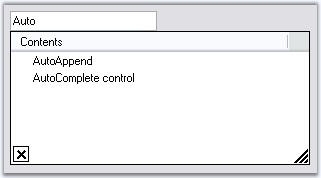{border="0"}

Figure 120: PreferredHeight = \"100\"; PreferredWidth = \"300\"

 

 

###### []{#p170}[]{#_DataSource}3.3.1.1.3.2 DataSource {#datasource style="tab-stops: 0pt"}

 

This section will discuss the data settings for the AutoComplete control, in the below topics.

[]{style="COLOR: #15428b"} 

[]{#p171}[]{#_Data_Settings}3.3.1.1.3.2.1      Data Settings

[]{style="COLOR: #15428b"} 

The data for the autocompletion will be maintained by the AutoComplete control itself. This is referred to as a History Data List mode. The below properties deals with data settings.

[]{style="COLOR: #15428b"} 

::: {align="center"}
  ------------------------- ---------------------------------------------------------------------------------------------------------------------------------------------------------------------------------------------------------------------------------------------------------------------------------------------------------------------------------------------------------------------------------------------------------------------------------------------------------------------------------------------------
  AutoComplete Properties   Description
  CategoryName              Specifies a unique or shared name that can be given to an AutoComplete control so that it can persist the values under that name. For example, if the CategoryName \"URL\" is provided for an AutoComplete control on a particular form, all values persisted by that AutoComplete control will also be accessible to other AutoComplete controls on others forms or on the same form with the CategoryName \"URL\".
  DataSource                Sets the Datasource to the Autocomplete control. The AutoComplete control automatically picks the \"History Data List\" mode or \"Data source\" mode based on the values set for the DataSource property. If the datasource property is set to NULL (default value is NULL), the control defaults to History Data List mode. It is to be remembered that the properties CategoryName, AutoAddItem and AutoSerialize have to be set appropriately for the History Data List mode to work properly.
  ------------------------- ---------------------------------------------------------------------------------------------------------------------------------------------------------------------------------------------------------------------------------------------------------------------------------------------------------------------------------------------------------------------------------------------------------------------------------------------------------------------------------------------------
:::

[]{style="COLOR: #15428b"} 

+--------------------------------------------------------------------------------------------------------------------------------------------------------------+
| **[\[C#\]]{style="FONT-FAMILY: 'Courier New'; COLOR: black"}**                                                                                               |
|                                                                                                                                                              |
| []{style="COLOR: #15428b"}                                                                                                                                   |
|                                                                                                                                                              |
| [this]{style="FONT-FAMILY: 'Courier New'; COLOR: blue"}[.autoComplete1.CategoryName = [\"FTP\"]{style="COLOR: maroon"};]{style="FONT-FAMILY: 'Courier New'"} |
|                                                                                                                                                              |
| [this]{style="FONT-FAMILY: 'Courier New'; COLOR: blue"}[.autoComplete1.DataSource = DataTable1;]{style="FONT-FAMILY: 'Courier New'"}                         |
+--------------------------------------------------------------------------------------------------------------------------------------------------------------+

[]{style="COLOR: #15428b"} 

+-----------------------------------------------------------------------------------------------------------------------------------------------------------+
| **[\[VB.NET\]]{style="FONT-FAMILY: 'Courier New'; COLOR: black"}**                                                                                        |
|                                                                                                                                                           |
| []{style="COLOR: #15428b"}                                                                                                                                |
|                                                                                                                                                           |
| [Me]{style="FONT-FAMILY: 'Courier New'; COLOR: blue"}[.autoComplete1.CategoryName = [\"FTP\"]{style="COLOR: maroon"}]{style="FONT-FAMILY: 'Courier New'"} |
|                                                                                                                                                           |
| [Me]{style="FONT-FAMILY: 'Courier New'; COLOR: blue"}[.autoComplete1.DataSource = DataTable1]{style="FONT-FAMILY: 'Courier New'"}                         |
+-----------------------------------------------------------------------------------------------------------------------------------------------------------+

[]{style="COLOR: #15428b"} 

::: {style="BORDER-BOTTOM: windowtext 1pt solid; BORDER-LEFT: medium none; PADDING-BOTTOM: 1pt; MARGIN-TOP: 9pt; PADDING-LEFT: 0pt; PADDING-RIGHT: 0pt; MARGIN-BOTTOM: 9pt; BORDER-TOP: windowtext 1pt solid; BORDER-RIGHT: medium none; PADDING-TOP: 1pt"}
{border="0"} Note: We can set External datasource for the autocompletion. See External DataSource topic.
:::

[]{style="COLOR: #15428b"} 

See Also

[]{style="COLOR: #15428b"} 

[How to delete the items in the list at run time?]{.UGHyperlink}[]{.UGHyperlink}

[]{#p172}[]{#_Source_for_AutoComplete}3.3.1.1.3.2.2      Source for AutoComplete Control

[]{style="COLOR: #15428b"} 

Dynamic Source at RunTime

[]{style="COLOR: #15428b"} 

Enabling the AutoComplete.AutoAddItem property will allow the end users to save their entries at run time. Pressing Enter key will save the user entry. See Through Designer topic for details.

[]{style="COLOR: #15428b"} 

Setting AutoCompletion Source Through Designer

[]{style="COLOR: #15428b"} 

The different sources available for auto completion are specified using **Control.AutoCompleteSource** property. When the end user enters a letter in the TextBox for example, the letter will be matched with the source available and displays the dropdown item accordingly.

[]{style="COLOR: #15428b"} 

::: {align="center"}
+-----------------------------------+--------------------------------------------------------------------------------------------------------------------------------------------------------------------------------------+
| Property                          | Description                                                                                                                                                                          |
+-----------------------------------+--------------------------------------------------------------------------------------------------------------------------------------------------------------------------------------+
| AutoCompleteSource                | Auto completion source for the control. The different sources are,                                                                                                                   |
|                                   |                                                                                                                                                                                      |
|                                   | *[]{style="COLOR: black; FONT-SIZE: 8pt"}*                                                                                                                                           |
|                                   |                                                                                                                                                                                      |
|                                   | *FileSystem* - Files system as source,                                                                                                                                               |
|                                   |                                                                                                                                                                                      |
|                                   | *HistoryList* - Includes all the URLs in the history list,                                                                                                                           |
|                                   |                                                                                                                                                                                      |
|                                   | *RecentlyUsedList* - Includes the list of most recently used URLs,                                                                                                                   |
|                                   |                                                                                                                                                                                      |
|                                   | *AllUrl* - Equivalent source of HistoryList and RecentlyUsedList as the source,                                                                                                      |
|                                   |                                                                                                                                                                                      |
|                                   | *AllSystemSources* - Equivalent source of AllUrls and FileSystem as the source (Default value of AutoCompleteSource when AutoCompletMode is set to values other than default value), |
|                                   |                                                                                                                                                                                      |
|                                   | *ListItems* - Specifies the items in the control,                                                                                                                                    |
|                                   |                                                                                                                                                                                      |
|                                   | *FileSystemDirectories* - Specifies directory names alone without file names,                                                                                                        |
|                                   |                                                                                                                                                                                      |
|                                   | *CustomSource* - Uses the string values entered in AutoCompleteCustomSource property and                                                                                             |
|                                   |                                                                                                                                                                                      |
|                                   | *None* - There will not be any source for the auto completion.                                                                                                                       |
+-----------------------------------+--------------------------------------------------------------------------------------------------------------------------------------------------------------------------------------+
:::

[]{style="COLOR: #15428b"} 

+---------------------------------------------------------------------------------------------------------------------------------------------------------------------------------------------------------+
| **[\[C#\]]{style="FONT-FAMILY: 'Courier New'; COLOR: black"}**                                                                                                                                          |
|                                                                                                                                                                                                         |
| []{style="COLOR: #15428b"}                                                                                                                                                                              |
|                                                                                                                                                                                                         |
| [this]{style="FONT-FAMILY: 'Courier New'; COLOR: blue"}[.textBox1.AutoCompleteSource = System.Windows.Forms.[AutoCompleteSource]{style="COLOR: teal"}.HistoryList;]{style="FONT-FAMILY: 'Courier New'"} |
+---------------------------------------------------------------------------------------------------------------------------------------------------------------------------------------------------------+

[]{style="COLOR: #15428b"} 

+------------------------------------------------------------------------------------------------------------------------------------------------------------------------------------------------------+
| **[\[VB.NET\]]{style="FONT-FAMILY: 'Courier New'; COLOR: black"}**                                                                                                                                   |
|                                                                                                                                                                                                      |
| []{style="COLOR: #15428b"}                                                                                                                                                                           |
|                                                                                                                                                                                                      |
| [Me]{style="FONT-FAMILY: 'Courier New'; COLOR: blue"}[.textBox1.AutoCompleteSource = System.Windows.Forms.[AutoCompleteSource]{style="COLOR: teal"}.HistoryList]{style="FONT-FAMILY: 'Courier New'"} |
+------------------------------------------------------------------------------------------------------------------------------------------------------------------------------------------------------+

[]{style="COLOR: #15428b"} 

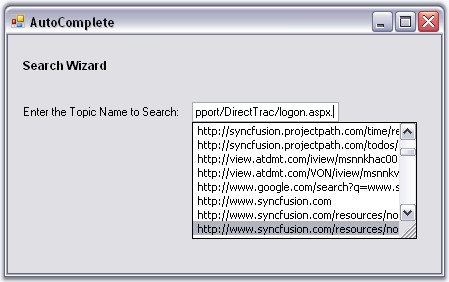{border="0"}

Figure 121: AutoCompleteSource = \"HistoryList\"

[]{style="COLOR: #15428b"} 

Custom Source

[]{style="COLOR: #15428b"} 

AutoComplete control lets you to specify a set of auto completion text using String Collection Editor. This editor is invoked using **Control.AutoCompleteCustomSource** property.

[]{style="COLOR: #15428b"} 

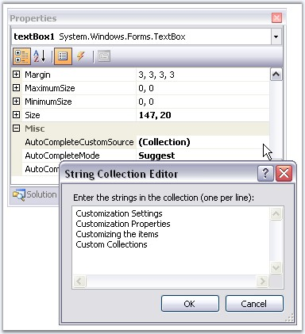{border="0"}

Figure 122: Adding AutoComplete Custom Source Through String Collection Editor

[]{style="COLOR: #15428b"} 

At run time when the user types the first letter, it will automatically display the auto completion list added through this editor.

[]{style="COLOR: #15428b"} 

::: {style="BORDER-BOTTOM: windowtext 1pt solid; BORDER-LEFT: medium none; PADDING-BOTTOM: 1pt; MARGIN-TOP: 9pt; PADDING-LEFT: 0pt; PADDING-RIGHT: 0pt; MARGIN-BOTTOM: 9pt; BORDER-TOP: windowtext 1pt solid; BORDER-RIGHT: medium none; PADDING-TOP: 1pt"}
{border="0"} Note: Control.AutoCompleteSource property should be set to \"CustomSource\" for this setting to be effective.
:::

[]{style="COLOR: #15428b"} 

+--------------------------------------------------------------------------------------------------------------------------------------------------------------------------------------------------------------------------------------------------------------------------------------------------------------------+
| **[\[C#\]]{style="FONT-FAMILY: 'Courier New'; COLOR: black"}**                                                                                                                                                                                                                                                     |
|                                                                                                                                                                                                                                                                                                                    |
| []{style="COLOR: #15428b"}                                                                                                                                                                                                                                                                                         |
|                                                                                                                                                                                                                                                                                                                    |
| [this]{style="FONT-FAMILY: 'Courier New'; COLOR: blue"}[.textBox1.AutoCompleteSource = System.Windows.Forms.[AutoCompleteSource]{style="COLOR: teal"}.CustomSource;]{style="FONT-FAMILY: 'Courier New'"}                                                                                                           |
|                                                                                                                                                                                                                                                                                                                    |
| []{style="FONT-FAMILY: 'Courier New'"}                                                                                                                                                                                                                                                                             |
|                                                                                                                                                                                                                                                                                                                    |
| [this]{style="FONT-FAMILY: 'Courier New'; COLOR: blue"}[.textBox1.AutoCompleteCustomSource.AddRange([new]{style="COLOR: blue"} [string]{style="COLOR: blue"}\[\] {[\"Customization Settings\"]{style="COLOR: maroon"}, [\"Customization Properties\"]{style="COLOR: maroon"},]{style="FONT-FAMILY: 'Courier New'"} |
|                                                                                                                                                                                                                                                                                                                    |
| [\"Customizing the items\"]{style="FONT-FAMILY: 'Courier New'; COLOR: maroon"}[, [\"Custom Collections\"]{style="COLOR: maroon"}});]{style="FONT-FAMILY: 'Courier New'"}                                                                                                                                           |
+--------------------------------------------------------------------------------------------------------------------------------------------------------------------------------------------------------------------------------------------------------------------------------------------------------------------+

[]{style="COLOR: #15428b"} 

+------------------------------------------------------------------------------------------------------------------------------------------------------------------------------------------------------------------------------------------------------------------------------------------------------------------+
| **[\[VB.NET\]]{style="FONT-FAMILY: 'Courier New'; COLOR: black"}**                                                                                                                                                                                                                                               |
|                                                                                                                                                                                                                                                                                                                  |
| []{style="COLOR: #15428b"}                                                                                                                                                                                                                                                                                       |
|                                                                                                                                                                                                                                                                                                                  |
| [Me]{style="FONT-FAMILY: 'Courier New'; COLOR: blue"}[.textBox1.AutoCompleteSource = System.Windows.Forms.[AutoCompleteSource]{style="COLOR: teal"}.CustomSource]{style="FONT-FAMILY: 'Courier New'"}                                                                                                            |
|                                                                                                                                                                                                                                                                                                                  |
| []{style="FONT-FAMILY: 'Courier New'"}                                                                                                                                                                                                                                                                           |
|                                                                                                                                                                                                                                                                                                                  |
| [Me]{style="FONT-FAMILY: 'Courier New'; COLOR: blue"}[.textBox1.AutoCompleteCustomSource.AddRange([New]{style="COLOR: blue"} [String]{style="COLOR: blue"}\[\] {[\"Customization Settings\"]{style="COLOR: maroon"}, [\"Customization Properties\"]{style="COLOR: maroon"},]{style="FONT-FAMILY: 'Courier New'"} |
|                                                                                                                                                                                                                                                                                                                  |
| [\"Customizing the items\"]{style="FONT-FAMILY: 'Courier New'; COLOR: maroon"}[, [\"Custom Collections\"]{style="COLOR: maroon"}})]{style="FONT-FAMILY: 'Courier New'"}                                                                                                                                          |
+------------------------------------------------------------------------------------------------------------------------------------------------------------------------------------------------------------------------------------------------------------------------------------------------------------------+

[]{style="COLOR: #15428b"} 

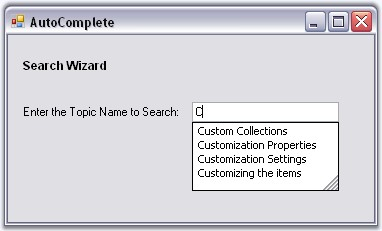{border="0"}

[]{style="COLOR: #15428b"} 

Figure 123: TextBox Associated with AutoCompleteCustomSource

[]{style="COLOR: #15428b"} 

Mode of AutoCompletion

[]{style="COLOR: #15428b"} 

AutoCompletion modes can be specified using **AutoCompleteMode** property.

[]{style="COLOR: #15428b"} 

::: {align="center"}
+-----------------------------------+---------------------------------------------------------------------------------------------------------------------------------------------------+
| Property                          | Description                                                                                                                                       |
+-----------------------------------+---------------------------------------------------------------------------------------------------------------------------------------------------+
| AutoCompleteMode                  | Gets or sets an option that controls how automatic completion, works for the control.                                                             |
|                                   |                                                                                                                                                   |
|                                   |                                                                                                                                                   |
|                                   |                                                                                                                                                   |
|                                   | The available modes are,                                                                                                                          |
|                                   |                                                                                                                                                   |
|                                   |                                                                                                                                                   |
|                                   |                                                                                                                                                   |
|                                   | *None* - No autocompletion will be provided for this target edit control,                                                                         |
|                                   |                                                                                                                                                   |
|                                   | *Suggest* - The autocompletion will be presented as a list of probable matches in the form of a drop-down window,                                 |
|                                   |                                                                                                                                                   |
|                                   | *Append* - The closest match will be added to the partial string in the edit control and                                                          |
|                                   |                                                                                                                                                   |
|                                   | *SuggestAppend* - A list of probable matches will be displayed as well as the entry will be completed in the edit control with the closest match. |
+-----------------------------------+---------------------------------------------------------------------------------------------------------------------------------------------------+
:::

[]{style="COLOR: #15428b"} 

+-------------------------------------------------------------------------------------------------------------------------------------------------------------------------------------------------------+
| **[\[C#\]]{style="FONT-FAMILY: 'Courier New'; COLOR: black"}**                                                                                                                                        |
|                                                                                                                                                                                                       |
| []{style="COLOR: #15428b"}                                                                                                                                                                            |
|                                                                                                                                                                                                       |
| [this]{style="FONT-FAMILY: 'Courier New'; COLOR: blue"}[.textBox1.AutoCompleteMode = System.Windows.Forms.[AutoCompleteMode]{style="COLOR: teal"}.SuggestAppend;]{style="FONT-FAMILY: 'Courier New'"} |
+-------------------------------------------------------------------------------------------------------------------------------------------------------------------------------------------------------+

[]{style="COLOR: #15428b"} 

+----------------------------------------------------------------------------------------------------------------------------------------------------------------------------------------------------+
| **[\[VB.NET\]]{style="FONT-FAMILY: 'Courier New'; COLOR: black"}**                                                                                                                                 |
|                                                                                                                                                                                                    |
| []{style="COLOR: #15428b"}                                                                                                                                                                         |
|                                                                                                                                                                                                    |
| [Me]{style="FONT-FAMILY: 'Courier New'; COLOR: blue"}[.textBox1.AutoCompleteMode = System.Windows.Forms.[AutoCompleteMode]{style="COLOR: teal"}.SuggestAppend]{style="FONT-FAMILY: 'Courier New'"} |
+----------------------------------------------------------------------------------------------------------------------------------------------------------------------------------------------------+

[]{style="COLOR: #15428b"} 

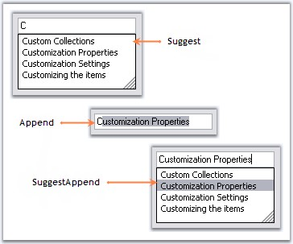{border="0"}

Figure 124: TextBox control with Suggest, Append and SuggestAppend Options

[]{style="COLOR: #15428b"} 

See Also

[]{style="COLOR: #15428b"} 

[Multiple Columns]{.UGHyperlink}[, ]{.UGHyperlink}[External Datasource]{.UGHyperlink}[]{.UGHyperlink}

[]{#_External_Datasource}3.3.1.1.3.2.3      External Datasource

[]{#p173} 

You can specify an external datasource for the AutoComplete control to use as the history list. This can be specified through the **AutoComplete.DataSource** property. The object specified for this property can be any object that implements **IList** or **IListSource**.

[]{style="COLOR: #15428b"} 

1.   Set **AutoComplete mode** to AutoSuggest.

2.   Set the DataSource in the form\'s Load event as follows.

[]{style="COLOR: #15428b"} 

+----------------------------------------------------------------------------------------------------------------------------------------------------------------------------------------------------------------------------------------------------------------------------+
| **[\[C#\]]{style="FONT-FAMILY: 'Courier New'; COLOR: black"}**                                                                                                                                                                                                             |
|                                                                                                                                                                                                                                                                            |
| **[]{style="FONT-FAMILY: 'Courier New'; COLOR: black"}**                                                                                                                                                                                                                   |
|                                                                                                                                                                                                                                                                            |
| [private void]{style="FONT-FAMILY: 'Courier New'; COLOR: blue"}[ Form1_Load(]{style="FONT-FAMILY: 'Courier New'; COLOR: black"}[object]{style="FONT-FAMILY: 'Courier New'; COLOR: blue"}[ sender, System.EventArgs e)]{style="FONT-FAMILY: 'Courier New'; COLOR: black"}   |
|                                                                                                                                                                                                                                                                            |
| [{]{style="FONT-FAMILY: 'Courier New'; COLOR: black"}                                                                                                                                                                                                                      |
|                                                                                                                                                                                                                                                                            |
| [   ]{style="FONT-FAMILY: 'Courier New'; COLOR: black"}[ // Set up the datasource on the Autocomplete control. ]{style="FONT-FAMILY: 'Courier New'; COLOR: green"}                                                                                                         |
|                                                                                                                                                                                                                                                                            |
| [this]{style="FONT-FAMILY: 'Courier New'; COLOR: blue"}[.oleDbDataAdapter1.Fill(]{style="FONT-FAMILY: 'Courier New'; COLOR: black"}[this]{style="FONT-FAMILY: 'Courier New'; COLOR: blue"}[.dataSet11.organisation);]{style="FONT-FAMILY: 'Courier New'; COLOR: black"}    |
|                                                                                                                                                                                                                                                                            |
| [this]{style="FONT-FAMILY: 'Courier New'; COLOR: blue"}[.autoComplete1.DataSource = ]{style="FONT-FAMILY: 'Courier New'; COLOR: black"}[this]{style="FONT-FAMILY: 'Courier New'; COLOR: blue"}[.dataSet11.organisation;]{style="FONT-FAMILY: 'Courier New'; COLOR: black"} |
|                                                                                                                                                                                                                                                                            |
| [}]{style="FONT-FAMILY: 'Courier New'; COLOR: black"}                                                                                                                                                                                                                      |
+----------------------------------------------------------------------------------------------------------------------------------------------------------------------------------------------------------------------------------------------------------------------------+

[]{style="COLOR: #15428b"} 

+----------------------------------------------------------------------------------------------------------------------------------------------------------------------------------------------------------------------------------------------------------------------------------------------------------------------------------------------------------------------------------------------------------------------------------------------------------------------------------------------------------------------------------------------------------------------------------------------------------------+
| **[\[VB.NET\]]{style="FONT-FAMILY: 'Courier New'; COLOR: black"}**                                                                                                                                                                                                                                                                                                                                                                                                                                                                                                                                             |
|                                                                                                                                                                                                                                                                                                                                                                                                                                                                                                                                                                                                                |
| **[]{style="FONT-FAMILY: 'Courier New'; COLOR: black"}**                                                                                                                                                                                                                                                                                                                                                                                                                                                                                                                                                       |
|                                                                                                                                                                                                                                                                                                                                                                                                                                                                                                                                                                                                                |
| [Private Sub]{style="FONT-FAMILY: 'Courier New'; COLOR: blue"}[ Form1_Load(]{style="FONT-FAMILY: 'Courier New'; COLOR: black"}[ByVal]{style="FONT-FAMILY: 'Courier New'; COLOR: blue"}[ sender ]{style="FONT-FAMILY: 'Courier New'; COLOR: black"}[As Object]{style="FONT-FAMILY: 'Courier New'; COLOR: blue"}[, ]{style="FONT-FAMILY: 'Courier New'; COLOR: black"}[ByVal]{style="FONT-FAMILY: 'Courier New'; COLOR: blue"}[ e ]{style="FONT-FAMILY: 'Courier New'; COLOR: black"}[As]{style="FONT-FAMILY: 'Courier New'; COLOR: blue"}[ System.EventArgs)]{style="FONT-FAMILY: 'Courier New'; COLOR: black"} |
|                                                                                                                                                                                                                                                                                                                                                                                                                                                                                                                                                                                                                |
| []{style="FONT-FAMILY: 'Courier New'; COLOR: black"}                                                                                                                                                                                                                                                                                                                                                                                                                                                                                                                                                           |
|                                                                                                                                                                                                                                                                                                                                                                                                                                                                                                                                                                                                                |
| [    ]{style="FONT-FAMILY: 'Courier New'; COLOR: black"}[ \' Set up the datasource on the Autocomplete control  .]{style="FONT-FAMILY: 'Courier New'; COLOR: green"}                                                                                                                                                                                                                                                                                                                                                                                                                                           |
|                                                                                                                                                                                                                                                                                                                                                                                                                                                                                                                                                                                                                |
| [Me]{style="FONT-FAMILY: 'Courier New'; COLOR: blue"}[.oleDbDataAdapter1.Fill(]{style="FONT-FAMILY: 'Courier New'; COLOR: black"}[Me]{style="FONT-FAMILY: 'Courier New'; COLOR: blue"}[.dataSet11.organisation)]{style="FONT-FAMILY: 'Courier New'; COLOR: black"}                                                                                                                                                                                                                                                                                                                                             |
|                                                                                                                                                                                                                                                                                                                                                                                                                                                                                                                                                                                                                |
| [Me]{style="FONT-FAMILY: 'Courier New'; COLOR: blue"}[.autoComplete1.DataSource = ]{style="FONT-FAMILY: 'Courier New'; COLOR: black"}[Me]{style="FONT-FAMILY: 'Courier New'; COLOR: blue"}[.dataSet11.organisation]{style="FONT-FAMILY: 'Courier New'; COLOR: black"}                                                                                                                                                                                                                                                                                                                                          |
|                                                                                                                                                                                                                                                                                                                                                                                                                                                                                                                                                                                                                |
| [End Sub]{style="FONT-FAMILY: 'Courier New'; COLOR: blue"}                                                                                                                                                                                                                                                                                                                                                                                                                                                                                                                                                     |
+----------------------------------------------------------------------------------------------------------------------------------------------------------------------------------------------------------------------------------------------------------------------------------------------------------------------------------------------------------------------------------------------------------------------------------------------------------------------------------------------------------------------------------------------------------------------------------------------------------------+

[]{style="COLOR: #15428b"} 

3.   **AutoCompleteItemSelected** event is raised when a new item has been selected by the user when the AutoComplete drop down list is displayed. In this event, for the tutorial purpose, the code to display corresponding OrgID of the OrganisationName on the label is included. The below code retrieves the corresponding item from the datasource, for the selected item in the AutoComplete control.

[]{style="COLOR: #15428b"} 

+------------------------------------------------------------------------------------------------------------------------------------------------------------------------------------------------------------------------------------------------------------------------------------------------------------------------------------------------+
| **[\[C#\]]{style="FONT-FAMILY: 'Courier New'; COLOR: black"}**                                                                                                                                                                                                                                                                                 |
|                                                                                                                                                                                                                                                                                                                                                |
| **[]{style="FONT-FAMILY: 'Courier New'; COLOR: black"}**                                                                                                                                                                                                                                                                                       |
|                                                                                                                                                                                                                                                                                                                                                |
| [private void]{style="FONT-FAMILY: 'Courier New'; COLOR: blue"}[ autoComplete1_AutoCompleteItemSelected(]{style="FONT-FAMILY: 'Courier New'; COLOR: black"}[object]{style="FONT-FAMILY: 'Courier New'; COLOR: blue"}[ sender,Syncfusion.Windows.Forms.Tools.AutoCompleteItemEventArgs args)]{style="FONT-FAMILY: 'Courier New'; COLOR: black"} |
|                                                                                                                                                                                                                                                                                                                                                |
| [{]{style="FONT-FAMILY: 'Courier New'; COLOR: black"}                                                                                                                                                                                                                                                                                          |
|                                                                                                                                                                                                                                                                                                                                                |
| [  ]{style="FONT-FAMILY: 'Courier New'; COLOR: black"}[// Displays corresponding OrgID of the OrganisationName on the label.]{style="FONT-FAMILY: 'Courier New'; COLOR: green"}                                                                                                                                                                |
|                                                                                                                                                                                                                                                                                                                                                |
| [this]{style="FONT-FAMILY: 'Courier New'; COLOR: blue"}[.label1.Text = args.ItemArray\[0\].ToString();]{style="FONT-FAMILY: 'Courier New'; COLOR: black"}                                                                                                                                                                                      |
|                                                                                                                                                                                                                                                                                                                                                |
| [}]{style="FONT-FAMILY: 'Courier New'; COLOR: black"}                                                                                                                                                                                                                                                                                          |
+------------------------------------------------------------------------------------------------------------------------------------------------------------------------------------------------------------------------------------------------------------------------------------------------------------------------------------------------+

[]{style="COLOR: #15428b"} 

+---------------------------------------------------------------------------------------------------------------------------------------------------------------------------------------------------------------------------------------------------------------------------------------------------------------------------------------------------------------------------------------------------------------------------------------------------------------------------------------------------------------------------------------------------------------------------------------------------------------------------------------------------------------------------------------+
| **[\[VB.NET\]]{style="FONT-FAMILY: 'Courier New'; COLOR: black"}**                                                                                                                                                                                                                                                                                                                                                                                                                                                                                                                                                                                                                    |
|                                                                                                                                                                                                                                                                                                                                                                                                                                                                                                                                                                                                                                                                                       |
| **[]{style="FONT-FAMILY: 'Courier New'; COLOR: black"}**                                                                                                                                                                                                                                                                                                                                                                                                                                                                                                                                                                                                                              |
|                                                                                                                                                                                                                                                                                                                                                                                                                                                                                                                                                                                                                                                                                       |
| [Private Sub]{style="FONT-FAMILY: 'Courier New'; COLOR: blue"}[ autoComplete1_AutoCompleteItemSelected(]{style="FONT-FAMILY: 'Courier New'; COLOR: black"}[ByVal]{style="FONT-FAMILY: 'Courier New'; COLOR: blue"}[ sender ]{style="FONT-FAMILY: 'Courier New'; COLOR: black"}[As Object]{style="FONT-FAMILY: 'Courier New'; COLOR: blue"}[, ]{style="FONT-FAMILY: 'Courier New'; COLOR: black"}[ByVal]{style="FONT-FAMILY: 'Courier New'; COLOR: blue"}[ args ]{style="FONT-FAMILY: 'Courier New'; COLOR: black"}[As]{style="FONT-FAMILY: 'Courier New'; COLOR: blue"}[ Syncfusion.Windows.Forms.Tools.AutoCompleteItemEventArgs)]{style="FONT-FAMILY: 'Courier New'; COLOR: black"} |
|                                                                                                                                                                                                                                                                                                                                                                                                                                                                                                                                                                                                                                                                                       |
| []{style="FONT-FAMILY: 'Courier New'; COLOR: black"}                                                                                                                                                                                                                                                                                                                                                                                                                                                                                                                                                                                                                                  |
|                                                                                                                                                                                                                                                                                                                                                                                                                                                                                                                                                                                                                                                                                       |
| [  ]{style="FONT-FAMILY: 'Courier New'; COLOR: black"}[\' Displays corresponding OrgID of the OrganisationName on the label.]{style="FONT-FAMILY: 'Courier New'; COLOR: green"}                                                                                                                                                                                                                                                                                                                                                                                                                                                                                                       |
|                                                                                                                                                                                                                                                                                                                                                                                                                                                                                                                                                                                                                                                                                       |
| [Me]{style="FONT-FAMILY: 'Courier New'; COLOR: blue"}[.label1.Text = args.ItemArray(0).ToString()]{style="FONT-FAMILY: 'Courier New'; COLOR: black"}                                                                                                                                                                                                                                                                                                                                                                                                                                                                                                                                  |
|                                                                                                                                                                                                                                                                                                                                                                                                                                                                                                                                                                                                                                                                                       |
| [End Sub]{style="FONT-FAMILY: 'Courier New'; COLOR: blue"}                                                                                                                                                                                                                                                                                                                                                                                                                                                                                                                                                                                                                            |
+---------------------------------------------------------------------------------------------------------------------------------------------------------------------------------------------------------------------------------------------------------------------------------------------------------------------------------------------------------------------------------------------------------------------------------------------------------------------------------------------------------------------------------------------------------------------------------------------------------------------------------------------------------------------------------------+

[]{style="COLOR: #15428b"} 

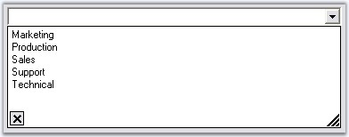{border="0"}

Figure 125: External Data Source set for the AutoComplete Control

[]{style="COLOR: #15428b"} 

Refer to Multiple Columns section for more information on configuring data sources with multiple columns.

###### []{#_Multiple_Columns}3.3.1.1.3.3 Multiple Columns {#multiple-columns style="tab-stops: 0pt"}

[]{#p174} 

The AutoComplete control allows users to display multiple columns of information for each matching entry in the AutoSuggest mode of operation. Columns can be configured through **AutoComplete.Columns** property.

[]{style="COLOR: #15428b"} 

::: {align="center"}
+-----------------------------------+-------------------------------------------------------------------------------------------------------------------------------------------------------------------------------------------------------------------------------------------------------------------------------------------------------------------+
| AutoComplete Properties           | Description                                                                                                                                                                                                                                                                                                       |
+-----------------------------------+-------------------------------------------------------------------------------------------------------------------------------------------------------------------------------------------------------------------------------------------------------------------------------------------------------------------+
| Columns                           | Specifies the collection of columns in the auto complete dropdown, when AutoCompleteModes enumerator value is AutoSuggest. Each column is represented by an **AutoCompleteDataColumnInfo** object. This class includes a definition for specifying whether the column is the matching column or the image column. |
+-----------------------------------+-------------------------------------------------------------------------------------------------------------------------------------------------------------------------------------------------------------------------------------------------------------------------------------------------------------------+
| MatchMode                         | Specifies the modes in which the AutoCompleteControl fills the history list for the current text in the current edit control.                                                                                                                                                                                     |
|                                   |                                                                                                                                                                                                                                                                                                                   |
|                                   |                                                                                                                                                                                                                                                                                                                   |
|                                   |                                                                                                                                                                                                                                                                                                                   |
|                                   | The values are,                                                                                                                                                                                                                                                                                                   |
|                                   |                                                                                                                                                                                                                                                                                                                   |
|                                   |                                                                                                                                                                                                                                                                                                                   |
|                                   |                                                                                                                                                                                                                                                                                                                   |
|                                   | *Manual and*                                                                                                                                                                                                                                                                                                      |
|                                   |                                                                                                                                                                                                                                                                                                                   |
|                                   | *Automatic (default).*                                                                                                                                                                                                                                                                                            |
+-----------------------------------+-------------------------------------------------------------------------------------------------------------------------------------------------------------------------------------------------------------------------------------------------------------------------------------------------------------------+
:::

[]{style="COLOR: #15428b"} 

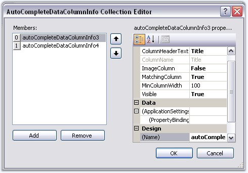{border="0"}

[]{style="COLOR: #15428b"} 

Figure 126: Adding DataColumns to the AutoCompletePopup

**[]{style="COLOR: #15428b"}** 

::: {align="center"}
  ----------------------------------- -----------------------------------------------------------------------------------------------------------------------------------------------------------------------------------------
  AutoCompleteDataColumn Properties   Description
  ColumnHeaderText                    Represents the text for the column header.
  MatchingColumn                      Column that will be used by the AutoComplete control to perform matching with the current content (at runtime) of the target control.
  ImageColumn                         Column which is filled with data that is just the index into the image list that has been assigned to the AutoComplete control. See [Image Settings]{style="COLOR: black"} for Details.
  MinColumnWidth                      Set minimum width for the column.
  Visible                             Shows or hides the column at runtime.
  ----------------------------------- -----------------------------------------------------------------------------------------------------------------------------------------------------------------------------------------
:::

[]{style="COLOR: #15428b"} 

+-----------------------------------------------------------------------------------------------------------------------------------------------------------------------------------+
| **[\[C#\]]{style="FONT-FAMILY: 'Courier New'; COLOR: black"}**                                                                                                                    |
|                                                                                                                                                                                   |
| []{style="COLOR: #15428b"}                                                                                                                                                        |
|                                                                                                                                                                                   |
| [this]{style="FONT-FAMILY: 'Courier New'; COLOR: blue"}[.autoComplete2.Columns.Add([this]{style="COLOR: blue"}.autoCompleteDataColumnInfo1);]{style="FONT-FAMILY: 'Courier New'"} |
|                                                                                                                                                                                   |
| [this]{style="FONT-FAMILY: 'Courier New'; COLOR: blue"}[.autoComplete2.Columns.Add([this]{style="COLOR: blue"}.autoCompleteDataColumnInfo2);]{style="FONT-FAMILY: 'Courier New'"} |
|                                                                                                                                                                                   |
| [this]{style="FONT-FAMILY: 'Courier New'; COLOR: blue"}[.autoComplete2.ShowColumnHeader = [true]{style="COLOR: blue"};]{style="FONT-FAMILY: 'Courier New'"}                       |
|                                                                                                                                                                                   |
| [this]{style="FONT-FAMILY: 'Courier New'; COLOR: blue"}[.autoComplete2.MatchMode = [AutoCompleteMatchModes]{style="COLOR: teal"}.Automatic;]{style="FONT-FAMILY: 'Courier New'"}  |
|                                                                                                                                                                                   |
| []{style="FONT-FAMILY: 'Courier New'"}                                                                                                                                            |
|                                                                                                                                                                                   |
| [this]{style="FONT-FAMILY: 'Courier New'; COLOR: blue"}[.autoCompleteDataColumnInfo1.ColumnHeaderText = [\"Title\"]{style="COLOR: maroon"};]{style="FONT-FAMILY: 'Courier New'"}  |
|                                                                                                                                                                                   |
| [this]{style="FONT-FAMILY: 'Courier New'; COLOR: blue"}[.autoCompleteDataColumnInfo1.MatchingColumn = [true]{style="COLOR: blue"};]{style="FONT-FAMILY: 'Courier New'"}           |
|                                                                                                                                                                                   |
| [this]{style="FONT-FAMILY: 'Courier New'; COLOR: blue"}[.autoCompleteDataColumnInfo1.Visible = [true]{style="COLOR: blue"};]{style="FONT-FAMILY: 'Courier New'"}                  |
+-----------------------------------------------------------------------------------------------------------------------------------------------------------------------------------+

[]{style="COLOR: #15428b"} 

+--------------------------------------------------------------------------------------------------------------------------------------------------------------------------------+
| **[\[VB.NET\]]{style="FONT-FAMILY: 'Courier New'; COLOR: black"}**                                                                                                             |
|                                                                                                                                                                                |
| []{style="COLOR: #15428b"}                                                                                                                                                     |
|                                                                                                                                                                                |
| [Me]{style="FONT-FAMILY: 'Courier New'; COLOR: blue"}[.autoComplete2.Columns.Add([Me]{style="COLOR: blue"}.autoCompleteDataColumnInfo1)]{style="FONT-FAMILY: 'Courier New'"}   |
|                                                                                                                                                                                |
| [Me]{style="FONT-FAMILY: 'Courier New'; COLOR: blue"}[.autoComplete2.Columns.Add([Me]{style="COLOR: blue"}.autoCompleteDataColumnInfo2)]{style="FONT-FAMILY: 'Courier New'"}   |
|                                                                                                                                                                                |
| [Me]{style="FONT-FAMILY: 'Courier New'; COLOR: blue"}[.autoComplete2.ShowColumnHeader = [True]{style="COLOR: blue"}]{style="FONT-FAMILY: 'Courier New'"}                       |
|                                                                                                                                                                                |
| [Me]{style="FONT-FAMILY: 'Courier New'; COLOR: blue"}[.autoComplete2.MatchMode = [AutoCompleteMatchModes]{style="COLOR: black"}.Automatic]{style="FONT-FAMILY: 'Courier New'"} |
|                                                                                                                                                                                |
| []{style="FONT-FAMILY: 'Courier New'"}                                                                                                                                         |
|                                                                                                                                                                                |
| [Me]{style="FONT-FAMILY: 'Courier New'; COLOR: blue"}[.autoCompleteDataColumnInfo1.ColumnHeaderText = [\"Title\"]{style="COLOR: maroon"}]{style="FONT-FAMILY: 'Courier New'"}  |
|                                                                                                                                                                                |
| [Me]{style="FONT-FAMILY: 'Courier New'; COLOR: blue"}[.autoCompleteDataColumnInfo1.MatchingColumn = [True]{style="COLOR: blue"}]{style="FONT-FAMILY: 'Courier New'"}           |
|                                                                                                                                                                                |
| [Me]{style="FONT-FAMILY: 'Courier New'; COLOR: blue"}[.autoCompleteDataColumnInfo1.Visible = [True]{style="COLOR: blue"}]{style="FONT-FAMILY: 'Courier New'"}                  |
+--------------------------------------------------------------------------------------------------------------------------------------------------------------------------------+

[]{style="COLOR: #15428b"} 

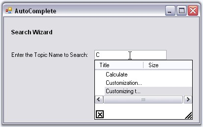{border="0"}

[]{style="COLOR: #15428b"} 

Figure 127: AutoComplete Popup with Multiple Columns

[]{style="COLOR: #15428b"} 

Column can be added matched using external sources also. A sample which demonstrates this feature is available in the below location.

 

..\\My Documents\\Syncfusion\\EssentialStudio\\***Version Number***\\Windows\\Tools.Windows\\Samples\\2.0\\Editors Package\\AutoCompleteDemo

 

While using an external datasource, the Columns property can be initially refreshed by clicking on the **Refresh** **Columns** verb visible in the designer.

 

::: {style="BORDER-BOTTOM: windowtext 1pt solid; BORDER-LEFT: medium none; PADDING-BOTTOM: 1pt; MARGIN-TOP: 9pt; PADDING-LEFT: 0pt; PADDING-RIGHT: 0pt; MARGIN-BOTTOM: 9pt; BORDER-TOP: windowtext 1pt solid; BORDER-RIGHT: medium none; PADDING-TOP: 1pt"}
{border="0"} Note: We can also add images to the dropdown items using internal source and external source. See Image Settings for details.
:::

**[]{style="COLOR: #15428b"}** 

See Also

[]{style="COLOR: #15428b"} 

[Source for AutoComplete Control]{.UGHyperlink}[, ]{.UGHyperlink}[How to match items in all the columns using AutoCompleteControl?]{.UGHyperlink}[]{.UGHyperlink}

###### []{#p175}[]{#_Image_Settings}3.3.1.1.3.4 Image Settings {#image-settings style="tab-stops: 0pt"}

[]{style="COLOR: #15428b"} 

We can add a dropdown item with image to the AutoComplete popup, through the **AutoComplete.AddHistoryItem** method. An imagelist should be associated with AutoComplete control for this purpose. Specify the item text and the image index in this method.

[]{style="COLOR: #15428b"} 

::: {align="center"}
+-----------------------------------+------------------------------------------------------------------------------------+
| AutoComplete Method               | Description                                                                        |
+-----------------------------------+------------------------------------------------------------------------------------+
| AddHistoryItem                    | Adds item to the internal history of the AutoComplete control. The parameters are, |
|                                   |                                                                                    |
|                                   |                                                                                    |
|                                   |                                                                                    |
|                                   | *newItemText* - Text for the dropdown item.                                        |
|                                   |                                                                                    |
|                                   | *ImageIndexValue* - Index of the image for the particular item.                    |
+-----------------------------------+------------------------------------------------------------------------------------+
:::

[]{style="COLOR: #15428b"} 

+----------------------------------------------------------------------------------------------------------------------------------------------------------------------------------+
| **[\[C#\]]{style="FONT-FAMILY: 'Courier New'; COLOR: black"}**                                                                                                                   |
|                                                                                                                                                                                  |
| []{style="COLOR: black"}                                                                                                                                                         |
|                                                                                                                                                                                  |
| [this]{style="FONT-FAMILY: 'Courier New'; COLOR: blue"}[.autoCompleteDataColumnInfo1.ColumnHeaderText = [\"Title\"]{style="COLOR: maroon"};]{style="FONT-FAMILY: 'Courier New'"} |
|                                                                                                                                                                                  |
| [this]{style="FONT-FAMILY: 'Courier New'; COLOR: blue"}[.autoCompleteDataColumnInfo1.ImageColumn = [false]{style="COLOR: blue"};]{style="FONT-FAMILY: 'Courier New'"}            |
|                                                                                                                                                                                  |
| [this]{style="FONT-FAMILY: 'Courier New'; COLOR: blue"}[.autoCompleteDataColumnInfo1.MatchingColumn = [true]{style="COLOR: blue"};]{style="FONT-FAMILY: 'Courier New'"}          |
|                                                                                                                                                                                  |
| [this]{style="FONT-FAMILY: 'Courier New'; COLOR: blue"}[.autoCompleteDataColumnInfo1.Visible = [true]{style="COLOR: blue"};]{style="FONT-FAMILY: 'Courier New'"}                 |
|                                                                                                                                                                                  |
| []{style="FONT-FAMILY: 'Courier New'"}                                                                                                                                           |
|                                                                                                                                                                                  |
| [this]{style="FONT-FAMILY: 'Courier New'; COLOR: blue"}[.autoCompleteDataColumnInfo2.ColumnHeaderText = [\"Size\"]{style="COLOR: maroon"};]{style="FONT-FAMILY: 'Courier New'"}  |
|                                                                                                                                                                                  |
| [this]{style="FONT-FAMILY: 'Courier New'; COLOR: blue"}[.autoCompleteDataColumnInfo2.ImageColumn = [true]{style="COLOR: blue"};]{style="FONT-FAMILY: 'Courier New'"}             |
|                                                                                                                                                                                  |
| [this]{style="FONT-FAMILY: 'Courier New'; COLOR: blue"}[.autoCompleteDataColumnInfo2.MatchingColumn = [false]{style="COLOR: blue"};]{style="FONT-FAMILY: 'Courier New'"}         |
|                                                                                                                                                                                  |
| [this]{style="FONT-FAMILY: 'Courier New'; COLOR: blue"}[.autoCompleteDataColumnInfo2.Visible = [true]{style="COLOR: blue"};]{style="FONT-FAMILY: 'Courier New'"}                 |
|                                                                                                                                                                                  |
| []{style="FONT-FAMILY: 'Courier New'"}                                                                                                                                           |
|                                                                                                                                                                                  |
| [this]{style="FONT-FAMILY: 'Courier New'; COLOR: blue"}[.autoComplete1.AddHistoryItem([\"User Guide\"]{style="COLOR: maroon"}, 3);]{style="FONT-FAMILY: 'Courier New'"}          |
|                                                                                                                                                                                  |
| [this]{style="FONT-FAMILY: 'Courier New'; COLOR: blue"}[.autoComplete1.AddHistoryItem([\"User Item\"]{style="COLOR: maroon"}, 2);]{style="FONT-FAMILY: 'Courier New'"}           |
+----------------------------------------------------------------------------------------------------------------------------------------------------------------------------------+

[]{style="COLOR: #15428b"} 

+-------------------------------------------------------------------------------------------------------------------------------------------------------------------------------+
| **[\[VB.NET\]]{style="FONT-FAMILY: 'Courier New'; COLOR: black"}**                                                                                                            |
|                                                                                                                                                                               |
| []{style="COLOR: #15428b"}                                                                                                                                                    |
|                                                                                                                                                                               |
| [Me]{style="FONT-FAMILY: 'Courier New'; COLOR: blue"}[.autoCompleteDataColumnInfo1.ColumnHeaderText = [\"Title\"]{style="COLOR: maroon"}]{style="FONT-FAMILY: 'Courier New'"} |
|                                                                                                                                                                               |
| [Me]{style="FONT-FAMILY: 'Courier New'; COLOR: blue"}[.autoCompleteDataColumnInfo1.ImageColumn = [False]{style="COLOR: blue"}]{style="FONT-FAMILY: 'Courier New'"}            |
|                                                                                                                                                                               |
| [Me]{style="FONT-FAMILY: 'Courier New'; COLOR: blue"}[.autoCompleteDataColumnInfo1.MatchingColumn = [True]{style="COLOR: blue"}]{style="FONT-FAMILY: 'Courier New'"}          |
|                                                                                                                                                                               |
| [Me]{style="FONT-FAMILY: 'Courier New'; COLOR: blue"}[.autoCompleteDataColumnInfo1.Visible = [True]{style="COLOR: blue"}]{style="FONT-FAMILY: 'Courier New'"}                 |
|                                                                                                                                                                               |
| []{style="FONT-FAMILY: 'Courier New'"}                                                                                                                                        |
|                                                                                                                                                                               |
| [Me]{style="FONT-FAMILY: 'Courier New'; COLOR: blue"}[.autoCompleteDataColumnInfo2.ColumnHeaderText = [\"Size\"]{style="COLOR: maroon"}]{style="FONT-FAMILY: 'Courier New'"}  |
|                                                                                                                                                                               |
| [Me]{style="FONT-FAMILY: 'Courier New'; COLOR: blue"}[.autoCompleteDataColumnInfo2.ImageColumn = [True]{style="COLOR: blue"}]{style="FONT-FAMILY: 'Courier New'"}             |
|                                                                                                                                                                               |
| [Me]{style="FONT-FAMILY: 'Courier New'; COLOR: blue"}[.autoCompleteDataColumnInfo2.MatchingColumn = [False]{style="COLOR: blue"}]{style="FONT-FAMILY: 'Courier New'"}         |
|                                                                                                                                                                               |
| [Me]{style="FONT-FAMILY: 'Courier New'; COLOR: blue"}[.autoCompleteDataColumnInfo2.Visible = [True]{style="COLOR: blue"}]{style="FONT-FAMILY: 'Courier New'"}                 |
|                                                                                                                                                                               |
| []{style="FONT-FAMILY: 'Courier New'"}                                                                                                                                        |
|                                                                                                                                                                               |
| [Me]{style="FONT-FAMILY: 'Courier New'; COLOR: blue"}[.autoComplete1.AddHistoryItem([\"User Guide\"]{style="COLOR: maroon"}, 3)]{style="FONT-FAMILY: 'Courier New'"}          |
|                                                                                                                                                                               |
| [Me]{style="FONT-FAMILY: 'Courier New'; COLOR: blue"}[.autoComplete1.AddHistoryItem([\"User Item\"]{style="COLOR: maroon"}, 2)]{style="FONT-FAMILY: 'Courier New'"}           |
+-------------------------------------------------------------------------------------------------------------------------------------------------------------------------------+

[]{style="COLOR: #15428b"} 

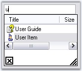{border="0"}

[]{style="COLOR: #15428b"} 

Figure 128: DropDownItem added to AutoComplete Popup using AddHistoryItem Method

[]{style="COLOR: #15428b"} 

Items with Images Through External DataSource

[]{style="COLOR: #15428b"} 

Items with images can be added to the AutoCompletePopup, also using external datasource like XML file. A sample which demonstrates the implementation of external datasource is available in the below location.

 

..\\My Documents\\Syncfusion\\EssentialStudio\\***Version Number***\\Windows\\Tools.Windows\\Samples\\2.0\\Editors Package\\AutoCompleteDemo

 

While using an external datasource, the Columns property can be initially refreshed by clicking the ***Refresh Columns*** verb, visible in the designer.

[]{style="COLOR: #15428b"} 

See Also

[]{style="COLOR: #15428b"} 

[[Multiple Columns]{.UGHyperlink}]()[]{.UGHyperlink}

###### []{#_Persistence}3.3.1.1.3.5 Persistence {#persistence style="tab-stops: 0pt"}

[]{#p176}[]{style="COLOR: #15428b"} 

The history list of AutoComplete control can be saved in the following formats.

[]{style="COLOR: #15428b"} 

[·      ]{style="FONT-FAMILY: Symbol"}Binary Format

[·      ]{style="FONT-FAMILY: Symbol"}XML Format

[·      ]{style="FONT-FAMILY: Symbol"}IsolatedStorage medium

[·      ]{style="FONT-FAMILY: Symbol"}MemoryStream

[·      ]{style="FONT-FAMILY: Symbol"}PersistState property

[]{style="COLOR: #15428b"} 

The AutoComplete control has a fully built-in serialization feature that provides automatic serialization of the AutoComplete\'s history list.  The serialization mechanism is implemented using the standardized Syncfusion.Windows.Forms.AppStateSerializer component that acts as a central coordinator for all the Essential Tools components and provides the option to read / write to different media such as the default Isolated Storage, XML file, XML stream, Binary file, Binary stream and the Windows Registry.

[]{style="COLOR: #15428b"} 

Persisting AutoComplete\'s data in default storage

[]{style="COLOR: #15428b"} 

The data of AutoComplete\'s control can be persisted by setting the AutoSerialize property to true. This information is stored in the Isolated storage.

[]{style="COLOR: #15428b"} 

::: {align="center"}
  ----------------------- --------------------------------------------------------------
  AutoComplete Property   Description
  AutoSerialize           Specifies whether AutoComplete control can persist its data.
  ----------------------- --------------------------------------------------------------
:::

[]{style="COLOR: #15428b"} 

+----------------------------------------------------------------------------------------------------------------------------------------------------------+
| **[\[C#\]]{style="FONT-FAMILY: 'Courier New'; COLOR: black"}**                                                                                           |
|                                                                                                                                                          |
| **[]{style="FONT-FAMILY: 'Courier New'; COLOR: black"}**                                                                                                 |
|                                                                                                                                                          |
| [this]{style="FONT-FAMILY: 'Courier New'; COLOR: blue"}[.autoComplete1.AutoSerialize = [true]{style="COLOR: blue"};]{style="FONT-FAMILY: 'Courier New'"} |
+----------------------------------------------------------------------------------------------------------------------------------------------------------+

[]{style="COLOR: #15428b"} 

+-------------------------------------------------------------------------------------------------------------------------------------------------------+
| **[\[VB.NET\]]{style="FONT-FAMILY: 'Courier New'; COLOR: black"}**                                                                                    |
|                                                                                                                                                       |
| **[]{style="FONT-FAMILY: 'Courier New'; COLOR: black"}**                                                                                              |
|                                                                                                                                                       |
| [Me]{style="FONT-FAMILY: 'Courier New'; COLOR: blue"}[.autoComplete1.AutoSerialize = [True]{style="COLOR: blue"}]{style="FONT-FAMILY: 'Courier New'"} |
+-------------------------------------------------------------------------------------------------------------------------------------------------------+

[]{style="COLOR: #15428b"} 

The AutoComplete control has built-in support for serialization that can be enabled or disabled using the AutoSerialize property.

 

The default serialization option is **Isolated storage** and the System.IO.IsolatedStorage routines normally store application specific encrypted entries under the \'C:\\Documents and Settings\\\[USER name\]\\Local Settings\\Application Data\\IsolatedStorage\\' folder. All of the Essential Tools framework components use the \'Syncfusion.Runtime.Serialization.AppStateSerializer\' class in the Shared library for Read/Write. The AppStateSerializer is fully documented and can be initialized for different persistence mediums such as XML / Binary files, XML / Binary streams, and the Win32 Registry using its API.

[]{style="COLOR: #ff6600; FONT-SIZE: 8pt"} 

Persisting in XML file

[]{style="COLOR: #ff6600; FONT-SIZE: 8pt"} 

To save and load the AutoComplete data in a XML,

[]{style="COLOR: #15428b"} 

+------------------------------------------------------------------------------------------------------------------------------------------------------------------------------------------------------------------------------------------------------------------------------------+
| **[\[C#\]]{style="FONT-FAMILY: 'Courier New'; COLOR: black"}**                                                                                                                                                                                                                     |
|                                                                                                                                                                                                                                                                                    |
| **[]{style="FONT-FAMILY: 'Courier New'; COLOR: black"}**                                                                                                                                                                                                                           |
|                                                                                                                                                                                                                                                                                    |
| [using]{style="FONT-FAMILY: 'Courier New'; COLOR: blue"}[ Syncfusion.Runtime.Serialization;]{style="FONT-FAMILY: 'Courier New'"}                                                                                                                                                   |
|                                                                                                                                                                                                                                                                                    |
| []{style="FONT-FAMILY: 'Courier New'"}                                                                                                                                                                                                                                             |
|                                                                                                                                                                                                                                                                                    |
| [// To Save]{style="FONT-FAMILY: 'Courier New'; COLOR: green"}                                                                                                                                                                                                                     |
|                                                                                                                                                                                                                                                                                    |
| [AppStateSerializer]{style="FONT-FAMILY: 'Courier New'; COLOR: teal"}[ aser = [new]{style="COLOR: blue"} [AppStateSerializer]{style="COLOR: teal"}([SerializeMode]{style="COLOR: teal"}.XMLFile, [@\"C:\\info.xml\"]{style="COLOR: maroon"});]{style="FONT-FAMILY: 'Courier New'"} |
|                                                                                                                                                                                                                                                                                    |
| [this]{style="FONT-FAMILY: 'Courier New'; COLOR: blue"}[.autoComplete1.SaveCurrentState(aser);]{style="FONT-FAMILY: 'Courier New'"}                                                                                                                                                |
|                                                                                                                                                                                                                                                                                    |
| []{style="FONT-FAMILY: 'Courier New'"}                                                                                                                                                                                                                                             |
|                                                                                                                                                                                                                                                                                    |
| [// To Load]{style="FONT-FAMILY: 'Courier New'; COLOR: green"}                                                                                                                                                                                                                     |
|                                                                                                                                                                                                                                                                                    |
| [AppStateSerializer]{style="FONT-FAMILY: 'Courier New'; COLOR: teal"}[ aser = [new]{style="COLOR: blue"} [AppStateSerializer]{style="COLOR: teal"}([SerializeMode]{style="COLOR: teal"}.XMLFile, [@\"C:\\info.xml\"]{style="COLOR: maroon"});]{style="FONT-FAMILY: 'Courier New'"} |
|                                                                                                                                                                                                                                                                                    |
| [this]{style="FONT-FAMILY: 'Courier New'; COLOR: blue"}[.autoComplete1.LoadCurrentState(aser);]{style="FONT-FAMILY: 'Courier New'"}                                                                                                                                                |
+------------------------------------------------------------------------------------------------------------------------------------------------------------------------------------------------------------------------------------------------------------------------------------+

[]{style="COLOR: #15428b"} 

+----------------------------------------------------------------------------------------------------------------------------------------------------------------------------------------------------------------------------------------------------------------------+
| **[\[VB.NET\]]{style="FONT-FAMILY: 'Courier New'; COLOR: black"}**                                                                                                                                                                                                   |
|                                                                                                                                                                                                                                                                      |
| **[]{style="FONT-FAMILY: 'Courier New'; COLOR: black"}**                                                                                                                                                                                                             |
|                                                                                                                                                                                                                                                                      |
| [Imports ]{style="FONT-FAMILY: 'Courier New'; COLOR: blue"}[Syncfusion.Runtime.Serialization]{style="FONT-FAMILY: 'Courier New'"}                                                                                                                                    |
|                                                                                                                                                                                                                                                                      |
| []{style="FONT-FAMILY: 'Courier New'"}                                                                                                                                                                                                                               |
|                                                                                                                                                                                                                                                                      |
| [\' To Save]{style="FONT-FAMILY: 'Courier New'; COLOR: green"}                                                                                                                                                                                                       |
|                                                                                                                                                                                                                                                                      |
| [Private]{style="FONT-FAMILY: 'Courier New'; COLOR: blue"}[ aser [As]{style="COLOR: blue"} AppStateSerializer = [New]{style="COLOR: blue"} AppStateSerializer(SerializeMode.XMLFile, [\"C:\\info.xml\"]{style="COLOR: maroon"})]{style="FONT-FAMILY: 'Courier New'"} |
|                                                                                                                                                                                                                                                                      |
| [Me]{style="FONT-FAMILY: 'Courier New'; COLOR: blue"}[.autoComplete1.SaveCurrentState(aser)]{style="FONT-FAMILY: 'Courier New'"}                                                                                                                                     |
|                                                                                                                                                                                                                                                                      |
| []{style="FONT-FAMILY: 'Courier New'"}                                                                                                                                                                                                                               |
|                                                                                                                                                                                                                                                                      |
| [\' To Load]{style="FONT-FAMILY: 'Courier New'; COLOR: green"}                                                                                                                                                                                                       |
|                                                                                                                                                                                                                                                                      |
| [Private]{style="FONT-FAMILY: 'Courier New'; COLOR: blue"}[ aser [As]{style="COLOR: blue"} AppStateSerializer = [New]{style="COLOR: blue"} AppStateSerializer(SerializeMode.XMLFile, [\"C:\\info.xml\"]{style="COLOR: maroon"})]{style="FONT-FAMILY: 'Courier New'"} |
|                                                                                                                                                                                                                                                                      |
| [Me]{style="FONT-FAMILY: 'Courier New'; COLOR: blue"}[.autoComplete1.LoadCurrentState(aser)]{style="FONT-FAMILY: 'Courier New'"}                                                                                                                                     |
|                                                                                                                                                                                                                                                                      |
| [End Sub()]{style="FONT-FAMILY: 'Courier New'; COLOR: blue"}                                                                                                                                                                                                         |
+----------------------------------------------------------------------------------------------------------------------------------------------------------------------------------------------------------------------------------------------------------------------+

[]{style="FONT-SIZE: 8pt"} 

 

Persisting in Memory Stream

**[]{style="COLOR: #15428b"}** 

To serialize the data into a **memory stream**,

[]{style="COLOR: #ff6600; FONT-SIZE: 8pt"} 

Storing State

**[]{style="FONT-SIZE: 8pt"}** 

+----------------------------------------------------------------------------------------------------------------------------------------------------------------------------------------------------------------------------------------------------+
| **[\[C#\]]{style="FONT-FAMILY: 'Courier New'; COLOR: black"}**                                                                                                                                                                                     |
|                                                                                                                                                                                                                                                    |
| **[]{style="FONT-FAMILY: 'Courier New'; COLOR: black"}**                                                                                                                                                                                           |
|                                                                                                                                                                                                                                                    |
| [MemoryStream ms = [new]{style="COLOR: blue"} MemoryStream();]{style="FONT-FAMILY: 'Courier New'"}                                                                                                                                                 |
|                                                                                                                                                                                                                                                    |
| [AppStateSerializer]{style="FONT-FAMILY: 'Courier New'; COLOR: teal"}[ aser = [new]{style="COLOR: blue"} [AppStateSerializer]{style="COLOR: teal"}([SerializeMode]{style="COLOR: teal"}.BinaryFmtStream, ms);]{style="FONT-FAMILY: 'Courier New'"} |
|                                                                                                                                                                                                                                                    |
| [this]{style="FONT-FAMILY: 'Courier New'; COLOR: blue"}[.autoComplete1.SaveCurrentState(aser);]{style="FONT-FAMILY: 'Courier New'"}                                                                                                                |
|                                                                                                                                                                                                                                                    |
| [aser.PersistNow();]{style="FONT-FAMILY: 'Courier New'"}                                                                                                                                                                                           |
+----------------------------------------------------------------------------------------------------------------------------------------------------------------------------------------------------------------------------------------------------+

[]{style="COLOR: #15428b"} 

+---------------------------------------------------------------------------------------------------------------------------------------------------------------------------------------------------------------------------------------+
| **[\[VB.NET\]]{style="FONT-FAMILY: 'Courier New'; COLOR: black"}**                                                                                                                                                                    |
|                                                                                                                                                                                                                                       |
| **[]{style="FONT-FAMILY: 'Courier New'; COLOR: black"}**                                                                                                                                                                              |
|                                                                                                                                                                                                                                       |
| [Dim]{style="FONT-FAMILY: 'Courier New'; COLOR: blue"}[ ms [As]{style="COLOR: blue"} MemoryStream = [New]{style="COLOR: blue"} MemoryStream()]{style="FONT-FAMILY: 'Courier New'"}                                                    |
|                                                                                                                                                                                                                                       |
| [Private]{style="FONT-FAMILY: 'Courier New'; COLOR: blue"}[ aser [As]{style="COLOR: blue"} AppStateSerializer = [New]{style="COLOR: blue"} AppStateSerializer(SerializeMode.BinaryFmtStream, ms)]{style="FONT-FAMILY: 'Courier New'"} |
|                                                                                                                                                                                                                                       |
| [Me]{style="FONT-FAMILY: 'Courier New'; COLOR: blue"}[.autoComplete1.SaveCurrentState(aser)]{style="FONT-FAMILY: 'Courier New'"}                                                                                                      |
|                                                                                                                                                                                                                                       |
| [aser.PersistNow()]{style="FONT-FAMILY: 'Courier New'"}                                                                                                                                                                               |
+---------------------------------------------------------------------------------------------------------------------------------------------------------------------------------------------------------------------------------------+

[]{style="FONT-SIZE: 8pt"} 

 

Retrieving State

**[]{style="FONT-SIZE: 8pt"}** 

+---------------------------------------------------------------------------------------------------------------------------------------------------+
| **[\[C#\]]{style="FONT-FAMILY: 'Courier New'; COLOR: black"}**                                                                                    |
|                                                                                                                                                   |
| **[]{style="FONT-FAMILY: 'Courier New'; COLOR: black"}**                                                                                          |
|                                                                                                                                                   |
| [// Code to retrieve data(stream) from database]{style="FONT-FAMILY: 'Courier New'; COLOR: green"}                                                |
|                                                                                                                                                   |
| [MemoryStream ms = [new]{style="COLOR: blue"} MemoryStream(val);]{style="FONT-FAMILY: 'Courier New'"}                                             |
|                                                                                                                                                   |
| [ms.Position = 0;]{style="FONT-FAMILY: 'Courier New'"}                                                                                            |
|                                                                                                                                                   |
| [AppStateSerializer aser = [new]{style="COLOR: blue"} AppStateSerializer(SerializeMode.BinaryFmtStream, ms);]{style="FONT-FAMILY: 'Courier New'"} |
|                                                                                                                                                   |
| [this]{style="FONT-FAMILY: 'Courier New'; COLOR: blue"}[.autoComplete1.LoadCurrentState(aser);]{style="FONT-FAMILY: 'Courier New'"}               |
+---------------------------------------------------------------------------------------------------------------------------------------------------+

[]{style="COLOR: #15428b"} 

+-----------------------------------------------------------------------------------------------------------------------------------------------------------------------------------------------------------------------------------+
| **[\[VB.NET\]]{style="FONT-FAMILY: 'Courier New'; COLOR: black"}**                                                                                                                                                                |
|                                                                                                                                                                                                                                   |
| **[]{style="FONT-FAMILY: 'Courier New'; COLOR: black"}**                                                                                                                                                                          |
|                                                                                                                                                                                                                                   |
| [\'Code to retrieve data(stream) from database]{style="FONT-FAMILY: 'Courier New'; COLOR: green"}                                                                                                                                 |
|                                                                                                                                                                                                                                   |
| [Dim]{style="FONT-FAMILY: 'Courier New'; COLOR: blue"}[ ms [As]{style="COLOR: blue"} MemoryStream = [New]{style="COLOR: blue"} MemoryStream(value)]{style="FONT-FAMILY: 'Courier New'"}                                           |
|                                                                                                                                                                                                                                   |
| [ms.Position = 0]{style="FONT-FAMILY: 'Courier New'"}                                                                                                                                                                             |
|                                                                                                                                                                                                                                   |
| [Dim]{style="FONT-FAMILY: 'Courier New'; COLOR: blue"}[ aser [As]{style="COLOR: blue"} AppStateSerializer = [New]{style="COLOR: blue"} AppStateSerializer(SerializeMode.BinaryFmtStream, ms)]{style="FONT-FAMILY: 'Courier New'"} |
|                                                                                                                                                                                                                                   |
| [this]{style="FONT-FAMILY: 'Courier New'; COLOR: blue"}[.autoComplete1.LoadCurrentState(aser);]{style="FONT-FAMILY: 'Courier New'"}                                                                                               |
+-----------------------------------------------------------------------------------------------------------------------------------------------------------------------------------------------------------------------------------+

[]{style="FONT-SIZE: 8pt"} 

To serialize in **Binary Format**, use the below code.

[]{style="COLOR: #15428b"} 

+------------------------------------------------------------------------------------------------------------------------------------------------------------------------------------------------------------------------------------------------------+
| **[\[C#\]]{style="FONT-FAMILY: 'Courier New'; COLOR: black"}**                                                                                                                                                                                       |
|                                                                                                                                                                                                                                                      |
| **[]{style="FONT-FAMILY: 'Courier New'; COLOR: black"}**                                                                                                                                                                                             |
|                                                                                                                                                                                                                                                      |
| [// To Save]{style="FONT-FAMILY: 'Courier New'; COLOR: green"}                                                                                                                                                                                       |
|                                                                                                                                                                                                                                                      |
| [AppStateSerializer]{style="FONT-FAMILY: 'Courier New'; COLOR: teal"}[ aser = [new]{style="COLOR: blue"} [AppStateSerializer]{style="COLOR: teal"}([SerializeMode]{style="COLOR: teal"}.BinaryFile,\"myfile\");]{style="FONT-FAMILY: 'Courier New'"} |
|                                                                                                                                                                                                                                                      |
| [this]{style="FONT-FAMILY: 'Courier New'; COLOR: blue"}[.autoComplete1.SaveCurrentState(aser);]{style="FONT-FAMILY: 'Courier New'"}                                                                                                                  |
|                                                                                                                                                                                                                                                      |
| [aser[.PersistNow();]{style="COLOR: black"}]{style="FONT-FAMILY: 'Courier New'"}                                                                                                                                                                     |
|                                                                                                                                                                                                                                                      |
| []{style="FONT-FAMILY: 'Courier New'; COLOR: black"}                                                                                                                                                                                                 |
|                                                                                                                                                                                                                                                      |
| [// To Load]{style="FONT-FAMILY: 'Courier New'; COLOR: green"}                                                                                                                                                                                       |
|                                                                                                                                                                                                                                                      |
| [AppStateSerializer]{style="FONT-FAMILY: 'Courier New'; COLOR: teal"}[ aser = [new]{style="COLOR: blue"} [AppStateSerializer]{style="COLOR: teal"}([SerializeMode]{style="COLOR: teal"}.BinaryFile,\"myfile\");]{style="FONT-FAMILY: 'Courier New'"} |
|                                                                                                                                                                                                                                                      |
| [this]{style="FONT-FAMILY: 'Courier New'; COLOR: blue"}[.autoComplete1.LoadCurrentState(aser);]{style="FONT-FAMILY: 'Courier New'"}                                                                                                                  |
+------------------------------------------------------------------------------------------------------------------------------------------------------------------------------------------------------------------------------------------------------+

[]{style="COLOR: #15428b"} 

+-------------------------------------------------------------------------------------------------------------------------------------------------------------------------------------------------------------------------------------------------------------------+
| **[\[VB.NET\]]{style="FONT-FAMILY: 'Courier New'; COLOR: black"}**                                                                                                                                                                                                |
|                                                                                                                                                                                                                                                                   |
| **[]{style="FONT-FAMILY: 'Courier New'; COLOR: black"}**                                                                                                                                                                                                          |
|                                                                                                                                                                                                                                                                   |
| [\' To Save]{style="FONT-FAMILY: 'Courier New'; COLOR: green"}                                                                                                                                                                                                    |
|                                                                                                                                                                                                                                                                   |
| [Private]{style="FONT-FAMILY: 'Courier New'; COLOR: blue"}[ aser [As]{style="COLOR: blue"} AppStateSerializer = [New]{style="COLOR: blue"} AppStateSerializer(SerializeMode.BinaryFile, [\"myfile\"]{style="COLOR: maroon"})]{style="FONT-FAMILY: 'Courier New'"} |
|                                                                                                                                                                                                                                                                   |
| [Me]{style="FONT-FAMILY: 'Courier New'; COLOR: blue"}[.autoComplete1.SaveCurrentState(aser)]{style="FONT-FAMILY: 'Courier New'"}                                                                                                                                  |
|                                                                                                                                                                                                                                                                   |
| [aser.PersistNow()]{style="FONT-FAMILY: 'Courier New'"}                                                                                                                                                                                                           |
|                                                                                                                                                                                                                                                                   |
| []{style="FONT-FAMILY: 'Courier New'"}                                                                                                                                                                                                                            |
|                                                                                                                                                                                                                                                                   |
| [\' To Load]{style="FONT-FAMILY: 'Courier New'; COLOR: green"}                                                                                                                                                                                                    |
|                                                                                                                                                                                                                                                                   |
| [Private]{style="FONT-FAMILY: 'Courier New'; COLOR: blue"}[ aser [As]{style="COLOR: blue"} AppStateSerializer = [New]{style="COLOR: blue"} AppStateSerializer(SerializeMode.BinaryFile, [\"myfile\"]{style="COLOR: maroon"})]{style="FONT-FAMILY: 'Courier New'"} |
|                                                                                                                                                                                                                                                                   |
| [Me]{style="FONT-FAMILY: 'Courier New'; COLOR: blue"}[.autoComplete1.LoadCurrentState(aser)]{style="FONT-FAMILY: 'Courier New'"}                                                                                                                                  |
+-------------------------------------------------------------------------------------------------------------------------------------------------------------------------------------------------------------------------------------------------------------------+

[]{style="COLOR: #15428b"} 

To serialize in **Isolated Storage** medium, use the below code.

[]{style="COLOR: #15428b"} 

+-----------------------------------------------------------------------------------------------------------------------------------------------------------------------------------------------------------------------------------------------------------------------------------------------------------------------------+
| **[\[C#\]]{style="FONT-FAMILY: 'Courier New'; COLOR: black"}**                                                                                                                                                                                                                                                              |
|                                                                                                                                                                                                                                                                                                                             |
| **[]{style="FONT-FAMILY: 'Courier New'; COLOR: black"}**                                                                                                                                                                                                                                                                    |
|                                                                                                                                                                                                                                                                                                                             |
| [// To Save]{style="FONT-FAMILY: 'Courier New'; COLOR: green"}                                                                                                                                                                                                                                                              |
|                                                                                                                                                                                                                                                                                                                             |
| [AppStateSerializer ]{style="FONT-FAMILY: 'Courier New'; COLOR: black"}[aser[ =]{style="COLOR: black"}[ new]{style="COLOR: blue"}[ AppStateSerializer(SerializeMode.]{style="COLOR: black"}IsolatedStorage[, \"myfile\");]{style="COLOR: black"}]{style="FONT-FAMILY: 'Courier New'"}                                       |
|                                                                                                                                                                                                                                                                                                                             |
| [this]{style="FONT-FAMILY: 'Courier New'; COLOR: blue"}[.autoComplete1.SaveCurrentState(aser);]{style="FONT-FAMILY: 'Courier New'"}                                                                                                                                                                                         |
|                                                                                                                                                                                                                                                                                                                             |
| [aser[.PersistNow();]{style="COLOR: black"}]{style="FONT-FAMILY: 'Courier New'"}                                                                                                                                                                                                                                            |
|                                                                                                                                                                                                                                                                                                                             |
| []{style="FONT-FAMILY: 'Courier New'; COLOR: black"}                                                                                                                                                                                                                                                                        |
|                                                                                                                                                                                                                                                                                                                             |
| [// To Load]{style="FONT-FAMILY: 'Courier New'; COLOR: green"}                                                                                                                                                                                                                                                              |
|                                                                                                                                                                                                                                                                                                                             |
| [AppStateSerializer serializer = ]{style="FONT-FAMILY: 'Courier New'; COLOR: black"}[new]{style="FONT-FAMILY: 'Courier New'; COLOR: blue"}[ AppStateSerializer(SerializeMode.]{style="FONT-FAMILY: 'Courier New'; COLOR: black"}[IsolatedStorage[, \"myfile\");]{style="COLOR: black"}]{style="FONT-FAMILY: 'Courier New'"} |
|                                                                                                                                                                                                                                                                                                                             |
| [this]{style="FONT-FAMILY: 'Courier New'; COLOR: blue"}[.autoComplete1.LoadCurrentState(aser);]{style="FONT-FAMILY: 'Courier New'"}                                                                                                                                                                                         |
+-----------------------------------------------------------------------------------------------------------------------------------------------------------------------------------------------------------------------------------------------------------------------------------------------------------------------------+

[]{style="COLOR: #15428b"} 

+------------------------------------------------------------------------------------------------------------------------------------------------------------------------------------------------------------------------------------------------------------------------------+
| **[\[VB.NET\]]{style="FONT-FAMILY: 'Courier New'; COLOR: black"}**                                                                                                                                                                                                           |
|                                                                                                                                                                                                                                                                              |
| **[]{style="FONT-FAMILY: 'Courier New'; COLOR: black"}**                                                                                                                                                                                                                     |
|                                                                                                                                                                                                                                                                              |
| [\' To Save]{style="FONT-FAMILY: 'Courier New'; COLOR: green"}                                                                                                                                                                                                               |
|                                                                                                                                                                                                                                                                              |
| [Private]{style="FONT-FAMILY: 'Courier New'; COLOR: blue"}[ aser [As]{style="COLOR: blue"} AppStateSerializer = [New]{style="COLOR: blue"} AppStateSerializer(SerializeMode.IsolatedStorage, [\"myfile\"]{style="COLOR: maroon"})]{style="FONT-FAMILY: 'Courier New'"}       |
|                                                                                                                                                                                                                                                                              |
| [Me]{style="FONT-FAMILY: 'Courier New'; COLOR: blue"}[.autoComplete1.SaveCurrentState(aser)]{style="FONT-FAMILY: 'Courier New'"}                                                                                                                                             |
|                                                                                                                                                                                                                                                                              |
| [aser.PersistNow()]{style="FONT-FAMILY: 'Courier New'"}                                                                                                                                                                                                                      |
|                                                                                                                                                                                                                                                                              |
| []{style="FONT-FAMILY: 'Courier New'"}                                                                                                                                                                                                                                       |
|                                                                                                                                                                                                                                                                              |
| [\' To Load]{style="FONT-FAMILY: 'Courier New'; COLOR: green"}                                                                                                                                                                                                               |
|                                                                                                                                                                                                                                                                              |
| [Private]{style="FONT-FAMILY: 'Courier New'; COLOR: blue"}[ serializer [As]{style="COLOR: blue"} AppStateSerializer = [New]{style="COLOR: blue"} AppStateSerializer(SerializeMode.IsolatedStorage, [\"myfile\"]{style="COLOR: maroon"})]{style="FONT-FAMILY: 'Courier New'"} |
|                                                                                                                                                                                                                                                                              |
| [Me]{style="FONT-FAMILY: 'Courier New'; COLOR: blue"}[.autoComplete1.LoadCurrentState(aser)]{style="FONT-FAMILY: 'Courier New'"}                                                                                                                                             |
+------------------------------------------------------------------------------------------------------------------------------------------------------------------------------------------------------------------------------------------------------------------------------+

[]{#p177} 

###### 3.3.1.1.3.6 Support to Set Maximum Limit for Suggestion List {#support-to-set-maximum-limit-for-suggestion-list style="tab-stops: 0pt"}

 

The AutoComplete control displays a filtered suggestion list from a mapped data source in a drop-down as the user types text into the text box. This feature provides support to set the maximum number for the filtered suggestion.

 

Use Case Scenarios

When you want to narrow down the filtering and get more accurate data, you can use this feature.

 

Properties

Table 12: Property Table

::: {align="center"}
  ------------------------------------------------- ------------------------------------------------ ---------- --------------- ---------------------
  **Property**                                      **Description**                                  **Type**   **Data Type**   **Reference links**
  MaxNumberofSuggestion[]{style="COLOR: #c00000"}   Set the maximum limit for the suggestion list.   NA         Integer.        NA
  ------------------------------------------------- ------------------------------------------------ ---------- --------------- ---------------------
:::

[]{style="COLOR: #c00000"} 

Sample Link

To view a sample:

1.   Open **Syncfusion Dashboard**.

2.   Click **Windows Forms**.

3.   Click **Run Samples**.

4.   Navigate to **Tools Samples \> Editors Package \> AutoCompleteDemo.** []{style="COLOR: #c00000"}

 

 

Maximum Number of Suggestion

You can set the maximum number of suggestions to be displayed in the AutoComplete using the MaxNumberofSuggestion property: The following code illustrates this: []{style="FONT-FAMILY: 'Courier New'"}

 

+--------------------------------------------------------------------------------------------------------------------------------+
| **[\[C#\]]{style="FONT-FAMILY: 'Courier New'"}**                                                                               |
|                                                                                                                                |
| [this.autoComplete1.MaxNumberofSuggestion = 5; ]{style="FONT-FAMILY: 'Courier New'"}**[]{style="FONT-FAMILY: 'Courier New'"}** |
+--------------------------------------------------------------------------------------------------------------------------------+

 

+-------------------------------------------------------------------------------------------------------------------------------------------------------------------------------+
| **[\[VB\]]{style="FONT-FAMILY: 'Courier New'"}**                                                                                                                              |
|                                                                                                                                                                               |
| [Me]{style="FONT-FAMILY: 'Courier New'; COLOR: blue"}[.autoComplete1.MaxNumberofSuggestion = 5]{style="FONT-FAMILY: 'Courier New'"}**[]{style="FONT-FAMILY: 'Courier New'"}** |
+-------------------------------------------------------------------------------------------------------------------------------------------------------------------------------+

 

 

[]{#related-topics}
::::::::::::::::::::::
