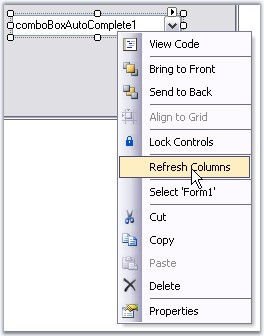
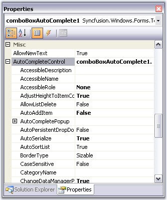
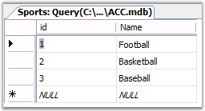
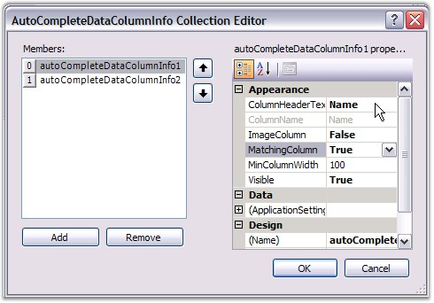
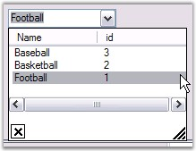
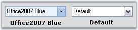

::: {style="DISPLAY: none"}
{#d2h_url_template}{#d2h_package_url style="WIDTH: 0px; DISPLAY: none; HEIGHT: 0px"}
:::

::::: {.d2h_secondary_topic style="PADDING-BOTTOM: 10pt; MARGIN: 0pt; PADDING-LEFT: 0pt; PADDING-RIGHT: 0pt; PADDING-TOP: 0pt"}
##### Concepts and Features {#concepts-and-features style="tab-stops: 0pt"}

**[]{style="COLOR: black"}** 

This section contains information about using the ComboBoxAutoComplete control in some commonly used scenarios.

[]{style="COLOR: #15428b"} 

###### []{#p198}3.3.1.2.3.1 Behavior Settings {#behavior-settings style="tab-stops: 0pt"}

[]{style="COLOR: #15428b"} 

The behavior settings of a ComboBoxAutoComplete control includes the below properties.

[]{style="COLOR: #15428b"} 

::: {align="center"}
  -------------------------------- --------------------------------------------------------------------------------------------------------------------------------------------------------------------------------------------------------------------------------------------------------------------------------
  ComboAutoComplete Properties     Description
  AllowNewText                     Specifies whether the user is allowed to enter new text. User can be allowed to enter new text in the ComboAutoComplete by setting AllowNewText to true. AllowNewText is mainly used to prevent items that are not in the list while validating.
  ReadOnly                         Gets or Sets value indicating whether changes can be done to the combobox.
  UpdateComboSelectionProperties   UpdateComboSelectionProperties set to true means the Property SelectedItem will return the AutoCompleteControl\'s SelectedItem. Else if it is set to false, then SelectedItem property should return the base class SelectedItem ie., the Windows ComboBox SelectedItem value.
  -------------------------------- --------------------------------------------------------------------------------------------------------------------------------------------------------------------------------------------------------------------------------------------------------------------------------
:::

[]{style="COLOR: #15428b"} 

+--------------------------------------------------------------------------------------------------------------------------------------------------------------------------------------------------------------------------------------------+
| **[\[C#\]]{style="FONT-FAMILY: 'Courier New'; COLOR: black"}**                                                                                                                                                                             |
|                                                                                                                                                                                                                                            |
| []{style="FONT-FAMILY: 'Courier New'; COLOR: black"}                                                                                                                                                                                       |
|                                                                                                                                                                                                                                            |
| [this]{style="FONT-FAMILY: 'Courier New'; COLOR: blue"}[.comboBoxAutoComplete1.AllowNewText= [true]{style="COLOR: blue"};]{style="FONT-FAMILY: 'Courier New'"}                                                                             |
|                                                                                                                                                                                                                                            |
| [this]{style="FONT-FAMILY: 'Courier New'; COLOR: blue"}[.comboBoxAutoComplete1.ReadOnly = [true]{style="COLOR: blue"};]{style="FONT-FAMILY: 'Courier New'"}                                                                                |
|                                                                                                                                                                                                                                            |
| [this]{style="FONT-FAMILY: 'Courier New'; COLOR: blue"}[.comboBoxAutoComplete1.UpdateComboSelectionProperties = [false]{style="COLOR: blue"};      ]{style="FONT-FAMILY: 'Courier New'"}[            ]{style="FONT-FAMILY: 'Courier New'"} |
+--------------------------------------------------------------------------------------------------------------------------------------------------------------------------------------------------------------------------------------------+

[]{style="COLOR: #15428b"} 

+---------------------------------------------------------------------------------------------------------------------------------------------------------------------------------+
| **[\[VB.NET\]]{style="FONT-FAMILY: 'Courier New'; COLOR: black"}**                                                                                                              |
|                                                                                                                                                                                 |
| []{style="FONT-FAMILY: 'Courier New'; COLOR: black"}                                                                                                                            |
|                                                                                                                                                                                 |
| [Me]{style="FONT-FAMILY: 'Courier New'; COLOR: blue"}[.comboBoxAutoComplete1.AllowNewText= [True]{style="COLOR: blue"}]{style="FONT-FAMILY: 'Courier New'"}                     |
|                                                                                                                                                                                 |
| [Me]{style="FONT-FAMILY: 'Courier New'; COLOR: blue"}[.comboBoxAutoComplete1.ReadOnly = [True]{style="COLOR: blue"}]{style="FONT-FAMILY: 'Courier New'"}                        |
|                                                                                                                                                                                 |
| [Me]{style="FONT-FAMILY: 'Courier New'; COLOR: blue"}[.comboBoxAutoComplete1.UpdateComboSelectionProperties = [False]{style="COLOR: blue"}]{style="FONT-FAMILY: 'Courier New'"} |
+---------------------------------------------------------------------------------------------------------------------------------------------------------------------------------+

**[]{style="COLOR: #333399"}** 

Refreshing the Columns

**[]{style="COLOR: #15428b"}** 

When the datasource of the AutoComplete control is set to a valid datasource through the designer, the \"Refresh Columns\" verb can be clicked to automatically populate the Columns collection. This option is available in the context menu of the ComboBoxAutoComplete control and also as property grid command.

**[]{style="COLOR: #15428b"}** 

{border="0"}

Figure 136: Refreshing Column using Control\'s Context Menu

 

**[]{style="COLOR: #15428b"}** 

Banner Text Support

[]{style="COLOR: #15428b"} 

We can set banner text for the ComboBoxAutoComplete control. Refer [[BannerTextProvider Component]{style="COLOR: windowtext; TEXT-DECORATION: none; text-underline: none"}](../../../../../../../../Documents%20and%20Settings/sindhujamj/Desktop/D2H/ui/windows/tools/Documents/Tools%20-%20Part%202.docx#BannerTextProviderComponent) topic for more details.

[]{style="COLOR: #15428b"} 

{border="0"}

[]{style="COLOR: #15428b"} 

Figure 137: Banner Text set for ComboBoxAutoComplete

###### []{#p199}[]{#_Multi_Columns}3.3.1.2.3.2 Multi Columns {#multi-columns style="tab-stops: 0pt"}

[]{style="COLOR: #15428b"} 

We can use multiples columns in the ComboBoxAutoComplete control. In this case, we need to specify which column is to be used as the matching column using the **ComboBoxAutoComplete.AutoCompleteControl.Columns** properties. Adding multiple columns is discussed Multiple Columns[ ]{style="COLOR: black"}topic in AutoCompleteControl UG.

[]{style="COLOR: #15428b"} 

{border="0"}

[]{style="COLOR: #15428b"} 

Figure 138: AutoCompleteControl Properties Accessed Through ComboBoxAutoComplete Property Grid

[]{style="COLOR: #15428b"} 

See Also

[]{style="COLOR: #15428b"} 

[Data Source]{.UGHyperlink}[]{.UGHyperlink}

[[]{style="TEXT-DECORATION: none"}]{.UGHyperlink} 

###### []{#p200}3.3.1.2.3.3 Datasource {#datasource style="tab-stops: 0pt"}

[]{style="COLOR: #15428b"} 

The following steps sets a DataView as the DataSource of ComboBoxAutoComplete.

[]{style="COLOR: #15428b"} 

1.   Drag and drop SqlDataAdapter or OleDbDataAdapter tool from the Data tab of the Toolbox onto the form. This will appear in component tray under the form. The Data Adapter Configuration Wizard will be automatically launched to assist you.

2.   SqlConnection object and associated Command objects will be created to support the Data Adapter.

3.   Select the DataAdapter you created and click the \"Generate DataSet\" option at the bottom of the properties window.

4.   This will enable you to create a DataSet object, which will contain the DataTable/DataView which, wraps the record set you configured in the Wizard.

5.   Create a name for your DataSet object and select the table(s) to include.

6.   Enter the following code in the Load event of your form to fill the DataSet with data from the database.

[]{style="COLOR: #15428b"} 

{border="0"}

Figure 139: External DataSource Table

[]{style="COLOR: #15428b"} 

+------------------------------------------------------------------------------------------------------------------------------------------------------------------------------------------------------------------------------------------------------------+
| **[\[C#\]]{style="FONT-FAMILY: 'Courier New'; COLOR: black"}**                                                                                                                                                                                             |
|                                                                                                                                                                                                                                                            |
| **[]{style="FONT-FAMILY: 'Courier New'; COLOR: black"}**                                                                                                                                                                                                   |
|                                                                                                                                                                                                                                                            |
| [// Fills the DataSet with data from the database.]{style="FONT-FAMILY: 'Courier New'; COLOR: green"}                                                                                                                                                      |
|                                                                                                                                                                                                                                                            |
| [this]{style="FONT-FAMILY: 'Courier New'; COLOR: blue"}[.oleDbDataAdapter1.Fill(]{style="FONT-FAMILY: 'Courier New'; COLOR: black"}[this]{style="FONT-FAMILY: 'Courier New'; COLOR: blue"}[.dataSet11);]{style="FONT-FAMILY: 'Courier New'; COLOR: black"} |
+------------------------------------------------------------------------------------------------------------------------------------------------------------------------------------------------------------------------------------------------------------+

[]{style="COLOR: #15428b"} 

+--------------------------------------------------------------------------------------------------------------------------------------------------------------------------------------------------------------------------------------------------------+
| **[\[VB.NET\]]{style="FONT-FAMILY: 'Courier New'; COLOR: black"}**                                                                                                                                                                                     |
|                                                                                                                                                                                                                                                        |
| **[]{style="FONT-FAMILY: 'Courier New'; COLOR: black"}**                                                                                                                                                                                               |
|                                                                                                                                                                                                                                                        |
| [\' Fills the DataSet with data from the database.]{style="FONT-FAMILY: 'Courier New'; COLOR: green"}                                                                                                                                                  |
|                                                                                                                                                                                                                                                        |
| [Me]{style="FONT-FAMILY: 'Courier New'; COLOR: blue"}[.oleDbDataAdapter1.Fill(]{style="FONT-FAMILY: 'Courier New'; COLOR: black"}[Me]{style="FONT-FAMILY: 'Courier New'; COLOR: blue"}[.dataSet11);]{style="FONT-FAMILY: 'Courier New'; COLOR: black"} |
+--------------------------------------------------------------------------------------------------------------------------------------------------------------------------------------------------------------------------------------------------------+

[]{style="COLOR: #15428b"} 

Adding Columns to the Popup and setting the matching column

[]{style="COLOR: #15428b"} 

Add columns through designer using ComboBoxAutoComplete.AutoCompleteControl.Columns property. Set the first column as the matching column.

[]{style="COLOR: #15428b"} 

{border="0"}

Figure 140: Adding Columns \"Name\" and \"ID\" According to External Data Source

**[]{style="COLOR: #15428b"}** 

Using the below code, assign the dataset as the data source for the ComboBoxAutoComplete control.

[]{style="COLOR: #15428b"} 

+---------------------------------------------------------------------------------------------------------------------------------------------------------------------------------------------------------------+
| **[\[C#\]]{style="FONT-FAMILY: 'Courier New'; COLOR: black"}**                                                                                                                                                |
|                                                                                                                                                                                                               |
| **[]{style="FONT-FAMILY: 'Courier New'; COLOR: black"}**                                                                                                                                                      |
|                                                                                                                                                                                                               |
| [// Assign  DataSet to the AutoCompleteControl.DataSource property of the ComboBoxAutoComplete.]{style="FONT-FAMILY: 'Courier New'; COLOR: green"}                                                            |
|                                                                                                                                                                                                               |
| [this]{style="FONT-FAMILY: 'Courier New'; COLOR: blue"}[.comboBoxAutoComplete1.AutoCompleteControl.DataSource = [this]{style="COLOR: blue"}.dataSet11.Sports;]{style="FONT-FAMILY: 'Courier New'"}            |
|                                                                                                                                                                                                               |
| [this]{style="FONT-FAMILY: 'Courier New'; COLOR: blue"}[.comboBoxAutoComplete1.DisplayMember = [\"Name\"]{style="COLOR: maroon"};]{style="FONT-FAMILY: 'Courier New'"}                                        |
|                                                                                                                                                                                                               |
| []{style="FONT-FAMILY: 'Courier New'; COLOR: black"}                                                                                                                                                          |
|                                                                                                                                                                                                               |
| [// Sets the attributes of columns in the drop down list of the AutoComplete.]{style="FONT-FAMILY: 'Courier New'; COLOR: green"}                                                                              |
|                                                                                                                                                                                                               |
| [this]{style="FONT-FAMILY: 'Courier New'; COLOR: blue"}[.comboBoxAutoComplete1.AutoCompleteControl.Columns.Add([this]{style="COLOR: blue"}.autoCompleteDataColumnInfo1);]{style="FONT-FAMILY: 'Courier New'"} |
|                                                                                                                                                                                                               |
| [this]{style="FONT-FAMILY: 'Courier New'; COLOR: blue"}[.comboBoxAutoComplete1.AutoCompleteControl.Columns.Add([this]{style="COLOR: blue"}.autoCompleteDataColumnInfo2);]{style="FONT-FAMILY: 'Courier New'"} |
|                                                                                                                                                                                                               |
| [   ]{style="FONT-FAMILY: 'Courier New'; COLOR: black"}                                                                                                                                                       |
|                                                                                                                                                                                                               |
| [this]{style="FONT-FAMILY: 'Courier New'; COLOR: blue"}[.autoCompleteDataColumnInfo1.ColumnHeaderText = [\"Name\"]{style="COLOR: maroon"};]{style="FONT-FAMILY: 'Courier New'"}                               |
|                                                                                                                                                                                                               |
| [this]{style="FONT-FAMILY: 'Courier New'; COLOR: blue"}[.autoCompleteDataColumnInfo1.MatchingColumn = [true]{style="COLOR: blue"};]{style="FONT-FAMILY: 'Courier New'"}                                       |
|                                                                                                                                                                                                               |
| [this]{style="FONT-FAMILY: 'Courier New'; COLOR: blue"}[.autoCompleteDataColumnInfo2.ColumnHeaderText = [\"ID\"]{style="COLOR: maroon"};]{style="FONT-FAMILY: 'Courier New'"}                                 |
+---------------------------------------------------------------------------------------------------------------------------------------------------------------------------------------------------------------+

[]{style="COLOR: #15428b"} 

+----------------------------------------------------------------------------------------------------------------------------------------------------------------------------------------------------------+
| **[\[VB.NET\]]{style="FONT-FAMILY: 'Courier New'; COLOR: black"}**                                                                                                                                       |
|                                                                                                                                                                                                          |
| []{style="FONT-FAMILY: 'Courier New'; COLOR: green"}                                                                                                                                                     |
|                                                                                                                                                                                                          |
| [\' Assign  DataSet to the AutoCompleteControl.DataSource property of the ComboBoxAutoComplete.]{style="FONT-FAMILY: 'Courier New'; COLOR: green"}                                                       |
|                                                                                                                                                                                                          |
| [Me]{style="FONT-FAMILY: 'Courier New'; COLOR: blue"}[.comboBoxAutoComplete1.AutoCompleteControl.DataSource = [Me]{style="COLOR: blue"}.dataSet11.Sports]{style="FONT-FAMILY: 'Courier New'"}            |
|                                                                                                                                                                                                          |
| [Me]{style="FONT-FAMILY: 'Courier New'; COLOR: blue"}[.comboBoxAutoComplete1.DisplayMember = [\"Name\"]{style="COLOR: maroon"}]{style="FONT-FAMILY: 'Courier New'"}                                      |
|                                                                                                                                                                                                          |
| []{style="FONT-FAMILY: 'Courier New'; COLOR: black"}                                                                                                                                                     |
|                                                                                                                                                                                                          |
| [\' Sets the attributes of columns in the drop down list of the AutoComplete.]{style="FONT-FAMILY: 'Courier New'; COLOR: green"}                                                                         |
|                                                                                                                                                                                                          |
| [Me]{style="FONT-FAMILY: 'Courier New'; COLOR: blue"}[.comboBoxAutoComplete1.AutoCompleteControl.Columns.Add([Me]{style="COLOR: blue"}.autoCompleteDataColumnInfo1)]{style="FONT-FAMILY: 'Courier New'"} |
|                                                                                                                                                                                                          |
| [Me]{style="FONT-FAMILY: 'Courier New'; COLOR: blue"}[.comboBoxAutoComplete1.AutoCompleteControl.Columns.Add([Me]{style="COLOR: blue"}.autoCompleteDataColumnInfo2)]{style="FONT-FAMILY: 'Courier New'"} |
|                                                                                                                                                                                                          |
| [   ]{style="FONT-FAMILY: 'Courier New'; COLOR: black"}                                                                                                                                                  |
|                                                                                                                                                                                                          |
| [Me]{style="FONT-FAMILY: 'Courier New'; COLOR: blue"}[.autoCompleteDataColumnInfo1.ColumnHeaderText = [\"Name\"]{style="COLOR: maroon"}]{style="FONT-FAMILY: 'Courier New'"}                             |
|                                                                                                                                                                                                          |
| [Me]{style="FONT-FAMILY: 'Courier New'; COLOR: blue"}[.autoCompleteDataColumnInfo1.MatchingColumn = [True]{style="COLOR: blue"}]{style="FONT-FAMILY: 'Courier New'"}                                     |
|                                                                                                                                                                                                          |
| [Me]{style="FONT-FAMILY: 'Courier New'; COLOR: blue"}[.autoCompleteDataColumnInfo2.ColumnHeaderText = [\"ID\"]{style="COLOR: maroon"}]{style="FONT-FAMILY: 'Courier New'"}                               |
+----------------------------------------------------------------------------------------------------------------------------------------------------------------------------------------------------------+

[]{style="COLOR: #15428b"} 

{border="0"}

Figure 141: ComboBoxAutoComplete with Sports Data

 

###### []{#p201}3.3.1.2.3.4 Visual Styles {#visual-styles style="tab-stops: 0pt"}

[]{style="COLOR: #15428b"} 

Visual Styles for the ComboBoxAutoComplete control can be set using **VisualStyle** property. The styles are,

[   ]{style="COLOR: #15428b"}

[·      ]{style="FONT-FAMILY: Symbol"}Default and

[·      ]{style="FONT-FAMILY: Symbol"}Office2007.

[]{style="COLOR: #15428b"} 

+--------------------------------------------------------------------------------------------------------------------------------------------------------------------------------------------------------------------------+
| **[\[C#\]]{style="FONT-FAMILY: 'Courier New'; COLOR: black"}**                                                                                                                                                           |
|                                                                                                                                                                                                                          |
| []{style="COLOR: #15428b"}                                                                                                                                                                                               |
|                                                                                                                                                                                                                          |
| [this]{style="FONT-FAMILY: 'Courier New'; COLOR: blue"}[.comboBoxAutoComplete1.VisualStyle = Syncfusion.Windows.Forms.Tools.[ThemedComboBoxStyles]{style="COLOR: teal"}.Office2007;]{style="FONT-FAMILY: 'Courier New'"} |
|                                                                                                                                                                                                                          |
| [this]{style="FONT-FAMILY: 'Courier New'; COLOR: blue"}[.comboBoxAutoComplete1.Office2007ColorTheme = Syncfusion.Windows.Forms.[Office2007Theme]{style="COLOR: teal"}.Managed;]{style="FONT-FAMILY: 'Courier New'"}      |
+--------------------------------------------------------------------------------------------------------------------------------------------------------------------------------------------------------------------------+

[]{style="COLOR: #15428b"} 

+------------------------------------------------------------------------------------------------------------------------------------------------------------------------------------------------------------------------+
| **[\[VB.NET\]]{style="FONT-FAMILY: 'Courier New'; COLOR: black"}**                                                                                                                                                     |
|                                                                                                                                                                                                                        |
| []{style="COLOR: #15428b"}                                                                                                                                                                                             |
|                                                                                                                                                                                                                        |
| [Me]{style="FONT-FAMILY: 'Courier New'; COLOR: blue"}[.comboBoxAutoComplete1.VisualStyle = Syncfusion.Windows.Forms.Tools.[ThemedComboBoxStyles]{style="COLOR: black"}.Office2007]{style="FONT-FAMILY: 'Courier New'"} |
|                                                                                                                                                                                                                        |
| [Me]{style="FONT-FAMILY: 'Courier New'; COLOR: blue"}[.comboBoxAutoComplete1.Office2007ColorTheme = Syncfusion.Windows.Forms.[Office2007Theme]{style="COLOR: black"}.Managed]{style="FONT-FAMILY: 'Courier New'"}      |
+------------------------------------------------------------------------------------------------------------------------------------------------------------------------------------------------------------------------+

[]{style="COLOR: #15428b"} 

{border="0"}

Figure 142: Visual Styles for ComboBoxAutoComplete Control

**[]{style="COLOR: #15428b"}** 

::: {style="BORDER-BOTTOM: windowtext 1pt solid; BORDER-LEFT: medium none; PADDING-BOTTOM: 1pt; MARGIN-TOP: 9pt; PADDING-LEFT: 0pt; PADDING-RIGHT: 0pt; MARGIN-BOTTOM: 9pt; BORDER-TOP: windowtext 1pt solid; BORDER-RIGHT: medium none; PADDING-TOP: 1pt"}
{border="0"} Note: The control supports all the three office color schemes.
:::

[]{style="COLOR: #15428b"} 

Custom Colors

[]{style="COLOR: #15428b"} 

We can also apply custom colors to the ComboBoxAutoComplete control by setting Office2007ColorTheme to \"*Managed*\" and specifying the custom color through the **ApplyManagedColors** method as follows.

[]{style="COLOR: #15428b"} 

+---------------------------------------------------------------------------------------------------------------------------------------------------------------------------------------------------------------------+
| **[\[C#\]]{style="FONT-FAMILY: 'Courier New'; COLOR: black"}**                                                                                                                                                      |
|                                                                                                                                                                                                                     |
| []{style="COLOR: #15428b"}                                                                                                                                                                                          |
|                                                                                                                                                                                                                     |
| [this]{style="FONT-FAMILY: 'Courier New'; COLOR: blue"}[.comboBoxAutoComplete1.Office2007ColorTheme = Syncfusion.Windows.Forms.[Office2007Theme]{style="COLOR: teal"}.Managed;]{style="FONT-FAMILY: 'Courier New'"} |
|                                                                                                                                                                                                                     |
| [Office2007Colors]{style="FONT-FAMILY: 'Courier New'; COLOR: teal"}[.ApplyManagedColors([this]{style="COLOR: blue"}, [Color]{style="COLOR: teal"}.LightGreen);]{style="FONT-FAMILY: 'Courier New'"}                 |
+---------------------------------------------------------------------------------------------------------------------------------------------------------------------------------------------------------------------+

[]{style="COLOR: #15428b"} 

+-------------------------------------------------------------------------------------------------------------------------------------------------------------------------------------------------------------------+
| **[\[VB.NET\]]{style="FONT-FAMILY: 'Courier New'; COLOR: black"}**                                                                                                                                                |
|                                                                                                                                                                                                                   |
| []{style="COLOR: #15428b"}                                                                                                                                                                                        |
|                                                                                                                                                                                                                   |
| [Me]{style="FONT-FAMILY: 'Courier New'; COLOR: blue"}[.comboBoxAutoComplete1.Office2007ColorTheme = Syncfusion.Windows.Forms.[Office2007Theme]{style="COLOR: black"}.Managed]{style="FONT-FAMILY: 'Courier New'"} |
|                                                                                                                                                                                                                   |
| [Office2007Colors.]{style="FONT-FAMILY: 'Courier New'; COLOR: black"}[ApplyManagedColors([this]{style="COLOR: blue"}, [Color]{style="COLOR: black"}.LightGreen)]{style="FONT-FAMILY: 'Courier New'"}              |
+-------------------------------------------------------------------------------------------------------------------------------------------------------------------------------------------------------------------+

[]{style="COLOR: #15428b"} 

{border="0"}

Figure 143: CustomColor= \"Orchid\"

 

 

[]{#related-topics}
:::::
