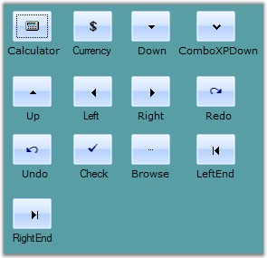
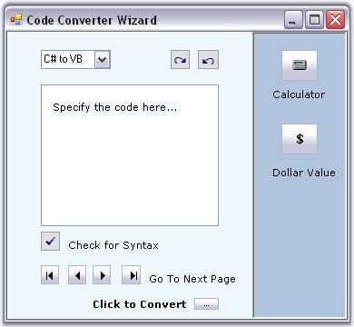
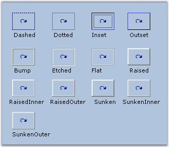
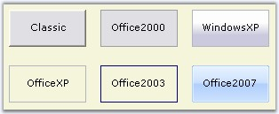
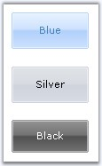
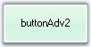
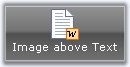
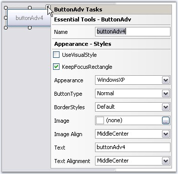
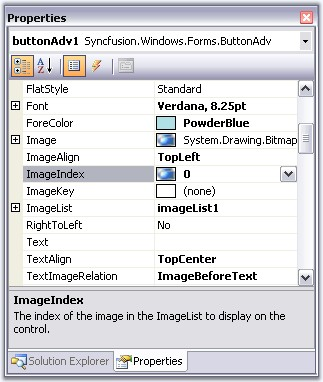
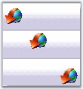

::: {style="DISPLAY: none"}
{#d2h_url_template}{#d2h_package_url style="WIDTH: 0px; DISPLAY: none; HEIGHT: 0px"}
:::

::::::::::::: {.d2h_secondary_topic style="PADDING-BOTTOM: 10pt; MARGIN: 0pt; PADDING-LEFT: 0pt; PADDING-RIGHT: 0pt; PADDING-TOP: 0pt"}
##### Concepts and Features {#concepts-and-features style="tab-stops: 0pt"}

[]{style="COLOR: black; FONT-SIZE: 8pt"} 

The following topics will help you become more familiar in using the ButtonAdv control.

###### []{#p211}[]{#_ButtonAdv_Appearance}3.3.2.1.3.1 ButtonAdv Appearance {#buttonadv-appearance style="tab-stops: 0pt"}

 

[]{#p212}This section will walk you through the below topics which discusses the properties that controls the appearance of the ButtonAdv.

[]{style="COLOR: #15428b"} 

[]{#_Button_Types}3.3.2.1.3.1.1      Button Types

[]{style="COLOR: #15428b"} 

ButtonAdv control supports different button types in terms of its appearance. It is specified using the **ButtonType** property.

[]{style="COLOR: #15428b"} 

::: {align="center"}
+-----------------------------------+--------------------------------------------------------------------------------------------+
| Property                          | Description                                                                                |
+-----------------------------------+--------------------------------------------------------------------------------------------+
| ButtonType                        | Specifies the button type to be used in the ButtonAdv control. The options are as follows. |
|                                   |                                                                                            |
|                                   |                                                                                            |
|                                   |                                                                                            |
|                                   | *Normal* - Normal button. (user can specify the image with this ButtonType).               |
|                                   |                                                                                            |
|                                   | *Calculator* - Calculator image is used.                                                   |
|                                   |                                                                                            |
|                                   | *Currency* - Currency image is used.                                                       |
|                                   |                                                                                            |
|                                   | *Down* - Down image is used.                                                               |
|                                   |                                                                                            |
|                                   | *ComboXPDown* - Down image like in a Windows XP combo box.                                 |
|                                   |                                                                                            |
|                                   | *Up* - Up image is used.                                                                   |
|                                   |                                                                                            |
|                                   | *Left* - Left image is used.                                                               |
|                                   |                                                                                            |
|                                   | *Right* - Right image is used.                                                             |
|                                   |                                                                                            |
|                                   | *Redo* - Redo image is used.                                                               |
|                                   |                                                                                            |
|                                   | *Undo* - Undo image is used.                                                               |
|                                   |                                                                                            |
|                                   | *Check* - Check image is used.                                                             |
|                                   |                                                                                            |
|                                   | *Browse* - Browse image is used.                                                           |
|                                   |                                                                                            |
|                                   | *LeftEnd* - Left end image is used.                                                        |
|                                   |                                                                                            |
|                                   | *RightEnd* - Right end image is used.                                                      |
+-----------------------------------+--------------------------------------------------------------------------------------------+
:::

[]{style="COLOR: #15428b"} 

::: {style="BORDER-BOTTOM: windowtext 1pt solid; BORDER-LEFT: medium none; PADDING-BOTTOM: 1pt; MARGIN-TOP: 9pt; PADDING-LEFT: 0pt; PADDING-RIGHT: 0pt; MARGIN-BOTTOM: 9pt; BORDER-TOP: windowtext 1pt solid; BORDER-RIGHT: medium none; PADDING-TOP: 1pt"}
{border="0"} Note: You can also specify your own image for the ButtonAdv using Image property and this will effect only when ButtonType is set to Normal. See Image Settings to know more.
:::

[]{style="COLOR: #15428b"} 

+------------------------------------------------------------------------------------------------------------------------------------------------------------------------------------------------+
| **[\[C#\]]{style="FONT-FAMILY: 'Courier New'; COLOR: black"}**                                                                                                                                 |
|                                                                                                                                                                                                |
| []{style="COLOR: #15428b"}                                                                                                                                                                     |
|                                                                                                                                                                                                |
| [//Setting Calculator button type]{style="FONT-FAMILY: 'Courier New'; COLOR: green"}                                                                                                           |
|                                                                                                                                                                                                |
| [this]{style="FONT-FAMILY: 'Courier New'; COLOR: blue"}[.ButtonAdvControl.ButtonType=Syncfusion.Windows.Forms.Tools.ButtonTypes.Calculator;]{style="FONT-FAMILY: 'Courier New'; COLOR: black"} |
+------------------------------------------------------------------------------------------------------------------------------------------------------------------------------------------------+

[]{style="COLOR: #15428b"} 

+-----------------------------------------------------------------------------------------------------------------------------------------------------------------------------------------------+
| **[\[VB.NET\]]{style="FONT-FAMILY: 'Courier New'; COLOR: black"}**                                                                                                                            |
|                                                                                                                                                                                               |
| []{style="COLOR: #15428b"}                                                                                                                                                                    |
|                                                                                                                                                                                               |
| [\'Setting Calculator button type]{style="FONT-FAMILY: 'Courier New'; COLOR: green"}                                                                                                          |
|                                                                                                                                                                                               |
| [Me]{style="FONT-FAMILY: 'Courier New'; COLOR: blue"}[.ButtonAdvControl.ButtonType = Syncfusion.Windows.Forms.Tools.ButtonTypes.Calculator]{style="FONT-FAMILY: 'Courier New'; COLOR: black"} |
+-----------------------------------------------------------------------------------------------------------------------------------------------------------------------------------------------+

[]{style="COLOR: #15428b"} 

{border="0"}

Figure 148: Button Types for ButtonAdv Control

[]{style="COLOR: #15428b"} 

::: {style="BORDER-BOTTOM: windowtext 1pt solid; BORDER-LEFT: medium none; PADDING-BOTTOM: 1pt; MARGIN-TOP: 9pt; PADDING-LEFT: 0pt; PADDING-RIGHT: 0pt; MARGIN-BOTTOM: 9pt; BORDER-TOP: windowtext 1pt solid; BORDER-RIGHT: medium none; PADDING-TOP: 1pt"}
{border="0"} Note: The ButtonTypes are only provided for ease of use and do not in any way change the functionality of the buttons.
:::

[]{style="COLOR: #15428b"} 

**Example -** A sample image which uses most of the button types in a single application is as follows. User will have to add respective functionalities for each button type.

[]{style="COLOR: #15428b"} 

{border="0"}

[]{style="COLOR: #15428b"} 

Figure 149: Button Types Implemented in a Sample

 

[]{#p213}[]{#_Border_Styles}3.3.2.1.3.1.2      Border Styles

[]{style="COLOR: #15428b"} 

Border style for the ButtonAdv control is specified in the below property.

[]{style="COLOR: #15428b"} 

::: {align="center"}
+-----------------------------------+-------------------------------------------------------------------+
| Property                          | Description                                                       |
+-----------------------------------+-------------------------------------------------------------------+
| BorderStyleAdv                    | Specifies the border style for ButtonAdv control. The styles are, |
|                                   |                                                                   |
|                                   |                                                                   |
|                                   |                                                                   |
|                                   | *None,*                                                           |
|                                   |                                                                   |
|                                   | *Default,*                                                        |
|                                   |                                                                   |
|                                   | *Dashed,*                                                         |
|                                   |                                                                   |
|                                   | *Dotted,*                                                         |
|                                   |                                                                   |
|                                   | *Inset,*                                                          |
|                                   |                                                                   |
|                                   | *Outset,*                                                         |
|                                   |                                                                   |
|                                   | *Solid,*                                                          |
|                                   |                                                                   |
|                                   | *Bump,*                                                           |
|                                   |                                                                   |
|                                   | *Etched,*                                                         |
|                                   |                                                                   |
|                                   | *Flat,*                                                           |
|                                   |                                                                   |
|                                   | *Raised,*                                                         |
|                                   |                                                                   |
|                                   | *RaisedInner,*                                                    |
|                                   |                                                                   |
|                                   | *RaisedOuter,*                                                    |
|                                   |                                                                   |
|                                   | *Sunken,*                                                         |
|                                   |                                                                   |
|                                   | *SunkenInner and*                                                 |
|                                   |                                                                   |
|                                   | *SunkenOuter.*                                                    |
+-----------------------------------+-------------------------------------------------------------------+
:::

[]{style="COLOR: #15428b"} 

::: {style="BORDER-BOTTOM: windowtext 1pt solid; BORDER-LEFT: medium none; PADDING-BOTTOM: 1pt; MARGIN-TOP: 9pt; PADDING-LEFT: 0pt; PADDING-RIGHT: 0pt; MARGIN-BOTTOM: 9pt; BORDER-TOP: windowtext 1pt solid; BORDER-RIGHT: medium none; PADDING-TOP: 1pt"}
{border="0"} Note: This setting will be effective only for Office2003, OfficeXP and WindowsXP styles set through ButtonAdv.Appearance property. See Visual Styles.
:::

[]{style="COLOR: #15428b"} 

+--------------------------------------------------------------------------------------------------------------------------------------------------------------------------------------------------------------+
| **[\[C#\]]{style="FONT-FAMILY: 'Courier New'; COLOR: black"}**                                                                                                                                               |
|                                                                                                                                                                                                              |
| []{style="COLOR: #15428b"}                                                                                                                                                                                   |
|                                                                                                                                                                                                              |
| [//Sample code for setting \"SunkenOuter\" Border Style using BorderStyleAdv]{style="FONT-FAMILY: 'Courier New'; COLOR: green"}                                                                              |
|                                                                                                                                                                                                              |
| [this]{style="FONT-FAMILY: 'Courier New'; COLOR: blue"}[.buttonAdv13.BorderStyleAdv = Syncfusion.Windows.Forms.[ButtonAdvBorderStyle]{style="COLOR: teal"}.SunkenOuter;]{style="FONT-FAMILY: 'Courier New'"} |
+--------------------------------------------------------------------------------------------------------------------------------------------------------------------------------------------------------------+

[]{style="COLOR: #15428b"} 

+------------------------------------------------------------------------------------------------------------------------------------------------------------------------------------------------------------+
| **[\[VB.NET\]]{style="FONT-FAMILY: 'Courier New'; COLOR: black"}**                                                                                                                                         |
|                                                                                                                                                                                                            |
| []{style="COLOR: #15428b"}                                                                                                                                                                                 |
|                                                                                                                                                                                                            |
| [//Sample code for setting \"SunkenOuter\" Border Style using BorderStyleAdv]{style="FONT-FAMILY: 'Courier New'; COLOR: green"}                                                                            |
|                                                                                                                                                                                                            |
| [Me]{style="FONT-FAMILY: 'Courier New'; COLOR: blue"}[.buttonAdv13.BorderStyleAdv = Syncfusion.Windows.Forms.[ButtonAdvBorderStyle]{style="COLOR: black"}.SunkenOuter]{style="FONT-FAMILY: 'Courier New'"} |
+------------------------------------------------------------------------------------------------------------------------------------------------------------------------------------------------------------+

[]{style="COLOR: #15428b"} 

{border="0"}

[]{style="COLOR: #15428b"} 

Figure 150: \"Redo\" ButtonType, ButtonAdvControls with Different Border Styles (Appearance=\"Office2003\")

**[]{style="COLOR: #15428b"}** 

See Also

**[]{style="COLOR: #15428b"}** 

[Visual Styles]{.UGHyperlink}[, ]{.UGHyperlink}[[Button Types]{.UGHyperlink}]()[]{.UGHyperlink}

[]{#p214}3.3.2.1.3.1.3      Visual Styles

[]{style="COLOR: #15428b"} 

Visual Styles for the ButtonAdv control can be enabled using **UseVisualStyle** property. The different visual style are specified through **Appearance.**

[]{style="COLOR: #15428b"} 

::: {align="center"}
+-----------------------------------+----------------------------------------------------------------------------------------------+
| Property                          | Description                                                                                  |
+-----------------------------------+----------------------------------------------------------------------------------------------+
| Appearance                        | Sets the visual styles for the control when UseVisualStyle property is true. The styles are, |
|                                   |                                                                                              |
|                                   |                                                                                              |
|                                   |                                                                                              |
|                                   | *Classic,*                                                                                   |
|                                   |                                                                                              |
|                                   | *Office2000,*                                                                                |
|                                   |                                                                                              |
|                                   | *WindowsXP,*                                                                                 |
|                                   |                                                                                              |
|                                   | *OfficeXP,*                                                                                  |
|                                   |                                                                                              |
|                                   | *Office2003 and*                                                                             |
|                                   |                                                                                              |
|                                   | *Office2007.*                                                                                |
+-----------------------------------+----------------------------------------------------------------------------------------------+
:::

[]{style="FONT-FAMILY: 'Courier New'; COLOR: blue"} 

+--------------------------------------------------------------------------------------------------------------------------------------------------------------------------------------------------+
| **[\[C#\]]{style="FONT-FAMILY: 'Courier New'; COLOR: black"}**                                                                                                                                   |
|                                                                                                                                                                                                  |
| []{style="COLOR: #15428b"}                                                                                                                                                                       |
|                                                                                                                                                                                                  |
| [this]{style="FONT-FAMILY: 'Courier New'; COLOR: blue"}[.buttonAdv1.UseVisualStyle = Syncfusion.Windows.Forms.[UseStyle]{style="COLOR: teal"}.True;]{style="FONT-FAMILY: 'Courier New'"}         |
|                                                                                                                                                                                                  |
| [//Sample code for setting \"OfficeXP\" style for ButtonAdv]{style="FONT-FAMILY: 'Courier New'; COLOR: green"}                                                                                   |
|                                                                                                                                                                                                  |
| [this]{style="FONT-FAMILY: 'Courier New'; COLOR: blue"}[.buttonAdv1.Appearance = Syncfusion.Windows.Forms.[ButtonAppearance]{style="COLOR: teal"}.OfficeXP;]{style="FONT-FAMILY: 'Courier New'"} |
+--------------------------------------------------------------------------------------------------------------------------------------------------------------------------------------------------+

[]{style="COLOR: #15428b"} 

+-----------------------------------------------------------------------------------------------------------------------------------------------------------------------------------------------+
| **[\[VB.NET\]]{style="FONT-FAMILY: 'Courier New'; COLOR: black"}**                                                                                                                            |
|                                                                                                                                                                                               |
| []{style="COLOR: #15428b"}                                                                                                                                                                    |
|                                                                                                                                                                                               |
| [Me]{style="FONT-FAMILY: 'Courier New'; COLOR: blue"}[.buttonAdv1.UseVisualStyle = Syncfusion.Windows.Forms.UseStyle.True]{style="FONT-FAMILY: 'Courier New'"}                                |
|                                                                                                                                                                                               |
| [\'Sample code for setting \"OfficeXP\" style for ButtonAdv]{style="FONT-FAMILY: 'Courier New'; COLOR: green"}                                                                                |
|                                                                                                                                                                                               |
| [Me]{style="FONT-FAMILY: 'Courier New'; COLOR: blue"}[.buttonAdv1.Appearance = Syncfusion.Windows.Forms.[ButtonAppearance]{style="COLOR: teal"}.OfficeXP]{style="FONT-FAMILY: 'Courier New'"} |
+-----------------------------------------------------------------------------------------------------------------------------------------------------------------------------------------------+

[]{style="COLOR: #15428b"} 

{border="0"}

[]{style="COLOR: #15428b"} 

Figure 151: Visual Styles for ButtonAdv

**[]{style="COLOR: #15428b"}** 

::: {style="BORDER-BOTTOM: windowtext 1pt solid; BORDER-LEFT: medium none; PADDING-BOTTOM: 1pt; MARGIN-TOP: 9pt; PADDING-LEFT: 0pt; PADDING-RIGHT: 0pt; MARGIN-BOTTOM: 9pt; BORDER-TOP: windowtext 1pt solid; BORDER-RIGHT: medium none; PADDING-TOP: 1pt"}
{border="0"} Note:[ ]{style="COLOR: black; FONT-SIZE: 8pt"}While mouse hovering over the OfficeXP, Office2003 and WindowsXP at run time, the button will be painted with some standard colors. This is an inbuilt feature in the ButtonControlAdv.
:::

**[]{style="COLOR: #15428b"}** 

Office Color Themes

**[]{style="COLOR: #15428b"}** 

ButtonControlAdv supports all the three OfficeColor Schemes when ButtonAdv.Appearance is set to Office2007. Similarly you can set Blue and Black color schemes also. Default value is Blue.

[]{style="COLOR: #15428b"} 

+----------------------------------------------------------------------------------------------------------------------------------------------------------------------------------------------------------+
| **[\[C#\]]{style="FONT-FAMILY: 'Courier New'; COLOR: black"}**                                                                                                                                           |
|                                                                                                                                                                                                          |
| []{style="COLOR: #15428b"}                                                                                                                                                                               |
|                                                                                                                                                                                                          |
| [//Sample code for setting \"Silver\" color scheme for ButtonAdv]{style="FONT-FAMILY: 'Courier New'; COLOR: green"}                                                                                      |
|                                                                                                                                                                                                          |
| [this]{style="FONT-FAMILY: 'Courier New'; COLOR: blue"}[.buttonAdv1.Office2007ColorScheme = Syncfusion.Windows.Forms.[Office2007Theme]{style="COLOR: teal"}.Silver;]{style="FONT-FAMILY: 'Courier New'"} |
+----------------------------------------------------------------------------------------------------------------------------------------------------------------------------------------------------------+

[]{style="COLOR: #15428b"} 

+--------------------------------------------------------------------------------------------------------------------------------------------------------------------------------------------------------+
| **[\[VB.NET\]]{style="FONT-FAMILY: 'Courier New'; COLOR: black"}**                                                                                                                                     |
|                                                                                                                                                                                                        |
| []{style="COLOR: #15428b"}                                                                                                                                                                             |
|                                                                                                                                                                                                        |
| [\'Sample code for setting \"Silver\" color scheme for ButtonAdv]{style="FONT-FAMILY: 'Courier New'; COLOR: green"}                                                                                    |
|                                                                                                                                                                                                        |
| [Me]{style="FONT-FAMILY: 'Courier New'; COLOR: blue"}[.buttonAdv1.Office2007ColorScheme = Syncfusion.Windows.Forms.[Office2007Theme]{style="COLOR: black"}.Silver]{style="FONT-FAMILY: 'Courier New'"} |
+--------------------------------------------------------------------------------------------------------------------------------------------------------------------------------------------------------+

[]{style="COLOR: #15428b"} 

{border="0"}

[]{style="COLOR: #15428b"} 

Figure 152: Office Color Schemes for ButtonAdv Control

\
Custom Colors

[]{style="COLOR: #15428b"} 

We can also apply custom colors to the ButtonAdv control by setting Office2007ColorScheme to \"*[Managed\"]{style="FONT-FAMILY: 'Segoe UI','sans-serif'"}* and specifying the custom color through the **ApplyManagedColors** method as follows.

[]{style="COLOR: #15428b"} 

+-----------------------------------------------------------------------------------------------------------------------------------------------------------------------------------------------------------+
| **[\[C#\]]{style="FONT-FAMILY: 'Courier New'; COLOR: black"}**                                                                                                                                            |
|                                                                                                                                                                                                           |
| []{style="COLOR: #15428b"}                                                                                                                                                                                |
|                                                                                                                                                                                                           |
| [this]{style="FONT-FAMILY: 'Courier New'; COLOR: blue"}[.buttonAdv1.Office2007ColorScheme = Syncfusion.Windows.Forms.[Office2007Theme]{style="COLOR: teal"}.Managed;]{style="FONT-FAMILY: 'Courier New'"} |
|                                                                                                                                                                                                           |
| [Office2007Colors]{style="FONT-FAMILY: 'Courier New'; COLOR: teal"}[.ApplyManagedColors([this]{style="COLOR: blue"}, [Color]{style="COLOR: teal"}.LightGreen);]{style="FONT-FAMILY: 'Courier New'"}       |
+-----------------------------------------------------------------------------------------------------------------------------------------------------------------------------------------------------------+

[]{style="COLOR: #15428b"} 

+---------------------------------------------------------------------------------------------------------------------------------------------------------------------------------------------------------+
| **[\[VB.NET\]]{style="FONT-FAMILY: 'Courier New'; COLOR: black"}**                                                                                                                                      |
|                                                                                                                                                                                                         |
| []{style="COLOR: #15428b"}                                                                                                                                                                              |
|                                                                                                                                                                                                         |
| [Me]{style="FONT-FAMILY: 'Courier New'; COLOR: blue"}[.buttonAdv1.Office2007ColorScheme = Syncfusion.Windows.Forms.[Office2007Theme]{style="COLOR: black"}.Managed]{style="FONT-FAMILY: 'Courier New'"} |
|                                                                                                                                                                                                         |
| [Office2007Colors.]{style="FONT-FAMILY: 'Courier New'; COLOR: black"}[ApplyManagedColors([this]{style="COLOR: blue"}, [Color]{style="COLOR: black"}.LightGreen)]{style="FONT-FAMILY: 'Courier New'"}    |
+---------------------------------------------------------------------------------------------------------------------------------------------------------------------------------------------------------+

[]{style="COLOR: #15428b"} 

{border="0"}

[]{style="COLOR: #15428b"} 

Figure 153: CustomColor = \"LightGreen\"

[]{style="COLOR: #15428b"} 

See Also

[]{style="COLOR: #15428b"} 

[[Button Types]{.UGHyperlink}]()[, ]{.UGHyperlink}[Image Settings]{.UGHyperlink}[]{.UGHyperlink}

[]{#p215}3.3.2.1.3.1.4      Foreground Settings

[]{style="COLOR: #15428b"} 

Text for the ButtonAdv can be customized using the below properties.

[]{style="COLOR: #15428b"} 

::: {align="center"}
+-----------------------------------+-----------------------------------------------------------------------+
| Properties                        | Description                                                           |
+-----------------------------------+-----------------------------------------------------------------------+
| Text                              | Sets the text for the ButtonAdv control.                              |
+-----------------------------------+-----------------------------------------------------------------------+
| TextAlign                         | Sets the alignment of the text in the control.  The options are,      |
|                                   |                                                                       |
|                                   |                                                                       |
|                                   |                                                                       |
|                                   | *TopLeft,*                                                            |
|                                   |                                                                       |
|                                   | *TopCenter,*                                                          |
|                                   |                                                                       |
|                                   | *TopRight,*                                                           |
|                                   |                                                                       |
|                                   | *MiddleLeft, *                                                        |
|                                   |                                                                       |
|                                   | *MiddleCenter,*                                                       |
|                                   |                                                                       |
|                                   | *MiddleRight,*                                                        |
|                                   |                                                                       |
|                                   | *BottomLeft,*                                                         |
|                                   |                                                                       |
|                                   | *BottomCenter and*                                                    |
|                                   |                                                                       |
|                                   | *BottomRight.*                                                        |
+-----------------------------------+-----------------------------------------------------------------------+
| TextImageRelation                 | Sets the relative location of the image to the text. The options are, |
|                                   |                                                                       |
|                                   |                                                                       |
|                                   |                                                                       |
|                                   | *Overlay,*                                                            |
|                                   |                                                                       |
|                                   | *ImageBeforeText,*                                                    |
|                                   |                                                                       |
|                                   | *TextBeforeImage,*                                                    |
|                                   |                                                                       |
|                                   | *ImageAboveText and*                                                  |
|                                   |                                                                       |
|                                   | *TextAboveImage.*                                                     |
+-----------------------------------+-----------------------------------------------------------------------+
| Font                              | Sets the font style for the control\'s text.                          |
+-----------------------------------+-----------------------------------------------------------------------+
| ForeColor                         | Sets the fore color for the control\'s text.                          |
+-----------------------------------+-----------------------------------------------------------------------+
:::

[]{style="COLOR: #15428b"} 

+----------------------------------------------------------------------------------------------------------------------------------------------------------------------------------------------------------------------------------------------------------------------------------------------+
| **[\[C#\]]{style="FONT-FAMILY: 'Courier New'; COLOR: black"}**                                                                                                                                                                                                                               |
|                                                                                                                                                                                                                                                                                              |
| []{style="COLOR: #15428b"}                                                                                                                                                                                                                                                                   |
|                                                                                                                                                                                                                                                                                              |
| [this]{style="FONT-FAMILY: 'Courier New'; COLOR: blue"}[.buttonAdv1.Text = [\"Image above Text\"]{style="COLOR: maroon"};]{style="FONT-FAMILY: 'Courier New'"}                                                                                                                               |
|                                                                                                                                                                                                                                                                                              |
| [this]{style="FONT-FAMILY: 'Courier New'; COLOR: blue"}[.buttonAdv4.TextAlign = System.Drawing.[ContentAlignment]{style="COLOR: teal"}.BottomCenter;]{style="FONT-FAMILY: 'Courier New'"}                                                                                                    |
|                                                                                                                                                                                                                                                                                              |
| [this]{style="FONT-FAMILY: 'Courier New'; COLOR: blue"}[.buttonAdv4.TextImageRelation = [TextImageRelation]{style="COLOR: teal"}.ImageAboveText;]{style="FONT-FAMILY: 'Courier New'"}                                                                                                        |
|                                                                                                                                                                                                                                                                                              |
| []{style="FONT-FAMILY: 'Courier New'"}                                                                                                                                                                                                                                                       |
|                                                                                                                                                                                                                                                                                              |
| [this]{style="FONT-FAMILY: 'Courier New'; COLOR: blue"}[.buttonAdv1.Font = [new]{style="COLOR: blue"} System.Drawing.[Font]{style="COLOR: teal"}([\"Verdana\"]{style="COLOR: maroon"}, 8.25F, System.Drawing.[FontStyle]{style="COLOR: teal"}.Regular);]{style="FONT-FAMILY: 'Courier New'"} |
|                                                                                                                                                                                                                                                                                              |
| [this]{style="FONT-FAMILY: 'Courier New'; COLOR: blue"}[.buttonAdv1.ForeColor = System.Drawing.[Color]{style="COLOR: teal"}.White;]{style="FONT-FAMILY: 'Courier New'"}                                                                                                                      |
+----------------------------------------------------------------------------------------------------------------------------------------------------------------------------------------------------------------------------------------------------------------------------------------------+

[]{style="COLOR: #15428b"} 

+--------------------------------------------------------------------------------------------------------------------------------------------------------------------------------------------------------------------------------------------------------------------------------------------+
| **[\[VB.NET\]]{style="FONT-FAMILY: 'Courier New'; COLOR: black"}**                                                                                                                                                                                                                         |
|                                                                                                                                                                                                                                                                                            |
| []{style="COLOR: #15428b"}                                                                                                                                                                                                                                                                 |
|                                                                                                                                                                                                                                                                                            |
| [Me]{style="FONT-FAMILY: 'Courier New'; COLOR: blue"}[.buttonAdv4.Text =  [\"Image above Text\"]{style="COLOR: maroon"}]{style="FONT-FAMILY: 'Courier New'"}                                                                                                                               |
|                                                                                                                                                                                                                                                                                            |
| [Me]{style="FONT-FAMILY: 'Courier New'; COLOR: blue"}[.buttonAdv4.TextAlign = System.Drawing.[ContentAlignment]{style="COLOR: black"}.BottomCenter]{style="FONT-FAMILY: 'Courier New'"}                                                                                                    |
|                                                                                                                                                                                                                                                                                            |
| [Me]{style="FONT-FAMILY: 'Courier New'; COLOR: blue"}[.buttonAdv4.TextImageRelation = [TextImageRelation]{style="COLOR: black"}.ImageAboveText]{style="FONT-FAMILY: 'Courier New'"}                                                                                                        |
|                                                                                                                                                                                                                                                                                            |
| []{style="FONT-FAMILY: 'Courier New'"}                                                                                                                                                                                                                                                     |
|                                                                                                                                                                                                                                                                                            |
| [Me]{style="FONT-FAMILY: 'Courier New'; COLOR: blue"}[.buttonAdv1.Font = [New]{style="COLOR: blue"} System.Drawing.[Font]{style="COLOR: black"}([\"Verdana\"]{style="COLOR: maroon"}, 8.25F, System.Drawing.[FontStyle]{style="COLOR: teal"}.Regular)]{style="FONT-FAMILY: 'Courier New'"} |
|                                                                                                                                                                                                                                                                                            |
| [Me]{style="FONT-FAMILY: 'Courier New'; COLOR: blue"}[.buttonAdv1.ForeColor = System.Drawing.[Color]{style="COLOR: black"}.White]{style="FONT-FAMILY: 'Courier New'"}                                                                                                                      |
+--------------------------------------------------------------------------------------------------------------------------------------------------------------------------------------------------------------------------------------------------------------------------------------------+

[]{style="COLOR: #15428b"} 

{border="0"}

[]{style="COLOR: #15428b"} 

Figure 154: ButtonAdv with Foreground Settings

###### []{#p216}3.3.2.1.3.2 Design Time Features {#design-time-features style="tab-stops: 0pt"}

[]{style="COLOR: #15428b"} 

ButtonAdv control has Smart Tag, which lets you set the properties easily.

[]{style="COLOR: #15428b"} 

Smart Tag Options

[]{style="COLOR: #15428b"} 

{border="0"}

[]{style="COLOR: #15428b"} 

Figure 155: Tasks Window accessed using Smart Tag of ButtonAdv

**[]{style="COLOR: #15428b"}** 

The various settings through this window is as follows.

[]{style="COLOR: #15428b"} 

[·      ]{style="FONT-FAMILY: Symbol"}Name - Lets you edit the control text.

[·      ]{style="FONT-FAMILY: Symbol"}UseVisualStyle - Enables visual style settings.

[·      ]{style="FONT-FAMILY: Symbol"}KeepFocusRectangle - Specifies whether to show focus rectangle or not.

[·      ]{style="FONT-FAMILY: Symbol"}Appearance - Lets you to set the Visual style for the control.

[·      ]{style="FONT-FAMILY: Symbol"}ButtonType - Lets you to set the button type.

[·      ]{style="FONT-FAMILY: Symbol"}BorderStyles - Lets you to set the border styles for the control.

[·      ]{style="FONT-FAMILY: Symbol"}Image - Lets you to set the image for the ButtonAdv control.

[·      ]{style="FONT-FAMILY: Symbol"}ImageAlign - Sets the image alignment within the control.

[·      ]{style="FONT-FAMILY: Symbol"}Text - Sets the text for button.

[·      ]{style="FONT-FAMILY: Symbol"}Text Alignment - Sets the alignment of the text.

###### []{#_Image_Settings_1}3.3.2.1.3.3 Image Settings {#image-settings style="tab-stops: 0pt"}

[]{#p217}[]{style="COLOR: #15428b"} 

ButtonAdv supports two types of images. They are,

[]{style="COLOR: #15428b"} 

[·      ]{style="FONT-FAMILY: Symbol"}BackgroundImage

[·      ]{style="FONT-FAMILY: Symbol"}Image

[]{style="COLOR: #15428b"} 

BackgroundImage

**[]{style="COLOR: #15428b"}** 

BackgroundImage is the image used as the Background for the control, which is set using the **BackgroundImage** property. This BackgroundImage can be laid in various manner with the BackgroundImageLayout property.

[]{style="COLOR: #15428b"} 

{border="0"}

[]{style="COLOR: #15428b"} 

Figure 156: Background Image for ButtonAdv

[]{style="COLOR: #15428b"} 

Image

[]{style="COLOR: #15428b"} 

Image that will be displayed on the control.

[]{style="COLOR: #15428b"} 

{border="0"}

[]{style="COLOR: #15428b"} 

Figure 157: Image for ButtonAdv

**[]{style="COLOR: #15428b"}** 

The Images can be added to the ButtonAdv control in two ways. Either **Image** property can be used or the below properties.

[]{style="COLOR: #15428b"} 

::: {align="center"}
+-----------------------------------+-----------------------------------------------------------------------+
| Properties                        | Description                                                           |
+-----------------------------------+-----------------------------------------------------------------------+
| ImageList                         | Sets the imagelist used for this control.                             |
+-----------------------------------+-----------------------------------------------------------------------+
| ImageAlign                        | Sets the alignment of the image inside the control. The options are,  |
|                                   |                                                                       |
|                                   |                                                                       |
|                                   |                                                                       |
|                                   | *TopLeft,*                                                            |
|                                   |                                                                       |
|                                   | *TopCenter,*                                                          |
|                                   |                                                                       |
|                                   | *TopRight*                                                            |
|                                   |                                                                       |
|                                   | *MiddleLeft, *                                                        |
|                                   |                                                                       |
|                                   | *MiddleCenter,*                                                       |
|                                   |                                                                       |
|                                   | *MiddleRight,*                                                        |
|                                   |                                                                       |
|                                   | *BottomLeft,*                                                         |
|                                   |                                                                       |
|                                   | *BottomCenter and*                                                    |
|                                   |                                                                       |
|                                   | *BottomRight.*                                                        |
+-----------------------------------+-----------------------------------------------------------------------+
| ImageIndex                        | Specifies the index for the image in the control.                     |
+-----------------------------------+-----------------------------------------------------------------------+
| Text                              | Sets the text for the ButtonAdv.                                      |
+-----------------------------------+-----------------------------------------------------------------------+
| TextAlign                         | Sets the alignment of the text in the control.  The options are,      |
|                                   |                                                                       |
|                                   |                                                                       |
|                                   |                                                                       |
|                                   | *TopLeft,*                                                            |
|                                   |                                                                       |
|                                   | *TopCenter,*                                                          |
|                                   |                                                                       |
|                                   | *TopRight*                                                            |
|                                   |                                                                       |
|                                   | *MiddleLeft,*                                                         |
|                                   |                                                                       |
|                                   | *MiddleCenter,*                                                       |
|                                   |                                                                       |
|                                   | *MiddleRight,*                                                        |
|                                   |                                                                       |
|                                   | *BottomLeft,*                                                         |
|                                   |                                                                       |
|                                   | *BottomCenter and*                                                    |
|                                   |                                                                       |
|                                   | *BottomRight.*                                                        |
+-----------------------------------+-----------------------------------------------------------------------+
| TextImageRelation                 | Sets the relative location of the image to the text. The options are, |
|                                   |                                                                       |
|                                   |                                                                       |
|                                   |                                                                       |
|                                   | *Overlay,*                                                            |
|                                   |                                                                       |
|                                   | *ImageBeforeText,*                                                    |
|                                   |                                                                       |
|                                   | *TextBeforeImage,*                                                    |
|                                   |                                                                       |
|                                   | *ImageAboveText and*                                                  |
|                                   |                                                                       |
|                                   | *TextAboveImage.*                                                     |
+-----------------------------------+-----------------------------------------------------------------------+
:::

[]{style="COLOR: #15428b"} 

{border="0"}

**[]{style="COLOR: #15428b"}** 

Figure 158: Image Settings For ButtonAdv

**[]{style="COLOR: #15428b"}** 

::: {style="BORDER-BOTTOM: windowtext 1pt solid; BORDER-LEFT: medium none; PADDING-BOTTOM: 1pt; MARGIN-TOP: 9pt; PADDING-LEFT: 0pt; PADDING-RIGHT: 0pt; MARGIN-BOTTOM: 9pt; BORDER-TOP: windowtext 1pt solid; BORDER-RIGHT: medium none; PADDING-TOP: 1pt"}
{border="0"} Note:[ ]{style="COLOR: black; FONT-SIZE: 8pt"}The Image settings will be effective only when [ButtonType]() is set to Normal.
:::

[]{style="COLOR: #15428b"} 

+--------------------------------------------------------------------------------------------------------------------------------------------------------------------------------------------------------------------------------------------------------------+
| **[\[C#\]]{style="FONT-FAMILY: 'Courier New'; COLOR: black"}**                                                                                                                                                                                               |
|                                                                                                                                                                                                                                                              |
| []{style="COLOR: #15428b"}                                                                                                                                                                                                                                   |
|                                                                                                                                                                                                                                                              |
| [this]{style="FONT-FAMILY: 'Courier New'; COLOR: blue"}[.btnAlignment.Image = ((System.Drawing.Bitmap)(resources.GetObject(\"btnAlignment.Image\")));]{style="FONT-FAMILY: 'Courier New'; COLOR: black"}                                                     |
|                                                                                                                                                                                                                                                              |
| [this]{style="FONT-FAMILY: 'Courier New'; COLOR: blue"}[.btnAlignment.ImageAlign = System.Drawing.ContentAlignment.MiddleLeft;]{style="FONT-FAMILY: 'Courier New'; COLOR: black"}                                                                            |
|                                                                                                                                                                                                                                                              |
| [this]{style="FONT-FAMILY: 'Courier New'; COLOR: blue"}[.btnAlignment.ImageIndex = 3;]{style="FONT-FAMILY: 'Courier New'; COLOR: black"}                                                                                                                     |
|                                                                                                                                                                                                                                                              |
| [this]{style="FONT-FAMILY: 'Courier New'; COLOR: blue"}[.btnAlignment.ImageList = ]{style="FONT-FAMILY: 'Courier New'; COLOR: black"}[this]{style="FONT-FAMILY: 'Courier New'; COLOR: blue"}[.imageList1;]{style="FONT-FAMILY: 'Courier New'; COLOR: black"} |
+--------------------------------------------------------------------------------------------------------------------------------------------------------------------------------------------------------------------------------------------------------------+

[]{style="COLOR: #15428b"} 

+--------------------------------------------------------------------------------------------------------------------------------------------------------------------------------------------------------------------------------------------------------------------------------------------------------------------+
| **[\[VB.NET\]]{style="FONT-FAMILY: 'Courier New'; COLOR: black"}**                                                                                                                                                                                                                                                 |
|                                                                                                                                                                                                                                                                                                                    |
| []{style="COLOR: #15428b"}                                                                                                                                                                                                                                                                                         |
|                                                                                                                                                                                                                                                                                                                    |
| [Me]{style="FONT-FAMILY: 'Courier New'; COLOR: blue"}[.btnAlignment.Image = ]{style="FONT-FAMILY: 'Courier New'; COLOR: black"}[CType]{style="FONT-FAMILY: 'Courier New'; COLOR: blue"}[((resources.GetObject(\"btnAlignment.Image\")), System.Drawing.Bitmap) ]{style="FONT-FAMILY: 'Courier New'; COLOR: black"} |
|                                                                                                                                                                                                                                                                                                                    |
| [Me]{style="FONT-FAMILY: 'Courier New'; COLOR: blue"}[.btnAlignment.ImageAlign = System.Drawing.ContentAlignment.MiddleLeft ]{style="FONT-FAMILY: 'Courier New'; COLOR: black"}                                                                                                                                    |
|                                                                                                                                                                                                                                                                                                                    |
| [Me]{style="FONT-FAMILY: 'Courier New'; COLOR: blue"}[.btnAlignment.ImageIndex = 3 ]{style="FONT-FAMILY: 'Courier New'; COLOR: black"}                                                                                                                                                                             |
|                                                                                                                                                                                                                                                                                                                    |
| [Me]{style="FONT-FAMILY: 'Courier New'; COLOR: blue"}[.btnAlignment.ImageList = ]{style="FONT-FAMILY: 'Courier New'; COLOR: black"}[Me]{style="FONT-FAMILY: 'Courier New'; COLOR: blue"}[.imageList1]{style="FONT-FAMILY: 'Courier New'; COLOR: black"}                                                            |
+--------------------------------------------------------------------------------------------------------------------------------------------------------------------------------------------------------------------------------------------------------------------------------------------------------------------+

[]{style="COLOR: #15428b"} 

{border="0"}

[]{style="COLOR: #15428b"} 

Figure 159: Image Alignment: MiddleLeft; TopCenter; BottomRight

 

 

[]{#related-topics}
:::::::::::::
